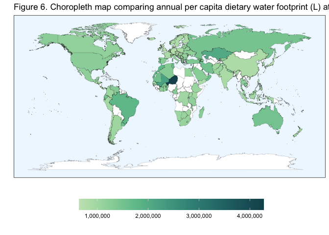

Analysis and Visualization Script
================

## Required Packages

``` r
library(tidyverse)
library(RColorBrewer)
library(colorspace)
```

## Data Loading

``` r
impact_modeling_data <- read.csv("/Users/kenjinchang/github/university-dining-impact-model/data/impact-modeling-data.csv")
```

## Included countries

To distinguish the 123 included countries from within the 135 designated
countries within the `world_map_iso` data without available university
enrollment and dietary footprint data, we need to construct a new column
that can aid with this need,

``` r
impact_modeling_data %>%
  mutate(inclusion=ifelse(uni_enr_tot>0,country)) %>%
  ggplot(aes(x=long,y=lat,fill=inclusion,group=group)) + 
  geom_polygon(color="black",linewidth=0.05) +
  scale_fill_discrete(na.value="white") +
  labs(fill="") +
  xlab("") + 
  ylab("") +
  theme(legend.position="none",panel.grid=element_blank(),panel.background=element_blank(),axis.text=element_blank(),axis.ticks=element_blank())
```

<!-- -->

``` r
impact_modeling_data %>%
  distinct(country)
```

    ##                                 country
    ## 1                           Afghanistan
    ## 2                               Albania
    ## 3                               Algeria
    ## 4                        American Samoa
    ## 5                               Andorra
    ## 6                                Angola
    ## 7                              Anguilla
    ## 8                            Antarctica
    ## 9                               Antigua
    ## 10                  Antigua and Barbuda
    ## 11                            Argentina
    ## 12                              Armenia
    ## 13                                Aruba
    ## 14                     Ascension Island
    ## 15                            Australia
    ## 16                              Austria
    ## 17                           Azerbaijan
    ## 18                               Azores
    ## 19                              Bahamas
    ## 20                              Bahrain
    ## 21                           Bangladesh
    ## 22                             Barbados
    ## 23                              Barbuda
    ## 24                              Belarus
    ## 25                              Belgium
    ## 26                               Belize
    ## 27                                Benin
    ## 28                              Bermuda
    ## 29                               Bhutan
    ## 30                              Bolivia
    ## 31                              Bonaire
    ## 32               Bosnia and Herzegovina
    ## 33                             Botswana
    ## 34                               Brazil
    ## 35                               Brunei
    ## 36                             Bulgaria
    ## 37                         Burkina Faso
    ## 38                              Burundi
    ## 39                             Cambodia
    ## 40                             Cameroon
    ## 41                               Canada
    ## 42                       Canary Islands
    ## 43                           Cape Verde
    ## 44                       Cayman Islands
    ## 45             Central African Republic
    ## 46                                 Chad
    ## 47                   Chagos Archipelago
    ## 48                                Chile
    ## 49                                China
    ## 50                     Christmas Island
    ## 51                        Cocos Islands
    ## 52                             Colombia
    ## 53                              Comoros
    ## 54                     Congo, Dem. Rep.
    ## 55                          Congo, Rep.
    ## 56                         Cook Islands
    ## 57                           Costa Rica
    ## 58                        Cote d'Ivoire
    ## 59                              Croatia
    ## 60                                 Cuba
    ## 61                              Curacao
    ## 62                               Cyprus
    ## 63                       Czech Republic
    ## 64                              Denmark
    ## 65                             Djibouti
    ## 66                             Dominica
    ## 67                   Dominican Republic
    ## 68                              Ecuador
    ## 69                                Egypt
    ## 70                          El Salvador
    ## 71                    Equatorial Guinea
    ## 72                              Eritrea
    ## 73                              Estonia
    ## 74                             Eswatini
    ## 75                             Ethiopia
    ## 76                     Falkland Islands
    ## 77                        Faroe Islands
    ## 78                                 Fiji
    ## 79                              Finland
    ## 80                               France
    ## 81                        French Guiana
    ## 82                     French Polynesia
    ## 83  French Southern and Antarctic Lands
    ## 84                                Gabon
    ## 85                               Gambia
    ## 86                              Georgia
    ## 87                              Germany
    ## 88                                Ghana
    ## 89                               Greece
    ## 90                            Greenland
    ## 91                              Grenada
    ## 92                           Grenadines
    ## 93                           Guadeloupe
    ## 94                                 Guam
    ## 95                            Guatemala
    ## 96                             Guernsey
    ## 97                               Guinea
    ## 98                        Guinea-Bissau
    ## 99                               Guyana
    ## 100                               Haiti
    ## 101                        Heard Island
    ## 102                            Honduras
    ## 103                             Hungary
    ## 104                             Iceland
    ## 105                               India
    ## 106                           Indonesia
    ## 107                                Iran
    ## 108                                Iraq
    ## 109                             Ireland
    ## 110                         Isle of Man
    ## 111                              Israel
    ## 112                               Italy
    ## 113                             Jamaica
    ## 114                               Japan
    ## 115                              Jersey
    ## 116                              Jordan
    ## 117                          Kazakhstan
    ## 118                               Kenya
    ## 119                            Kiribati
    ## 120                              Kosovo
    ## 121                     Krygyz Republic
    ## 122                              Kuwait
    ## 123                                 Lao
    ## 124                              Latvia
    ## 125                             Lebanon
    ## 126                             Lesotho
    ## 127                             Liberia
    ## 128                               Libya
    ## 129                       Liechtenstein
    ## 130                           Lithuania
    ## 131                          Luxembourg
    ## 132                          Madagascar
    ## 133                     Madeira Islands
    ## 134                              Malawi
    ## 135                            Malaysia
    ## 136                            Maldives
    ## 137                                Mali
    ## 138                               Malta
    ## 139                    Marshall Islands
    ## 140                          Martinique
    ## 141                          Mauritania
    ## 142                           Mauritius
    ## 143                             Mayotte
    ## 144                              Mexico
    ## 145               Micronesia, Fed. Sts.
    ## 146                             Moldova
    ## 147                              Monaco
    ## 148                            Mongolia
    ## 149                          Montenegro
    ## 150                          Montserrat
    ## 151                             Morocco
    ## 152                          Mozambique
    ## 153                             Myanmar
    ## 154                             Namibia
    ## 155                               Nauru
    ## 156                               Nepal
    ## 157                         Netherlands
    ## 158                               Nevis
    ## 159                       New Caledonia
    ## 160                         New Zealand
    ## 161                           Nicaragua
    ## 162                               Niger
    ## 163                             Nigeria
    ## 164                                Niue
    ## 165                      Norfolk Island
    ## 166                         North Korea
    ## 167                     North Macedonia
    ## 168            Northern Mariana Islands
    ## 169                              Norway
    ## 170                                Oman
    ## 171                            Pakistan
    ## 172                               Palau
    ## 173                           Palestine
    ## 174                              Panama
    ## 175                    Papua New Guinea
    ## 176                            Paraguay
    ## 177                                Peru
    ## 178                         Philippines
    ## 179                    Pitcairn Islands
    ## 180                              Poland
    ## 181                            Portugal
    ## 182                         Puerto Rico
    ## 183                               Qatar
    ## 184                             Reunion
    ## 185                             Romania
    ## 186                              Russia
    ## 187                              Rwanda
    ## 188                                Saba
    ## 189                    Saint Barthelemy
    ## 190                        Saint Helena
    ## 191                         Saint Kitts
    ## 192                        Saint Martin
    ## 193           Saint Pierre and Miquelon
    ## 194                       Saint Vincent
    ## 195                               Samoa
    ## 196                          San Marino
    ## 197               Sao Tome and Principe
    ## 198                        Saudi Arabia
    ## 199                             Senegal
    ## 200                              Serbia
    ## 201                          Seychelles
    ## 202                     Siachen Glacier
    ## 203                        Sierra Leone
    ## 204                           Singapore
    ## 205                      Sint Eustatius
    ## 206                        Sint Maarten
    ## 207                     Slovak Republic
    ## 208                            Slovenia
    ## 209                     Solomon Islands
    ## 210                             Somalia
    ## 211                        South Africa
    ## 212                       South Georgia
    ## 213                         South Korea
    ## 214              South Sandwich Islands
    ## 215                         South Sudan
    ## 216                               Spain
    ## 217                           Sri Lanka
    ## 218                 St. Kitts and Nevis
    ## 219                           St. Lucia
    ## 220      St. Vincent and the Grenadines
    ## 221                               Sudan
    ## 222                            Suriname
    ## 223                              Sweden
    ## 224                         Switzerland
    ## 225                               Syria
    ## 226                              Taiwan
    ## 227                          Tajikistan
    ## 228                            Tanzania
    ## 229                            Thailand
    ## 230                         Timor-Leste
    ## 231                              Tobago
    ## 232                                Togo
    ## 233                               Tonga
    ## 234                            Trinidad
    ## 235                 Trinidad and Tobago
    ## 236                             Tunisia
    ## 237                              Turkey
    ## 238                        Turkmenistan
    ## 239            Turks and Caicos Islands
    ## 240                              Uganda
    ## 241                             Ukraine
    ## 242                United Arab Emirates
    ## 243                      United Kingdom
    ## 244                       United States
    ## 245                             Uruguay
    ## 246                          Uzbekistan
    ## 247                             Vanuatu
    ## 248                             Vatican
    ## 249                           Venezuela
    ## 250                             Vietnam
    ## 251               Virgin Islands (U.S.)
    ## 252                   Wallis and Futuna
    ## 253                      Western Sahara
    ## 254                               Yemen
    ## 255                              Zambia
    ## 256                            Zimbabwe
    ## 257                    Hong Kong, China
    ## 258                        Macao, China

Comparing university enrollment totals across countries.

``` r
ggplot(impact_modeling_data,aes(x=long,y=lat,fill=uni_enr_tot,group=group)) + 
  geom_polygon(color="black",linewidth=0.05) + 
  scale_fill_distiller(palette="Purples",trans="reverse",na.value="white") +
  labs(fill="") +
  xlab("") + 
  ylab("") +
  theme(legend.position="bottom",panel.grid=element_blank(),panel.background=element_blank(),axis.text=element_blank(),axis.ticks=element_blank())
```

<!-- -->

Comparing university enrollment proportions (university enrollees as a
function of the national population) across countries.

``` r
ggplot(impact_modeling_data,aes(x=long,y=lat,fill=uni_enr_prop,group=group)) + 
  geom_polygon(color="black",linewidth=0.05) + 
  scale_fill_distiller(palette="Purples",trans="reverse",na.value="white") +
  labs(fill="") +
  xlab("") + 
  ylab("") +
  theme(legend.position="bottom",panel.grid=element_blank(),panel.background=element_blank(),axis.text=element_blank(),axis.ticks=element_blank())
```

<!-- -->

Comparing per capita baseline carbon footprint (kg co2e) across
countries

``` r
ggplot(impact_modeling_data,aes(x=long,y=lat,fill=baseline_kg_co2e_total,group=group)) + 
  geom_polygon(color="black",linewidth=0.05) + 
  scale_fill_viridis_c(option="A",trans="reverse",na.value="white") +
  labs(fill="") +
  xlab("") + 
  ylab("") +
  theme(legend.position="bottom",panel.grid=element_blank(),panel.background=element_blank(),axis.text=element_blank(),axis.ticks=element_blank())
```

<!-- -->

Comparing per capita water footprint of baseline diet across countries.

``` r
ggplot(impact_modeling_data,aes(x=long,y=lat,fill=baseline_l_blue_green_wf,group=group)) + 
  geom_polygon(color="black",linewidth=0.05) + 
  scale_fill_continuous_sequential(palette="BluGrn",trans="reverse",na.value="white") +
  labs(fill="") +
  xlab("") + 
  ylab("") +
  theme(legend.position="bottom",panel.grid=element_blank(),panel.background=element_blank(),axis.text=element_blank(),axis.ticks=element_blank())
```

<!-- -->

``` r
ggplot(impact_modeling_data,aes(x=long,y=lat,fill=baseline_l_blue_green_wf,group=group)) + 
  geom_polygon(color="black",linewidth=0.05) + 
  scale_fill_viridis_c(na.value="white") +
  labs(fill="") +
  xlab("") + 
  ylab("") +
  theme(legend.position="bottom",panel.grid=element_blank(),panel.background=element_blank(),axis.text=element_blank(),axis.ticks=element_blank())
```

<!-- -->
