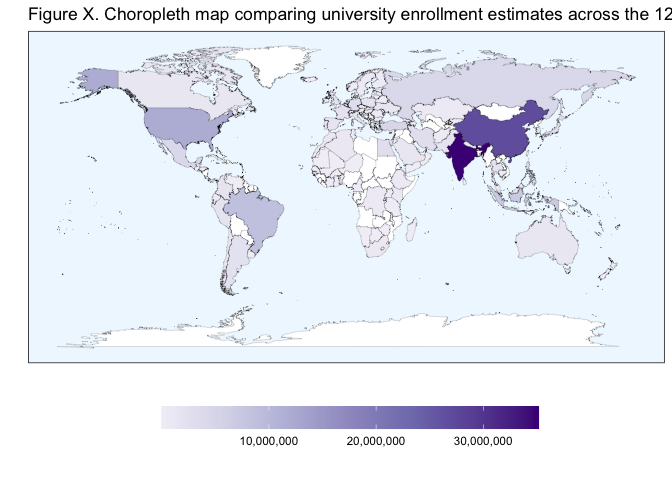

Analysis and Visualization Script
================

## Required Packages

``` r
library(tidyverse)
library(RColorBrewer)
library(colorspace)
```

## Data Loading

``` r
impact_modeling_data <- read.csv("/Users/kenjinchang/github/university-dining-impact-model/data/impact-modeling-data.csv")
```

## Included countries

To distinguish the 123 included countries from within the 135 designated
countries within the `world_map_iso` data without available university
enrollment and dietary footprint data, we need to construct a new column
that can aid with this need,

``` r
impact_modeling_data %>%
  mutate(inclusion=ifelse(uni_enr_tot>0,country)) %>%
  ggplot(aes(x=long,y=lat,fill=inclusion,group=group)) + 
  geom_polygon(color="black",size=0.05,alpha=0.67) +
  scale_fill_discrete(h=c(115,350),na.value="white") +
  guides(fill="none") +
  xlab("") + 
  ylab("") +
  labs(caption="") +
  ggtitle("Figure 1. Choropleth map highlighting the 123 countries included in our analyses.") +
  theme(legend.position="none",panel.grid=element_blank(),panel.background=element_rect(fill="aliceblue"),panel.border=element_rect(fill=NA),axis.text=element_blank(),axis.ticks=element_blank())
```

<!-- -->

Comparing university enrollment totals across countries.

``` r
ggplot(impact_modeling_data,aes(x=long,y=lat,fill=uni_enr_tot,group=group)) + 
  geom_polygon(color="black",size=0.05) + 
  scale_fill_distiller(name="",palette="Purples",trans="reverse",na.value="white",labels=scales::comma) +
  guides(fill=guide_colorbar(reverse=TRUE)) + 
  xlab("") + 
  ylab("") +
  labs(caption="") +
  ggtitle("Figure 2. Choropleth map comparing university enrollment estimates across the 123 included countries.") +
  theme(legend.position="bottom",panel.grid=element_blank(),panel.background=element_rect(fill="aliceblue"),panel.border=element_rect(fill=NA),axis.text=element_blank(),axis.ticks=element_blank(),legend.key.width=unit(2,"cm"))
```

<!-- -->

Comparing university enrollment proportions (university enrollees as a
function of the national population) across countries.

``` r
ggplot(impact_modeling_data,aes(x=long,y=lat,fill=uni_enr_prop,group=group)) + 
  geom_polygon(color="black",size=0.05) + 
  scale_fill_distiller(name="",palette="Purples",trans="reverse",na.value="white",labels=scales::percent) +
  guides(fill=guide_colorbar(reverse=TRUE)) + 
  xlab("") + 
  ylab("") +
  labs(caption="") +
  ggtitle("Figure 4. Choropleth map comparing university enrollment estimates as a proportion of their respective national populations across the 123 included countries.") +
  theme(legend.position="bottom",panel.grid=element_blank(),panel.background=element_rect(fill="aliceblue"),panel.border=element_rect(fill=NA),axis.text=element_blank(),axis.ticks=element_blank(),legend.key.width=unit(2,"cm"))
```

<!-- -->

Comparing per capita baseline carbon footprint (kg co2e) across
countries

``` r
ggplot(impact_modeling_data,aes(x=long,y=lat,fill=baseline_kg_co2e_total,group=group)) + 
  geom_polygon(color="black",size=0.05,alpha=0.9) + 
  scale_fill_continuous_sequential(name="",palette="OrRd",na.value="white",labels=scales::comma) +
  guides() +
  xlab("") + 
  ylab("") +
  labs(caption="") +
  ggtitle("Figure 5. Choropleth map comparing annual per capita dietary greenhouse gas estimates (kg CO2e) at baseline across the 123 included countries.") +
  theme(legend.position="bottom",panel.grid=element_blank(),panel.background=element_rect(fill="aliceblue"),panel.border=element_rect(fill=NA),axis.text=element_blank(),axis.ticks=element_blank(),legend.key.width=unit(2,"cm"))
```

<!-- -->

Comparing per capita water footprint of baseline diet across countries.

``` r
ggplot(impact_modeling_data,aes(x=long,y=lat,fill=baseline_l_blue_green_wf,group=group)) + 
  geom_polygon(color="black",size=0.05,alpha=0.9) + 
  scale_fill_continuous_sequential(name="",palette="BluGrn",na.value="white",labels=scales::comma) +
  guides() +
  xlab("") + 
  ylab("") +
  labs(caption="") +
  ggtitle("Figure 6. Choropleth map comparing annual per capita dietary water footprint (L) at baseline across the 123 included countries.") +
  theme(legend.position="bottom",panel.grid=element_blank(),panel.background=element_rect(fill="aliceblue"),panel.border=element_rect(fill=NA),axis.text=element_blank(),axis.ticks=element_blank(),legend.key.width=unit(2,"cm"))
```

<!-- -->

## Reduction Modeling

In order to examine the mitigation potential associated with each of the
explored dietary scenarios, we will need to assemble population-level
estimates by multiplying each country’s annual per capita baseline
estimates against their respective enrollment totals.

To begin this process, we will first create an accessory dataframe
dropping the relevant shapefile and map data.

``` r
reduction_modeling_data <- read.csv("/Users/kenjinchang/github/university-dining-impact-model/data/impact-modeling-data.csv") %>%
  distinct(country,isced6_enr,isced7_enr,isced8_enr,natpop_est,uni_enr_tot,uni_enr_prop,baseline_kg_co2e_excl_luc,baseline_kg_co2e_total,baseline_l_blue_green_wf,baseline_l_blue_wf_total,baseline_l_green_wf
,meatless_day_kg_co2e_excl_luc,meatless_day_kg_co2e_total,meatless_day_l_blue_green_wf,meatless_day_l_blue_wf_total,meatless_day_l_green_wf,no_dairy_kg_co2e_excl_luc,no_dairy_kg_co2e_total,no_dairy_l_blue_green_wf,no_dairy_l_blue_wf_total,no_dairy_l_green_wf,low_red_meat_kg_co2e_excl_luc,low_red_meat_kg_co2e_total,low_red_meat_l_blue_green_wf,low_red_meat_l_blue_wf_total,low_red_meat_l_green_wf,no_red_meat_kg_co2e_excl_luc,no_red_meat_kg_co2e_total,no_red_meat_l_blue_green_wf,no_red_meat_l_blue_wf_total,no_red_meat_l_green_wf,pescetarian_kg_co2e_excl_luc,pescetarian_kg_co2e_total,pescetarian_l_blue_green_wf,pescetarian_l_blue_wf_total,pescetarian_l_green_wf,lacto_ovo_vegetarian_kg_co2e_excl_luc,lacto_ovo_vegetarian_kg_co2e_total,lacto_ovo_vegetarian_l_blue_green_wf,lacto_ovo_vegetarian_l_blue_wf_total,lacto_ovo_vegetarian_l_green_wf,X2.3_vegan_kg_co2e_excl_luc,X2.3_vegan_kg_co2e_total,X2.3_vegan_l_blue_green_wf,X2.3_vegan_l_blue_wf_total,X2.3_vegan_l_green_wf,vegan_kg_co2e_excl_luc,vegan_kg_co2e_total,vegan_l_blue_green_wf,vegan_l_blue_wf_total,vegan_l_green_wf) %>%
  drop_na()
```

With this complete, we will need to construct 9 new variables: one
isolating the per capita carbon footprint attributable to land-use
change for each of our dietary scenarios.

``` r
reduction_modeling_data <- reduction_modeling_data %>% mutate(baseline_kg_co2e_luc=baseline_kg_co2e_total-baseline_kg_co2e_excl_luc) %>%
  mutate(meatless_day_kg_co2e_luc=meatless_day_kg_co2e_total-meatless_day_kg_co2e_excl_luc) %>%
  mutate(no_dairy_kg_co2e_luc=no_dairy_kg_co2e_total-no_dairy_kg_co2e_excl_luc) %>%
  mutate(low_red_meat_kg_co2e_luc=low_red_meat_kg_co2e_total-low_red_meat_kg_co2e_excl_luc) %>%
  mutate(no_red_meat_kg_co2e_luc=no_red_meat_kg_co2e_total-no_red_meat_kg_co2e_excl_luc) %>%
  mutate(pescetarian_kg_co2e_luc=pescetarian_kg_co2e_total-pescetarian_kg_co2e_excl_luc) %>%
  mutate(lacto_ovo_vegetarian_kg_co2e_luc=lacto_ovo_vegetarian_kg_co2e_total-lacto_ovo_vegetarian_kg_co2e_excl_luc) %>%
  mutate(X2.3_vegan_kg_co2e_luc=X2.3_vegan_kg_co2e_total-X2.3_vegan_kg_co2e_excl_luc) %>%
  mutate(vegan_kg_co2e_luc=vegan_kg_co2e_total-vegan_kg_co2e_excl_luc)
```

With these new variables in place, we can generate population-level
estimates by scaling each of these per capita estimates according to the
university enrollment totals for each country.

``` r
reduction_modeling_data <- reduction_modeling_data %>%
  mutate(pop_baseline_excl_luc=baseline_kg_co2e_excl_luc*uni_enr_tot) %>%
  mutate(pop_baseline_kg_co2e_total=baseline_kg_co2e_total*uni_enr_tot) %>%
  mutate(pop_baseline_kg_co2e_luc=baseline_kg_co2e_luc*uni_enr_tot) %>%
  mutate(pop_baseline_l_blue_green_wf=baseline_l_blue_green_wf*uni_enr_tot) %>%
  mutate(pop_baseline_l_blue_wf_total=baseline_l_blue_wf_total*uni_enr_tot) %>%
  mutate(pop_baseline_l_green_wf=baseline_l_green_wf*uni_enr_tot) %>%
  mutate(pop_meatless_day_kg_co2e_excl_luc=meatless_day_kg_co2e_excl_luc*uni_enr_tot) %>%
  mutate(pop_meatless_day_kg_co2e_total=meatless_day_kg_co2e_total*uni_enr_tot) %>%
  mutate(pop_meatless_day_kg_co2e_luc=meatless_day_kg_co2e_luc*uni_enr_tot) %>%
  mutate(pop_meatless_day_l_blue_green_wf=meatless_day_l_blue_green_wf*uni_enr_tot) %>%
  mutate(pop_meatless_day_l_blue_wf_total=meatless_day_l_blue_wf_total*uni_enr_tot) %>%
  mutate(pop_meatless_day_l_green_wf=meatless_day_l_green_wf*uni_enr_tot) %>%
  mutate(pop_no_dairy_kg_co2e_excl_luc=no_dairy_kg_co2e_excl_luc*uni_enr_tot) %>%
  mutate(pop_no_dairy_kg_co2e_total=no_dairy_kg_co2e_total*uni_enr_tot) %>%
  mutate(pop_no_dairy_kg_co2e_luc=no_dairy_kg_co2e_luc*uni_enr_tot) %>%
  mutate(pop_no_dairy_l_blue_green_wf=no_dairy_l_blue_green_wf*uni_enr_tot) %>%
  mutate(pop_no_dairy_l_blue_wf_total=no_dairy_l_blue_wf_total*uni_enr_tot) %>%
  mutate(pop_no_dairy_l_green_wf=no_dairy_l_green_wf*uni_enr_tot) %>%
  mutate(pop_low_red_meat_kg_co2e_excl_luc=low_red_meat_kg_co2e_excl_luc*uni_enr_tot) %>%
  mutate(pop_low_red_meat_kg_co2e_total=low_red_meat_kg_co2e_total*uni_enr_tot) %>%
  mutate(pop_low_red_meat_kg_co2e_luc=low_red_meat_kg_co2e_luc*uni_enr_tot) %>%
  mutate(pop_low_red_meat_l_blue_green_wf=low_red_meat_l_blue_green_wf*uni_enr_tot) %>%
  mutate(pop_low_red_meat_l_blue_wf_total=low_red_meat_l_blue_wf_total*uni_enr_tot) %>%
  mutate(pop_low_red_meat_l_green_wf=low_red_meat_l_green_wf*uni_enr_tot) %>%
  mutate(pop_no_red_meat_kg_co2e_excl_luc=no_red_meat_kg_co2e_excl_luc*uni_enr_tot) %>%
  mutate(pop_no_red_meat_kg_co2e_total=no_red_meat_kg_co2e_total*uni_enr_tot) %>%
  mutate(pop_no_red_meat_kg_co2e_luc=no_red_meat_kg_co2e_luc*uni_enr_tot) %>%
  mutate(pop_no_red_meat_l_blue_green_wf=no_red_meat_l_blue_green_wf*uni_enr_tot) %>%
  mutate(pop_no_red_meat_l_blue_wf_total=no_red_meat_l_blue_wf_total*uni_enr_tot) %>%
  mutate(pop_no_red_meat_l_green_wf=no_red_meat_l_green_wf*uni_enr_tot) %>%
  mutate(pop_pescetarian_kg_co2e_excl_luc=pescetarian_kg_co2e_excl_luc*uni_enr_tot) %>%
  mutate(pop_pescetarian_kg_co2e_total=pescetarian_kg_co2e_total*uni_enr_tot) %>%
  mutate(pop_pescetarian_kg_co2e_luc=pescetarian_kg_co2e_luc*uni_enr_tot) %>%
  mutate(pop_pescetarian_l_blue_green_wf=pescetarian_l_blue_green_wf*uni_enr_tot) %>%
  mutate(pop_pescetarian_l_blue_wf_total=pescetarian_l_blue_wf_total*uni_enr_tot) %>%
  mutate(pop_pescetarian_l_green_wf=pescetarian_l_green_wf*uni_enr_tot) %>%
  mutate(pop_lacto_ovo_vegetarian_kg_co2e_excl_luc=lacto_ovo_vegetarian_kg_co2e_excl_luc*uni_enr_tot) %>%
  mutate(pop_lacto_ovo_vegetarian_kg_co2e_total=lacto_ovo_vegetarian_kg_co2e_total*uni_enr_tot) %>%
  mutate(pop_lacto_ovo_vegetarian_kg_co2e_luc=lacto_ovo_vegetarian_kg_co2e_luc*uni_enr_tot) %>%
  mutate(pop_lacto_ovo_vegetarian_l_blue_green_wf=lacto_ovo_vegetarian_l_blue_green_wf*uni_enr_tot) %>%
  mutate(pop_lacto_ovo_vegetarian_l_blue_wf_total=lacto_ovo_vegetarian_l_blue_wf_total*uni_enr_tot) %>%
  mutate(pop_lacto_ovo_vegetarian_l_green_wf=lacto_ovo_vegetarian_l_green_wf*uni_enr_tot) %>%
  mutate(pop_X2.3_vegan_kg_co2e_excl_luc=X2.3_vegan_kg_co2e_excl_luc*uni_enr_tot) %>%
  mutate(pop_X2.3_vegan_kg_co2e_total=X2.3_vegan_kg_co2e_total*uni_enr_tot) %>%
  mutate(pop_X2.3_vegan_kg_co2e_luc=X2.3_vegan_kg_co2e_luc*uni_enr_tot) %>%
  mutate(pop_X2.3_vegan_l_blue_green_wf=X2.3_vegan_l_blue_green_wf*uni_enr_tot) %>%
  mutate(pop_X2.3_vegan_l_blue_wf_total=X2.3_vegan_l_blue_wf_total*uni_enr_tot) %>%
  mutate(pop_X2.3_vegan_l_green_wf=X2.3_vegan_l_green_wf*uni_enr_tot) %>%
  mutate(pop_vegan_kg_co2e_excl_luc=vegan_kg_co2e_excl_luc*uni_enr_tot) %>%
  mutate(pop_vegan_kg_co2e_total=vegan_kg_co2e_total*uni_enr_tot) %>%
  mutate(pop_vegan_kg_co2e_luc=vegan_kg_co2e_luc*uni_enr_tot) %>%
  mutate(pop_vegan_l_blue_green_wf=vegan_l_blue_green_wf*uni_enr_tot) %>%
  mutate(pop_vegan_l_blue_wf_total=vegan_l_blue_wf_total*uni_enr_tot) %>%
  mutate(pop_vegan_l_green_wf=vegan_l_green_wf*uni_enr_tot)
```

With these newly constructed population-level estimates, we can now
model how each of these indicators would change in response to the
proposed dietary scenarios by subtracting these estimates from the
baseline statistic.
