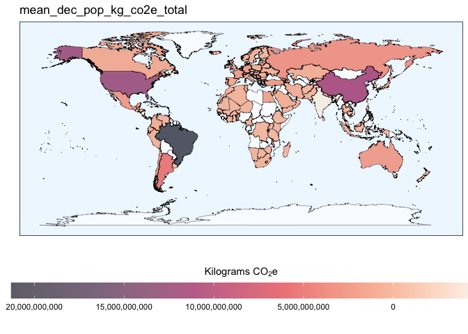
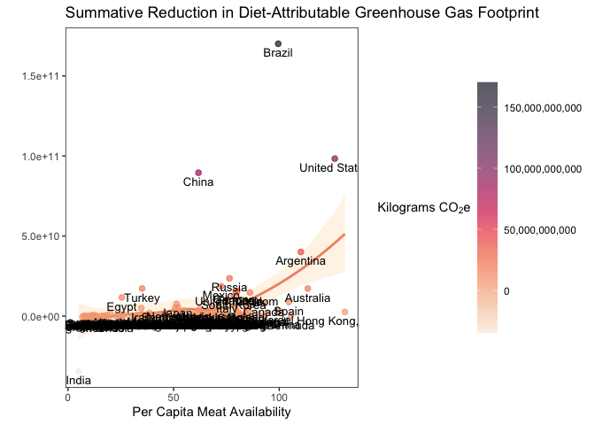
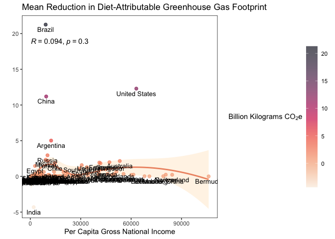
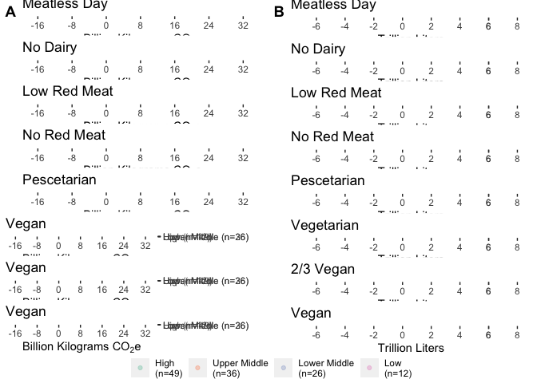
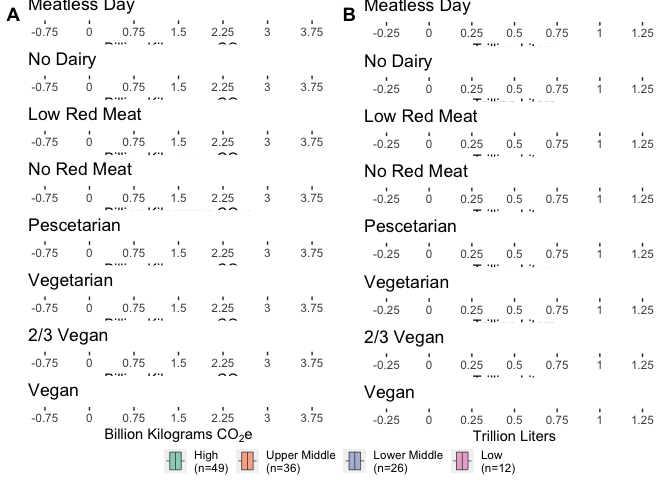

Analysis and Visualization Script
================

## Required Packages

``` r
library(tidyverse)
library(viridis)
library(RColorBrewer)
library(colorspace)
library(ggpubr)
```

## Data Loading

``` r
impact_modeling_data <- read.csv("/Users/kenjinchang/github/university-dining-impact-model/data/impact-modeling-data.csv")
```

## Included countries

To distinguish the 123 included countries from within the 135 designated
countries within the `world_map_iso` data without available university
enrollment and dietary footprint data, we need to construct a new column
that can aid with this need,

``` r
impact_modeling_data %>%
  mutate(inclusion=ifelse(uni_enr_tot>0,country)) %>%
  ggplot(aes(x=long,y=lat,fill=inclusion,group=group)) + 
  geom_polygon(color="black",size=0.125,alpha=0.66) +
  scale_fill_discrete(h=c(260,260),na.value="white") +
  guides(fill="none") +
  xlab("") + 
  ylab("") +
  labs(caption="") +
  ggtitle("Figure X. Choropleth map highlighting the 123 countries included in our analyses.") +
  theme(legend.position="none",panel.grid=element_blank(),panel.background=element_rect(fill="aliceblue"),panel.border=element_rect(fill=NA),axis.text=element_blank(),axis.ticks=element_blank())
```

<!-- -->

Comparing university enrollment totals across countries.

``` r
uni_enr_tot_choro <- ggplot(impact_modeling_data,aes(x=long,y=lat,fill=uni_enr_tot,group=group)) + 
  geom_polygon(color="black",size=0.125,alpha=0.66) + 
  scale_fill_continuous_sequential(labels=function(x)x/1000000,name="Millions Enrolled",palette="Purple-Blue",na.value="white",breaks=c(0,6000000,12000000,18000000,24000000,30000000),alpha=0.66) +
  guides(fill=guide_colorbar(title.position="top",title.hjust=0.5)) +
  xlab("") + 
  ylab("") +
  labs(caption="") +
  ggtitle("Enrollment Total") +
  theme(legend.position="bottom",panel.grid=element_blank(),panel.background=element_rect(fill="aliceblue"),panel.border=element_rect(fill=NA),axis.text=element_blank(),axis.ticks=element_blank(),legend.key.width=unit(3.5,"cm"))
```

guides(fill=guide_colorbar(reverse=TRUE

ggtitle(“Figure X. Choropleth map comparing university enrollment
estimates across the 123 included countries.”) +

Comparing university enrollment proportions (university enrollees as a
function of the national population) across countries.

``` r
uni_enr_prop_choro <- ggplot(impact_modeling_data,aes(x=long,y=lat,fill=uni_enr_prop,group=group)) + 
  geom_polygon(color="black",size=0.125,alpha=0.66) + 
  scale_fill_continuous_sequential(alpha=0.66,name="Percentage Enrolled",palette="Purple-Blue",na.value="white",labels=scales::percent,breaks=c(0,0.013,0.026,0.039,0.052,0.065)) +
  guides(fill=guide_colorbar(title.position="top",title.hjust=0.5)) +
  xlab("") + 
  ylab("") +
  labs(caption="") +
  ggtitle("Enrollment Proportion") +
  theme(legend.position="bottom",panel.grid=element_blank(),panel.background=element_rect(fill="aliceblue"),panel.border=element_rect(fill=NA),axis.text=element_blank(),axis.ticks=element_blank(),legend.key.width=unit(3.5,"cm"))
```

``` r
ggarrange(uni_enr_tot_choro,uni_enr_prop_choro,
          labels=c("A","B"),
          ncol=1,
          nrow=2)
```

<!-- -->

ggtitle(“Figure X. Choropleth map comparing university enrollment
estimates as a proportion of their respective national populations
across the 123 included countries.”) +

Comparing per capita baseline carbon footprint (kg co2e) across
countries

``` r
pc_baseline_total_cf_choro <- ggplot(impact_modeling_data,aes(x=long,y=lat,fill=baseline_kg_co2e_total,group=group)) + 
  geom_polygon(color="black",size=0.125,alpha=0.66) + 
  scale_fill_viridis_c(alpha=0.66,name=bquote('Kilograms CO'[2]*'e'),option="F",trans="reverse",na.value="white",labels=scales::comma,breaks=c(750,1500,2250,3000,3750)) +
  guides(fill=guide_colorbar(reverse=TRUE,title.position="top",title.hjust=0.5)) +
  xlab("") + 
  ylab("") +
  labs(caption="") +
  ggtitle("Diet-Attributable Greenhouse Gas Footprint at Baseline") +
  theme(legend.position="bottom",panel.grid=element_blank(),panel.background=element_rect(fill="aliceblue"),panel.border=element_rect(fill=NA),axis.text=element_blank(),axis.ticks=element_blank(),legend.key.width=unit(3.5,"cm"))
```

ggtitle(“Figure X. Choropleth map comparing annual per capita dietary
greenhouse gas estimates (kg CO2e) at baseline across the 123 included
countries.”) +

Comparing per capita water footprint of baseline diet across countries.

``` r
pc_baseline_total_wf_choro <- ggplot(impact_modeling_data,aes(x=long,y=lat,fill=baseline_l_blue_green_wf,group=group)) + 
  geom_polygon(color="black",size=0.125,alpha=0.66) + 
  scale_fill_viridis_c(alpha=0.66,name="Liters",option="G",trans="reverse",na.value="white",labels=scales::comma,breaks=c(750000,1500000,2250000,3000000,3750000)) +
  guides(fill=guide_colorbar(reverse=TRUE,title.position="top",title.hjust=0.5)) +
  xlab("") + 
  ylab("") +
  labs(caption="") +
  ggtitle("Diet-Attributable Water Footprint at Baseline") +
  theme(legend.position="bottom",panel.grid=element_blank(),panel.background=element_rect(fill="aliceblue"),panel.border=element_rect(fill=NA),axis.text=element_blank(),axis.ticks=element_blank(),legend.key.width=unit(3.5,"cm"))
```

ggtitle(“Figure X. Choropleth map comparing annual per capita dietary
water footprint (L) at baseline across the 123 included countries.”) +

``` r
ggarrange(pc_baseline_total_cf_choro,pc_baseline_total_wf_choro,
          labels=c("A","B"),
          ncol=1,
          nrow=2)
```

<!-- -->

## Reduction Modeling

In order to examine the mitigation potential associated with each of the
explored dietary scenarios, we will need to assemble population-level
estimates by multiplying each country’s annual per capita baseline
estimates against their respective enrollment totals.

To begin this process, we will first create an accessory dataframe
dropping the relevant shapefile and map data.

``` r
reduction_modeling_data <- read.csv("/Users/kenjinchang/github/university-dining-impact-model/data/impact-modeling-data.csv") %>%
  distinct(country,isced6_enr,isced7_enr,isced8_enr,natpop_est,pcgni_est,uni_enr_tot,uni_enr_prop,baseline_kg_co2e_excl_luc,baseline_kg_co2e_total,baseline_l_blue_green_wf,baseline_l_blue_wf_total,baseline_l_green_wf
,meatless_day_kg_co2e_excl_luc,meatless_day_kg_co2e_total,meatless_day_l_blue_green_wf,meatless_day_l_blue_wf_total,meatless_day_l_green_wf,no_dairy_kg_co2e_excl_luc,no_dairy_kg_co2e_total,no_dairy_l_blue_green_wf,no_dairy_l_blue_wf_total,no_dairy_l_green_wf,low_red_meat_kg_co2e_excl_luc,low_red_meat_kg_co2e_total,low_red_meat_l_blue_green_wf,low_red_meat_l_blue_wf_total,low_red_meat_l_green_wf,no_red_meat_kg_co2e_excl_luc,no_red_meat_kg_co2e_total,no_red_meat_l_blue_green_wf,no_red_meat_l_blue_wf_total,no_red_meat_l_green_wf,pescetarian_kg_co2e_excl_luc,pescetarian_kg_co2e_total,pescetarian_l_blue_green_wf,pescetarian_l_blue_wf_total,pescetarian_l_green_wf,lacto_ovo_vegetarian_kg_co2e_excl_luc,lacto_ovo_vegetarian_kg_co2e_total,lacto_ovo_vegetarian_l_blue_green_wf,lacto_ovo_vegetarian_l_blue_wf_total,lacto_ovo_vegetarian_l_green_wf,X2.3_vegan_kg_co2e_excl_luc,X2.3_vegan_kg_co2e_total,X2.3_vegan_l_blue_green_wf,X2.3_vegan_l_blue_wf_total,X2.3_vegan_l_green_wf,vegan_kg_co2e_excl_luc,vegan_kg_co2e_total,vegan_l_blue_green_wf,vegan_l_blue_wf_total,vegan_l_green_wf) %>%
  drop_na()
```

With this complete, we will need to construct 9 new variables: one
isolating the per capita carbon footprint attributable to land-use
change for each of our dietary scenarios.

``` r
reduction_modeling_data <- reduction_modeling_data %>% mutate(baseline_kg_co2e_luc=baseline_kg_co2e_total-baseline_kg_co2e_excl_luc) %>%
  mutate(meatless_day_kg_co2e_luc=meatless_day_kg_co2e_total-meatless_day_kg_co2e_excl_luc) %>%
  mutate(no_dairy_kg_co2e_luc=no_dairy_kg_co2e_total-no_dairy_kg_co2e_excl_luc) %>%
  mutate(low_red_meat_kg_co2e_luc=low_red_meat_kg_co2e_total-low_red_meat_kg_co2e_excl_luc) %>%
  mutate(no_red_meat_kg_co2e_luc=no_red_meat_kg_co2e_total-no_red_meat_kg_co2e_excl_luc) %>%
  mutate(pescetarian_kg_co2e_luc=pescetarian_kg_co2e_total-pescetarian_kg_co2e_excl_luc) %>%
  mutate(lacto_ovo_vegetarian_kg_co2e_luc=lacto_ovo_vegetarian_kg_co2e_total-lacto_ovo_vegetarian_kg_co2e_excl_luc) %>%
  mutate(X2.3_vegan_kg_co2e_luc=X2.3_vegan_kg_co2e_total-X2.3_vegan_kg_co2e_excl_luc) %>%
  mutate(vegan_kg_co2e_luc=vegan_kg_co2e_total-vegan_kg_co2e_excl_luc)
```

With these new variables in place, we can generate population-level
estimates by scaling each of these per capita estimates according to the
university enrollment totals for each country.

``` r
reduction_modeling_data <- reduction_modeling_data %>%
  mutate(pop_baseline_kg_co2e_excl_luc=baseline_kg_co2e_excl_luc*uni_enr_tot) %>%
  mutate(pop_baseline_kg_co2e_total=baseline_kg_co2e_total*uni_enr_tot) %>%
  mutate(pop_baseline_kg_co2e_luc=baseline_kg_co2e_luc*uni_enr_tot) %>%
  mutate(pop_baseline_l_blue_green_wf=baseline_l_blue_green_wf*uni_enr_tot) %>%
  mutate(pop_baseline_l_blue_wf_total=baseline_l_blue_wf_total*uni_enr_tot) %>%
  mutate(pop_baseline_l_green_wf=baseline_l_green_wf*uni_enr_tot) %>%
  mutate(pop_meatless_day_kg_co2e_excl_luc=meatless_day_kg_co2e_excl_luc*uni_enr_tot) %>%
  mutate(pop_meatless_day_kg_co2e_total=meatless_day_kg_co2e_total*uni_enr_tot) %>%
  mutate(pop_meatless_day_kg_co2e_luc=meatless_day_kg_co2e_luc*uni_enr_tot) %>%
  mutate(pop_meatless_day_l_blue_green_wf=meatless_day_l_blue_green_wf*uni_enr_tot) %>%
  mutate(pop_meatless_day_l_blue_wf_total=meatless_day_l_blue_wf_total*uni_enr_tot) %>%
  mutate(pop_meatless_day_l_green_wf=meatless_day_l_green_wf*uni_enr_tot) %>%
  mutate(pop_no_dairy_kg_co2e_excl_luc=no_dairy_kg_co2e_excl_luc*uni_enr_tot) %>%
  mutate(pop_no_dairy_kg_co2e_total=no_dairy_kg_co2e_total*uni_enr_tot) %>%
  mutate(pop_no_dairy_kg_co2e_luc=no_dairy_kg_co2e_luc*uni_enr_tot) %>%
  mutate(pop_no_dairy_l_blue_green_wf=no_dairy_l_blue_green_wf*uni_enr_tot) %>%
  mutate(pop_no_dairy_l_blue_wf_total=no_dairy_l_blue_wf_total*uni_enr_tot) %>%
  mutate(pop_no_dairy_l_green_wf=no_dairy_l_green_wf*uni_enr_tot) %>%
  mutate(pop_low_red_meat_kg_co2e_excl_luc=low_red_meat_kg_co2e_excl_luc*uni_enr_tot) %>%
  mutate(pop_low_red_meat_kg_co2e_total=low_red_meat_kg_co2e_total*uni_enr_tot) %>%
  mutate(pop_low_red_meat_kg_co2e_luc=low_red_meat_kg_co2e_luc*uni_enr_tot) %>%
  mutate(pop_low_red_meat_l_blue_green_wf=low_red_meat_l_blue_green_wf*uni_enr_tot) %>%
  mutate(pop_low_red_meat_l_blue_wf_total=low_red_meat_l_blue_wf_total*uni_enr_tot) %>%
  mutate(pop_low_red_meat_l_green_wf=low_red_meat_l_green_wf*uni_enr_tot) %>%
  mutate(pop_no_red_meat_kg_co2e_excl_luc=no_red_meat_kg_co2e_excl_luc*uni_enr_tot) %>%
  mutate(pop_no_red_meat_kg_co2e_total=no_red_meat_kg_co2e_total*uni_enr_tot) %>%
  mutate(pop_no_red_meat_kg_co2e_luc=no_red_meat_kg_co2e_luc*uni_enr_tot) %>%
  mutate(pop_no_red_meat_l_blue_green_wf=no_red_meat_l_blue_green_wf*uni_enr_tot) %>%
  mutate(pop_no_red_meat_l_blue_wf_total=no_red_meat_l_blue_wf_total*uni_enr_tot) %>%
  mutate(pop_no_red_meat_l_green_wf=no_red_meat_l_green_wf*uni_enr_tot) %>%
  mutate(pop_pescetarian_kg_co2e_excl_luc=pescetarian_kg_co2e_excl_luc*uni_enr_tot) %>%
  mutate(pop_pescetarian_kg_co2e_total=pescetarian_kg_co2e_total*uni_enr_tot) %>%
  mutate(pop_pescetarian_kg_co2e_luc=pescetarian_kg_co2e_luc*uni_enr_tot) %>%
  mutate(pop_pescetarian_l_blue_green_wf=pescetarian_l_blue_green_wf*uni_enr_tot) %>%
  mutate(pop_pescetarian_l_blue_wf_total=pescetarian_l_blue_wf_total*uni_enr_tot) %>%
  mutate(pop_pescetarian_l_green_wf=pescetarian_l_green_wf*uni_enr_tot) %>%
  mutate(pop_lacto_ovo_vegetarian_kg_co2e_excl_luc=lacto_ovo_vegetarian_kg_co2e_excl_luc*uni_enr_tot) %>%
  mutate(pop_lacto_ovo_vegetarian_kg_co2e_total=lacto_ovo_vegetarian_kg_co2e_total*uni_enr_tot) %>%
  mutate(pop_lacto_ovo_vegetarian_kg_co2e_luc=lacto_ovo_vegetarian_kg_co2e_luc*uni_enr_tot) %>%
  mutate(pop_lacto_ovo_vegetarian_l_blue_green_wf=lacto_ovo_vegetarian_l_blue_green_wf*uni_enr_tot) %>%
  mutate(pop_lacto_ovo_vegetarian_l_blue_wf_total=lacto_ovo_vegetarian_l_blue_wf_total*uni_enr_tot) %>%
  mutate(pop_lacto_ovo_vegetarian_l_green_wf=lacto_ovo_vegetarian_l_green_wf*uni_enr_tot) %>%
  mutate(pop_X2.3_vegan_kg_co2e_excl_luc=X2.3_vegan_kg_co2e_excl_luc*uni_enr_tot) %>%
  mutate(pop_X2.3_vegan_kg_co2e_total=X2.3_vegan_kg_co2e_total*uni_enr_tot) %>%
  mutate(pop_X2.3_vegan_kg_co2e_luc=X2.3_vegan_kg_co2e_luc*uni_enr_tot) %>%
  mutate(pop_X2.3_vegan_l_blue_green_wf=X2.3_vegan_l_blue_green_wf*uni_enr_tot) %>%
  mutate(pop_X2.3_vegan_l_blue_wf_total=X2.3_vegan_l_blue_wf_total*uni_enr_tot) %>%
  mutate(pop_X2.3_vegan_l_green_wf=X2.3_vegan_l_green_wf*uni_enr_tot) %>%
  mutate(pop_vegan_kg_co2e_excl_luc=vegan_kg_co2e_excl_luc*uni_enr_tot) %>%
  mutate(pop_vegan_kg_co2e_total=vegan_kg_co2e_total*uni_enr_tot) %>%
  mutate(pop_vegan_kg_co2e_luc=vegan_kg_co2e_luc*uni_enr_tot) %>%
  mutate(pop_vegan_l_blue_green_wf=vegan_l_blue_green_wf*uni_enr_tot) %>%
  mutate(pop_vegan_l_blue_wf_total=vegan_l_blue_wf_total*uni_enr_tot) %>%
  mutate(pop_vegan_l_green_wf=vegan_l_green_wf*uni_enr_tot)
```

With these newly constructed population-level estimates, we can now
model how each of these indicators would change in response to the
proposed dietary scenarios. To do so, we will subtract each of the
population-level estimates associated the eight identified dietary
scenarios from the corresponding baseline statistic for each country.
Seeing as there are six indicators for each of the eight non-baseline
scenarios, this should generate a total of 48 new columns.

``` r
reduction_modeling_data <- reduction_modeling_data %>% mutate(dec_pop_meatless_day_kg_co2e_excl_luc=pop_baseline_kg_co2e_excl_luc-pop_meatless_day_kg_co2e_excl_luc) %>%
  mutate(dec_pop_meatless_day_kg_co2e_total=pop_baseline_kg_co2e_total-pop_meatless_day_kg_co2e_total) %>%
  mutate(dec_pop_meatless_day_kg_co2e_luc=pop_baseline_kg_co2e_luc-pop_meatless_day_kg_co2e_luc) %>%
  mutate(dec_pop_meatless_day_l_blue_green_wf=pop_baseline_l_blue_green_wf-pop_meatless_day_l_blue_green_wf) %>%
  mutate(dec_pop_meatless_day_l_blue_wf_total=pop_baseline_l_blue_wf_total-pop_meatless_day_l_blue_wf_total) %>% 
  mutate(dec_pop_meatless_day_l_green_wf=pop_baseline_l_green_wf-pop_meatless_day_l_green_wf) %>%
  mutate(dec_pop_no_dairy_kg_co2e_excl_luc=pop_baseline_kg_co2e_excl_luc-pop_no_dairy_kg_co2e_excl_luc) %>%
  mutate(dec_pop_no_dairy_kg_co2e_total=pop_baseline_kg_co2e_total-pop_no_dairy_kg_co2e_total) %>%
  mutate(dec_pop_no_dairy_kg_co2e_luc=pop_baseline_kg_co2e_luc-pop_no_dairy_kg_co2e_luc) %>%
  mutate(dec_pop_no_dairy_l_blue_green_wf=pop_baseline_l_blue_green_wf-pop_no_dairy_l_blue_green_wf) %>%
  mutate(dec_pop_no_dairy_l_blue_wf_total=pop_baseline_l_blue_wf_total-pop_no_dairy_l_blue_wf_total) %>%
  mutate(dec_pop_no_dairy_l_green_wf=pop_baseline_l_green_wf-pop_no_dairy_l_green_wf) %>%
  mutate(dec_pop_low_red_meat_kg_co2e_excl_luc=pop_baseline_kg_co2e_excl_luc-pop_low_red_meat_kg_co2e_excl_luc) %>% 
  mutate(dec_pop_low_red_meat_kg_co2e_total=pop_baseline_kg_co2e_total-pop_low_red_meat_kg_co2e_total) %>%
  mutate(dec_pop_low_red_meat_kg_co2e_luc=pop_baseline_kg_co2e_luc-pop_low_red_meat_kg_co2e_luc) %>%
  mutate(dec_pop_low_red_meat_l_blue_green_wf=pop_baseline_l_blue_green_wf-pop_low_red_meat_l_blue_green_wf) %>%
  mutate(dec_pop_low_red_meat_l_blue_wf_total=pop_baseline_l_blue_wf_total-pop_low_red_meat_l_blue_wf_total) %>%
  mutate(dec_pop_low_red_meat_l_green_wf=pop_baseline_l_green_wf-pop_low_red_meat_l_green_wf) %>%
  mutate(dec_pop_no_red_meat_kg_co2e_excl_luc=pop_baseline_kg_co2e_excl_luc-pop_no_red_meat_kg_co2e_excl_luc) %>%
  mutate(dec_pop_no_red_meat_kg_co2e_total=pop_baseline_kg_co2e_total-pop_no_red_meat_kg_co2e_total) %>%
  mutate(dec_pop_no_red_meat_kg_co2e_luc=pop_baseline_kg_co2e_luc-pop_no_red_meat_kg_co2e_luc) %>%
  mutate(dec_pop_no_red_meat_l_blue_green_wf=pop_baseline_l_blue_green_wf-pop_no_red_meat_l_blue_green_wf) %>%
  mutate(dec_pop_no_red_meat_l_blue_wf_total=pop_baseline_l_blue_wf_total-pop_no_red_meat_l_blue_wf_total) %>%
  mutate(dec_pop_no_red_meat_l_green_wf=pop_baseline_l_green_wf-pop_no_red_meat_l_green_wf) %>%
  mutate(dec_pop_pescetarian_kg_co2e_excl_luc=pop_baseline_kg_co2e_excl_luc-pop_pescetarian_kg_co2e_excl_luc) %>%
  mutate(dec_pop_pescetarian_kg_co2e_total=pop_baseline_kg_co2e_total-pop_pescetarian_kg_co2e_total) %>%
  mutate(dec_pop_pescetarian_kg_co2e_luc=pop_baseline_kg_co2e_luc-pop_pescetarian_kg_co2e_luc) %>%
  mutate(dec_pop_pescetarian_l_blue_green_wf=pop_baseline_l_blue_green_wf-pop_pescetarian_l_blue_green_wf) %>%
  mutate(dec_pop_pescetarian_l_blue_wf_total=pop_baseline_l_blue_wf_total-pop_pescetarian_l_blue_wf_total) %>%
  mutate(dec_pop_pescetarian_l_green_wf=pop_baseline_l_green_wf-pop_pescetarian_l_green_wf) %>%
  mutate(dec_pop_lacto_ovo_vegetarian_kg_co2e_excl_luc=pop_baseline_kg_co2e_excl_luc-pop_lacto_ovo_vegetarian_kg_co2e_excl_luc) %>%
  mutate(dec_pop_lacto_ovo_vegetarian_kg_co2e_total=pop_baseline_kg_co2e_total-pop_lacto_ovo_vegetarian_kg_co2e_total) %>%
  mutate(dec_pop_lacto_ovo_vegetarian_kg_co2e_luc=pop_baseline_kg_co2e_luc-pop_lacto_ovo_vegetarian_kg_co2e_luc) %>%
  mutate(dec_pop_lacto_ovo_vegetarian_l_blue_green_wf=pop_baseline_l_blue_green_wf-pop_lacto_ovo_vegetarian_l_blue_green_wf) %>%
  mutate(dec_pop_lacto_ovo_vegetarian_l_blue_wf_total=pop_baseline_l_blue_wf_total-pop_lacto_ovo_vegetarian_l_blue_wf_total) %>%
  mutate(dec_pop_lacto_ovo_vegetarian_l_green_wf=pop_baseline_l_green_wf-pop_lacto_ovo_vegetarian_l_green_wf) %>%
  mutate(dec_pop_X2.3_vegan_kg_co2e_excl_luc=pop_baseline_kg_co2e_excl_luc-pop_X2.3_vegan_kg_co2e_excl_luc) %>%
  mutate(dec_pop_X2.3_vegan_kg_co2e_total=pop_baseline_kg_co2e_total-pop_X2.3_vegan_kg_co2e_total) %>%
  mutate(dec_pop_X2.3_vegan_kg_co2e_luc=pop_baseline_kg_co2e_luc-pop_X2.3_vegan_kg_co2e_luc) %>%
  mutate(dec_pop_X2.3_vegan_l_blue_green_wf=pop_baseline_l_blue_green_wf-pop_X2.3_vegan_l_blue_green_wf) %>%
  mutate(dec_pop_X2.3_vegan_l_blue_wf_total=pop_baseline_l_blue_wf_total-pop_X2.3_vegan_l_blue_wf_total) %>%
  mutate(dec_pop_X2.3_vegan_l_green_wf=pop_baseline_l_green_wf-pop_X2.3_vegan_l_green_wf) %>%
  mutate(dec_pop_vegan_kg_co2e_excl_luc=pop_baseline_kg_co2e_excl_luc-pop_vegan_kg_co2e_excl_luc) %>%
  mutate(dec_pop_vegan_kg_co2e_total=pop_baseline_kg_co2e_total-pop_vegan_kg_co2e_total) %>%
  mutate(dec_pop_vegan_kg_co2e_luc=pop_baseline_kg_co2e_luc-pop_vegan_kg_co2e_luc) %>%
  mutate(dec_pop_vegan_l_blue_green_wf=pop_baseline_l_blue_green_wf-pop_vegan_l_blue_green_wf) %>%
  mutate(dec_pop_vegan_l_blue_wf_total=pop_baseline_l_blue_wf_total-pop_vegan_l_blue_wf_total) %>%
  mutate(dec_pop_vegan_l_green_wf=pop_baseline_l_green_wf-pop_vegan_l_green_wf) 
```

Now, we will do the same for the percent decrease calculations.

``` r
reduction_modeling_data <- reduction_modeling_data %>% mutate(perc_dec_pop_meatless_day_kg_co2e_excl_luc=(pop_baseline_kg_co2e_excl_luc-pop_meatless_day_kg_co2e_excl_luc)/pop_baseline_kg_co2e_excl_luc) %>%
  mutate(perc_dec_pop_meatless_day_kg_co2e_total=(pop_meatless_day_kg_co2e_total-pop_meatless_day_kg_co2e_total)/pop_meatless_day_kg_co2e_total) %>%
  mutate(perc_dec_pop_meatless_day_kg_co2e_luc=(pop_baseline_kg_co2e_luc-pop_meatless_day_kg_co2e_luc)/pop_baseline_kg_co2e_luc) %>%
  mutate(perc_dec_pop_meatless_day_l_blue_green_wf=(pop_baseline_l_blue_green_wf-pop_meatless_day_l_blue_green_wf)/pop_baseline_l_blue_green_wf) %>%
  mutate(perc_dec_pop_meatless_day_l_blue_wf_total=(pop_baseline_l_blue_wf_total-pop_meatless_day_l_blue_wf_total)/pop_baseline_l_blue_wf_total) %>% 
  mutate(perc_dec_pop_meatless_day_l_green_wf=(pop_baseline_l_green_wf-pop_meatless_day_l_green_wf)/pop_baseline_l_green_wf) %>%
  mutate(perc_dec_pop_no_dairy_kg_co2e_excl_luc=(pop_baseline_kg_co2e_excl_luc-pop_no_dairy_kg_co2e_excl_luc)/pop_baseline_kg_co2e_excl_luc) %>%
  mutate(perc_dec_pop_no_dairy_kg_co2e_total=(pop_baseline_kg_co2e_total-pop_no_dairy_kg_co2e_total)/pop_baseline_kg_co2e_total) %>%
  mutate(perc_dec_pop_no_dairy_kg_co2e_luc=(pop_baseline_kg_co2e_luc-pop_no_dairy_kg_co2e_luc)/pop_baseline_kg_co2e_luc) %>%
  mutate(perc_dec_pop_no_dairy_l_blue_green_wf=(pop_baseline_l_blue_green_wf-pop_no_dairy_l_blue_green_wf)/pop_baseline_l_blue_green_wf) %>%
  mutate(perc_dec_pop_no_dairy_l_blue_wf_total=(pop_baseline_l_blue_wf_total-pop_no_dairy_l_blue_wf_total)/pop_baseline_l_blue_wf_total) %>%
  mutate(perc_dec_pop_no_dairy_l_green_wf=(pop_baseline_l_green_wf-pop_no_dairy_l_green_wf)/pop_baseline_l_green_wf) %>%
  mutate(perc_dec_pop_low_red_meat_kg_co2e_excl_luc=(pop_baseline_kg_co2e_excl_luc-pop_low_red_meat_kg_co2e_excl_luc)/pop_baseline_kg_co2e_excl_luc) %>% 
  mutate(perc_dec_pop_low_red_meat_kg_co2e_total=(pop_baseline_kg_co2e_total-pop_low_red_meat_kg_co2e_total)/pop_baseline_kg_co2e_total) %>%
  mutate(perc_dec_pop_low_red_meat_kg_co2e_luc=(pop_baseline_kg_co2e_luc-pop_low_red_meat_kg_co2e_luc)/pop_baseline_kg_co2e_luc) %>%
  mutate(perc_dec_pop_low_red_meat_l_blue_green_wf=(pop_baseline_l_blue_green_wf-pop_low_red_meat_l_blue_green_wf)/pop_baseline_l_blue_green_wf) %>%
  mutate(perc_dec_pop_low_red_meat_l_blue_wf_total=(pop_baseline_l_blue_wf_total-pop_low_red_meat_l_blue_wf_total)/pop_baseline_l_blue_wf_total) %>%
  mutate(perc_dec_pop_low_red_meat_l_green_wf=(pop_baseline_l_green_wf-pop_low_red_meat_l_green_wf)/pop_baseline_l_green_wf) %>%
  mutate(perc_dec_pop_no_red_meat_kg_co2e_excl_luc=(pop_baseline_kg_co2e_excl_luc-pop_no_red_meat_kg_co2e_excl_luc)/pop_baseline_kg_co2e_excl_luc) %>%
  mutate(perc_dec_pop_no_red_meat_kg_co2e_total=(pop_baseline_kg_co2e_total-pop_no_red_meat_kg_co2e_total)/pop_baseline_kg_co2e_total) %>%
  mutate(perc_dec_pop_no_red_meat_kg_co2e_luc=(pop_baseline_kg_co2e_luc-pop_no_red_meat_kg_co2e_luc)/pop_baseline_kg_co2e_luc) %>%
  mutate(perc_dec_pop_no_red_meat_l_blue_green_wf=(pop_baseline_l_blue_green_wf-pop_no_red_meat_l_blue_green_wf)/pop_baseline_l_blue_green_wf) %>%
  mutate(perc_dec_pop_no_red_meat_l_blue_wf_total=(pop_baseline_l_blue_wf_total-pop_no_red_meat_l_blue_wf_total)/pop_baseline_l_blue_wf_total) %>%
  mutate(perc_dec_pop_no_red_meat_l_green_wf=(pop_baseline_l_green_wf-pop_no_red_meat_l_green_wf)/pop_baseline_l_green_wf) %>%
  mutate(perc_dec_pop_pescetarian_kg_co2e_excl_luc=(pop_baseline_kg_co2e_excl_luc-pop_pescetarian_kg_co2e_excl_luc)/pop_baseline_kg_co2e_excl_luc) %>%
  mutate(perc_dec_pop_pescetarian_kg_co2e_total=(pop_baseline_kg_co2e_total-pop_pescetarian_kg_co2e_total)/pop_baseline_kg_co2e_total) %>%
  mutate(perc_dec_pop_pescetarian_kg_co2e_luc=(pop_baseline_kg_co2e_luc-pop_pescetarian_kg_co2e_luc)/pop_baseline_kg_co2e_luc) %>%
  mutate(perc_dec_pop_pescetarian_l_blue_green_wf=(pop_baseline_l_blue_green_wf-pop_pescetarian_l_blue_green_wf)/pop_baseline_l_blue_green_wf) %>%
  mutate(perc_dec_pop_pescetarian_l_blue_wf_total=(pop_baseline_l_blue_wf_total-pop_pescetarian_l_blue_wf_total)/pop_baseline_l_blue_wf_total) %>%
  mutate(perc_dec_pop_pescetarian_l_green_wf=(pop_baseline_l_green_wf-pop_pescetarian_l_green_wf)/pop_baseline_l_green_wf) %>%
  mutate(perc_dec_pop_lacto_ovo_vegetarian_kg_co2e_excl_luc=(pop_baseline_kg_co2e_excl_luc-pop_lacto_ovo_vegetarian_kg_co2e_excl_luc)/pop_baseline_kg_co2e_excl_luc) %>%
  mutate(perc_dec_pop_lacto_ovo_vegetarian_kg_co2e_total=(pop_baseline_kg_co2e_total-pop_lacto_ovo_vegetarian_kg_co2e_total)/pop_baseline_kg_co2e_total) %>%
  mutate(perc_dec_pop_lacto_ovo_vegetarian_kg_co2e_luc=(pop_baseline_kg_co2e_luc-pop_lacto_ovo_vegetarian_kg_co2e_luc)/pop_baseline_kg_co2e_luc) %>%
  mutate(perc_dec_pop_lacto_ovo_vegetarian_l_blue_green_wf=(pop_baseline_l_blue_green_wf-pop_lacto_ovo_vegetarian_l_blue_green_wf)/pop_baseline_l_blue_green_wf) %>%
  mutate(perc_dec_pop_lacto_ovo_vegetarian_l_blue_wf_total=(pop_baseline_l_blue_wf_total-pop_lacto_ovo_vegetarian_l_blue_wf_total)/pop_baseline_l_blue_wf_total) %>%
  mutate(perc_dec_pop_lacto_ovo_vegetarian_l_green_wf=(pop_baseline_l_green_wf-pop_lacto_ovo_vegetarian_l_green_wf)/pop_baseline_l_green_wf) %>%
  mutate(perc_dec_pop_X2.3_vegan_kg_co2e_excl_luc=(pop_baseline_kg_co2e_excl_luc-pop_X2.3_vegan_kg_co2e_excl_luc)/pop_baseline_kg_co2e_excl_luc) %>%
  mutate(perc_dec_pop_X2.3_vegan_kg_co2e_total=(pop_baseline_kg_co2e_total-pop_X2.3_vegan_kg_co2e_total)/pop_baseline_kg_co2e_total) %>%
  mutate(perc_dec_pop_X2.3_vegan_kg_co2e_luc=(pop_baseline_kg_co2e_luc-pop_X2.3_vegan_kg_co2e_luc)/pop_baseline_kg_co2e_luc) %>%
  mutate(perc_dec_pop_X2.3_vegan_l_blue_green_wf=(pop_baseline_l_blue_green_wf-pop_X2.3_vegan_l_blue_green_wf)/pop_baseline_l_blue_green_wf) %>%
  mutate(perc_dec_pop_X2.3_vegan_l_blue_wf_total=(pop_baseline_l_blue_wf_total-pop_X2.3_vegan_l_blue_wf_total)/pop_baseline_l_blue_wf_total) %>%
  mutate(perc_dec_pop_X2.3_vegan_l_green_wf=(pop_baseline_l_green_wf-pop_X2.3_vegan_l_green_wf)/pop_baseline_l_green_wf) %>%
  mutate(perc_dec_pop_vegan_kg_co2e_excl_luc=(pop_baseline_kg_co2e_excl_luc-pop_vegan_kg_co2e_excl_luc)/pop_baseline_kg_co2e_excl_luc) %>%
  mutate(perc_dec_pop_vegan_kg_co2e_total=(pop_baseline_kg_co2e_total-pop_vegan_kg_co2e_total)/pop_baseline_kg_co2e_total) %>%
  mutate(perc_dec_pop_vegan_kg_co2e_luc=(pop_baseline_kg_co2e_luc-pop_vegan_kg_co2e_luc)/pop_baseline_kg_co2e_luc) %>%
  mutate(perc_dec_pop_vegan_l_blue_green_wf=(pop_baseline_l_blue_green_wf-pop_vegan_l_blue_green_wf)/pop_baseline_l_blue_green_wf) %>%
  mutate(perc_dec_pop_vegan_l_blue_wf_total=(pop_baseline_l_blue_wf_total-pop_vegan_l_blue_wf_total)/pop_baseline_l_blue_wf_total) %>%
  mutate(perc_dec_pop_vegan_l_green_wf=(pop_baseline_l_green_wf-pop_vegan_l_green_wf)/pop_baseline_l_green_wf)
```

Now, per our research questions, we will add economic designations using
the World Bank Atlas Method to categorize our 123 countries into 4
groups: low-income countries, lower-middle-income countries,
upper-middle-income countries, and high-income countries. We will do so
using the classifications provided
[here](https://datahelpdesk.worldbank.org/knowledgebase/articles/906519-world-bank-country-and-lending-groups).
\[Note: Venezuela has been temporarily unclassified in 2021 pending
release of revised national accounts statistics but has most recently
been designated as an upper-middle-income country.\]

``` r
reduction_modeling_data <- reduction_modeling_data %>%
  mutate(income.classification=case_when(country=="Australia"~"high",country=="Austria"~"high",country=="Barbados"~"high",country=="Belgium"~"high",country=="Bermuda"~"high",country=="Brunei"~"high",country=="Canada"~"high",country=="Chile"~"high",country=="Croatia"~"high",country=="Cyprus"~"high",country=="Czech Republic"~"high",country=="Denmark"~"high",country=="Estonia"~"high",country=="Finland"~"high",country=="France"~"high",country=="Germany"~"high",country=="Greece"~"high",country=="Hong Kong, China"~"high",country=="Hungary"~"high",country=="Iceland"~"high",country=="Ireland"~"high",country=="Israel"~"high",country=="Italy"~"high",country=="Japan"~"high",country=="Kuwait"~"high",country=="Latvia"~"high",country=="Lithuania"~"high",country=="Luxembourg"~"high",country=="Macao, China"~"high",country=="Malta"~"high",country=="Netherlands"~"high",country=="New Zealand"~"high",country=="Norway"~"high",country=="Oman"~"high",country=="Panama"~"high",country=="Poland"~"high",country=="Portugal"~"high",country=="Romania"~"high",country=="Saudi Arabia"~"high",country=="Slovak Republic"~"high",country=="Slovenia"~"high",country=="South Korea"~"high",country=="Spain"~"high",country=="Sweden"~"high",country=="Switzerland"~"high",country=="Taiwan"~"high",country=="United Kingdom"~"high",country=="United States"~"high",country=="Uruguay"~"high",country=="Afghanistan"~"low",country=="Burkina Faso"~"low",country=="Congo, Dem. Rep."~"low",country=="Ethiopia"~"low",country=="Madagascar"~"low",country=="Malawi"~"low",country=="Mali"~"low",country=="Niger"~"low",country=="Rwanda"~"low",country=="Togo"~"low",country=="Uganda"~"low",country=="Yemen"~"low",country=="Algeria"~"lower middle",country=="Benin"~"lower middle",country=="Cambodia"~"lower middle",country=="Cameroon"~"lower middle",country=="Cape Verde"~"lower middle",country=="Cote d'Ivoire"~"lower middle",country=="Egypt"~"lower middle",country=="Ghana"~"lower middle",country=="Honduras"~"lower middle",country=="India"~"lower middle",country=="Iran"~"lower middle",country=="Jordan"~"lower middle",country=="Kenya"~"lower middle",country=="Krygyz Republic"~"lower middle",country=="Lebanon"~"lower middle",country=="Mauritania"~"lower middle",country=="Morocco"~"lower middle",country=="Nepal"~"lower middle",country=="Pakistan"~"lower middle",country=="Philippines"~"lower middle",country=="Senegal"~"lower middle",country=="Sri Lanka"~"lower middle",country=="Tanzania"~"lower middle",country=="Tunisia"~"lower middle",country=="Ukraine"~"lower middle",country=="Zimbabwe"~"lower middle",country=="Albania"~"upper middle",country=="Argentina"~"upper middle",country=="Armenia"~"upper middle",country=="Azerbaijan"~"upper middle",country=="Belarus"~"upper middle",country=="Belize"~"upper middle",country=="Bosnia and Herzegovina"~"upper middle",country=="Botswana"~"upper middle",country=="Brazil"~"upper middle",country=="Bulgaria"~"upper middle",country=="China"~"upper middle",country=="Colombia"~"upper middle",country=="Costa Rica"~"upper middle",country=="Ecuador"~"upper middle",country=="El Salvador"~"upper middle",country=="Fiji"~"upper middle",country=="Georgia"~"upper middle",country=="Guatemala"~"upper middle",country=="Indonesia"~"upper middle",country=="Jamaica"~"upper middle",country=="Kazakhstan"~"upper middle",country=="Malaysia"~"upper middle",country=="Maldives"~"upper middle",country=="Mauritius"~"upper middle",country=="Mexico"~"upper middle",country=="Moldova"~"upper middle",country=="Montenegro"~"upper middle",country=="Namibia"~"upper middle",country=="North Macedonia"~"upper middle",country=="Peru"~"upper middle",country=="Russia"~"upper middle",country=="Serbia"~"upper middle",country=="South Africa"~"upper middle",country=="Thailand"~"upper middle",country=="Turkey"~"upper middle",country=="Venezuela"~"upper middle"))
```

Now, we will use the `count` function to see how many countries fall
into each group of observations.

``` r
reduction_modeling_data %>% group_by(income.classification) %>%
  count("high")
```

    ## # A tibble: 4 × 3
    ## # Groups:   income.classification [4]
    ##   income.classification `"high"`     n
    ##   <chr>                 <chr>    <int>
    ## 1 high                  high        49
    ## 2 low                   high        12
    ## 3 lower middle          high        26
    ## 4 upper middle          high        36

In addition to grouping our 123 countries according to income, we will
follow a similar procedure, both for per capita meat supply and
proportional university enrollment.

For the former, we will be using the
[data](https://ourworldindata.org/grapher/meat-supply-per-person)
provided jointly by Our World in Data (OWID) and the Food and
Agriculture Organization (FAO) of the United Nations (UN). AS we did for
the economic designations, i.e., via the gathered country-level per
capita GNI estimates and the World-Bank-specified income groupings, we
will document the levels of this predictor variable both continuously
and categorically. To avoid potential COVID-related effects in trade,
production, and consumption (and for consistency with the EdStats
database), all observations taken from the `meat-supply-per-person.csv`
consult the most recent reference year from 2019 on.

``` r
reduction_modeling_data <- reduction_modeling_data %>%
  mutate(pc.meat.availability=case_when(country=="Australia"~113.5364,country=="Austria"~80.757805,country=="Barbados"~73.73382,country=="Belgium"~61.834118,country=="Bermuda"~105.58974,country=="Brunei"~73.71816,country=="Canada"~92.69366,country=="Chile"~86.1724,country=="Croatia"~82.37099,country=="Cyprus"~81.75594,country=="Czech Republic"~80.892815,country=="Denmark"~74.1218,country=="Estonia"~67.56921,country=="Finland"~71.81789,country=="France"~79.379684,country=="Germany"~80.154045,country=="Greece"~79.51641,country=="Hong Kong, China"~131.09276,country=="Hungary"~83.91513,country=="Iceland"~86.076126,country=="Ireland"~80.86589,country=="Israel"~100.03038,country=="Italy"~75.26189,country=="Japan"~51.382828,country=="Kuwait"~69.475334,country=="Latvia"~71.73087,country=="Lithuania"~82.36999,country=="Luxembourg"~78.49805,country=="Macao, China"~92.845276,country=="Malta"~61.05685,country=="Netherlands"~52.148273,country=="New Zealand"~86.9317,country=="Norway"~68.21777,country=="Oman"~51.870903,country=="Panama"~90.18525,country=="Poland"~84.60712,country=="Portugal"~94.31224,country=="Romania"~65.886795,country=="Saudi Arabia"~50.68443,country=="Slovak Republic"~61.50469,country=="Slovenia"~74.01035,country=="South Korea"~78.46385,country=="Spain"~104.55724,country=="Sweden"~69.64331,country=="Switzerland"~65.770706,country=="Taiwan"~84.156334,country=="United Kingdom"~79.838486,country=="United States"~126.3031,country=="Uruguay"~66.51014,country=="Afghanistan"~8.3396845,country=="Burkina Faso"~35.83849,country=="Congo, Dem. Rep."~36.316055,country=="Ethiopia"~7.4541984,country=="Madagascar"~6.7978826,country=="Malawi"~25.52311,country=="Mali"~10.8003645,country=="Niger"~8.00444,country=="Rwanda"~8.63766,country=="Togo"~13.403464,country=="Uganda"~9.544708,country=="Yemen"~17.138468,country=="Algeria"~19.941036,country=="Benin"~15.43024,country=="Cambodia"~11.443514,country=="Cameroon"~11.993587,country=="Cape Verde"~30.344278,country=="Cote d'Ivoire"~11.7628565,country=="Egypt"~25.47277,country=="Ghana"~13.519137,country=="Honduras"~33.939266,country=="India"~5.058201,country=="Iran"~34.68307,country=="Jordan"~32.716515,country=="Kenya"~12.578182,country=="Krygyz Republic"~34.22183,country=="Lebanon"~38.26308,country=="Mauritania"~32.106297,country=="Morocco"~38.48661,country=="Nepal"~16.352087,country=="Pakistan"~18.136559,country=="Philippines"~35.956985,country=="Senegal"~17.73161,country=="Sri Lanka"~9.947946,country=="Tanzania"~10.279127,country=="Tunisia"~26.583939,country=="Ukraine"~52.07261,country=="Zimbabwe"~50.275642,country=="Albania"~41.180588,country=="Argentina"~110.226555,country=="Armenia"~57.86262,country=="Azerbaijan"~35.201714,country=="Belarus"~84.05967,country=="Belize"~53.63133,country=="Bosnia and Herzegovina"~44.386997,country=="Botswana"~22.606571,country=="Brazil"~99.51421,country=="Bulgaria"~60.26872,country=="China"~61.763466,country=="Colombia"~62.227943,country=="Costa Rica"~63.574398,country=="Ecuador"~46.1094,country=="El Salvador"~38.69938,country=="Fiji"~50.37552,country=="Georgia"~38.867252,country=="Guatemala"~42.22101,country=="Indonesia"~19.043371,country=="Jamaica"~66.493515,country=="Kazakhstan"~68.70878,country=="Malaysia"~59.479687,country=="Maldives"~23.994505,country=="Mauritius"~54.154842,country=="Mexico"~72.58686,country=="Moldova"~46.732574,country=="Montenegro"~75.629395,country=="Namibia"~25.570827,country=="North Macedonia"~39.211926,country=="Peru"~54.839634,country=="Russia"~76.43811,country=="Serbia"~72.89403,country=="South Africa"~63.097736,country=="Thailand"~25.816267,country=="Turkey"~35.10809,country=="Venezuela"~34.252438))
```

Adding aggregate variables that sum and average the pop-level decreases
in water and emissions costs across scenarios in prep for multivariate
regression modeling.

``` r
reduction_modeling_data <- reduction_modeling_data %>% rowwise() %>% mutate(sum_dec_pop_kg_co2e_total=sum(dec_pop_meatless_day_kg_co2e_total,dec_pop_low_red_meat_kg_co2e_total,dec_pop_no_red_meat_kg_co2e_total,dec_pop_no_dairy_kg_co2e_total,dec_pop_pescetarian_kg_co2e_total,dec_pop_lacto_ovo_vegetarian_kg_co2e_total,dec_pop_X2.3_vegan_kg_co2e_total,dec_pop_vegan_kg_co2e_total)) %>% mutate(mean_dec_pop_kg_co2e_total=sum(dec_pop_meatless_day_kg_co2e_total,dec_pop_low_red_meat_kg_co2e_total,dec_pop_no_red_meat_kg_co2e_total,dec_pop_no_dairy_kg_co2e_total,dec_pop_pescetarian_kg_co2e_total,dec_pop_lacto_ovo_vegetarian_kg_co2e_total,dec_pop_X2.3_vegan_kg_co2e_total,dec_pop_vegan_kg_co2e_total)/8) %>% mutate(sum_dec_pop_l_blue_green_wf=sum(dec_pop_meatless_day_l_blue_green_wf,dec_pop_low_red_meat_l_blue_green_wf,dec_pop_no_red_meat_l_blue_green_wf,dec_pop_no_dairy_l_blue_green_wf,dec_pop_pescetarian_l_blue_green_wf,dec_pop_lacto_ovo_vegetarian_l_blue_green_wf,dec_pop_X2.3_vegan_l_blue_green_wf,dec_pop_vegan_l_blue_green_wf)) %>% mutate(mean_dec_pop_l_blue_green_wf=sum(dec_pop_meatless_day_l_blue_green_wf,dec_pop_low_red_meat_l_blue_green_wf,dec_pop_no_red_meat_l_blue_green_wf,dec_pop_no_dairy_l_blue_green_wf,dec_pop_pescetarian_l_blue_green_wf,dec_pop_lacto_ovo_vegetarian_l_blue_green_wf,dec_pop_X2.3_vegan_l_blue_green_wf,dec_pop_vegan_l_blue_green_wf)/8)
```

Now, we can map the mean reduction potentials across indicators to our
shapefile data to look at how changes in the water requirements and
emissions costs differ spatially.

This will require us to join our reduction and impact modeling datasets.

``` r
impact_reduction_modeling_data <- left_join(impact_modeling_data,reduction_modeling_data,by="country")
```

``` r
ggplot(impact_reduction_modeling_data,aes(x=long,y=lat,fill=mean_dec_pop_kg_co2e_total,group=group)) + 
  geom_polygon(color="black",size=0.125,alpha=0.66) + 
  scale_fill_viridis_c(alpha=0.66,name=bquote('Kilograms CO'[2]*'e'),option="F",trans="reverse",na.value="white",labels=scales::comma) +
  guides(fill=guide_colorbar(title.position="top",title.hjust=0.5)) +
  xlab("") + 
  ylab("") +
  labs(caption="") +
  ggtitle("mean_dec_pop_kg_co2e_total") +
  theme(legend.position="bottom",panel.grid=element_blank(),panel.background=element_rect(fill="aliceblue"),panel.border=element_rect(fill=NA),axis.text=element_blank(),axis.ticks=element_blank(),legend.key.width=unit(3.5,"cm"))
```

<!-- -->

``` r
ggplot(impact_reduction_modeling_data,aes(x=long,y=lat,fill=mean_dec_pop_l_blue_green_wf,group=group)) + 
  geom_polygon(color="black",size=0.125,alpha=0.66) + 
  scale_fill_viridis_c(alpha=0.66,name=bquote('Kilograms CO'[2]*'e'),option="G",trans="reverse",na.value="white",labels=scales::comma) +
  guides(fill=guide_colorbar(title.position="top",title.hjust=0.5)) +
  xlab("") + 
  ylab("") +
  labs(caption="") +
  ggtitle("mean_dec_pop_l_blue_green_wf") +
  theme(legend.position="bottom",panel.grid=element_blank(),panel.background=element_rect(fill="aliceblue"),panel.border=element_rect(fill=NA),axis.text=element_blank(),axis.ticks=element_blank(),legend.key.width=unit(3.5,"cm"))
```

<!-- -->

``` r
xy_pc_meat_availability_wf <- reduction_modeling_data %>%
  ggplot(aes(x=pc.meat.availability,y=baseline_l_blue_green_wf,color=baseline_l_blue_green_wf)) +
  scale_color_viridis(alpha=0.66,name="Liters",option="G",trans="reverse",labels=scales::comma) +
  geom_smooth(method="loess",show.legend=FALSE,color="paleturquoise3",fill="azure2") +
  geom_point(size=2,alpha=0.66) +
  guides(color=guide_colorbar(reverse=TRUE,title="Liters",title.position="left",title.vjust=0.5,alpha=0.66)) +
  xlab("Per Capita Meat Availability") +
  ylab("") + 
  ggtitle("Diet-Attributable Water Footprint") +
  theme(panel.background=element_rect(fill="white"),panel.border=element_rect(fill=NA),legend.position="right",legend.key.height=unit(1.5,"cm"))
xy_pc_meat_availability_wf
```

<!-- -->

``` r
cor.test(reduction_modeling_data$pc.meat.availability,reduction_modeling_data$baseline_l_blue_green_wf)
```

    ## 
    ##  Pearson's product-moment correlation
    ## 
    ## data:  reduction_modeling_data$pc.meat.availability and reduction_modeling_data$baseline_l_blue_green_wf
    ## t = -1.8377, df = 121, p-value = 0.06857
    ## alternative hypothesis: true correlation is not equal to 0
    ## 95 percent confidence interval:
    ##  -0.33212163  0.01262712
    ## sample estimates:
    ##        cor 
    ## -0.1647756

``` r
xy_pc_meat_availability_cf <- reduction_modeling_data %>%
  ggplot(aes(x=pc.meat.availability,y=baseline_kg_co2e_total,color=baseline_kg_co2e_total)) +
  scale_color_viridis(labels=scales::comma,alpha=0.66,option="F",trans="reverse") +
  geom_smooth(method="loess",show.legend=FALSE,alpha=0.66,color="lightsalmon2",fill="antiquewhite1") +
  geom_point(size=2,alpha=0.66) +
  guides(color=guide_colorbar(reverse=TRUE,title=bquote('Kilograms CO'[2]*'e'),title.position="left",title.vjust=0.5,alpha=0.66)) +
  xlab("Per Capita Meat Availability") +
  ylab("") + 
  ggtitle("Diet-Attributable Greenhouse Gas Footprint") +
  theme(panel.background=element_rect(fill="white"),panel.border=element_rect(fill=NA),legend.position="right",legend.key.height=unit(1.5,"cm"))
xy_pc_meat_availability_cf
```

<!-- -->

``` r
cor.test(reduction_modeling_data$pc.meat.availability,reduction_modeling_data$baseline_kg_co2e_total)
```

    ## 
    ##  Pearson's product-moment correlation
    ## 
    ## data:  reduction_modeling_data$pc.meat.availability and reduction_modeling_data$baseline_kg_co2e_total
    ## t = 9.081, df = 121, p-value = 2.486e-15
    ## alternative hypothesis: true correlation is not equal to 0
    ## 95 percent confidence interval:
    ##  0.5179804 0.7312527
    ## sample estimates:
    ##       cor 
    ## 0.6366351

``` r
cor.test(reduction_modeling_data$pcgni_est,reduction_modeling_data$baseline_kg_co2e_total)
```

    ## 
    ##  Pearson's product-moment correlation
    ## 
    ## data:  reduction_modeling_data$pcgni_est and reduction_modeling_data$baseline_kg_co2e_total
    ## t = 5.5518, df = 121, p-value = 1.701e-07
    ## alternative hypothesis: true correlation is not equal to 0
    ## 95 percent confidence interval:
    ##  0.2972471 0.5812418
    ## sample estimates:
    ##       cor 
    ## 0.4505711

``` r
baseline_emissions_req_mlr <- lm(baseline_kg_co2e_total~pcgni_est+pc.meat.availability+uni_enr_prop,data=reduction_modeling_data)
summary(baseline_emissions_req_mlr)
```

    ## 
    ## Call:
    ## lm(formula = baseline_kg_co2e_total ~ pcgni_est + pc.meat.availability + 
    ##     uni_enr_prop, data = reduction_modeling_data)
    ## 
    ## Residuals:
    ##     Min      1Q  Median      3Q     Max 
    ## -806.84 -354.45  -69.55  154.51 2300.90 
    ## 
    ## Coefficients:
    ##                       Estimate Std. Error t value Pr(>|t|)    
    ## (Intercept)          7.048e+02  1.063e+02   6.628 1.05e-09 ***
    ## pcgni_est            1.968e-03  2.814e-03   0.699    0.486    
    ## pc.meat.availability 1.283e+01  2.331e+00   5.506 2.15e-07 ***
    ## uni_enr_prop         1.577e+03  3.669e+03   0.430    0.668    
    ## ---
    ## Signif. codes:  0 '***' 0.001 '**' 0.01 '*' 0.05 '.' 0.1 ' ' 1
    ## 
    ## Residual standard error: 518.2 on 119 degrees of freedom
    ## Multiple R-squared:  0.4089, Adjusted R-squared:  0.3939 
    ## F-statistic: 27.43 on 3 and 119 DF,  p-value: 1.477e-13

``` r
confint(baseline_emissions_req_mlr)
```

    ##                              2.5 %       97.5 %
    ## (Intercept)           4.942644e+02 9.153988e+02
    ## pcgni_est            -3.604609e-03 7.540001e-03
    ## pc.meat.availability  8.217800e+00 1.744780e+01
    ## uni_enr_prop         -5.687056e+03 8.842039e+03

``` r
baseline_emissions_req_mlr_v2 <- lm(baseline_kg_co2e_total~pc.meat.availability,data=reduction_modeling_data)
summary(baseline_emissions_req_mlr_v2)
```

    ## 
    ## Call:
    ## lm(formula = baseline_kg_co2e_total ~ pc.meat.availability, data = reduction_modeling_data)
    ## 
    ## Residuals:
    ##     Min      1Q  Median      3Q     Max 
    ## -853.96 -335.86  -53.42  194.34 2241.70 
    ## 
    ## Coefficients:
    ##                      Estimate Std. Error t value Pr(>|t|)    
    ## (Intercept)           704.671     96.932   7.270 3.88e-11 ***
    ## pc.meat.availability   14.267      1.571   9.081 2.49e-15 ***
    ## ---
    ## Signif. codes:  0 '***' 0.001 '**' 0.01 '*' 0.05 '.' 0.1 ' ' 1
    ## 
    ## Residual standard error: 515.5 on 121 degrees of freedom
    ## Multiple R-squared:  0.4053, Adjusted R-squared:  0.4004 
    ## F-statistic: 82.47 on 1 and 121 DF,  p-value: 2.486e-15

``` r
baseline_water_req_mlr <- lm(baseline_l_blue_green_wf~pcgni_est+pc.meat.availability+uni_enr_prop,data=reduction_modeling_data)
summary(baseline_water_req_mlr)
```

    ## 
    ## Call:
    ## lm(formula = baseline_l_blue_green_wf ~ pcgni_est + pc.meat.availability + 
    ##     uni_enr_prop, data = reduction_modeling_data)
    ## 
    ## Residuals:
    ##     Min      1Q  Median      3Q     Max 
    ## -523775 -197853  -86202  128170 2999167 
    ## 
    ## Coefficients:
    ##                        Estimate Std. Error t value Pr(>|t|)    
    ## (Intercept)           1.274e+06  7.857e+04  16.222   <2e-16 ***
    ## pcgni_est            -4.784e+00  2.079e+00  -2.301   0.0231 *  
    ## pc.meat.availability  1.301e+03  1.722e+03   0.756   0.4514    
    ## uni_enr_prop         -3.867e+06  2.711e+06  -1.427   0.1563    
    ## ---
    ## Signif. codes:  0 '***' 0.001 '**' 0.01 '*' 0.05 '.' 0.1 ' ' 1
    ## 
    ## Residual standard error: 382900 on 119 degrees of freedom
    ## Multiple R-squared:  0.08678,    Adjusted R-squared:  0.06376 
    ## F-statistic: 3.769 on 3 and 119 DF,  p-value: 0.01258

``` r
confint(baseline_water_req_mlr)
```

    ##                              2.5 %        97.5 %
    ## (Intercept)           1.118916e+06  1.430053e+06
    ## pcgni_est            -8.901182e+00 -6.674566e-01
    ## pc.meat.availability -2.108492e+03  4.710704e+03
    ## uni_enr_prop         -9.233857e+06  1.500353e+06

``` r
baseline_water_req_mlr_v2 <- lm(baseline_l_blue_green_wf~pcgni_est,data=reduction_modeling_data)
summary(baseline_water_req_mlr_v2)
```

    ## 
    ## Call:
    ## lm(formula = baseline_l_blue_green_wf ~ pcgni_est, data = reduction_modeling_data)
    ## 
    ## Residuals:
    ##     Min      1Q  Median      3Q     Max 
    ## -511843 -202598 -100034  116479 3030982 
    ## 
    ## Coefficients:
    ##               Estimate Std. Error t value Pr(>|t|)    
    ## (Intercept)  1.243e+06  4.480e+04  27.739  < 2e-16 ***
    ## pcgni_est   -4.819e+00  1.584e+00  -3.042  0.00288 ** 
    ## ---
    ## Signif. codes:  0 '***' 0.001 '**' 0.01 '*' 0.05 '.' 0.1 ' ' 1
    ## 
    ## Residual standard error: 383000 on 121 degrees of freedom
    ## Multiple R-squared:  0.07106,    Adjusted R-squared:  0.06339 
    ## F-statistic: 9.257 on 1 and 121 DF,  p-value: 0.002878

Now that we have generated mlr models for our baseline dietary patterns
(to understand how our variable differentially predict the water and
emissions costs of the standard diets for our 123 countries), we will do
the same for our reduction scenarios.

``` r
xy_mean_dec_pop_meat_availability_cf <- reduction_modeling_data %>%
  ggplot(aes(x=pc.meat.availability,y=mean_dec_pop_kg_co2e_total,color=mean_dec_pop_kg_co2e_total)) +
  scale_color_viridis(labels=scales::comma,alpha=0.66,option="F",trans="reverse") +
  geom_smooth(method="loess",show.legend=FALSE,alpha=0.66,color="lightsalmon2",fill="antiquewhite1") +
  geom_point(size=2,alpha=0.66) +
  geom_text(aes(label=country),size=3.5,vjust=1.5,color="black") +
  guides(color=guide_colorbar(reverse=TRUE,title=bquote('Kilograms CO'[2]*'e'),title.position="left",title.vjust=0.5,alpha=0.66)) +
  xlab("Per Capita Meat Availability") +
  ylab("") + 
  ggtitle("Mean Reduction in Diet-Attributable Greenhouse Gas Footprint") +
  theme(panel.background=element_rect(fill="white"),panel.border=element_rect(fill=NA),legend.position="right",legend.key.height=unit(1.5,"cm"))
xy_mean_dec_pop_meat_availability_cf
```

<!-- -->

``` r
xy_sum_dec_pop_meat_availability_cf <- reduction_modeling_data %>%
  ggplot(aes(x=pc.meat.availability,y=sum_dec_pop_kg_co2e_total,color=sum_dec_pop_kg_co2e_total)) +
  scale_color_viridis(labels=scales::comma,alpha=0.66,option="F",trans="reverse") +
  geom_smooth(method="loess",show.legend=FALSE,alpha=0.66,color="lightsalmon2",fill="antiquewhite1") +
  geom_point(size=2,alpha=0.66) +
  geom_text(aes(label=country),size=3.5,vjust=1.5,color="black") +
  guides(color=guide_colorbar(reverse=TRUE,title=bquote('Kilograms CO'[2]*'e'),title.position="left",title.vjust=0.5,alpha=0.66)) +
  xlab("Per Capita Meat Availability") +
  ylab("") + 
  ggtitle("Summative Reduction in Diet-Attributable Greenhouse Gas Footprint") +
  theme(panel.background=element_rect(fill="white"),panel.border=element_rect(fill=NA),legend.position="right",legend.key.height=unit(1.5,"cm"))
xy_sum_dec_pop_meat_availability_cf
```

<!-- -->

``` r
xy_mean_dec_pop_meat_availability_wf <- reduction_modeling_data %>%
  ggplot(aes(x=pc.meat.availability,y=mean_dec_pop_l_blue_green_wf,color=mean_dec_pop_l_blue_green_wf)) +
  scale_color_viridis(alpha=0.66,name="Liters",option="G",trans="reverse",labels=scales::comma) +
  geom_smooth(method="loess",show.legend=FALSE,color="paleturquoise3",fill="azure2") +
  geom_point(size=2,alpha=0.66) +
  geom_text(aes(label=country),size=3.5,vjust=1.5,color="black") +
  guides(color=guide_colorbar(reverse=TRUE,title="Liters",title.position="left",title.vjust=0.5,alpha=0.66)) +
  xlab("Per Capita Meat Availability") +
  ylab("") + 
  ggtitle("Mean Reduction in Diet-Attributable Water Footprint") +
  theme(panel.background=element_rect(fill="white"),panel.border=element_rect(fill=NA),legend.position="right",legend.key.height=unit(1.5,"cm"))
xy_mean_dec_pop_meat_availability_wf
```

<!-- -->

``` r
xy_sum_dec_pop_meat_availability_wf <- reduction_modeling_data %>%
  ggplot(aes(x=pc.meat.availability,y=sum_dec_pop_l_blue_green_wf,color=sum_dec_pop_l_blue_green_wf)) +
  scale_color_viridis(alpha=0.66,name="Liters",option="G",trans="reverse",labels=scales::comma) +
  geom_smooth(method="loess",show.legend=FALSE,color="paleturquoise3",fill="azure2") +
  geom_point(size=2,alpha=0.66) +
  geom_text(aes(label=country),size=3.5,vjust=1.5,color="black") +
  guides(color=guide_colorbar(reverse=TRUE,title="Liters",title.position="left",title.vjust=0.5,alpha=0.66)) +
  xlab("Per Capita Meat Availability") +
  ylab("") + 
  ggtitle("Summative Reduction in Diet-Attributable Water Footprint") +
  theme(panel.background=element_rect(fill="white"),panel.border=element_rect(fill=NA),legend.position="right",legend.key.height=unit(1.5,"cm"))
xy_mean_dec_pop_meat_availability_wf
```

<!-- -->

Here, we have two options:

``` r
mean_dec_pop_emissions_req_mlr <- lm(mean_dec_pop_kg_co2e_total~pcgni_est+pc.meat.availability+uni_enr_prop,data=reduction_modeling_data)
summary(mean_dec_pop_emissions_req_mlr)
```

    ## 
    ## Call:
    ## lm(formula = mean_dec_pop_kg_co2e_total ~ pcgni_est + pc.meat.availability + 
    ##     uni_enr_prop, data = reduction_modeling_data)
    ## 
    ## Residuals:
    ##        Min         1Q     Median         3Q        Max 
    ## -3.396e+09 -9.448e+08 -2.315e+08  5.132e+08  1.853e+10 
    ## 
    ## Coefficients:
    ##                        Estimate Std. Error t value Pr(>|t|)    
    ## (Intercept)          -1.083e+09  4.830e+08  -2.242 0.026795 *  
    ## pcgni_est            -2.486e+04  1.278e+04  -1.945 0.054154 .  
    ## pc.meat.availability  4.046e+07  1.059e+07   3.822 0.000212 ***
    ## uni_enr_prop          3.508e+08  1.666e+10   0.021 0.983239    
    ## ---
    ## Signif. codes:  0 '***' 0.001 '**' 0.01 '*' 0.05 '.' 0.1 ' ' 1
    ## 
    ## Residual standard error: 2.354e+09 on 119 degrees of freedom
    ## Multiple R-squared:  0.1428, Adjusted R-squared:  0.1212 
    ## F-statistic:  6.61 on 3 and 119 DF,  p-value: 0.0003606

``` r
sum_dec_pop_emissions_req_mlr <- lm(sum_dec_pop_kg_co2e_total~pcgni_est+pc.meat.availability+uni_enr_prop,data=reduction_modeling_data)
summary(sum_dec_pop_emissions_req_mlr)
```

    ## 
    ## Call:
    ## lm(formula = sum_dec_pop_kg_co2e_total ~ pcgni_est + pc.meat.availability + 
    ##     uni_enr_prop, data = reduction_modeling_data)
    ## 
    ## Residuals:
    ##        Min         1Q     Median         3Q        Max 
    ## -2.717e+10 -7.558e+09 -1.852e+09  4.106e+09  1.482e+11 
    ## 
    ## Coefficients:
    ##                        Estimate Std. Error t value Pr(>|t|)    
    ## (Intercept)          -8.664e+09  3.864e+09  -2.242 0.026795 *  
    ## pcgni_est            -1.989e+05  1.022e+05  -1.945 0.054154 .  
    ## pc.meat.availability  3.237e+08  8.468e+07   3.822 0.000212 ***
    ## uni_enr_prop          2.806e+09  1.333e+11   0.021 0.983239    
    ## ---
    ## Signif. codes:  0 '***' 0.001 '**' 0.01 '*' 0.05 '.' 0.1 ' ' 1
    ## 
    ## Residual standard error: 1.883e+10 on 119 degrees of freedom
    ## Multiple R-squared:  0.1428, Adjusted R-squared:  0.1212 
    ## F-statistic:  6.61 on 3 and 119 DF,  p-value: 0.0003606

``` r
mean_dec_pop_water_req_mlr <- lm(mean_dec_pop_l_blue_green_wf~pcgni_est+pc.meat.availability+uni_enr_prop,data=reduction_modeling_data)
summary(mean_dec_pop_water_req_mlr)
```

    ## 
    ## Call:
    ## lm(formula = mean_dec_pop_l_blue_green_wf ~ pcgni_est + pc.meat.availability + 
    ##     uni_enr_prop, data = reduction_modeling_data)
    ## 
    ## Residuals:
    ##        Min         1Q     Median         3Q        Max 
    ## -5.819e+12 -3.220e+11 -7.694e+10  2.146e+11  5.139e+12 
    ## 
    ## Coefficients:
    ##                        Estimate Std. Error t value Pr(>|t|)    
    ## (Intercept)          -4.672e+11  1.981e+11  -2.358 0.019992 *  
    ## pcgni_est            -8.114e+06  5.242e+06  -1.548 0.124346    
    ## pc.meat.availability  1.553e+10  4.342e+09   3.576 0.000505 ***
    ## uni_enr_prop         -7.297e+11  6.835e+12  -0.107 0.915158    
    ## ---
    ## Signif. codes:  0 '***' 0.001 '**' 0.01 '*' 0.05 '.' 0.1 ' ' 1
    ## 
    ## Residual standard error: 9.654e+11 on 119 degrees of freedom
    ## Multiple R-squared:  0.1284, Adjusted R-squared:  0.1065 
    ## F-statistic: 5.845 on 3 and 119 DF,  p-value: 0.0009273

``` r
sum_dec_pop_water_req_mlr <- lm(sum_dec_pop_l_blue_green_wf~pcgni_est+pc.meat.availability+uni_enr_prop,data=reduction_modeling_data)
summary(sum_dec_pop_water_req_mlr)
```

    ## 
    ## Call:
    ## lm(formula = sum_dec_pop_l_blue_green_wf ~ pcgni_est + pc.meat.availability + 
    ##     uni_enr_prop, data = reduction_modeling_data)
    ## 
    ## Residuals:
    ##        Min         1Q     Median         3Q        Max 
    ## -4.655e+13 -2.576e+12 -6.155e+11  1.717e+12  4.111e+13 
    ## 
    ## Coefficients:
    ##                        Estimate Std. Error t value Pr(>|t|)    
    ## (Intercept)          -3.737e+12  1.585e+12  -2.358 0.019992 *  
    ## pcgni_est            -6.491e+07  4.194e+07  -1.548 0.124346    
    ## pc.meat.availability  1.242e+11  3.473e+10   3.576 0.000505 ***
    ## uni_enr_prop         -5.837e+12  5.468e+13  -0.107 0.915158    
    ## ---
    ## Signif. codes:  0 '***' 0.001 '**' 0.01 '*' 0.05 '.' 0.1 ' ' 1
    ## 
    ## Residual standard error: 7.723e+12 on 119 degrees of freedom
    ## Multiple R-squared:  0.1284, Adjusted R-squared:  0.1065 
    ## F-statistic: 5.845 on 3 and 119 DF,  p-value: 0.0009273

is it better than ols?

``` r
sum_dec_pop_water_req_ols <- lm(sqrt(sum_dec_pop_l_blue_green_wf)~sqrt(pc.meat.availability),data=reduction_modeling_data)
summary(sum_dec_pop_water_req_ols)
```

    ## 
    ## Call:
    ## lm(formula = sqrt(sum_dec_pop_l_blue_green_wf) ~ sqrt(pc.meat.availability), 
    ##     data = reduction_modeling_data)
    ## 
    ## Residuals:
    ##      Min       1Q   Median       3Q      Max 
    ## -1529291  -740033  -365284   352920  5510575 
    ## 
    ## Coefficients:
    ##                            Estimate Std. Error t value Pr(>|t|)  
    ## (Intercept)                 -191076     537653  -0.355   0.7231  
    ## sqrt(pc.meat.availability)   167749      67792   2.474   0.0152 *
    ## ---
    ## Signif. codes:  0 '***' 0.001 '**' 0.01 '*' 0.05 '.' 0.1 ' ' 1
    ## 
    ## Residual standard error: 1244000 on 92 degrees of freedom
    ##   (29 observations deleted due to missingness)
    ## Multiple R-squared:  0.0624, Adjusted R-squared:  0.05221 
    ## F-statistic: 6.123 on 1 and 92 DF,  p-value: 0.01518

RESULTS MAIN FINDINGS

SUM OF MEAN REDUCTIONS IN GREENHOUSE GAS EMISSIONS AMD WATER USAGE
ACROSS ALL COUNTRIES AND SCENARIOS

``` r
sum(reduction_modeling_data$mean_dec_pop_kg_co2e_total)
```

    ## [1] 82288308837

``` r
sum(reduction_modeling_data$mean_dec_pop_l_blue_green_wf)
```

    ## [1] 2.55726e+13

SUM OF REDUCTIONS IN GREENHOUSE GAS EMISSIONS AND WATER USAGE ACROSS ALL
COUNTRIES FOR MEATLESS DAY SCENARIO

``` r
sum(reduction_modeling_data$dec_pop_meatless_day_kg_co2e_total)
```

    ## [1] 6811218782

``` r
sum(reduction_modeling_data$dec_pop_meatless_day_l_blue_green_wf)
```

    ## [1] 9.246755e+12

SUM OF REDUCTIONS IN GREENHOUSE GAS EMISSIONS AND WATER USAGE ACROSS ALL
COUNTRIES FOR NO DAIRY SCENARIO

``` r
sum(reduction_modeling_data$dec_pop_no_dairy_kg_co2e_total)
```

    ## [1] 67887008674

``` r
sum(reduction_modeling_data$dec_pop_no_dairy_l_blue_green_wf)
```

    ## [1] 9.330179e+12

SUM OF REDUCTIONS IN GREENHOUSE GAS EMISSIONS AND WATER USAGE ACROSS ALL
COUNTRIES FOR LOW RED MEAT SCENARIO

``` r
sum(reduction_modeling_data$dec_pop_low_red_meat_kg_co2e_total)
```

    ## [1] 13260977697

``` r
sum(reduction_modeling_data$dec_pop_low_red_meat_l_blue_green_wf)
```

    ## [1] 6.458015e+12

SUM OF REDUCTIONS IN GREENHOUSE GAS EMISSIONS AND WATER USAGE ACROSS ALL
COUNTRIES FOR NO RED MEAT SCENARIO

``` r
sum(reduction_modeling_data$dec_pop_no_red_meat_kg_co2e_total)
```

    ## [1] 81742812166

``` r
sum(reduction_modeling_data$dec_pop_no_red_meat_l_blue_green_wf)
```

    ## [1] 2.571486e+13

SUM OF REDUCTIONS IN GREENHOUSE GAS EMISSIONS AND WATER USAGE ACROSS ALL
COUNTRIES FOR PESCETARIAN SCENARIO

``` r
sum(reduction_modeling_data$dec_pop_pescetarian_kg_co2e_total)
```

    ## [1] 115255663323

``` r
sum(reduction_modeling_data$dec_pop_pescetarian_l_blue_green_wf)
```

    ## [1] 3.772486e+13

SUM OF REDUCTIONS IN GREENHOUSE GAS EMISSIONS AND WATER USAGE ACROSS ALL
COUNTRIES FOR VEGETARIAN SCENARIO

``` r
sum(reduction_modeling_data$dec_pop_lacto_ovo_vegetarian_kg_co2e_total)
```

    ## [1] 55874112155

``` r
sum(reduction_modeling_data$dec_pop_lacto_ovo_vegetarian_l_blue_green_wf)
```

    ## [1] 2.734249e+13

SUM OF REDUCTIONS IN GREENHOUSE GAS EMISSIONS AND WATER USAGE ACROSS ALL
COUNTRIES FOR 2/3 VEGAN SCENARIO

``` r
sum(reduction_modeling_data$dec_pop_X2.3_vegan_kg_co2e_total)
```

    ## [1] 126716644876

``` r
sum(reduction_modeling_data$dec_pop_X2.3_vegan_l_blue_green_wf)
```

    ## [1] 3.67516e+13

SUM OF REDUCTIONS IN GREENHOUSE GAS EMISSIONS AND WATER USAGE ACROSS ALL
COUNTRIES FOR VEGAN SCENARIO

``` r
sum(reduction_modeling_data$dec_pop_vegan_kg_co2e_total)
```

    ## [1] 1.90758e+11

``` r
sum(reduction_modeling_data$dec_pop_vegan_l_blue_green_wf)
```

    ## [1] 5.2012e+13

TOP 10 MOST IMPACT OVERALL ACROSS SCENARIOS FOR BOTH SETS OF INDICATORS

``` r
reduction_modeling_data %>% select(country,mean_dec_pop_kg_co2e_total) %>% arrange(desc(mean_dec_pop_kg_co2e_total)) %>% head(10)
```

    ## # A tibble: 10 × 2
    ## # Rowwise: 
    ##    country       mean_dec_pop_kg_co2e_total
    ##    <chr>                              <dbl>
    ##  1 Brazil                      21259089616.
    ##  2 United States               12294336771.
    ##  3 China                       11194346178.
    ##  4 Argentina                    5014534540.
    ##  5 Russia                       2951111580.
    ##  6 Mexico                       2338131471.
    ##  7 Turkey                       2157645707.
    ##  8 Australia                    2155057560.
    ##  9 Germany                      1981995716.
    ## 10 France                       1934957078.

``` r
reduction_modeling_data %>% select(country,mean_dec_pop_l_blue_green_wf) %>% arrange(desc(mean_dec_pop_l_blue_green_wf)) %>% head(10)
```

    ## # A tibble: 10 × 2
    ## # Rowwise: 
    ##    country       mean_dec_pop_l_blue_green_wf
    ##    <chr>                                <dbl>
    ##  1 Brazil                             6.11e12
    ##  2 United States                      4.99e12
    ##  3 China                              4.04e12
    ##  4 Turkey                             2.34e12
    ##  5 Russia                             1.41e12
    ##  6 Mexico                             1.12e12
    ##  7 Egypt                              1.00e12
    ##  8 Iran                               7.65e11
    ##  9 Argentina                          7.57e11
    ## 10 Australia                          6.91e11

TOP 10 Meatless Day

``` r
reduction_modeling_data %>% select(country,dec_pop_meatless_day_kg_co2e_total) %>% arrange(desc(dec_pop_meatless_day_kg_co2e_total)) %>% head(10)
```

    ## # A tibble: 10 × 2
    ## # Rowwise: 
    ##    country       dec_pop_meatless_day_kg_co2e_total
    ##    <chr>                                      <dbl>
    ##  1 Brazil                              10025292908.
    ##  2 United States                        5288540683.
    ##  3 China                                2875512542.
    ##  4 Argentina                            2411486833.
    ##  5 Turkey                                998249702.
    ##  6 Russia                                949291594.
    ##  7 France                                828694791.
    ##  8 Mexico                                776143100.
    ##  9 Germany                               769026749.
    ## 10 Australia                             689331344.

``` r
reduction_modeling_data %>% select(country,dec_pop_meatless_day_l_blue_wf_total) %>% arrange(desc(dec_pop_meatless_day_l_blue_wf_total)) %>% head(10)
```

    ## # A tibble: 10 × 2
    ## # Rowwise: 
    ##    country       dec_pop_meatless_day_l_blue_wf_total
    ##    <chr>                                        <dbl>
    ##  1 United States                        381099408064.
    ##  2 Egypt                                373800381473.
    ##  3 China                                233579069756.
    ##  4 Iran                                 218308397354.
    ##  5 Turkey                               203588782221.
    ##  6 Brazil                               168572271998.
    ##  7 Mexico                                60946751135.
    ##  8 Saudi Arabia                          46713113852.
    ##  9 Russia                                44021680526.
    ## 10 Italy                                 39244983017.

TOP 10 No Dairy

``` r
reduction_modeling_data %>% select(country,dec_pop_no_dairy_kg_co2e_total) %>% arrange(desc(dec_pop_no_dairy_kg_co2e_total)) %>% head(10)
```

    ## # A tibble: 10 × 2
    ## # Rowwise: 
    ##    country       dec_pop_no_dairy_kg_co2e_total
    ##    <chr>                                  <dbl>
    ##  1 Brazil                          14651998966.
    ##  2 India                           10178251775.
    ##  3 United States                    9139681139.
    ##  4 China                            3550663427.
    ##  5 Turkey                           2769098887.
    ##  6 Argentina                        2541278008.
    ##  7 Russia                           2259074703.
    ##  8 Germany                          1918817819.
    ##  9 France                           1551836550.
    ## 10 Mexico                           1373202210.

``` r
reduction_modeling_data %>% select(country,dec_pop_no_dairy_l_blue_wf_total) %>% arrange(desc(dec_pop_no_dairy_l_blue_wf_total)) %>% head(10)
```

    ## # A tibble: 10 × 2
    ## # Rowwise: 
    ##    country       dec_pop_no_dairy_l_blue_wf_total
    ##    <chr>                                    <dbl>
    ##  1 Egypt                            394163405546.
    ##  2 United States                    235444451492.
    ##  3 Iran                             218710280025.
    ##  4 Turkey                           211953172800.
    ##  5 China                            126995619546.
    ##  6 Brazil                            98244348859.
    ##  7 Mexico                            54302558045.
    ##  8 Spain                             50000567175.
    ##  9 Italy                             37798399760.
    ## 10 Morocco                           37524165718.

TOP 10 LOW RED MEAT

``` r
reduction_modeling_data %>% select(country,dec_pop_low_red_meat_kg_co2e_total) %>% arrange(desc(dec_pop_low_red_meat_kg_co2e_total)) %>% head(10)
```

    ## # A tibble: 10 × 2
    ## # Rowwise: 
    ##    country       dec_pop_low_red_meat_kg_co2e_total
    ##    <chr>                                      <dbl>
    ##  1 Brazil                              10454933515.
    ##  2 United States                        7247635892.
    ##  3 Argentina                            3358791400.
    ##  4 China                                2577067167.
    ##  5 Australia                            1446249107.
    ##  6 France                               1084737733.
    ##  7 Germany                              1084007024.
    ##  8 Turkey                               1033849620.
    ##  9 Mexico                                802890871.
    ## 10 Russia                                798621652.

``` r
reduction_modeling_data %>% select(country,dec_pop_low_red_meat_l_blue_wf_total) %>% arrange(desc(dec_pop_low_red_meat_l_blue_wf_total)) %>% head(10)
```

    ## # A tibble: 10 × 2
    ## # Rowwise: 
    ##    country       dec_pop_low_red_meat_l_blue_wf_total
    ##    <chr>                                        <dbl>
    ##  1 Egypt                                356434745553.
    ##  2 United States                        319980532800.
    ##  3 Iran                                 217479323511.
    ##  4 Turkey                               198722191094.
    ##  5 Brazil                               122232153460.
    ##  6 China                                 92379255721.
    ##  7 Mexico                                47234997553.
    ##  8 Spain                                 45088421201.
    ##  9 Italy                                 39652962708.
    ## 10 Kazakhstan                            38605062892.

TOP 10 NO RED MEAT

``` r
reduction_modeling_data %>% select(country,dec_pop_no_red_meat_kg_co2e_total) %>% arrange(desc(dec_pop_no_red_meat_kg_co2e_total)) %>% head(10)
```

    ## # A tibble: 10 × 2
    ## # Rowwise: 
    ##    country        dec_pop_no_red_meat_kg_co2e_total
    ##    <chr>                                      <dbl>
    ##  1 Brazil                              24558408882.
    ##  2 United States                       14478263781.
    ##  3 China                               14028328445.
    ##  4 Argentina                            6168922599.
    ##  5 Russia                               3605474038.
    ##  6 Mexico                               2784760919.
    ##  7 Chile                                2725459392.
    ##  8 Australia                            2700198202.
    ##  9 United Kingdom                       2155520706.
    ## 10 France                               2092507114.

``` r
reduction_modeling_data %>% select(country,dec_pop_no_red_meat_l_blue_wf_total) %>% arrange(desc(dec_pop_no_red_meat_l_blue_wf_total)) %>% head(10)
```

    ## # A tibble: 10 × 2
    ## # Rowwise: 
    ##    country       dec_pop_no_red_meat_l_blue_wf_total
    ##    <chr>                                       <dbl>
    ##  1 United States                       418351079579.
    ##  2 Egypt                               416685854684.
    ##  3 Turkey                              203525078769.
    ##  4 Iran                                192817932032.
    ##  5 Brazil                              154874386169.
    ##  6 Spain                                70381415227.
    ##  7 Russia                               64785428844.
    ##  8 Mexico                               64494154813.
    ##  9 France                               54814406063.
    ## 10 Italy                                52107916912.

TOP 10 PESCETARIAN

``` r
reduction_modeling_data %>% select(country,dec_pop_pescetarian_kg_co2e_total) %>% arrange(desc(dec_pop_pescetarian_kg_co2e_total)) %>% head(10)
```

    ## # A tibble: 10 × 2
    ## # Rowwise: 
    ##    country        dec_pop_pescetarian_kg_co2e_total
    ##    <chr>                                      <dbl>
    ##  1 Brazil                              28956322521.
    ##  2 China                               15447403878.
    ##  3 United States                       14252578510.
    ##  4 Argentina                            6608052672.
    ##  5 Russia                               3519432744.
    ##  6 Mexico                               3129057112.
    ##  7 Chile                                2784122864.
    ##  8 Australia                            2748429787.
    ##  9 Turkey                               2575245953.
    ## 10 United Kingdom                       2200877112.

``` r
reduction_modeling_data %>% select(country,dec_pop_pescetarian_l_blue_wf_total) %>% arrange(desc(dec_pop_pescetarian_l_blue_wf_total)) %>% head(10)
```

    ## # A tibble: 10 × 2
    ## # Rowwise: 
    ##    country     dec_pop_pescetarian_l_blue_wf_total
    ##    <chr>                                     <dbl>
    ##  1 Egypt                             504201849204.
    ##  2 Turkey                            249200282136.
    ##  3 Iran                              216076006430.
    ##  4 Spain                              68922590854.
    ##  5 Mexico                             63379792023.
    ##  6 South Korea                        49890537764.
    ##  7 Greece                             40619031771.
    ##  8 Italy                              37738504091.
    ##  9 Morocco                            36903387836.
    ## 10 Kazakhstan                         36586137570.

TOP 10 VEGETARIAN

``` r
reduction_modeling_data %>% select(country,dec_pop_lacto_ovo_vegetarian_kg_co2e_total) %>% arrange(desc(dec_pop_lacto_ovo_vegetarian_kg_co2e_total)) %>% head(10)
```

    ## # A tibble: 10 × 2
    ## # Rowwise: 
    ##    country       dec_pop_lacto_ovo_vegetarian_kg_co2e_total
    ##    <chr>                                              <dbl>
    ##  1 Brazil                                      20591407483.
    ##  2 China                                       14299915464.
    ##  3 United States                               10425744570.
    ##  4 Argentina                                    5828690866.
    ##  5 Russia                                       2682845024.
    ##  6 Mexico                                       2472190175.
    ##  7 Chile                                        2422231296.
    ##  8 South Korea                                  2050340693.
    ##  9 Australia                                    2027206211.
    ## 10 France                                       1749257441.

``` r
reduction_modeling_data %>% select(country,dec_pop_lacto_ovo_vegetarian_l_blue_wf_total) %>% arrange(desc(dec_pop_lacto_ovo_vegetarian_l_blue_wf_total)) %>% head(10)
```

    ## # A tibble: 10 × 2
    ## # Rowwise: 
    ##    country       dec_pop_lacto_ovo_vegetarian_l_blue_wf_total
    ##    <chr>                                                <dbl>
    ##  1 China                                              1.01e12
    ##  2 United States                                      6.45e11
    ##  3 Egypt                                              4.89e11
    ##  4 India                                              3.52e11
    ##  5 Brazil                                             2.60e11
    ##  6 Turkey                                             2.33e11
    ##  7 Iran                                               2.23e11
    ##  8 Indonesia                                          1.65e11
    ##  9 Russia                                             1.15e11
    ## 10 Japan                                              8.89e10

TOP 10 2/3 VEGAN

``` r
reduction_modeling_data %>% select(country,dec_pop_X2.3_vegan_kg_co2e_total) %>% arrange(desc(dec_pop_X2.3_vegan_kg_co2e_total)) %>% head(10)
```

    ## # A tibble: 10 × 2
    ## # Rowwise: 
    ##    country       dec_pop_X2.3_vegan_kg_co2e_total
    ##    <chr>                                    <dbl>
    ##  1 Brazil                            25986564015.
    ##  2 United States                     15895367845.
    ##  3 China                             14904640478.
    ##  4 Argentina                          5648012143.
    ##  5 India                              5070889628.
    ##  6 Russia                             4049741473.
    ##  7 Turkey                             3237588190.
    ##  8 Mexico                             3045424068.
    ##  9 Germany                            2756152325.
    ## 10 Australia                          2735292949.

``` r
reduction_modeling_data %>% select(country,dec_pop_X2.3_vegan_l_blue_wf_total) %>% arrange(desc(dec_pop_X2.3_vegan_l_blue_wf_total)) %>% head(10)
```

    ## # A tibble: 10 × 2
    ## # Rowwise: 
    ##    country       dec_pop_X2.3_vegan_l_blue_wf_total
    ##    <chr>                                      <dbl>
    ##  1 China                              882477533725.
    ##  2 Egypt                              582138600732.
    ##  3 India                              576091975386.
    ##  4 United States                      491749082471.
    ##  5 Turkey                             292249411580.
    ##  6 Brazil                             229558227587.
    ##  7 Iran                               222011067283.
    ##  8 Russia                             119200766038.
    ##  9 Mexico                             114666891891.
    ## 10 Spain                              101961096862.

TOP 10 VEGAN

``` r
reduction_modeling_data %>% select(country,dec_pop_vegan_kg_co2e_total) %>% arrange(desc(dec_pop_vegan_kg_co2e_total)) %>% head(10)
```

    ## # A tibble: 10 × 2
    ## # Rowwise: 
    ##    country       dec_pop_vegan_kg_co2e_total
    ##    <chr>                               <dbl>
    ##  1 Brazil                       34847788634.
    ##  2 China                        21871238023.
    ##  3 United States                21626881750.
    ##  4 India                        16401526704.
    ##  5 Argentina                     7551041800.
    ##  6 Russia                        5744411407.
    ##  7 Turkey                        4339457474.
    ##  8 Mexico                        4321383315.
    ##  9 Australia                     3869783490.
    ## 10 Germany                       3816080800.

``` r
reduction_modeling_data %>% select(country,dec_pop_vegan_l_blue_wf_total) %>% arrange(desc(dec_pop_vegan_l_blue_wf_total)) %>% head(10)
```

    ## # A tibble: 10 × 2
    ## # Rowwise: 
    ##    country       dec_pop_vegan_l_blue_wf_total
    ##    <chr>                                 <dbl>
    ##  1 China                               1.27e12
    ##  2 India                               1.00e12
    ##  3 Egypt                               6.96e11
    ##  4 United States                       5.69e11
    ##  5 Turkey                              3.39e11
    ##  6 Brazil                              2.68e11
    ##  7 Indonesia                           2.44e11
    ##  8 Iran                                2.24e11
    ##  9 Russia                              1.63e11
    ## 10 Mexico                              1.42e11

Now, we will use the `count` function to see how many countries fall
into each group of observations. \*\*\* EDIT \*\*\*

asdkjfhsadlkjfhlksajdfhdsakfhjsk \*\*\* Ejdshfjklahfdlks

Need to also add grouping mechanism for enrollment before continuing
with below v

klsfjask;dfhja;ksdljdf

After rejoining this new dataframe with our original working dataset
(with the shapefile data), we can reconstruct our initial figure - this
time designating the included countries according to their income
classifications.

``` r
inclusion_income <- left_join(impact_modeling_data,reduction_modeling_data,by="country") %>% ggplot(aes(x=long,y=lat,fill=income.classification,group=group)) + 
  geom_polygon(color="black",size=0.125,alpha=0.66) +
  scale_fill_brewer(palette="Set2",limits=c("high","upper middle","lower middle","low"),labels=c("High\n(n=49)","Upper Middle\n(n=36)","Lower Middle\n(n=26)","Low\n(n=12)","NA"),na.value="white") +
  guides() +
  xlab("") + 
  ylab("") +
  labs(caption="") +
  theme(legend.position="bottom",legend.title=element_blank(),panel.grid=element_blank(),panel.background=element_rect(fill="aliceblue"),panel.border=element_rect(fill=NA),axis.text=element_blank(),axis.ticks=element_blank())
inclusion_income
```

<!-- -->

ggtitle(“Figure X. Choropleth map highlighting the 123 countries
included in our analyses.”) +

``` r
ggsave("figure-1.tiff",device="tiff",plot=inclusion_income,path=("/Users/kenjinchang/github/university-dining-impact-model/figures/"),dpi=300,units="mm",width=100*(14/5),height=70*(14/5))
```

Now, we will generate a violin plot array to depict the anticipated
population-level reductions in water usage and carbon emissions across
the eight proposed dietary scenarios.

First, we will need to model the potential implications of these changes
on diet-attributable climate emissions:

``` r
vegan_cf_dec_pop_vp <- ggplot(reduction_modeling_data,aes(x=dec_pop_vegan_kg_co2e_total,y=income.classification,color=dec_pop_vegan_kg_co2e_total)) + 
  geom_jitter(height=0.33,alpha=0.66,size=3) +
  geom_violin(size=0.25,scale="width",draw_quantiles=0.5,adjust=1,alpha=0.66,trim=TRUE) +
  scale_color_gradientn(colors=c("peachpuff1","coral","maroon"),values=scales::rescale(c(-17000000000,0,10000000000,25000000000,35000000000)),name=bquote('Billion Kilograms CO'[2]*'e'),trans="reverse",labels=function(x)x/1000000000,breaks=c(5000000000,10000000000,15000000000,20000000000,25000000000,30000000000,35000000000),limits=c(-18000000000,35000000000)) +
  scale_y_discrete(limits=c("low","lower middle","upper middle","high"),labels=c("Low (n=12)","Lower Middle (n=26)","Upper Middle (n=36)","High (n=49)"),position="right") +
  scale_x_continuous(labels=function(x)x/1000000000,breaks=c(-16000000000,-8000000000,0,8000000000,16000000000,24000000000,32000000000)) +
  geom_vline(xintercept=0,linetype=2,size=0.25) +
  stat_summary(fun=mean,geom="point",fill="white",shape=21,size=2) +
  coord_cartesian(xlim=c(-17000000000,34000000000)) +
  xlab(bquote('Billion Kilograms CO'[2]*'e')) +
  ylab("") +
  guides(color=guide_colorbar(reverse=TRUE,title.position="top",title.hjust=0.5)) +
  ggtitle("Vegan") +
  theme(panel.background=element_rect(fill="white"),panel.border=element_rect(fill=NA),legend.position="bottom",legend.key.width=unit(3.5,"cm"))
```

scale_fill_brewer(palette=“Set2”,limits=c(“high”,“upper middle”,“lower
middle”,“low”),labels=c(“High(n=49)”,“Upper Middle(n=36)”,“Lower
Middle(n=26)”,“Low(n=12)”)) +

``` r
X2.3_vegan_cf_dec_pop_vp <- ggplot(reduction_modeling_data,aes(x=dec_pop_X2.3_vegan_kg_co2e_total,y=income.classification,color=dec_pop_X2.3_vegan_kg_co2e_total)) + 
  geom_jitter(height=0.33,alpha=0.66,size=3) +
  geom_violin(size=0.25,scale="width",draw_quantiles=0.5,adjust=1,alpha=0.66,trim=TRUE) +
  scale_color_viridis_c(option="F",name=bquote('Billion Kilograms CO'[2]*'e'),trans="reverse",alpha=0.66,labels=function(x)x/1000000000,breaks=c(5000000000,10000000000,15000000000,20000000000,25000000000,30000000000,35000000000)) +
  scale_y_discrete(limits=c("low","lower middle","upper middle","high"),labels=c("Low (n=12)","Lower Middle (n=26)","Upper Middle (n=36)","High (n=49)"),position="right") +
  scale_x_continuous(labels=function(x)x/1000000000,breaks=c(-16000000000,-8000000000,0,8000000000,16000000000,24000000000,32000000000),limits=c(-17000000000,35000000000)) +
  geom_vline(xintercept=0,linetype=2,size=0.25) +
  stat_summary(fun=mean,geom="point",fill="white",shape=21,size=2) +
  coord_cartesian(xlim=c(-17000000000,34000000000)) +
  xlab(bquote('Billion Kilograms CO'[2]*'e')) +
  ylab("") +
  guides(color=guide_colorbar(reverse=TRUE,title.position="top",title.hjust=0.5)) +
  ggtitle("Vegan") +
  theme(panel.background=element_rect(fill="white"),panel.border=element_rect(fill=NA),legend.position="bottom",legend.key.width=unit(3.5,"cm"))
```

``` r
lacto_ovo_vegetarian_cf_dec_pop_vp <- ggplot(reduction_modeling_data,aes(x=dec_pop_lacto_ovo_vegetarian_kg_co2e_total,y=income.classification,color=dec_pop_lacto_ovo_vegetarian_kg_co2e_total)) + 
  geom_jitter(height=0.33,alpha=0.66,size=3) +
  geom_violin(size=0.25,scale="width",draw_quantiles=0.5,adjust=1,alpha=0.66,trim=TRUE) +
  scale_color_viridis_c(option="F",name=bquote('Billion Kilograms CO'[2]*'e'),trans="reverse",alpha=0.66,labels=function(x)x/1000000000,breaks=c(5000000000,10000000000,15000000000,20000000000,25000000000,30000000000,35000000000)) +
  scale_y_discrete(limits=c("low","lower middle","upper middle","high"),labels=c("Low (n=12)","Lower Middle (n=26)","Upper Middle (n=36)","High (n=49)"),position="right") +
  scale_x_continuous(labels=function(x)x/1000000000,breaks=c(-16000000000,-8000000000,0,8000000000,16000000000,24000000000,32000000000),limits=c(-17000000000,35000000000)) +
  geom_vline(xintercept=0,linetype=2,size=0.25) +
  stat_summary(fun=mean,geom="point",fill="white",shape=21,size=2) +
  coord_cartesian(xlim=c(-17000000000,34000000000)) +
  xlab(bquote('Billion Kilograms CO'[2]*'e')) +
  ylab("") +
  guides(color=guide_colorbar(reverse=TRUE,title.position="top",title.hjust=0.5)) +
  ggtitle("Vegan") +
  theme(panel.background=element_rect(fill="white"),panel.border=element_rect(fill=NA),legend.position="bottom",legend.key.width=unit(3.5,"cm"))
```

``` r
pescetarian_cf_dec_pop_vp <- ggplot(reduction_modeling_data,aes(x=dec_pop_pescetarian_kg_co2e_total,y=income.classification,fill=income.classification)) + 
  geom_jitter(aes(color=income.classification),height=0.33,alpha=0.33) +
  geom_violin(fill=NA,size=0.25,scale="width",draw_quantiles=0.5,adjust=1,alpha=0.66,trim=TRUE) +
  scale_color_brewer(palette="Set2",limits=c("high","upper middle","lower middle","low"),labels=c("High\n(n=49)","Upper Middle\n(n=36)","Lower Middle\n(n=26)","Low\n(n=12)")) +
  scale_fill_brewer(palette="Set2",limits=c("high","upper middle","lower middle","low"),labels=c("High\n(n=49)","Upper Middle\n(n=36)","Lower Middle\n(n=26)","Low\n(n=12)")) +
  scale_y_discrete(limits=c("high","upper middle","lower middle","low")) +
  scale_x_continuous(labels=function(x)x/1000000000,breaks=c(-16000000000,-8000000000,0,8000000000,16000000000,24000000000,32000000000)) +
  geom_vline(xintercept=0,linetype=2,size=0.25) +
  stat_summary(fun=mean,geom="point",fill="white",shape=21,size=2) +
  coord_cartesian(xlim=c(-17000000000,34000000000)) +
  xlab(bquote('Billion Kilograms CO'[2]*'e')) +
  ylab("") +
  ggtitle("Pescetarian") +
  theme(panel.background=element_rect(fill="white"),panel.border=element_rect(fill=NA),legend.title=element_blank(),legend.position="none",axis.text.y=element_blank(),axis.ticks.y=element_blank())
```

``` r
no_red_meat_cf_dec_pop_vp <- ggplot(reduction_modeling_data,aes(x=dec_pop_no_red_meat_kg_co2e_total,y=income.classification,fill=income.classification)) + 
  geom_jitter(aes(color=income.classification),height=0.33,alpha=0.33) +
  geom_violin(fill=NA,size=0.25,scale="width",draw_quantiles=0.5,adjust=1,alpha=0.66,trim=TRUE) +
  scale_color_brewer(palette="Set2",limits=c("high","upper middle","lower middle","low"),labels=c("High\n(n=49)","Upper Middle\n(n=36)","Lower Middle\n(n=26)","Low\n(n=12)")) +
  scale_fill_brewer(palette="Set2",limits=c("high","upper middle","lower middle","low"),labels=c("High\n(n=49)","Upper Middle\n(n=36)","Lower Middle\n(n=26)","Low\n(n=12)")) +
  scale_y_discrete(limits=c("high","upper middle","lower middle","low")) +
  scale_x_continuous(labels=function(x)x/1000000000,breaks=c(-16000000000,-8000000000,0,8000000000,16000000000,24000000000,32000000000)) +
  geom_vline(xintercept=0,linetype=2,size=0.25) +
  stat_summary(fun=mean,geom="point",fill="white",shape=21,size=2) +
  coord_cartesian(xlim=c(-17000000000,34000000000)) +
  xlab(bquote('Billion Kilograms CO'[2]*'e')) +
  ylab("") +
  ggtitle("No Red Meat") +
  theme(panel.background=element_rect(fill="white"),panel.border=element_rect(fill=NA),legend.title=element_blank(),legend.position="none",axis.text.y=element_blank(),axis.ticks.y=element_blank())
```

``` r
low_red_meat_cf_dec_pop_vp <- ggplot(reduction_modeling_data,aes(x=dec_pop_low_red_meat_kg_co2e_total,y=income.classification,fill=income.classification)) + 
  geom_jitter(aes(color=income.classification),height=0.33,alpha=0.33) +
  geom_violin(fill=NA,size=0.25,scale="width",draw_quantiles=0.5,adjust=1,alpha=0.66,trim=TRUE) +
  scale_color_brewer(palette="Set2",limits=c("high","upper middle","lower middle","low"),labels=c("High\n(n=49)","Upper Middle\n(n=36)","Lower Middle\n(n=26)","Low\n(n=12)")) +
  scale_fill_brewer(palette="Set2",limits=c("high","upper middle","lower middle","low"),labels=c("High\n(n=49)","Upper Middle\n(n=36)","Lower Middle\n(n=26)","Low\n(n=12)")) +
  scale_y_discrete(limits=c("high","upper middle","lower middle","low")) +
  scale_x_continuous(labels=function(x)x/1000000000,breaks=c(-16000000000,-8000000000,0,8000000000,16000000000,24000000000,32000000000)) +
  geom_vline(xintercept=0,linetype=2,size=0.25) +
  stat_summary(fun=mean,geom="point",fill="white",shape=21,size=2) +
  coord_cartesian(xlim=c(-17000000000,34000000000)) +
  xlab(bquote('Billion Kilograms CO'[2]*'e')) +
  ylab("") +
  ggtitle("Low Red Meat") +
  theme(panel.background=element_rect(fill="white"),panel.border=element_rect(fill=NA),legend.title=element_blank(),legend.position="none",axis.text.y=element_blank(),axis.ticks.y=element_blank())
```

``` r
no_dairy_cf_dec_pop_vp <- ggplot(reduction_modeling_data,aes(x=dec_pop_no_dairy_kg_co2e_total,y=income.classification,fill=income.classification)) + 
  geom_jitter(aes(color=income.classification),height=0.33,alpha=0.33) +
  geom_violin(fill=NA,size=0.25,scale="width",draw_quantiles=0.5,adjust=1,alpha=0.66,trim=TRUE) +
  scale_color_brewer(palette="Set2",limits=c("high","upper middle","lower middle","low"),labels=c("High\n(n=49)","Upper Middle\n(n=36)","Lower Middle\n(n=26)","Low\n(n=12)")) +
  scale_fill_brewer(palette="Set2",limits=c("high","upper middle","lower middle","low"),labels=c("High\n(n=49)","Upper Middle\n(n=36)","Lower Middle\n(n=26)","Low\n(n=12)")) +
  scale_y_discrete(limits=c("high","upper middle","lower middle","low")) +
  scale_x_continuous(labels=function(x)x/1000000000,breaks=c(-16000000000,-8000000000,0,8000000000,16000000000,24000000000,32000000000)) +
  geom_vline(xintercept=0,linetype=2,size=0.25) +
  stat_summary(fun=mean,geom="point",fill="white",shape=21,size=2) +
  coord_cartesian(xlim=c(-17000000000,34000000000)) +
  xlab(bquote('Billion Kilograms CO'[2]*'e')) +
  ylab("") +
  ggtitle("No Dairy") +
  theme(panel.background=element_rect(fill="white"),panel.border=element_rect(fill=NA),legend.title=element_blank(),legend.position="none",axis.text.y=element_blank(),axis.ticks.y=element_blank())
```

``` r
meatless_day_cf_dec_pop_vp <- ggplot(reduction_modeling_data,aes(x=dec_pop_meatless_day_kg_co2e_total,y=income.classification,fill=income.classification)) + 
  geom_jitter(aes(color=income.classification),height=0.33,alpha=0.33) +
  geom_violin(fill=NA,size=0.25,scale="width",draw_quantiles=0.5,adjust=1,alpha=0.66,trim=TRUE) +
  scale_color_brewer(palette="Set2",limits=c("high","upper middle","lower middle","low"),labels=c("High\n(n=49)","Upper Middle\n(n=36)","Lower Middle\n(n=26)","Low\n(n=12)")) +
  scale_fill_brewer(palette="Set2",limits=c("high","upper middle","lower middle","low"),labels=c("High\n(n=49)","Upper Middle\n(n=36)","Lower Middle\n(n=26)","Low\n(n=12)")) +
  scale_y_discrete(limits=c("high","upper middle","lower middle","low")) +
  scale_x_continuous(labels=function(x)x/1000000000,breaks=c(-16000000000,-8000000000,0,8000000000,16000000000,24000000000,32000000000)) +
  geom_vline(xintercept=0,linetype=2,size=0.25) +
  stat_summary(fun=mean,geom="point",fill="white",shape=21,size=2) +
  coord_cartesian(xlim=c(-17000000000,34000000000)) +
  xlab(bquote('Billion Kilograms CO'[2]*'e')) +
  ylab("") +
  ggtitle("Meatless Day") +
  theme(panel.background=element_rect(fill="white"),panel.border=element_rect(fill=NA),legend.title=element_blank(),legend.position="none",axis.text.y=element_blank(),axis.ticks.y=element_blank())
```

Now, we will generate the a similar array of plots for the estimated
population-level reductions in water usage across the same eight
scenarios:

``` r
vegan_wf_dec_pop_vp <- ggplot(reduction_modeling_data,aes(x=dec_pop_vegan_l_blue_green_wf,y=income.classification,fill=income.classification)) + 
  geom_jitter(aes(color=income.classification),height=0.33,alpha=0.33) +
  geom_violin(fill=NA,size=0.25,scale="width",draw_quantiles=0.5,adjust=1,alpha=0.66,trim=TRUE) +
  scale_color_brewer(palette="Set2",limits=c("high","upper middle","lower middle","low"),labels=c("High\n(n=49)","Upper Middle\n(n=36)","Lower Middle\n(n=26)","Low\n(n=12)")) +
  scale_fill_brewer(palette="Set2",limits=c("high","upper middle","lower middle","low"),labels=c("High\n(n=49)","Upper Middle\n(n=36)","Lower Middle\n(n=26)","Low\n(n=12)")) +
  scale_y_discrete(limits=c("high","upper middle","lower middle","low")) +
  scale_x_continuous(labels=function(x)x/1000000000000,breaks=c(-6000000000000,-4000000000000,-2000000000000,0,2000000000000,4000000000000,6000000000000,6000000000000,8000000000000)) +
  geom_vline(xintercept=0,linetype=2,size=0.25) +
  stat_summary(fun=mean,geom="point",fill="white",shape=21,size=2) +
  coord_cartesian(xlim=c(-7000000000000,8200000000000)) +
  xlab("Trillion Liters") +
  ylab("") +
  ggtitle("Vegan") +
  theme(panel.background=element_rect(fill="white"),panel.border=element_rect(fill=NA),legend.title=element_blank(),legend.position="bottom",axis.text.y=element_blank(),axis.ticks.y=element_blank())
```

``` r
X2.3_vegan_wf_dec_pop_vp <- ggplot(reduction_modeling_data,aes(x=dec_pop_X2.3_vegan_l_blue_green_wf,y=income.classification,fill=income.classification)) + 
  geom_jitter(aes(color=income.classification),height=0.33,alpha=0.33) +
  geom_violin(fill=NA,size=0.25,scale="width",draw_quantiles=0.5,adjust=1,alpha=0.66,trim=TRUE) +
  scale_color_brewer(palette="Set2",limits=c("high","upper middle","lower middle","low"),labels=c("High\n(n=49)","Upper Middle\n(n=36)","Lower Middle\n(n=26)","Low\n(n=12)")) +
  scale_fill_brewer(palette="Set2",limits=c("high","upper middle","lower middle","low"),labels=c("High\n(n=49)","Upper Middle\n(n=36)","Lower Middle\n(n=26)","Low\n(n=12)")) +
  scale_y_discrete(limits=c("high","upper middle","lower middle","low")) +
  scale_x_continuous(labels=function(x)x/1000000000000,breaks=c(-6000000000000,-4000000000000,-2000000000000,0,2000000000000,4000000000000,6000000000000,6000000000000,8000000000000)) +
  geom_vline(xintercept=0,linetype=2,size=0.25) +
  stat_summary(fun=mean,geom="point",fill="white",shape=21,size=2) +
  coord_cartesian(xlim=c(-7000000000000,8200000000000)) +
  xlab("Trillion Liters") +
  ylab("") +
  ggtitle("2/3 Vegan") +
  theme(panel.background=element_rect(fill="white"),panel.border=element_rect(fill=NA),legend.title=element_blank(),legend.position="none",axis.text.y=element_blank(),axis.ticks.y=element_blank())
```

``` r
lacto_ovo_vegetarian_wf_dec_pop_vp <- ggplot(reduction_modeling_data,aes(x=dec_pop_lacto_ovo_vegetarian_l_blue_green_wf,y=income.classification,fill=income.classification)) + 
  geom_jitter(aes(color=income.classification),height=0.33,alpha=0.33) +
  geom_violin(fill=NA,size=0.25,scale="width",draw_quantiles=0.5,adjust=1,alpha=0.66,trim=TRUE) +
  scale_color_brewer(palette="Set2",limits=c("high","upper middle","lower middle","low"),labels=c("High\n(n=49)","Upper Middle\n(n=36)","Lower Middle\n(n=26)","Low\n(n=12)")) +
  scale_fill_brewer(palette="Set2",limits=c("high","upper middle","lower middle","low"),labels=c("High\n(n=49)","Upper Middle\n(n=36)","Lower Middle\n(n=26)","Low\n(n=12)")) +
  scale_y_discrete(limits=c("high","upper middle","lower middle","low")) +
  scale_x_continuous(labels=function(x)x/1000000000000,breaks=c(-6000000000000,-4000000000000,-2000000000000,0,2000000000000,4000000000000,6000000000000,6000000000000,8000000000000)) +
  geom_vline(xintercept=0,linetype=2,size=0.25) +
  stat_summary(fun=mean,geom="point",fill="white",shape=21,size=2) +
  coord_cartesian(xlim=c(-7000000000000,8200000000000)) +
  xlab("Trillion Liters") +
  ylab("") +
  ggtitle("Vegetarian") +
  theme(panel.background=element_rect(fill="white"),panel.border=element_rect(fill=NA),legend.title=element_blank(),legend.position="none",axis.text.y=element_blank(),axis.ticks.y=element_blank())
```

``` r
pescetarian_wf_dec_pop_vp <- ggplot(reduction_modeling_data,aes(x=dec_pop_pescetarian_l_blue_green_wf,y=income.classification,fill=income.classification)) + 
  geom_jitter(aes(color=income.classification),height=0.33,alpha=0.33) +
  geom_violin(fill=NA,size=0.25,scale="width",draw_quantiles=0.5,adjust=1,alpha=0.66,trim=TRUE) +
  scale_color_brewer(palette="Set2",limits=c("high","upper middle","lower middle","low"),labels=c("High\n(n=49)","Upper Middle\n(n=36)","Lower Middle\n(n=26)","Low\n(n=12)")) +
  scale_fill_brewer(palette="Set2",limits=c("high","upper middle","lower middle","low"),labels=c("High\n(n=49)","Upper Middle\n(n=36)","Lower Middle\n(n=26)","Low\n(n=12)")) +
  scale_y_discrete(limits=c("high","upper middle","lower middle","low")) +
  scale_x_continuous(labels=function(x)x/1000000000000,breaks=c(-6000000000000,-4000000000000,-2000000000000,0,2000000000000,4000000000000,6000000000000,6000000000000,8000000000000)) +
  geom_vline(xintercept=0,linetype=2,size=0.25) +
  stat_summary(fun=mean,geom="point",fill="white",shape=21,size=2) +
  coord_cartesian(xlim=c(-7000000000000,8200000000000)) +
  xlab("Trillion Liters") +
  ylab("") +
  ggtitle("Pescetarian") +
  theme(panel.background=element_rect(fill="white"),panel.border=element_rect(fill=NA),legend.title=element_blank(),legend.position="none",axis.text.y=element_blank(),axis.ticks.y=element_blank())
```

``` r
no_red_meat_wf_dec_pop_vp <- ggplot(reduction_modeling_data,aes(x=dec_pop_no_red_meat_l_blue_green_wf,y=income.classification,fill=income.classification)) + 
  geom_jitter(aes(color=income.classification),height=0.33,alpha=0.33) +
  geom_violin(fill=NA,size=0.25,scale="width",draw_quantiles=0.5,adjust=1,alpha=0.66,trim=TRUE) +
  scale_color_brewer(palette="Set2",limits=c("high","upper middle","lower middle","low"),labels=c("High\n(n=49)","Upper Middle\n(n=36)","Lower Middle\n(n=26)","Low\n(n=12)")) +
  scale_fill_brewer(palette="Set2",limits=c("high","upper middle","lower middle","low"),labels=c("High\n(n=49)","Upper Middle\n(n=36)","Lower Middle\n(n=26)","Low\n(n=12)")) +
  scale_y_discrete(limits=c("high","upper middle","lower middle","low")) +
  scale_x_continuous(labels=function(x)x/1000000000000,breaks=c(-6000000000000,-4000000000000,-2000000000000,0,2000000000000,4000000000000,6000000000000,6000000000000,8000000000000)) +
  geom_vline(xintercept=0,linetype=2,size=0.25) +
  stat_summary(fun=mean,geom="point",fill="white",shape=21,size=2) +
  coord_cartesian(xlim=c(-7000000000000,8200000000000)) +
  xlab("Trillion Liters") +
  ylab("") +
  ggtitle("No Red Meat") +
  theme(panel.background=element_rect(fill="white"),panel.border=element_rect(fill=NA),legend.title=element_blank(),legend.position="none",axis.text.y=element_blank(),axis.ticks.y=element_blank())
```

``` r
low_red_meat_wf_dec_pop_vp <- ggplot(reduction_modeling_data,aes(x=dec_pop_low_red_meat_l_blue_green_wf,y=income.classification,fill=income.classification)) + 
  geom_jitter(aes(color=income.classification),height=0.33,alpha=0.33) +
  geom_violin(fill=NA,size=0.25,scale="width",draw_quantiles=0.5,adjust=1,alpha=0.66,trim=TRUE) +
  scale_color_brewer(palette="Set2",limits=c("high","upper middle","lower middle","low"),labels=c("High\n(n=49)","Upper Middle\n(n=36)","Lower Middle\n(n=26)","Low\n(n=12)")) +
  scale_fill_brewer(palette="Set2",limits=c("high","upper middle","lower middle","low"),labels=c("High\n(n=49)","Upper Middle\n(n=36)","Lower Middle\n(n=26)","Low\n(n=12)")) +
  scale_y_discrete(limits=c("high","upper middle","lower middle","low")) +
  scale_x_continuous(labels=function(x)x/1000000000000,breaks=c(-6000000000000,-4000000000000,-2000000000000,0,2000000000000,4000000000000,6000000000000,6000000000000,8000000000000)) +
  geom_vline(xintercept=0,linetype=2,size=0.25) +
  stat_summary(fun=mean,geom="point",fill="white",shape=21,size=2) +
  coord_cartesian(xlim=c(-7000000000000,8200000000000)) +
  xlab("Trillion Liters") +
  ylab("") +
  ggtitle("Low Red Meat") +
  theme(panel.background=element_rect(fill="white"),panel.border=element_rect(fill=NA),legend.title=element_blank(),legend.position="none",axis.text.y=element_blank(),axis.ticks.y=element_blank())
```

``` r
no_dairy_wf_dec_pop_vp <- ggplot(reduction_modeling_data,aes(x=dec_pop_no_dairy_l_blue_green_wf,y=income.classification,fill=income.classification)) + 
  geom_jitter(aes(color=income.classification),height=0.33,alpha=0.33) +
  geom_violin(fill=NA,size=0.25,scale="width",draw_quantiles=0.5,adjust=1,alpha=0.66,trim=TRUE) +
  scale_color_brewer(palette="Set2",limits=c("high","upper middle","lower middle","low"),labels=c("High\n(n=49)","Upper Middle\n(n=36)","Lower Middle\n(n=26)","Low\n(n=12)")) +
  scale_fill_brewer(palette="Set2",limits=c("high","upper middle","lower middle","low"),labels=c("High\n(n=49)","Upper Middle\n(n=36)","Lower Middle\n(n=26)","Low\n(n=12)")) +
  scale_y_discrete(limits=c("high","upper middle","lower middle","low")) +
  scale_x_continuous(labels=function(x)x/1000000000000,breaks=c(-6000000000000,-4000000000000,-2000000000000,0,2000000000000,4000000000000,6000000000000,6000000000000,8000000000000)) +
  geom_vline(xintercept=0,linetype=2,size=0.25) +
  stat_summary(fun=mean,geom="point",fill="white",shape=21,size=2) +
  coord_cartesian(xlim=c(-7000000000000,8200000000000)) +
  xlab("Trillion Liters") +
  ylab("") +
  ggtitle("No Dairy") +
  theme(panel.background=element_rect(fill="white"),panel.border=element_rect(fill=NA),legend.title=element_blank(),legend.position="none",axis.text.y=element_blank(),axis.ticks.y=element_blank())
```

``` r
meatless_day_wf_dec_pop_vp <- ggplot(reduction_modeling_data,aes(x=dec_pop_meatless_day_l_blue_green_wf,y=income.classification,fill=income.classification)) + 
  geom_jitter(aes(color=income.classification),height=0.33,alpha=0.33) +
  geom_violin(fill=NA,size=0.25,scale="width",draw_quantiles=0.5,adjust=1,alpha=0.66,trim=TRUE) +
  scale_color_brewer(palette="Set2",limits=c("high","upper middle","lower middle","low"),labels=c("High\n(n=49)","Upper Middle\n(n=36)","Lower Middle\n(n=26)","Low\n(n=12)")) +
  scale_fill_brewer(palette="Set2",limits=c("high","upper middle","lower middle","low"),labels=c("High\n(n=49)","Upper Middle\n(n=36)","Lower Middle\n(n=26)","Low\n(n=12)")) +
  scale_y_discrete(limits=c("high","upper middle","lower middle","low")) +
  scale_x_continuous(labels=function(x)x/1000000000000,breaks=c(-6000000000000,-4000000000000,-2000000000000,0,2000000000000,4000000000000,6000000000000,6000000000000,8000000000000)) +
  geom_vline(xintercept=0,linetype=2,size=0.25) +
  stat_summary(fun=mean,geom="point",fill="white",shape=21,size=2) +
  coord_cartesian(xlim=c(-7000000000000,8200000000000)) +
  xlab("Trillion Liters") +
  ylab("") +
  ggtitle("Meatless Day") +
  theme(panel.background=element_rect(fill="white"),panel.border=element_rect(fill=NA),legend.title=element_blank(),legend.position="none",axis.text.y=element_blank(),axis.ticks.y=element_blank())
```

With these subplots now assigned to our environment generated, we can
use the `ggpubr` package’s `ggarrange` function to organize these plots
into a single visualization for ease of comparison.

``` r
library(ggpubr)
```

``` r
pop_dec_cf_wf_vp <- ggarrange(meatless_day_cf_dec_pop_vp,meatless_day_wf_dec_pop_vp,no_dairy_cf_dec_pop_vp,no_dairy_wf_dec_pop_vp,low_red_meat_cf_dec_pop_vp,low_red_meat_wf_dec_pop_vp,no_red_meat_cf_dec_pop_vp,no_red_meat_wf_dec_pop_vp,pescetarian_cf_dec_pop_vp,pescetarian_wf_dec_pop_vp,lacto_ovo_vegetarian_cf_dec_pop_vp,lacto_ovo_vegetarian_wf_dec_pop_vp,X2.3_vegan_cf_dec_pop_vp,X2.3_vegan_wf_dec_pop_vp,vegan_cf_dec_pop_vp,vegan_wf_dec_pop_vp,
          ncol=2,
          nrow=8,
          labels=c("A","B","","","","","","","","","","","","","",""),
          font.label=list(size=14,face="bold",color="black"),
          common.legend=TRUE,
          legend="bottom")
pop_dec_cf_wf_vp
```

<!-- -->
%\>% annotate_figure(top=text_grob(“Figure X. Violin plot array
comparing the anticipated mitigation and savings potential associated
with each of the eight modeled dietary scenarios across the four
designated income classifications.”))

``` r
ggsave("supp-a.tiff",device="tiff",plot=pop_dec_cf_wf_vp,path=("/Users/kenjinchang/github/university-dining-impact-model/figures/"),dpi=300,units="mm",width=75*(14/5),height=150*(14/5))
```

In the interest of exploring the different possible visualization
options, we will also generate an array of box plots to see how the
aesthetics and presentation of the distributions differ.

As we did last time, we will begin this process by coding the relevant
subplots mapping the distributions for the estimated emissions
population-level reductions across income classification groups into our
environment - this time using box plots.

``` r
vegan_cf_dec_pop_bp <- ggplot(reduction_modeling_data,aes(x=dec_pop_vegan_kg_co2e_total,y=income.classification,fill=income.classification)) + 
  geom_boxplot(size=0.25,outlier.shape=NA,alpha=0.66) +
  scale_fill_brewer(palette="Set2",limits=c("high","upper middle","lower middle","low"),labels=c("High\n(n=49)","Upper Middle\n(n=36)","Lower Middle\n(n=26)","Low\n(n=12)")) +
  scale_y_discrete(limits=c("high","upper middle","lower middle","low")) +
  scale_x_continuous(labels=function(x)x/1000000000,breaks=c(-750000000,0,750000000,1500000000,2250000000,3000000000,3750000000)) +
  geom_vline(size=0.25,xintercept=0,linetype=2) +
  stat_summary(fun=mean,geom="point",fill="white",shape=21,size=2) +
  coord_cartesian(xlim=c(-800000000,3800000000)) +
  xlab(bquote('Billion Kilograms CO'[2]*'e')) +
  ylab("") +
  ggtitle("Vegan") +
  theme(panel.background=element_rect(fill="white"),panel.border=element_rect(fill=NA),legend.title=element_blank(),legend.position="bottom",axis.text.y=element_blank(),axis.ticks.y=element_blank())
```

``` r
X2.3_vegan_cf_dec_pop_bp <- ggplot(reduction_modeling_data,aes(x=dec_pop_X2.3_vegan_kg_co2e_total,y=income.classification,fill=income.classification)) + 
  geom_boxplot(size=0.25,outlier.shape=NA,alpha=0.66) +
  scale_fill_brewer(palette="Set2",limits=c("high","upper middle","lower middle","low"),labels=c("High\n(n=49)","Upper Middle\n(n=36)","Lower Middle\n(n=26)","Low\n(n=12)")) +
  scale_y_discrete(limits=c("high","upper middle","lower middle","low")) +
  scale_x_continuous(labels=function(x)x/1000000000,breaks=c(-750000000,0,750000000,1500000000,2250000000,3000000000,3750000000)) +
  geom_vline(size=0.25,xintercept=0,linetype=2) +
  stat_summary(fun=mean,geom="point",fill="white",shape=21,size=2) +
  coord_cartesian(xlim=c(-800000000,3800000000)) +
  xlab(bquote('Billion Kilograms CO'[2]*'e')) +
  ylab("") +
  ggtitle("2/3 Vegan") +
  theme(panel.background=element_rect(fill="white"),panel.border=element_rect(fill=NA),legend.title=element_blank(),legend.position="bottom",axis.text.y=element_blank(),axis.ticks.y=element_blank())
```

``` r
lacto_ovo_vegetarian_cf_dec_pop_bp <- ggplot(reduction_modeling_data,aes(x=dec_pop_lacto_ovo_vegetarian_kg_co2e_total,y=income.classification,fill=income.classification)) + 
  geom_boxplot(size=0.25,outlier.shape=NA,alpha=0.66) +
  scale_fill_brewer(palette="Set2",limits=c("high","upper middle","lower middle","low"),labels=c("High\n(n=49)","Upper Middle\n(n=36)","Lower Middle\n(n=26)","Low\n(n=12)")) +
  scale_y_discrete(limits=c("high","upper middle","lower middle","low")) +
  scale_x_continuous(labels=function(x)x/1000000000,breaks=c(-750000000,0,750000000,1500000000,2250000000,3000000000,3750000000)) +
  geom_vline(size=0.25,xintercept=0,linetype=2) +
  stat_summary(fun=mean,geom="point",fill="white",shape=21,size=2) +
  coord_cartesian(xlim=c(-800000000,3800000000)) +
  xlab(bquote('Billion Kilograms CO'[2]*'e')) +
  ylab("") +
  ggtitle("Vegetarian") +
  theme(panel.background=element_rect(fill="white"),panel.border=element_rect(fill=NA),legend.title=element_blank(),legend.position="bottom",axis.text.y=element_blank(),axis.ticks.y=element_blank())
```

``` r
pescetarian_cf_dec_pop_bp <- ggplot(reduction_modeling_data,aes(x=dec_pop_pescetarian_kg_co2e_total,y=income.classification,fill=income.classification)) + 
  geom_boxplot(size=0.25,outlier.shape=NA,alpha=0.66) +
  scale_fill_brewer(palette="Set2",limits=c("high","upper middle","lower middle","low"),labels=c("High\n(n=49)","Upper Middle\n(n=36)","Lower Middle\n(n=26)","Low\n(n=12)")) +
  scale_y_discrete(limits=c("high","upper middle","lower middle","low")) +
  scale_x_continuous(labels=function(x)x/1000000000,breaks=c(-750000000,0,750000000,1500000000,2250000000,3000000000,3750000000)) +
  geom_vline(size=0.25,xintercept=0,linetype=2) +
  stat_summary(fun=mean,geom="point",fill="white",shape=21,size=2) +
  coord_cartesian(xlim=c(-800000000,3800000000)) +
  xlab(bquote('Billion Kilograms CO'[2]*'e')) +
  ylab("") +
  ggtitle("Pescetarian") +
  theme(panel.background=element_rect(fill="white"),panel.border=element_rect(fill=NA),legend.title=element_blank(),legend.position="bottom",axis.text.y=element_blank(),axis.ticks.y=element_blank())
```

``` r
no_red_meat_cf_dec_pop_bp <- ggplot(reduction_modeling_data,aes(x=dec_pop_no_red_meat_kg_co2e_total,y=income.classification,fill=income.classification)) + 
  geom_boxplot(size=0.25,outlier.shape=NA,alpha=0.66) +
  scale_fill_brewer(palette="Set2",limits=c("high","upper middle","lower middle","low"),labels=c("High\n(n=49)","Upper Middle\n(n=36)","Lower Middle\n(n=26)","Low\n(n=12)")) +
  scale_y_discrete(limits=c("high","upper middle","lower middle","low")) +
  scale_x_continuous(labels=function(x)x/1000000000,breaks=c(-750000000,0,750000000,1500000000,2250000000,3000000000,3750000000)) +
  geom_vline(size=0.25,xintercept=0,linetype=2) +
  stat_summary(fun=mean,geom="point",fill="white",shape=21,size=2) +
  coord_cartesian(xlim=c(-800000000,3800000000)) +
  xlab(bquote('Billion Kilograms CO'[2]*'e')) +
  ylab("") +
  ggtitle("No Red Meat") +
  theme(panel.background=element_rect(fill="white"),panel.border=element_rect(fill=NA),legend.title=element_blank(),legend.position="bottom",axis.text.y=element_blank(),axis.ticks.y=element_blank())
```

``` r
low_red_meat_cf_dec_pop_bp <- ggplot(reduction_modeling_data,aes(x=dec_pop_low_red_meat_kg_co2e_total,y=income.classification,fill=income.classification)) + 
  geom_boxplot(size=0.25,outlier.shape=NA,alpha=0.66) +
  scale_fill_brewer(palette="Set2",limits=c("high","upper middle","lower middle","low"),labels=c("High\n(n=49)","Upper Middle\n(n=36)","Lower Middle\n(n=26)","Low\n(n=12)")) +
  scale_y_discrete(limits=c("high","upper middle","lower middle","low")) +
  scale_x_continuous(labels=function(x)x/1000000000,breaks=c(-750000000,0,750000000,1500000000,2250000000,3000000000,3750000000)) +
  geom_vline(size=0.25,xintercept=0,linetype=2) +
  stat_summary(fun=mean,geom="point",fill="white",shape=21,size=2) +
  coord_cartesian(xlim=c(-800000000,3800000000)) +
  xlab(bquote('Billion Kilograms CO'[2]*'e')) +
  ylab("") +
  ggtitle("Low Red Meat") +
  theme(panel.background=element_rect(fill="white"),panel.border=element_rect(fill=NA),legend.title=element_blank(),legend.position="bottom",axis.text.y=element_blank(),axis.ticks.y=element_blank())
```

``` r
no_dairy_cf_dec_pop_bp <- ggplot(reduction_modeling_data,aes(x=dec_pop_no_dairy_kg_co2e_total,y=income.classification,fill=income.classification)) + 
  geom_boxplot(size=0.25,outlier.shape=NA,alpha=0.66) +
  scale_fill_brewer(palette="Set2",limits=c("high","upper middle","lower middle","low"),labels=c("High\n(n=49)","Upper Middle\n(n=36)","Lower Middle\n(n=26)","Low\n(n=12)")) +
  scale_y_discrete(limits=c("high","upper middle","lower middle","low")) +
  scale_x_continuous(labels=function(x)x/1000000000,breaks=c(-750000000,0,750000000,1500000000,2250000000,3000000000,3750000000)) +
  geom_vline(size=0.25,xintercept=0,linetype=2) +
  stat_summary(fun=mean,geom="point",fill="white",shape=21,size=2) +
  coord_cartesian(xlim=c(-800000000,3800000000)) +
  xlab(bquote('Billion Kilograms CO'[2]*'e')) +
  ylab("") +
  ggtitle("No Dairy") +
  theme(panel.background=element_rect(fill="white"),panel.border=element_rect(fill=NA),legend.title=element_blank(),legend.position="bottom",axis.text.y=element_blank(),axis.ticks.y=element_blank())
```

``` r
meatless_day_cf_dec_pop_bp <- ggplot(reduction_modeling_data,aes(x=dec_pop_meatless_day_kg_co2e_total,y=income.classification,fill=income.classification)) + 
  geom_boxplot(size=0.25,outlier.shape=NA,alpha=0.66) +
  scale_fill_brewer(palette="Set2",limits=c("high","upper middle","lower middle","low"),labels=c("High\n(n=49)","Upper Middle\n(n=36)","Lower Middle\n(n=26)","Low\n(n=12)")) +
  scale_y_discrete(limits=c("high","upper middle","lower middle","low")) +
  scale_x_continuous(labels=function(x)x/1000000000,breaks=c(-750000000,0,750000000,1500000000,2250000000,3000000000,3750000000)) +
  geom_vline(size=0.25,xintercept=0,linetype=2) +
  stat_summary(fun=mean,geom="point",fill="white",shape=21,size=2) +
  coord_cartesian(xlim=c(-800000000,3800000000)) +
  xlab(bquote('Billion Kilograms CO'[2]*'e')) +
  ylab("") +
  ggtitle("Meatless Day") +
  theme(panel.background=element_rect(fill="white"),panel.border=element_rect(fill=NA),legend.title=element_blank(),legend.position="bottom",axis.text.y=element_blank(),axis.ticks.y=element_blank())
```

Now, we will proceed by doing the same for the distributions for our
water savings estimates across the same lending classifications.

``` r
vegan_wf_dec_pop_bp <- ggplot(reduction_modeling_data,aes(x=dec_pop_vegan_l_blue_green_wf,y=income.classification,fill=income.classification)) + 
  geom_boxplot(size=0.25,outlier.shape=NA,alpha=0.66) +
  scale_fill_brewer(palette="Set2",limits=c("high","upper middle","lower middle","low"),labels=c("High\n(n=49)","Upper Middle\n(n=36)","Lower Middle\n(n=26)","Low\n(n=12)")) +
  scale_y_discrete(limits=c("high","upper middle","lower middle","low")) +
  scale_x_continuous(labels=function(x)x/1000000000000,breaks=c(-250000000000,0,250000000000,500000000000,750000000000,1000000000000,1250000000000)) +
  geom_vline(size=0.25,xintercept=0,linetype=2) +
  stat_summary(fun=mean,geom="point",fill="white",shape=21,size=2) +
  coord_cartesian(xlim=c(-300000000000,1300000000000)) +
  xlab("Trillion Liters") +
  ylab("") +
  ggtitle("Vegan") +
  theme(panel.background=element_rect(fill="white"),panel.border=element_rect(fill=NA),legend.title=element_blank(),legend.position="none",axis.text.y=element_blank(),axis.ticks.y=element_blank())
```

``` r
X2.3_vegan_wf_dec_pop_bp <- ggplot(reduction_modeling_data,aes(x=dec_pop_X2.3_vegan_l_blue_green_wf,y=income.classification,fill=income.classification)) + 
  geom_boxplot(size=0.25,outlier.shape=NA,alpha=0.66) +
  scale_fill_brewer(palette="Set2",limits=c("high","upper middle","lower middle","low"),labels=c("High\n(n=49)","Upper Middle\n(n=36)","Lower Middle\n(n=26)","Low\n(n=12)")) +
  scale_y_discrete(limits=c("high","upper middle","lower middle","low")) +
  scale_x_continuous(labels=function(x)x/1000000000000,breaks=c(-250000000000,0,250000000000,500000000000,750000000000,1000000000000,1250000000000)) +
  geom_vline(size=0.25,xintercept=0,linetype=2) +
  stat_summary(fun=mean,geom="point",fill="white",shape=21,size=2) +
  coord_cartesian(xlim=c(-300000000000,1300000000000)) +
  xlab("Trillion Liters") +
  ylab("") +
  ggtitle("2/3 Vegan") +
  theme(panel.background=element_rect(fill="white"),panel.border=element_rect(fill=NA),legend.title=element_blank(),legend.position="none",axis.text.y=element_blank(),axis.ticks.y=element_blank())
```

``` r
lacto_ovo_vegetarian_wf_dec_pop_bp <- ggplot(reduction_modeling_data,aes(x=dec_pop_lacto_ovo_vegetarian_l_blue_green_wf,y=income.classification,fill=income.classification)) +
  geom_boxplot(size=0.25,outlier.shape=NA,alpha=0.66) +
  scale_fill_brewer(palette="Set2",limits=c("high","upper middle","lower middle","low"),labels=c("High\n(n=49)","Upper Middle\n(n=36)","Lower Middle\n(n=26)","Low\n(n=12)")) +
  scale_y_discrete(limits=c("high","upper middle","lower middle","low")) +
  scale_x_continuous(labels=function(x)x/1000000000000,breaks=c(-250000000000,0,250000000000,500000000000,750000000000,1000000000000,1250000000000)) +
  geom_vline(size=0.25,xintercept=0,linetype=2) +
  stat_summary(fun=mean,geom="point",fill="white",shape=21,size=2) +
  coord_cartesian(xlim=c(-300000000000,1300000000000)) +
  xlab("Trillion Liters") +
  ylab("") +
  ggtitle("Vegetarian") +
  theme(panel.background=element_rect(fill="white"),panel.border=element_rect(fill=NA),legend.title=element_blank(),legend.position="none",axis.text.y=element_blank(),axis.ticks.y=element_blank())
```

``` r
pescetarian_wf_dec_pop_bp <- ggplot(reduction_modeling_data,aes(x=dec_pop_pescetarian_l_blue_green_wf,y=income.classification,fill=income.classification)) + 
  geom_boxplot(size=0.25,outlier.shape=NA,alpha=0.66) +
  scale_fill_brewer(palette="Set2",limits=c("high","upper middle","lower middle","low"),labels=c("High\n(n=49)","Upper Middle\n(n=36)","Lower Middle\n(n=26)","Low\n(n=12)")) +
  scale_y_discrete(limits=c("high","upper middle","lower middle","low")) +
  scale_x_continuous(labels=function(x)x/1000000000000,breaks=c(-250000000000,0,250000000000,500000000000,750000000000,1000000000000,1250000000000)) +
  geom_vline(size=0.25,xintercept=0,linetype=2) +
  stat_summary(fun=mean,geom="point",fill="white",shape=21,size=2) +
  coord_cartesian(xlim=c(-300000000000,1300000000000)) +
  xlab("Trillion Liters") +
  ylab("") +
  ggtitle("Pescetarian") +
  theme(panel.background=element_rect(fill="white"),panel.border=element_rect(fill=NA),legend.title=element_blank(),legend.position="none",axis.text.y=element_blank(),axis.ticks.y=element_blank())
```

``` r
no_red_meat_wf_dec_pop_bp <- ggplot(reduction_modeling_data,aes(x=dec_pop_no_red_meat_l_blue_green_wf,y=income.classification,fill=income.classification)) + 
  geom_boxplot(size=0.25,outlier.shape=NA,alpha=0.66) +
  scale_fill_brewer(palette="Set2",limits=c("high","upper middle","lower middle","low"),labels=c("High\n(n=49)","Upper Middle\n(n=36)","Lower Middle\n(n=26)","Low\n(n=12)")) +
  scale_y_discrete(limits=c("high","upper middle","lower middle","low")) +
  scale_x_continuous(labels=function(x)x/1000000000000,breaks=c(-250000000000,0,250000000000,500000000000,750000000000,1000000000000,1250000000000)) +
  geom_vline(size=0.25,xintercept=0,linetype=2) +
  stat_summary(fun=mean,geom="point",fill="white",shape=21,size=2) +
  coord_cartesian(xlim=c(-300000000000,1300000000000)) +
  xlab("Trillion Liters") +
  ylab("") +
  ggtitle("No Red Meat") +
  theme(panel.background=element_rect(fill="white"),panel.border=element_rect(fill=NA),legend.title=element_blank(),legend.position="none",axis.text.y=element_blank(),axis.ticks.y=element_blank())
```

``` r
low_red_meat_wf_dec_pop_bp <- ggplot(reduction_modeling_data,aes(x=dec_pop_low_red_meat_l_blue_green_wf,y=income.classification,fill=income.classification)) + 
  geom_boxplot(size=0.25,outlier.shape=NA,alpha=0.66) +
  scale_fill_brewer(palette="Set2",limits=c("high","upper middle","lower middle","low"),labels=c("High\n(n=49)","Upper Middle\n(n=36)","Lower Middle\n(n=26)","Low\n(n=12)")) +
  scale_y_discrete(limits=c("high","upper middle","lower middle","low")) +
  scale_x_continuous(labels=function(x)x/1000000000000,breaks=c(-250000000000,0,250000000000,500000000000,750000000000,1000000000000,1250000000000)) +
  geom_vline(size=0.25,xintercept=0,linetype=2) +
  stat_summary(fun=mean,geom="point",fill="white",shape=21,size=2) +
  coord_cartesian(xlim=c(-300000000000,1300000000000)) +
  xlab("Trillion Liters") +
  ylab("") +
  ggtitle("Low Red Meat") +
  theme(panel.background=element_rect(fill="white"),panel.border=element_rect(fill=NA),legend.title=element_blank(),legend.position="none",axis.text.y=element_blank(),axis.ticks.y=element_blank())
```

``` r
no_dairy_wf_dec_pop_bp <- ggplot(reduction_modeling_data,aes(x=dec_pop_no_dairy_l_blue_green_wf,y=income.classification,fill=income.classification)) + 
  geom_boxplot(size=0.25,outlier.shape=NA,alpha=0.66) +
  scale_fill_brewer(palette="Set2",limits=c("high","upper middle","lower middle","low"),labels=c("High\n(n=49)","Upper Middle\n(n=36)","Lower Middle\n(n=26)","Low\n(n=12)")) +
  scale_y_discrete(limits=c("high","upper middle","lower middle","low")) +
  scale_x_continuous(labels=function(x)x/1000000000000,breaks=c(-250000000000,0,250000000000,500000000000,750000000000,1000000000000,1250000000000)) +
  geom_vline(size=0.25,xintercept=0,linetype=2) +
  stat_summary(fun=mean,geom="point",fill="white",shape=21,size=2) +
  coord_cartesian(xlim=c(-300000000000,1300000000000)) +
  xlab("Trillion Liters") +
  ylab("") +
  ggtitle("No Dairy") +
  theme(panel.background=element_rect(fill="white"),panel.border=element_rect(fill=NA),legend.title=element_blank(),legend.position="none",axis.text.y=element_blank(),axis.ticks.y=element_blank())
```

``` r
meatless_day_wf_dec_pop_bp <- ggplot(reduction_modeling_data,aes(x=dec_pop_meatless_day_l_blue_green_wf,y=income.classification,fill=income.classification)) + 
  geom_boxplot(size=0.25,outlier.shape=NA,alpha=0.66) +
  scale_fill_brewer(palette="Set2",limits=c("high","upper middle","lower middle","low"),labels=c("High\n(n=49)","Upper Middle\n(n=36)","Lower Middle\n(n=26)","Low\n(n=12)")) +
  scale_y_discrete(limits=c("high","upper middle","lower middle","low")) +
  scale_x_continuous(labels=function(x)x/1000000000000,breaks=c(-250000000000,0,250000000000,500000000000,750000000000,1000000000000,1250000000000)) +
  geom_vline(size=0.25,xintercept=0,linetype=2) +
  stat_summary(fun=mean,geom="point",fill="white",shape=21,size=2) +
  coord_cartesian(xlim=c(-300000000000,1300000000000)) +
  xlab("Trillion Liters") +
  ylab("") +
  ggtitle("Meatless Day") +
  theme(panel.background=element_rect(fill="white"),panel.border=element_rect(fill=NA),legend.title=element_blank(),legend.position="none",axis.text.y=element_blank(),axis.ticks.y=element_blank())
```

Again, using the `ggarrange` function of the `ggpubr` package, we will
combine these subplots into a single graphic.

``` r
pop_dec_cf_wf_bp <- ggarrange(meatless_day_cf_dec_pop_bp,meatless_day_wf_dec_pop_bp,no_dairy_cf_dec_pop_bp,no_dairy_wf_dec_pop_bp,low_red_meat_cf_dec_pop_bp,low_red_meat_wf_dec_pop_bp,no_red_meat_cf_dec_pop_bp,no_red_meat_wf_dec_pop_bp,pescetarian_cf_dec_pop_bp,pescetarian_wf_dec_pop_bp,lacto_ovo_vegetarian_cf_dec_pop_bp,lacto_ovo_vegetarian_wf_dec_pop_bp,X2.3_vegan_cf_dec_pop_bp,X2.3_vegan_wf_dec_pop_bp,vegan_cf_dec_pop_bp,vegan_wf_dec_pop_bp,
          ncol=2,
          nrow=8,
          labels=c("A","B","","","","","","","","","","","","","",""),
          font.label=list(size=14,face="bold",color="black"),
          common.legend=TRUE,
          legend="bottom") 
pop_dec_cf_wf_bp
```

<!-- -->

``` r
ggsave("figure-3.tiff",device="tiff",plot=pop_dec_cf_wf_bp,path=("/Users/kenjinchang/github/university-dining-impact-model/figures/"),dpi=300,units="mm",width=120*(14/5),height=180*(14/5))
```

%\>% annotate_figure(top=text_grob(“Figure X. Box plot array comparing
the anticipated mitigation and savings potential associated with each of
the eight modeled dietary scenarios across the four designated income
classifications.”))

Now, we can make a plot that looks at the most impactful countries
across

``` r
meatless_day_cf_dec_pop_rank <- reduction_modeling_data %>%
  select(country,dec_pop_meatless_day_kg_co2e_luc,dec_pop_meatless_day_kg_co2e_excl_luc,dec_pop_meatless_day_kg_co2e_total) %>%
  arrange(desc(dec_pop_meatless_day_kg_co2e_total)) %>%
  slice(1:10) %>%
  pivot_longer(cols=c(dec_pop_meatless_day_kg_co2e_luc,dec_pop_meatless_day_kg_co2e_excl_luc),
               names_to="indicator",
               values_to="value") %>%
  ggplot(aes(x=value,y=country,fill=factor(indicator,levels=c("dec_pop_meatless_day_kg_co2e_excl_luc","dec_pop_meatless_day_kg_co2e_luc","dec_pop_meatless_day_l_blue_wf_total","dec_pop_meatless_day_l_green_wf")))) + 
  geom_col(color="black",size=0.25,alpha=0.8) + 
  scale_fill_manual(values=c("salmon","peachpuff1","lightskyblue3","paleturquoise3"),labels=c("Non-LUC-Attributable Carbon Footprint","LUC-Attributable Carbon Footprint","Blue Water Footprint","Green Water Footprint"),drop=FALSE) +
  scale_x_continuous(breaks=c(0,4000000000,8000000000,12000000000,16000000000,20000000000,24000000000,28000000000,32000000000,36000000000),labels=function(x)x/1000000000) +
  scale_y_discrete(limits=c("Germany","Mexico","Australia","France","Russia","Turkey","Argentina","China","United States","Brazil")) +
  coord_cartesian(xlim=c(0,35500000000)) +
  xlab(bquote('Billion Kilograms CO'[2]*'e')) +
  ylab("") +
  ggtitle("Meatless Day") +
  theme(panel.background=element_rect(fill="white"),panel.border=element_rect(fill=NA),legend.title=element_blank(),legend.position="none")
```

``` r
no_dairy_cf_dec_pop_rank <- reduction_modeling_data %>%
  select(country,dec_pop_no_dairy_kg_co2e_luc,dec_pop_no_dairy_kg_co2e_excl_luc,dec_pop_no_dairy_kg_co2e_total) %>%
  arrange(desc(dec_pop_no_dairy_kg_co2e_total)) %>%
  slice(1:10) %>%
  pivot_longer(cols=c(dec_pop_no_dairy_kg_co2e_luc,dec_pop_no_dairy_kg_co2e_excl_luc),
               names_to="indicator",
               values_to="value") %>%
  ggplot(aes(x=value,y=country,fill=indicator)) + 
  geom_col(color="black",size=0.25,alpha=0.8) + 
  scale_fill_manual(values=c("salmon","peachpuff1"),labels=c("Non-LUC-Attributable Carbon Footprint","LUC-Attributable Carbon Footprint")) +
  scale_x_continuous(breaks=c(0,4000000000,8000000000,12000000000,16000000000,20000000000,24000000000,28000000000,32000000000,36000000000),labels=function(x)x/1000000000) +
  scale_y_discrete(limits=c("Mexico","France","Germany","Russia","Argentina","Turkey","China","United States","India","Brazil")) +
  coord_cartesian(xlim=c(0,35500000000)) +
  xlab(bquote('Billion Kilograms CO'[2]*'e')) +
  ylab("") +
  ggtitle("No Dairy") +
  theme(panel.background=element_rect(fill="white"),panel.border=element_rect(fill=NA),legend.title=element_blank(),legend.position="none")
```

``` r
low_red_meat_cf_dec_pop_rank <- reduction_modeling_data %>%
  select(country,dec_pop_low_red_meat_kg_co2e_luc,dec_pop_low_red_meat_kg_co2e_excl_luc,dec_pop_low_red_meat_kg_co2e_total) %>%
  arrange(desc(dec_pop_low_red_meat_kg_co2e_total)) %>%
  slice(1:10) %>%
  pivot_longer(cols=c(dec_pop_low_red_meat_kg_co2e_luc,dec_pop_low_red_meat_kg_co2e_excl_luc),
               names_to="indicator",
               values_to="value") %>%
  ggplot(aes(x=value,y=country,fill=indicator)) + 
  geom_col(color="black",size=0.25,alpha=0.8) + 
  scale_fill_manual(values=c("salmon","peachpuff1"),labels=c("Non-LUC-Attributable Carbon Footprint","LUC-Attributable Carbon Footprint")) +
  scale_x_continuous(breaks=c(0,4000000000,8000000000,12000000000,16000000000,20000000000,24000000000,28000000000,32000000000,36000000000),labels=function(x)x/1000000000) +
  scale_y_discrete(limits=c("Russia","Mexico","Turkey","Germany","France","Australia","China","Argentina","United States","Brazil")) +
  coord_cartesian(xlim=c(0,35500000000)) +
  xlab(bquote('Billion Kilograms CO'[2]*'e')) +
  ylab("") +
  ggtitle("Low Red Meat") +
  theme(panel.background=element_rect(fill="white"),panel.border=element_rect(fill=NA),legend.title=element_blank(),legend.position="none")
```

``` r
no_red_meat_cf_dec_pop_rank <- reduction_modeling_data %>%
  select(country,dec_pop_no_red_meat_kg_co2e_luc,dec_pop_no_red_meat_kg_co2e_excl_luc,dec_pop_no_red_meat_kg_co2e_total) %>%
  arrange(desc(dec_pop_no_red_meat_kg_co2e_total)) %>%
  slice(1:10) %>%
  pivot_longer(cols=c(dec_pop_no_red_meat_kg_co2e_luc,dec_pop_no_red_meat_kg_co2e_excl_luc),
               names_to="indicator",
               values_to="value") %>%
  ggplot(aes(x=value,y=country,fill=indicator)) + 
  geom_col(color="black",size=0.25,alpha=0.8) + 
  scale_fill_manual(values=c("salmon","peachpuff1"),labels=c("Non-LUC-Attributable Carbon Footprint","LUC-Attributable Carbon Footprint")) +
  scale_x_continuous(breaks=c(0,4000000000,8000000000,12000000000,16000000000,20000000000,24000000000,28000000000,32000000000,36000000000),labels=function(x)x/1000000000) +
  scale_y_discrete(limits=c("France","United Kingdom","Australia","Chile","Mexico","Russia","Argentina","China","United States","Brazil")) +
  coord_cartesian(xlim=c(0,35500000000)) +
  xlab(bquote('Billion Kilograms CO'[2]*'e')) +
  ylab("") +
  ggtitle("No Red Meat") +
  theme(panel.background=element_rect(fill="white"),panel.border=element_rect(fill=NA),legend.title=element_blank(),legend.position="none")
```

``` r
pescetarian_cf_dec_pop_rank <- reduction_modeling_data %>%
  select(country,dec_pop_pescetarian_kg_co2e_luc,dec_pop_pescetarian_kg_co2e_excl_luc,dec_pop_pescetarian_kg_co2e_total) %>%
  arrange(desc(dec_pop_pescetarian_kg_co2e_total)) %>%
  slice(1:10) %>%
  pivot_longer(cols=c(dec_pop_pescetarian_kg_co2e_luc,dec_pop_pescetarian_kg_co2e_excl_luc),
               names_to="indicator",
               values_to="value") %>%
  ggplot(aes(x=value,y=country,fill=indicator)) + 
  geom_col(color="black",size=0.25,alpha=0.8) + 
  scale_fill_manual(values=c("salmon","peachpuff1"),labels=c("Non-LUC-Attributable Carbon Footprint","LUC-Attributable Carbon Footprint")) +
  scale_x_continuous(breaks=c(0,4000000000,8000000000,12000000000,16000000000,20000000000,24000000000,28000000000,32000000000,36000000000),labels=function(x)x/1000000000) +
  scale_y_discrete(limits=c("United Kingdom","Turkey","Australia","Chile","Mexico","Russia","Argentina","United States","China","Brazil")) +
  coord_cartesian(xlim=c(0,35500000000)) +
  xlab(bquote('Billion Kilograms CO'[2]*'e')) +
  ylab("") +
  ggtitle("Pescetarian") +
  theme(panel.background=element_rect(fill="white"),panel.border=element_rect(fill=NA),legend.title=element_blank(),legend.position="none")
```

``` r
lacto_ovo_vegetarian_cf_dec_pop_rank <- reduction_modeling_data %>%
  select(country,dec_pop_lacto_ovo_vegetarian_kg_co2e_luc,dec_pop_lacto_ovo_vegetarian_kg_co2e_excl_luc,dec_pop_lacto_ovo_vegetarian_kg_co2e_total) %>%
  arrange(desc(dec_pop_lacto_ovo_vegetarian_kg_co2e_total)) %>%
  slice(1:10) %>%
  pivot_longer(cols=c(dec_pop_lacto_ovo_vegetarian_kg_co2e_luc,dec_pop_lacto_ovo_vegetarian_kg_co2e_excl_luc),
               names_to="indicator",
               values_to="value") %>%
  ggplot(aes(x=value,y=country,fill=indicator)) + 
  geom_col(color="black",size=0.25,alpha=0.8) + 
  scale_fill_manual(values=c("salmon","peachpuff1"),labels=c("Non-LUC-Attributable Carbon Footprint","LUC-Attributable Carbon Footprint")) +
  scale_x_continuous(breaks=c(0,4000000000,8000000000,12000000000,16000000000,20000000000,24000000000,28000000000,32000000000,36000000000),labels=function(x)x/1000000000) +
  scale_y_discrete(limits=c("France","Australia","South Korea","Chile","Mexico","Russia","Argentina","United States","China","Brazil")) +
  coord_cartesian(xlim=c(0,35500000000)) +
  xlab(bquote('Billion Kilograms CO'[2]*'e')) +
  ylab("") +
  ggtitle("Vegetarian") +
  theme(panel.background=element_rect(fill="white"),panel.border=element_rect(fill=NA),legend.title=element_blank(),legend.position="none")
```

``` r
X2.3_vegan_cf_dec_pop_rank <- reduction_modeling_data %>%
  select(country,dec_pop_X2.3_vegan_kg_co2e_luc,dec_pop_X2.3_vegan_kg_co2e_excl_luc,dec_pop_X2.3_vegan_kg_co2e_total) %>%
  arrange(desc(dec_pop_X2.3_vegan_kg_co2e_total)) %>%
  slice(1:10) %>%
  pivot_longer(cols=c(dec_pop_X2.3_vegan_kg_co2e_luc,dec_pop_X2.3_vegan_kg_co2e_excl_luc),
               names_to="indicator",
               values_to="value") %>%
  ggplot(aes(x=value,y=country,fill=indicator)) + 
  geom_col(color="black",size=0.25,alpha=0.66) + 
  scale_fill_manual(values=c("salmon","peachpuff1"),labels=c("Non-LUC-Attributable Carbon Footprint","LUC-Attributable Carbon Footprint")) +
  scale_x_continuous(breaks=c(0,4000000000,8000000000,12000000000,16000000000,20000000000,24000000000,28000000000,32000000000,36000000000),labels=function(x)x/1000000000) +
  scale_y_discrete(limits=c("Australia","Germany","Mexico","Turkey","Russia","India","Argentina","China","United States","Brazil")) +
  coord_cartesian(xlim=c(0,35500000000)) +
  xlab(bquote('Billion Kilograms CO'[2]*'e')) +
  ylab("") +
  ggtitle("2/3 Vegan") +
  theme(panel.background=element_rect(fill="white"),panel.border=element_rect(fill=NA),legend.title=element_blank(),legend.position="none")
```

``` r
vegan_cf_dec_pop_rank <- reduction_modeling_data %>%
  select(country,dec_pop_vegan_kg_co2e_luc,dec_pop_vegan_kg_co2e_excl_luc,dec_pop_vegan_kg_co2e_total) %>%
  arrange(desc(dec_pop_vegan_kg_co2e_total)) %>%
  slice(1:10) %>%
  pivot_longer(cols=c(dec_pop_vegan_kg_co2e_luc,dec_pop_vegan_kg_co2e_excl_luc),
               names_to="indicator",
               values_to="value") %>%
  ggplot(aes(x=value,y=country,fill=factor(indicator,levels=c("dec_pop_vegan_kg_co2e_excl_luc","dec_pop_vegan_kg_co2e_luc","dec_pop_vegan_l_blue_wf_total","dec_pop_vegan_l_green_wf")))) + 
  geom_col(color="black",size=0.25,alpha=0.66) + 
  scale_fill_manual(values=c("salmon","peachpuff1","lightskyblue3","paleturquoise3"),labels=c("Non-LUC-Attributable Carbon Footprint","LUC-Attributable Carbon Footprint","Blue Water Footprint","Green Water Footprint"),drop=FALSE) +
  scale_x_continuous(breaks=c(0,4000000000,8000000000,12000000000,16000000000,20000000000,24000000000,28000000000,32000000000,36000000000),labels=function(x)x/1000000000) +
  scale_y_discrete(limits=c("Germany","Australia","Mexico","Turkey","Russia","Argentina","India","United States","China","Brazil")) +
  coord_cartesian(xlim=c(0,35500000000)) +
  xlab(bquote('Billion Kilograms CO'[2]*'e')) +
  ylab("") +
  ggtitle("Vegan") +
  theme(panel.background=element_rect(fill="white"),panel.border=element_rect(fill=NA),legend.title=element_blank(),legend.position="bottom")
```

Now, we will do the same for the countries with the largest anticipated
water-related dividends.

``` r
meatless_day_wf_dec_pop_rank <- reduction_modeling_data %>%
  select(country,dec_pop_meatless_day_l_blue_wf_total,dec_pop_meatless_day_l_green_wf,dec_pop_meatless_day_l_blue_green_wf) %>%
  arrange(desc(dec_pop_meatless_day_l_blue_green_wf)) %>%
  slice(1:10) %>%
  pivot_longer(cols=c(dec_pop_meatless_day_l_blue_wf_total,dec_pop_meatless_day_l_green_wf),
               names_to="indicator",
               values_to="value") %>%
  ggplot(aes(x=value,y=country,fill=indicator)) + 
  geom_col(color="black",size=0.25,alpha=0.66) + 
  scale_fill_manual(values=c("lightskyblue3","paleturquoise3"),labels=c("Blue Water Footprint","Green Water Footprint")) +
  scale_x_continuous(labels=function(x)x/1000000000000,breaks=c(0,1000000000000,2000000000000,3000000000000,4000000000000,5000000000000,6000000000000,7000000000000,8000000000000,9000000000000)) +
  scale_y_discrete(limits=c("Italy","Iran","Mexico","Argentina","Russia","Egypt","China","Turkey","United States","Brazil")) +
  coord_cartesian(xlim=c(0,8700000000000)) +
  xlab("Trillion Liters") +
  ylab("") +
  ggtitle("Meatless Day") +
  theme(panel.background=element_rect(fill="white"),panel.border=element_rect(fill=NA),legend.title=element_blank(),legend.position="none")
```

``` r
no_dairy_wf_dec_pop_rank <- reduction_modeling_data %>%
  select(country,dec_pop_no_dairy_l_blue_wf_total,dec_pop_no_dairy_l_green_wf,dec_pop_no_dairy_l_blue_green_wf) %>%
  arrange(desc(dec_pop_no_dairy_l_blue_green_wf)) %>%
  slice(1:10) %>%
  pivot_longer(cols=c(dec_pop_no_dairy_l_blue_wf_total,dec_pop_no_dairy_l_green_wf),
               names_to="indicator",
               values_to="value") %>%
  ggplot(aes(x=value,y=country,fill=indicator)) + 
  geom_col(color="black",size=0.25,alpha=0.66) + 
  scale_fill_manual(values=c("lightskyblue3","paleturquoise3"),labels=c("Blue Water Footprint","Green Water Footprint")) +
  scale_x_continuous(labels=function(x)x/1000000000000,breaks=c(0,1000000000000,2000000000000,3000000000000,4000000000000,5000000000000,6000000000000,7000000000000,8000000000000,9000000000000)) +
  scale_y_discrete(limits=c("Italy","Argentina","Iran","Russia","Egypt","Mexico","China","Turkey","United States","Brazil")) +
  coord_cartesian(xlim=c(0,8700000000000)) +
  xlab("Trillion Liters") +
  ylab("") +
  ggtitle("No Dairy") +
  theme(panel.background=element_rect(fill="white"),panel.border=element_rect(fill=NA),legend.title=element_blank(),legend.position="none")
```

``` r
low_red_meat_wf_dec_pop_rank <- reduction_modeling_data %>%
  select(country,dec_pop_low_red_meat_l_blue_wf_total,dec_pop_low_red_meat_l_green_wf,dec_pop_low_red_meat_l_blue_green_wf) %>%
  arrange(desc(dec_pop_low_red_meat_l_blue_green_wf)) %>%
  slice(1:10) %>%
  pivot_longer(cols=c(dec_pop_low_red_meat_l_blue_wf_total,dec_pop_low_red_meat_l_green_wf),
               names_to="indicator",
               values_to="value") %>%
  ggplot(aes(x=value,y=country,fill=indicator)) + 
  geom_col(color="black",size=0.25,alpha=0.66) + 
  scale_fill_manual(values=c("lightskyblue3","paleturquoise3"),labels=c("Blue Water Footprint","Green Water Footprint")) +
  scale_x_continuous(labels=function(x)x/1000000000000,breaks=c(0,1000000000000,2000000000000,3000000000000,4000000000000,5000000000000,6000000000000,7000000000000,8000000000000,9000000000000)) +
  scale_y_discrete(limits=c("Italy","Australia","Iran","Mexico","Argentina","Egypt","China","Turkey","United States","Brazil")) +
  coord_cartesian(xlim=c(0,8700000000000)) +
  xlab("Trillion Liters") +
  ylab("") +
  ggtitle("Low Red Meat") +
  theme(panel.background=element_rect(fill="white"),panel.border=element_rect(fill=NA),legend.title=element_blank(),legend.position="none")
```

``` r
no_red_meat_wf_dec_pop_rank <- reduction_modeling_data %>%
  select(country,dec_pop_no_red_meat_l_blue_wf_total,dec_pop_no_red_meat_l_green_wf,dec_pop_no_red_meat_l_blue_green_wf) %>%
  arrange(desc(dec_pop_no_red_meat_l_blue_green_wf)) %>%
  slice(1:10) %>%
  pivot_longer(cols=c(dec_pop_no_red_meat_l_blue_wf_total,dec_pop_no_red_meat_l_green_wf),
               names_to="indicator",
               values_to="value") %>%
  ggplot(aes(x=value,y=country,fill=indicator)) + 
  geom_col(color="black",size=0.25,alpha=0.66) + 
  scale_fill_manual(values=c("lightskyblue3","paleturquoise3"),labels=c("Blue Water Footprint","Green Water Footprint")) +
  scale_x_continuous(labels=function(x)x/1000000000000,breaks=c(0,1000000000000,2000000000000,3000000000000,4000000000000,5000000000000,6000000000000,7000000000000,8000000000000,9000000000000)) +
  scale_y_discrete(limits=c("South Korea","Argentina","Australia","Egypt","Mexico","Russia","Turkey","China","United States","Brazil")) +
  coord_cartesian(xlim=c(0,8700000000000)) +
  xlab("Trillion Liters") +
  ylab("") +
  ggtitle("No Red Meat") +
  theme(panel.background=element_rect(fill="white"),panel.border=element_rect(fill=NA),legend.title=element_blank(),legend.position="none")
```

``` r
pescetarian_wf_dec_pop_rank <- reduction_modeling_data %>%
  select(country,dec_pop_pescetarian_l_blue_wf_total,dec_pop_pescetarian_l_green_wf,dec_pop_pescetarian_l_blue_green_wf) %>%
  arrange(desc(dec_pop_pescetarian_l_blue_green_wf)) %>%
  slice(1:10) %>%
  pivot_longer(cols=c(dec_pop_pescetarian_l_blue_wf_total,dec_pop_pescetarian_l_green_wf),
               names_to="indicator",
               values_to="value") %>%
  ggplot(aes(x=value,y=country,fill=indicator)) + 
  geom_col(color="black",size=0.25,alpha=0.66) + 
  scale_fill_manual(values=c("lightskyblue3","paleturquoise3"),labels=c("Blue Water Footprint","Green Water Footprint")) +
  scale_x_continuous(labels=function(x)x/1000000000000,breaks=c(0,1000000000000,2000000000000,3000000000000,4000000000000,5000000000000,6000000000000,7000000000000,8000000000000,9000000000000)) +
  scale_y_discrete(limits=c("South Korea","Argentina","Iran","Egypt","Mexico","Russia","Turkey","China","United States","Brazil")) +
  coord_cartesian(xlim=c(0,8700000000000)) +
  xlab("Trillion Liters") +
  ylab("") +
  ggtitle("Pescetarian") +
  theme(panel.background=element_rect(fill="white"),panel.border=element_rect(fill=NA),legend.title=element_blank(),legend.position="none")
```

``` r
lacto_ovo_vegetarian_wf_dec_pop_rank <- reduction_modeling_data %>%
  select(country,dec_pop_lacto_ovo_vegetarian_l_blue_wf_total,dec_pop_lacto_ovo_vegetarian_l_green_wf,dec_pop_lacto_ovo_vegetarian_l_blue_green_wf) %>%
  arrange(desc(dec_pop_lacto_ovo_vegetarian_l_blue_green_wf)) %>%
  slice(1:10) %>%
  pivot_longer(cols=c(dec_pop_lacto_ovo_vegetarian_l_blue_wf_total,dec_pop_lacto_ovo_vegetarian_l_green_wf),
               names_to="indicator",
               values_to="value") %>%
  ggplot(aes(x=value,y=country,fill=indicator)) + 
  geom_col(color="black",size=0.25,alpha=0.66) + 
  scale_fill_manual(values=c("lightskyblue3","paleturquoise3"),labels=c("Blue Water Footprint","Green Water Footprint")) +
  scale_x_continuous(labels=function(x)x/1000000000000,breaks=c(0,1000000000000,2000000000000,3000000000000,4000000000000,5000000000000,6000000000000,7000000000000,8000000000000,9000000000000)) +
  scale_y_discrete(limits=c("Iran","Argentina","Australia","Mexico","Egypt","Russia","Turkey","China","United States","Brazil")) +
  coord_cartesian(xlim=c(0,8700000000000)) +
  xlab("Trillion Liters") +
  ylab("") +
  ggtitle("Vegetarian") +
  theme(panel.background=element_rect(fill="white"),panel.border=element_rect(fill=NA),legend.title=element_blank(),legend.position="none")
```

``` r
X2.3_vegan_wf_dec_pop_rank <- reduction_modeling_data %>%
  select(country,dec_pop_X2.3_vegan_l_blue_wf_total,dec_pop_X2.3_vegan_l_green_wf,dec_pop_X2.3_vegan_l_blue_green_wf) %>%
  arrange(desc(dec_pop_X2.3_vegan_l_blue_green_wf)) %>%
  slice(1:10) %>%
  pivot_longer(cols=c(dec_pop_X2.3_vegan_l_blue_wf_total,dec_pop_X2.3_vegan_l_green_wf),
               names_to="indicator",
               values_to="value") %>%
  ggplot(aes(x=value,y=country,fill=indicator)) + 
  geom_col(color="black",size=0.25,alpha=0.66) + 
  scale_fill_manual(values=c("lightskyblue3","paleturquoise3"),labels=c("Blue Water Footprint","Green Water Footprint")) +
  scale_x_continuous(labels=function(x)x/1000000000000,breaks=c(0,1000000000000,2000000000000,3000000000000,4000000000000,5000000000000,6000000000000,7000000000000,8000000000000,9000000000000)) +
  scale_y_discrete(limits=c("Australia","Argentina","Iran","Egypt","Mexico","Russia","Turkey","China","United States","Brazil")) +
  coord_cartesian(xlim=c(0,8700000000000)) +
  xlab("Trillion Liters") +
  ylab("") +
  ggtitle("2/3 Vegan") +
  theme(panel.background=element_rect(fill="white"),panel.border=element_rect(fill=NA),legend.title=element_blank(),legend.position="none")
```

``` r
vegan_wf_dec_pop_rank <- reduction_modeling_data %>%
  select(country,dec_pop_vegan_l_blue_wf_total,dec_pop_vegan_l_green_wf,dec_pop_vegan_l_blue_green_wf) %>%
  arrange(desc(dec_pop_vegan_l_blue_green_wf)) %>%
  slice(1:10) %>%
  pivot_longer(cols=c(dec_pop_vegan_l_blue_wf_total,dec_pop_vegan_l_green_wf),
               names_to="indicator",
               values_to="value") %>%
  ggplot(aes(x=value,y=country,fill=indicator)) + 
  geom_col(color="black",size=0.25,alpha=0.66) + 
  scale_fill_manual(values=c("lightskyblue3","paleturquoise3"),labels=c("Blue Water Footprint","Green Water Footprint")) +
  scale_x_continuous(labels=function(x)x/1000000000000,breaks=c(0,1000000000000,2000000000000,3000000000000,4000000000000,5000000000000,6000000000000,7000000000000,8000000000000,9000000000000)) +
  scale_y_discrete(limits=c("Germany","Australia","Iran","Egypt","Mexico","Russia","Turkey","United States","China","Brazil")) +
  coord_cartesian(xlim=c(0,8700000000000)) +
  xlab("Trillion Liters") +
  ylab("") +
  ggtitle("Vegan") +
  theme(panel.background=element_rect(fill="white"),panel.border=element_rect(fill=NA),legend.title=element_blank(),legend.position="bottom")
```

Now, we will aggregate these ranking subplots together.

``` r
pop_dec_cf_wf_rank <- ggarrange(meatless_day_cf_dec_pop_rank,meatless_day_wf_dec_pop_rank,no_dairy_cf_dec_pop_rank,no_dairy_wf_dec_pop_rank,low_red_meat_cf_dec_pop_rank,low_red_meat_wf_dec_pop_rank,no_red_meat_cf_dec_pop_rank,no_red_meat_wf_dec_pop_rank,pescetarian_cf_dec_pop_rank,pescetarian_wf_dec_pop_rank,lacto_ovo_vegetarian_cf_dec_pop_rank,lacto_ovo_vegetarian_wf_dec_pop_rank,X2.3_vegan_cf_dec_pop_rank,X2.3_vegan_wf_dec_pop_rank,vegan_cf_dec_pop_rank,vegan_wf_dec_pop_rank,
          ncol=2,
          nrow=8,
          labels=c("A","B","","","","","","","","","","","","","",""),
          font.label=list(size=14,face="bold",color="black"),
          common.legend=TRUE,
          legend="bottom") 
pop_dec_cf_wf_rank
```

<!-- -->

%\>% annotate_figure(top=text_grob(“Figure X. Bar plot array comparing
the anticipated mitigationsavings potential associated with the 10 most
impactful countrieseach gross ecological indicator across the eight
modeled dietary scenarios.”))

``` r
ggsave("figure-4.tiff",device="tiff",plot=pop_dec_cf_wf_rank,path=("/Users/kenjinchang/github/university-dining-impact-model/figures/"),dpi=300,units="mm",width=120*(14/5),height=180*(14/5))
```

Now, we will generate box and violin plots looking at the distribution
of university enrollees across the different income classifications to
pair alongside their corresponding choropleths.

``` r
uni_enr_tot_income_classification_bp <- ggplot(reduction_modeling_data,aes(x=uni_enr_tot,y=income.classification,fill=income.classification)) + 
  geom_boxplot(size=0.25,outlier.shape=NA,alpha=0.66) + 
  scale_fill_brewer(palette="Set2",limits=c("high","upper middle","lower middle","low"),labels=c("High\n(n=49)","Upper Middle\n(n=36)","Lower Middle\n(n=26)","Low\n(n=12)")) +
  scale_y_discrete(limits=c("high","upper middle","lower middle","low")) +
  scale_x_continuous(labels=function(x)x/1000000,breaks=c(0,500000,1000000,1500000,2000000,2500000,3000000,3500000,4000000,4500000)) +
  geom_vline(size=0.25,xintercept=0,linetype=2) +
  stat_summary(fun=mean,geom="point",fill="white",shape=21,size=2) +
  coord_cartesian(xlim=c(0,4400000)) +
  xlab("Million Enrollees") +
  ylab("") +
  ggtitle("Enrollment Total") +
  stat_summary(fun=mean,geom="point",fill="white",shape=21,size=2) +
  theme(panel.background=element_rect(fill="white"),panel.border=element_rect(fill=NA),legend.title=element_blank(),legend.position="bottom",axis.text.y=element_blank(),axis.ticks.y=element_blank())
```

``` r
uni_enr_tot_income_classification_vp <- ggplot(reduction_modeling_data,aes(x=uni_enr_tot,y=income.classification,fill=income.classification)) + 
  geom_jitter(aes(color=income.classification),height=0.33,alpha=0.33) +
  geom_violin(fill=NA,size=0.25,scale="width",draw_quantiles=0.5,adjust=1,alpha=0.66,trim=TRUE) +
  scale_fill_brewer(palette="Set2",limits=c("high","upper middle","lower middle","low"),labels=c("High\n(n=49)","Upper Middle\n(n=36)","Lower Middle\n(n=26)","Low\n(n=12)")) +
  scale_color_brewer(palette="Set2",limits=c("high","upper middle","lower middle","low"),labels=c("High\n(n=49)","Upper Middle\n(n=36)","Lower Middle\n(n=26)","Low\n(n=12)")) +
  scale_y_discrete(limits=c("high","upper middle","lower middle","low")) +
  scale_x_continuous(labels=function(x)x/1000000,breaks=c(0,7000000,14000000,21000000,28000000,35000000)) +
  geom_vline(size=0.25,xintercept=0,linetype=2) +
  stat_summary(fun=mean,geom="point",fill="white",shape=21,size=2) +
  coord_cartesian(xlim=c(0,34500000)) +
  xlab("Million Enrollees") +
  ylab("") +
  ggtitle("Enrollment Total") +
  stat_summary(fun=mean,geom="point",fill="white",shape=21,size=2) +
  theme(panel.background=element_rect(fill="white"),panel.border=element_rect(fill=NA),legend.title=element_blank(),legend.position="bottom",axis.text.y=element_blank(),axis.ticks.y=element_blank())
```

``` r
uni_enr_tot_vp <- ggplot(reduction_modeling_data,aes(x=uni_enr_tot,y=income.classification,fill=income.classification)) + 
  geom_jitter(aes(color=uni_enr_tot),height=0.3,show.legend=FALSE,alpha=0.66,size=3) +
  geom_violin(fill=NA,size=0.25,scale="width",draw_quantiles=0.5,adjust=1,alpha=0.66,trim=TRUE) +
  scale_fill_brewer(palette="Set2",limits=c("high","upper middle","lower middle","low"),labels=c("High\n(n=49)","Upper Middle\n(n=36)","Lower Middle\n(n=26)","Low\n(n=12)")) +
  scale_color_continuous_sequential(palette="Purple-Blue",alpha=0.66) +
  scale_y_discrete(limits=c("high","upper middle","lower middle","low"),labels=c("High (n=49)","Upper Middle (n=36)","Lower Middle (n=26)","Low (n=12)"),position="right") +
  scale_x_continuous(labels=function(x)x/1000000,breaks=c(0,7000000,14000000,21000000,28000000,35000000)) +
  geom_vline(size=0.25,xintercept=0,linetype=2) +
  stat_summary(fun=mean,geom="point",fill="white",shape=21,size=2) +
  coord_cartesian(xlim=c(0,34500000)) +
  xlab("Million Enrollees") +
  ylab("") +
  ggtitle("Enrollment Total") +
  stat_summary(fun=mean,geom="point",fill="white",shape=21,size=2) +
  theme(panel.background=element_rect(fill="white"),panel.border=element_rect(fill=NA),legend.title=element_blank(),legend.position="none")
```

``` r
uni_enr_prop_income_classification_bp <- ggplot(reduction_modeling_data,aes(x=uni_enr_prop,y=income.classification,fill=income.classification)) + 
  geom_boxplot(size=0.25,outlier.shape=NA,alpha=0.66) + 
  scale_fill_brewer(palette="Set2",limits=c("high","upper middle","lower middle","low"),labels=c("High\n(n=49)","Upper Middle\n(n=36)","Lower Middle\n(n=26)","Low\n(n=12)")) +
  scale_y_discrete(limits=c("high","upper middle","lower middle","low")) +
  scale_x_continuous(labels=scales::percent,breaks=c(0,0.0075,0.015,0.0225,0.03,0.0375,0.045,0.0525,0.06)) +
  geom_vline(size=0.25,xintercept=0,linetype=2) +
  stat_summary(fun=mean,geom="point",fill="white",shape=21,size=2) +
  coord_cartesian(xlim=c(0,0.06)) +
  xlab("Proportion Enrolled") +
  ylab("") +
  ggtitle("Enrollment Proportion") +
  stat_summary(fun=mean,geom="point",fill="white",shape=21,size=2) +
  theme(panel.background=element_rect(fill="white"),panel.border=element_rect(fill=NA),legend.title=element_blank(),legend.position="bottom",axis.text.y=element_blank(),axis.ticks.y=element_blank())
```

``` r
uni_enr_prop_income_classification_vp <- ggplot(reduction_modeling_data,aes(x=uni_enr_prop,y=income.classification,fill=income.classification)) + 
  geom_jitter(aes(color=income.classification),height=0.33,alpha=0.33) +
  geom_violin(fill=NA,size=0.25,scale="width",draw_quantiles=0.5,adjust=1,alpha=0.66,trim=TRUE) +
  scale_fill_brewer(palette="Set2",limits=c("high","upper middle","lower middle","low"),labels=c("High\n(n=49)","Upper Middle\n(n=36)","Lower Middle\n(n=26)","Low\n(n=12)")) +
  scale_color_brewer(palette="Set2",limits=c("high","upper middle","lower middle","low"),labels=c("High\n(n=49)","Upper Middle\n(n=36)","Lower Middle\n(n=26)","Low\n(n=12)")) +
  scale_y_discrete(limits=c("high","upper middle","lower middle","low")) +
  scale_x_continuous(labels=scales::percent,breaks=c(0,0.015,0.03,0.045,0.06,0.075)) +
  geom_vline(size=0.25,xintercept=0,linetype=2) +
  stat_summary(fun=mean,geom="point",fill="white",shape=21,size=2) +
  coord_cartesian(xlim=c(0,0.0725)) +
  xlab("Proportion Enrolled") +
  ylab("") +
  ggtitle("Enrollment Proportion") +
  stat_summary(fun=mean,geom="point",fill="white",shape=21,size=2) +
  theme(panel.background=element_rect(fill="white"),panel.border=element_rect(fill=NA),legend.title=element_blank(),legend.position="bottom",axis.text.y=element_blank(),axis.ticks.y=element_blank())
```

``` r
uni_enr_prop_vp <- ggplot(reduction_modeling_data,aes(x=uni_enr_prop,y=income.classification,fill=income.classification)) + 
  geom_jitter(aes(color=uni_enr_prop),height=0.3,show.legend=FALSE,alpha=0.66,size=3) +
  geom_violin(fill=NA,size=0.25,scale="width",draw_quantiles=0.5,adjust=1,alpha=0.66,trim=TRUE) +
  scale_fill_brewer(palette="Set2",limits=c("high","upper middle","lower middle","low"),labels=c("High\n(n=49)","Upper Middle\n(n=36)","Lower Middle\n(n=26)","Low\n(n=12)")) +
  scale_color_continuous_sequential(palette="Purple-Blue",alpha=0.66) +
  scale_y_discrete(limits=c("high","upper middle","lower middle","low"),labels=c("High (n=49)","Upper Middle (n=36)","Lower Middle (n=26)","Low (n=12)"),position="right") +
  scale_x_continuous(labels=scales::percent,breaks=c(0,0.015,0.03,0.045,0.06,0.075)) +
  geom_vline(size=0.25,xintercept=0,linetype=2) +
  stat_summary(fun=mean,geom="point",fill="white",shape=21,size=2) +
  coord_cartesian(xlim=c(0,0.0725)) +
  xlab("Proportion Enrolled") +
  ylab("") +
  ggtitle("Enrollment Proportion") +
  stat_summary(fun=mean,geom="point",fill="white",shape=21,size=2) +
  theme(panel.background=element_rect(fill="white"),panel.border=element_rect(fill=NA),legend.title=element_blank(),legend.position="right")
```

``` r
uni_enr_prop_choro_vp <- ggarrange(uni_enr_prop_choro,uni_enr_prop_vp,
          ncol=1,
          nrow=2,
          labels=c("C","D"),
          font.label=list(size=14,face="bold",color="black"),
          legend="bottom",
          align="hv",
          heights=c(1,0.4))
```

``` r
uni_enr_tot_choro_vp <- ggarrange(uni_enr_tot_choro,uni_enr_tot_vp,
          ncol=1,
          nrow=2,
          labels=c("A","B"),
          font.label=list(size=14,face="bold",color="black"),
          legend="bottom",
          align="hv",
          heights=c(1,0.4))
```

``` r
uni_enr_tot_prop_choro_vp <- ggarrange(uni_enr_tot_choro_vp,uni_enr_prop_choro_vp,
          ncol=2,
          nrow=1)
uni_enr_tot_prop_choro_vp
```

<!-- -->

``` r
ggsave("figure-2.tiff",device="tiff",plot=uni_enr_tot_prop_choro_vp,path=("/Users/kenjinchang/github/university-dining-impact-model/figures/"),dpi=300,units="mm",width=200*(14/5),height=90*(14/5))
```

``` r
uni_enr_tot_prop_choro <- ggarrange(uni_enr_tot_choro,uni_enr_prop_choro,
                            ncol=2,
                            nrow=1,
                            labels=c("A","C"),
                            font.label=list(size=14,face="bold",color="black"),
                            legend="bottom")
```

``` r
uni_enr_tot_prop_bp <- ggarrange(uni_enr_tot_income_classification_bp,uni_enr_prop_income_classification_bp,
                        ncol=2,
                        nrow=1,
                        labels=c("B","D"),
                        font.label=list(size=14,face="bold",color="black"),
                        legend="bottom",
                        common.legend=TRUE)
```

``` r
uni_enr_tot_prop_choro_bp <- ggarrange(uni_enr_tot_prop_choro,uni_enr_tot_prop_bp,
                              ncol=1,
                              nrow=2,
                              heights=c(1,0.4))
uni_enr_tot_prop_choro_bp
```

<!-- -->

Alternative visualization option ^

``` r
pc_baseline_total_cf_vp <- ggplot(reduction_modeling_data,aes(x=baseline_kg_co2e_total,y=income.classification,fill=income.classification)) +
  geom_jitter(aes(color=baseline_kg_co2e_total),height=0.3,show.legend=FALSE,alpha=0.66,size=3) +
  geom_violin(fill=NA,size=0.25,scale="width",draw_quantiles=0.5,adjust=1,alpha=0.66,trim=TRUE) +
  scale_fill_brewer(palette="Set2",limits=c("high","upper middle","lower middle","low"),labels=c("High\n(n=49)","Upper Middle\n(n=36)","Lower Middle\n(n=26)","Low\n(n=12)")) +
  scale_color_viridis_c(name="",option="F",na.value="white",labels=scales::comma,trans="reverse") +
  scale_y_discrete(limits=c("high","upper middle","lower middle","low"),labels=c("High (n=49)","Upper Middle (n=36)","Lower Middle (n=26)","Low (n=12)"),position="right") +
  scale_x_continuous(labels=scales::comma) +
  geom_vline(size=0.25,xintercept=0,linetype=2) +
  stat_summary(fun=mean,geom="point",fill="white",shape=21,size=2) +
  coord_cartesian() +
  xlab(bquote('Kilograms CO'[2]*'e')) +
  ylab("") +
  ggtitle("Diet-Attributable Greenhouse Gas Footprint at Baseline") +
  stat_summary(fun=mean,geom="point",fill="white",shape=21,size=2) +
  theme(panel.background=element_rect(fill="white"),panel.border=element_rect(fill=NA),legend.title=element_blank(),legend.position="right")
```

``` r
pc_baseline_total_cf_bp <- ggplot(reduction_modeling_data,aes(x=baseline_kg_co2e_total,y=income.classification,fill=income.classification)) +
  geom_boxplot(size=0.25,outlier.shape=NA,alpha=0.66) +
  scale_fill_brewer(palette="Set2",limits=c("high","upper middle","lower middle","low"),labels=c("High\n(n=49)","Upper Middle\n(n=36)","Lower Middle\n(n=26)","Low\n(n=12)")) +
  scale_y_discrete(limits=c("high","upper middle","lower middle","low"),labels=c("High (n=49)","Upper Middle (n=36)","Lower Middle (n=26)","Low (n=12)")) +
  scale_x_continuous(labels=scales::comma,breaks=c(0,300,600,900,1200,1500,1800,2100,2400,2700)) +
  geom_vline(size=0.25,xintercept=0,linetype=2) +
  stat_summary(fun=mean,geom="point",fill="white",shape=21,size=2) +
  coord_cartesian(xlim=c(0,2750)) +
  xlab(bquote('Kilograms CO'[2]*'e')) +
  ylab("") +
  ggtitle("Diet-Attributable Greenhouse Gas Footprint at Baseline") +
  stat_summary(fun=mean,geom="point",fill="white",shape=21,size=2) +
  theme(panel.background=element_rect(fill="white"),panel.border=element_rect(fill=NA),legend.title=element_blank(),legend.position="bottom",axis.ticks.y=element_blank(),axis.text.y=element_blank())
```

``` r
pc_baseline_total_wf_vp <- ggplot(reduction_modeling_data,aes(x=baseline_l_blue_green_wf,y=income.classification,fill=income.classification)) +
  geom_jitter(aes(color=baseline_l_blue_green_wf),height=0.3,show.legend=FALSE,alpha=0.66,size=3) +
  geom_violin(fill=NA,size=0.25,scale="width",draw_quantiles=0.5,adjust=1,alpha=0.66,trim=TRUE) +
  scale_fill_brewer(palette="Set2",limits=c("high","upper middle","lower middle","low"),labels=c("High\n(n=49)","Upper Middle\n(n=36)","Lower Middle\n(n=26)","Low\n(n=12)")) +
  scale_color_viridis_c(name="",option="G",na.value="white",labels=scales::comma,trans="reverse") +
  scale_y_discrete(limits=c("high","upper middle","lower middle","low"),labels=c("High (n=49)","Upper Middle (n=36)","Lower Middle (n=26)","Low (n=12)"),position="right") +
  scale_x_continuous(labels=scales::comma) +
  geom_vline(size=0.25,xintercept=0,linetype=2) +
  stat_summary(fun=mean,geom="point",fill="white",shape=21,size=2) +
  coord_cartesian() +
  xlab("Liters") +
  ylab("") +
  ggtitle("Diet-Attributable Water Footprint at Baseline") +
  stat_summary(fun=mean,geom="point",fill="white",shape=21,size=2) +
  theme(panel.background=element_rect(fill="white"),panel.border=element_rect(fill=NA),legend.title=element_blank(),legend.position="right")
```

``` r
pc_baseline_total_wf_bp <- ggplot(reduction_modeling_data,aes(x=baseline_l_blue_green_wf,y=income.classification,fill=income.classification)) +
  geom_boxplot(size=0.25,outlier.shape=NA,alpha=0.66) +
  scale_fill_brewer(palette="Set2",limits=c("high","upper middle","lower middle","low"),labels=c("High\n(n=49)","Upper Middle\n(n=36)","Lower Middle\n(n=26)","Low\n(n=12)")) +
  scale_y_discrete(limits=c("high","upper middle","lower middle","low"),labels=c("High (n=49)","Upper Middle (n=36)","Lower Middle (n=26)","Low (n=12)")) +
  scale_x_continuous(labels=scales::comma,breaks=c(0,250000,500000,750000,1000000,1250000,1500000,1750000)) +
  geom_vline(size=0.25,xintercept=0,linetype=2) +
  stat_summary(fun=mean,geom="point",fill="white",shape=21,size=2) +
  coord_cartesian(xlim=c(0,1750000)) +
  xlab("Liters") +
  ylab("") +
  ggtitle("Diet-Attributable Water Footprint at Baseline") +
  stat_summary(fun=mean,geom="point",fill="white",shape=21,size=2) +
  theme(panel.background=element_rect(fill="white"),panel.border=element_rect(fill=NA),legend.title=element_blank(),legend.position="bottom",axis.text.y=element_blank(),axis.ticks.y=element_blank())
```

``` r
pc_baseline_total_cf_choro_vp <- ggarrange(pc_baseline_total_cf_choro,pc_baseline_total_cf_vp,
          ncol=1,
          nrow=2,
          labels=c("A","B"),
          font.label=list(size=14,face="bold",color="black"),
          legend="bottom",
          align="hv",
          heights=c(1,0.4))
```

``` r
pc_baseline_total_wf_choro_vp <- ggarrange(pc_baseline_total_wf_choro,pc_baseline_total_wf_vp,
          ncol=1,
          nrow=2,
          labels=c("C","D"),
          font.label=list(size=14,face="bold",color="black"),
          legend="bottom",
          align="hv",
          heights=c(1,0.4))
```

``` r
pc_baseline_total_cf_wf_choro_vp <- ggarrange(pc_baseline_total_cf_choro_vp,pc_baseline_total_wf_choro_vp,
          ncol=2,
          nrow=1)
pc_baseline_total_cf_wf_choro_vp
```

<!-- -->

``` r
ggsave("figure-5.tiff",device="tiff",plot=pc_baseline_total_cf_wf_choro_vp,path=("/Users/kenjinchang/github/university-dining-impact-model/figures/"),dpi=300,units="mm",width=200*(14/5),height=90*(14/5))
```

``` r
pc_baseline_total_cf_wf_choro <- ggarrange(pc_baseline_total_cf_choro,pc_baseline_total_wf_choro,
                                           ncol=2,
                            nrow=1,
                            labels=c("A","C"),
                            font.label=list(size=14,face="bold",color="black"),
                            legend="bottom")
```

``` r
pc_baseline_total_cf_wf_bp <- ggarrange(pc_baseline_total_cf_bp,pc_baseline_total_wf_bp,
                                        ncol=2,
                        nrow=1,
                        labels=c("B","D"),
                        font.label=list(size=14,face="bold",color="black"),
                        legend="bottom",
                        common.legend=TRUE,
                        align="hv")
```

``` r
pc_baseline_total_cf_wf_choro_bp <- ggarrange(pc_baseline_total_cf_wf_choro,pc_baseline_total_cf_wf_bp,
                                              ncol=1,
                              nrow=2,
                              align="hv",
                              heights=c(1,0.4))
pc_baseline_total_cf_wf_choro_bp
```

<!-- -->

Alternative visualization option ^

Now, we will directly map GNI against the two per capita ecological
indicators at baseline.

``` r
xy_pcgni_wf <- reduction_modeling_data %>%
  rowwise() %>%
  filter(!pcgni_est==0) %>%
  ggplot(aes(x=pcgni_est,y=baseline_l_blue_green_wf,color=baseline_l_blue_green_wf)) +
  scale_color_viridis(alpha=0.66,name="Liters",option="G",trans="reverse",labels=scales::comma) +
  geom_smooth(method="loess",show.legend=FALSE,color="paleturquoise3",fill="azure2") +
  geom_point(size=2,alpha=0.66) +
  scale_x_continuous(labels=scales::comma,breaks=c(0,15000,30000,45000,60000,75000,90000,105000)) +
  scale_y_continuous(labels=scales::comma,breaks=c(500000,1000000,1500000,2000000,2500000,3000000,3500000,4000000,4500000),limits=c(150000,4500000)) +
  guides(color=guide_colorbar(reverse=TRUE,title="Liters",title.position="left",title.vjust=0.5,alpha=0.66)) +
  xlab("Per Capita Gross National Income") +
  ylab("") + 
  ggtitle("Diet-Attributable Water Footprint") +
  theme(panel.background=element_rect(fill="white"),panel.border=element_rect(fill=NA),legend.position="right",legend.key.height=unit(1.5,"cm"))
```

``` r
xy_pcgni_cf <- reduction_modeling_data %>%
  rowwise() %>%
  filter(!pcgni_est==0) %>%
  ggplot(aes(x=pcgni_est,y=baseline_kg_co2e_total,color=baseline_kg_co2e_total)) +
  scale_color_viridis(labels=scales::comma,alpha=0.66,option="F",trans="reverse") +
  geom_smooth(method="loess",show.legend=FALSE,alpha=0.66,color="lightsalmon2",fill="antiquewhite1") +
  geom_point(size=2,alpha=0.66) +
  scale_x_continuous(labels=scales::comma,breaks=c(0,15000,30000,45000,60000,75000,90000,105000)) +
  scale_y_continuous(labels=scales::comma,breaks=c(500,1000,1500,2000,2500,3000,3500,4000,4500),limits=c(150,4500)) +
  guides(color=guide_colorbar(reverse=TRUE,title=bquote('Kilograms CO'[2]*'e'),title.position="left",title.vjust=0.5,alpha=0.66)) +
  xlab("Per Capita Gross National Income") +
  ylab("") + 
  ggtitle("Diet-Attributable Greenhouse Gas Footprint") +
  theme(panel.background=element_rect(fill="white"),panel.border=element_rect(fill=NA),legend.position="right",legend.key.height=unit(1.5,"cm"))
```

``` r
xy_pcgnni_cf_wf <- ggarrange(xy_pcgni_cf,xy_pcgni_wf,
          ncol=2,
          nrow=1,
          labels=c("A","B"),
          font.label=list(size=14,face="bold",color="black"))
xy_pcgnni_cf_wf
```

<!-- -->

``` r
ggsave("figure-6.tiff",device="tiff",plot=xy_pcgnni_cf_wf,path=("/Users/kenjinchang/github/university-dining-impact-model/figures/"),dpi=300,units="mm",width=200*(14/5),height=40*(14/5))
```
