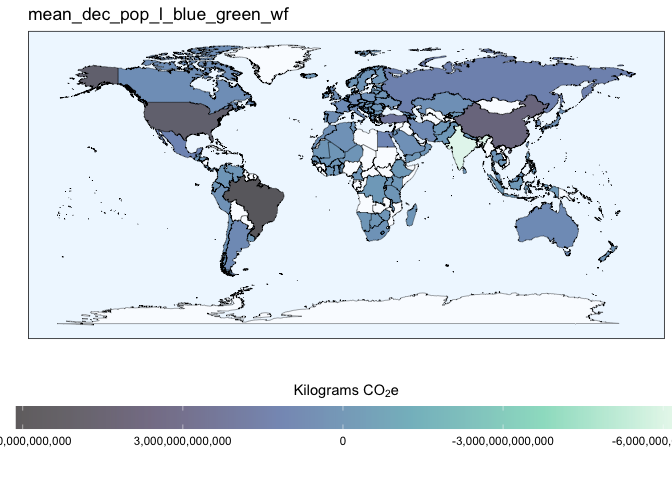
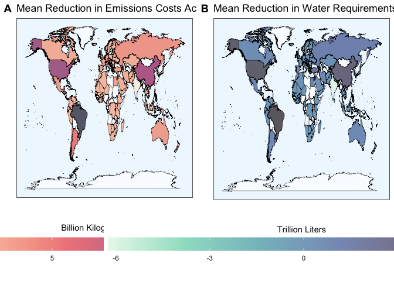
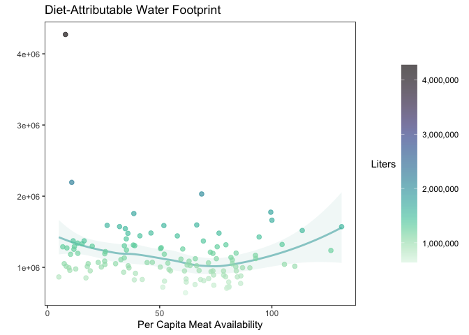
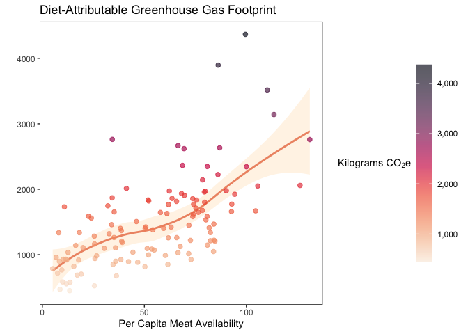
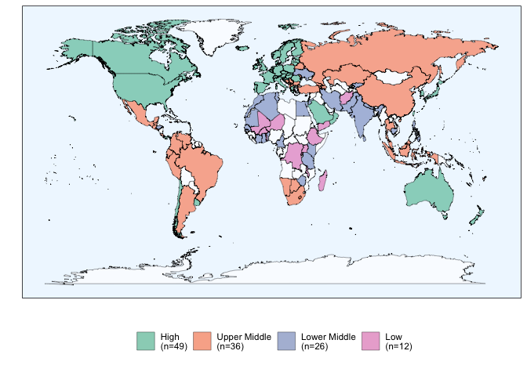
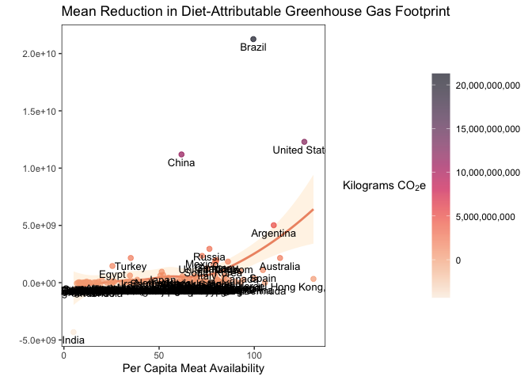

Analysis and Visualization Script
================

## Required Packages

``` r
library(tidyverse)
library(RColorBrewer)
library(colorspace)
```

## Data Loading

``` r
impact_modeling_data <- read.csv("/Users/kenjinchang/github/university-dining-impact-model/data/impact-modeling-data.csv")
```

## Included countries

To distinguish the 123 included countries from within the 135 designated
countries within the `world_map_iso` data without available university
enrollment and dietary footprint data, we need to construct a new column
that can aid with this need,

``` r
impact_modeling_data %>%
  mutate(inclusion=ifelse(uni_enr_tot>0,country)) %>%
  ggplot(aes(x=long,y=lat,fill=inclusion,group=group)) + 
  geom_polygon(color="black",size=0.05,alpha=0.33) +
  scale_fill_discrete(h=c(260,260),na.value="white") +
  guides(fill="none") +
  xlab("") + 
  ylab("") +
  labs(caption="") +
  ggtitle("Figure 1. Choropleth map highlighting the 123 countries included in our analyses.") +
  theme(legend.position="none",panel.grid=element_blank(),panel.background=element_rect(fill="aliceblue"),panel.border=element_rect(fill=NA),axis.text=element_blank(),axis.ticks=element_blank())
```

<!-- -->

Comparing university enrollment totals across countries.

``` r
ggplot(impact_modeling_data,aes(x=long,y=lat,fill=uni_enr_tot,group=group)) + 
  geom_polygon(color="black",size=0.05) + 
  scale_fill_distiller(name="",palette="Purples",trans="reverse",na.value="white",labels=scales::comma) +
  guides(fill=guide_colorbar(reverse=TRUE)) + 
  xlab("") + 
  ylab("") +
  labs(caption="") +
  ggtitle("Figure 2. Choropleth map comparing university enrollment estimates across the 123 included countries.") +
  theme(legend.position="bottom",panel.grid=element_blank(),panel.background=element_rect(fill="aliceblue"),panel.border=element_rect(fill=NA),axis.text=element_blank(),axis.ticks=element_blank(),legend.key.width=unit(2,"cm"))
```

<!-- -->

Comparing university enrollment proportions (university enrollees as a
function of the national population) across countries.

``` r
ggplot(impact_modeling_data,aes(x=long,y=lat,fill=uni_enr_prop,group=group)) + 
  geom_polygon(color="black",size=0.05) + 
  scale_fill_distiller(name="",palette="Purples",trans="reverse",na.value="white",labels=scales::percent) +
  guides(fill=guide_colorbar(reverse=TRUE)) + 
  xlab("") + 
  ylab("") +
  labs(caption="") +
  ggtitle("Figure 4. Choropleth map comparing university enrollment estimates as a proportion of their respective national populations across the 123 included countries.") +
  theme(legend.position="bottom",panel.grid=element_blank(),panel.background=element_rect(fill="aliceblue"),panel.border=element_rect(fill=NA),axis.text=element_blank(),axis.ticks=element_blank(),legend.key.width=unit(2,"cm"))
```

<!-- -->

Comparing per capita baseline carbon footprint (kg co2e) across
countries

``` r
ggplot(impact_modeling_data,aes(x=long,y=lat,fill=baseline_kg_co2e_total,group=group)) + 
  geom_polygon(color="black",size=0.05,alpha=0.9) + 
  scale_fill_continuous_sequential(name="",palette="OrRd",na.value="white",labels=scales::comma) +
  guides() +
  xlab("") + 
  ylab("") +
  labs(caption="") +
  ggtitle("Figure 5. Choropleth map comparing annual per capita dietary greenhouse gas estimates (kg CO2e) at baseline across the 123 included countries.") +
  theme(legend.position="bottom",panel.grid=element_blank(),panel.background=element_rect(fill="aliceblue"),panel.border=element_rect(fill=NA),axis.text=element_blank(),axis.ticks=element_blank(),legend.key.width=unit(2,"cm"))
```

<!-- -->

Comparing per capita water footprint of baseline diet across countries.

``` r
ggplot(impact_modeling_data,aes(x=long,y=lat,fill=baseline_l_blue_green_wf,group=group)) + 
  geom_polygon(color="black",size=0.05,alpha=0.9) + 
  scale_fill_continuous_sequential(name="",palette="BluGrn",na.value="white",labels=scales::comma) +
  guides() +
  xlab("") + 
  ylab("") +
  labs(caption="") +
  ggtitle("Figure 6. Choropleth map comparing annual per capita dietary water footprint (L) at baseline across the 123 included countries.") +
  theme(legend.position="bottom",panel.grid=element_blank(),panel.background=element_rect(fill="aliceblue"),panel.border=element_rect(fill=NA),axis.text=element_blank(),axis.ticks=element_blank(),legend.key.width=unit(2,"cm"))
```

<!-- -->

## Reduction Modeling

In order to examine the mitigation potential associated with each of the
explored dietary scenarios, we will need to assemble population-level
estimates by multiplying each country’s annual per capita baseline
estimates against their respective enrollment totals.

To begin this process, we will first create an accessory dataframe
dropping the relevant shapefile and map data.

``` r
reduction_modeling_data <- read.csv("/Users/kenjinchang/github/university-dining-impact-model/data/impact-modeling-data.csv") %>%
  distinct(country,isced6_enr,isced7_enr,isced8_enr,natpop_est,uni_enr_tot,uni_enr_prop,baseline_kg_co2e_excl_luc,baseline_kg_co2e_total,baseline_l_blue_green_wf,baseline_l_blue_wf_total,baseline_l_green_wf
,meatless_day_kg_co2e_excl_luc,meatless_day_kg_co2e_total,meatless_day_l_blue_green_wf,meatless_day_l_blue_wf_total,meatless_day_l_green_wf,no_dairy_kg_co2e_excl_luc,no_dairy_kg_co2e_total,no_dairy_l_blue_green_wf,no_dairy_l_blue_wf_total,no_dairy_l_green_wf,low_red_meat_kg_co2e_excl_luc,low_red_meat_kg_co2e_total,low_red_meat_l_blue_green_wf,low_red_meat_l_blue_wf_total,low_red_meat_l_green_wf,no_red_meat_kg_co2e_excl_luc,no_red_meat_kg_co2e_total,no_red_meat_l_blue_green_wf,no_red_meat_l_blue_wf_total,no_red_meat_l_green_wf,pescetarian_kg_co2e_excl_luc,pescetarian_kg_co2e_total,pescetarian_l_blue_green_wf,pescetarian_l_blue_wf_total,pescetarian_l_green_wf,lacto_ovo_vegetarian_kg_co2e_excl_luc,lacto_ovo_vegetarian_kg_co2e_total,lacto_ovo_vegetarian_l_blue_green_wf,lacto_ovo_vegetarian_l_blue_wf_total,lacto_ovo_vegetarian_l_green_wf,X2.3_vegan_kg_co2e_excl_luc,X2.3_vegan_kg_co2e_total,X2.3_vegan_l_blue_green_wf,X2.3_vegan_l_blue_wf_total,X2.3_vegan_l_green_wf,vegan_kg_co2e_excl_luc,vegan_kg_co2e_total,vegan_l_blue_green_wf,vegan_l_blue_wf_total,vegan_l_green_wf) %>%
  drop_na()
```

With this complete, we will need to construct 9 new variables: one
isolating the per capita carbon footprint attributable to land-use
change for each of our dietary scenarios.

``` r
reduction_modeling_data <- reduction_modeling_data %>% mutate(baseline_kg_co2e_luc=baseline_kg_co2e_total-baseline_kg_co2e_excl_luc) %>%
  mutate(meatless_day_kg_co2e_luc=meatless_day_kg_co2e_total-meatless_day_kg_co2e_excl_luc) %>%
  mutate(no_dairy_kg_co2e_luc=no_dairy_kg_co2e_total-no_dairy_kg_co2e_excl_luc) %>%
  mutate(low_red_meat_kg_co2e_luc=low_red_meat_kg_co2e_total-low_red_meat_kg_co2e_excl_luc) %>%
  mutate(no_red_meat_kg_co2e_luc=no_red_meat_kg_co2e_total-no_red_meat_kg_co2e_excl_luc) %>%
  mutate(pescetarian_kg_co2e_luc=pescetarian_kg_co2e_total-pescetarian_kg_co2e_excl_luc) %>%
  mutate(lacto_ovo_vegetarian_kg_co2e_luc=lacto_ovo_vegetarian_kg_co2e_total-lacto_ovo_vegetarian_kg_co2e_excl_luc) %>%
  mutate(X2.3_vegan_kg_co2e_luc=X2.3_vegan_kg_co2e_total-X2.3_vegan_kg_co2e_excl_luc) %>%
  mutate(vegan_kg_co2e_luc=vegan_kg_co2e_total-vegan_kg_co2e_excl_luc)
```

With these new variables in place, we can generate population-level
estimates by scaling each of these per capita estimates according to the
university enrollment totals for each country.

``` r
reduction_modeling_data <- reduction_modeling_data %>%
  mutate(pop_baseline_kg_co2e_excl_luc=baseline_kg_co2e_excl_luc*uni_enr_tot) %>%
  mutate(pop_baseline_kg_co2e_total=baseline_kg_co2e_total*uni_enr_tot) %>%
  mutate(pop_baseline_kg_co2e_luc=baseline_kg_co2e_luc*uni_enr_tot) %>%
  mutate(pop_baseline_l_blue_green_wf=baseline_l_blue_green_wf*uni_enr_tot) %>%
  mutate(pop_baseline_l_blue_wf_total=baseline_l_blue_wf_total*uni_enr_tot) %>%
  mutate(pop_baseline_l_green_wf=baseline_l_green_wf*uni_enr_tot) %>%
  mutate(pop_meatless_day_kg_co2e_excl_luc=meatless_day_kg_co2e_excl_luc*uni_enr_tot) %>%
  mutate(pop_meatless_day_kg_co2e_total=meatless_day_kg_co2e_total*uni_enr_tot) %>%
  mutate(pop_meatless_day_kg_co2e_luc=meatless_day_kg_co2e_luc*uni_enr_tot) %>%
  mutate(pop_meatless_day_l_blue_green_wf=meatless_day_l_blue_green_wf*uni_enr_tot) %>%
  mutate(pop_meatless_day_l_blue_wf_total=meatless_day_l_blue_wf_total*uni_enr_tot) %>%
  mutate(pop_meatless_day_l_green_wf=meatless_day_l_green_wf*uni_enr_tot) %>%
  mutate(pop_no_dairy_kg_co2e_excl_luc=no_dairy_kg_co2e_excl_luc*uni_enr_tot) %>%
  mutate(pop_no_dairy_kg_co2e_total=no_dairy_kg_co2e_total*uni_enr_tot) %>%
  mutate(pop_no_dairy_kg_co2e_luc=no_dairy_kg_co2e_luc*uni_enr_tot) %>%
  mutate(pop_no_dairy_l_blue_green_wf=no_dairy_l_blue_green_wf*uni_enr_tot) %>%
  mutate(pop_no_dairy_l_blue_wf_total=no_dairy_l_blue_wf_total*uni_enr_tot) %>%
  mutate(pop_no_dairy_l_green_wf=no_dairy_l_green_wf*uni_enr_tot) %>%
  mutate(pop_low_red_meat_kg_co2e_excl_luc=low_red_meat_kg_co2e_excl_luc*uni_enr_tot) %>%
  mutate(pop_low_red_meat_kg_co2e_total=low_red_meat_kg_co2e_total*uni_enr_tot) %>%
  mutate(pop_low_red_meat_kg_co2e_luc=low_red_meat_kg_co2e_luc*uni_enr_tot) %>%
  mutate(pop_low_red_meat_l_blue_green_wf=low_red_meat_l_blue_green_wf*uni_enr_tot) %>%
  mutate(pop_low_red_meat_l_blue_wf_total=low_red_meat_l_blue_wf_total*uni_enr_tot) %>%
  mutate(pop_low_red_meat_l_green_wf=low_red_meat_l_green_wf*uni_enr_tot) %>%
  mutate(pop_no_red_meat_kg_co2e_excl_luc=no_red_meat_kg_co2e_excl_luc*uni_enr_tot) %>%
  mutate(pop_no_red_meat_kg_co2e_total=no_red_meat_kg_co2e_total*uni_enr_tot) %>%
  mutate(pop_no_red_meat_kg_co2e_luc=no_red_meat_kg_co2e_luc*uni_enr_tot) %>%
  mutate(pop_no_red_meat_l_blue_green_wf=no_red_meat_l_blue_green_wf*uni_enr_tot) %>%
  mutate(pop_no_red_meat_l_blue_wf_total=no_red_meat_l_blue_wf_total*uni_enr_tot) %>%
  mutate(pop_no_red_meat_l_green_wf=no_red_meat_l_green_wf*uni_enr_tot) %>%
  mutate(pop_pescetarian_kg_co2e_excl_luc=pescetarian_kg_co2e_excl_luc*uni_enr_tot) %>%
  mutate(pop_pescetarian_kg_co2e_total=pescetarian_kg_co2e_total*uni_enr_tot) %>%
  mutate(pop_pescetarian_kg_co2e_luc=pescetarian_kg_co2e_luc*uni_enr_tot) %>%
  mutate(pop_pescetarian_l_blue_green_wf=pescetarian_l_blue_green_wf*uni_enr_tot) %>%
  mutate(pop_pescetarian_l_blue_wf_total=pescetarian_l_blue_wf_total*uni_enr_tot) %>%
  mutate(pop_pescetarian_l_green_wf=pescetarian_l_green_wf*uni_enr_tot) %>%
  mutate(pop_lacto_ovo_vegetarian_kg_co2e_excl_luc=lacto_ovo_vegetarian_kg_co2e_excl_luc*uni_enr_tot) %>%
  mutate(pop_lacto_ovo_vegetarian_kg_co2e_total=lacto_ovo_vegetarian_kg_co2e_total*uni_enr_tot) %>%
  mutate(pop_lacto_ovo_vegetarian_kg_co2e_luc=lacto_ovo_vegetarian_kg_co2e_luc*uni_enr_tot) %>%
  mutate(pop_lacto_ovo_vegetarian_l_blue_green_wf=lacto_ovo_vegetarian_l_blue_green_wf*uni_enr_tot) %>%
  mutate(pop_lacto_ovo_vegetarian_l_blue_wf_total=lacto_ovo_vegetarian_l_blue_wf_total*uni_enr_tot) %>%
  mutate(pop_lacto_ovo_vegetarian_l_green_wf=lacto_ovo_vegetarian_l_green_wf*uni_enr_tot) %>%
  mutate(pop_X2.3_vegan_kg_co2e_excl_luc=X2.3_vegan_kg_co2e_excl_luc*uni_enr_tot) %>%
  mutate(pop_X2.3_vegan_kg_co2e_total=X2.3_vegan_kg_co2e_total*uni_enr_tot) %>%
  mutate(pop_X2.3_vegan_kg_co2e_luc=X2.3_vegan_kg_co2e_luc*uni_enr_tot) %>%
  mutate(pop_X2.3_vegan_l_blue_green_wf=X2.3_vegan_l_blue_green_wf*uni_enr_tot) %>%
  mutate(pop_X2.3_vegan_l_blue_wf_total=X2.3_vegan_l_blue_wf_total*uni_enr_tot) %>%
  mutate(pop_X2.3_vegan_l_green_wf=X2.3_vegan_l_green_wf*uni_enr_tot) %>%
  mutate(pop_vegan_kg_co2e_excl_luc=vegan_kg_co2e_excl_luc*uni_enr_tot) %>%
  mutate(pop_vegan_kg_co2e_total=vegan_kg_co2e_total*uni_enr_tot) %>%
  mutate(pop_vegan_kg_co2e_luc=vegan_kg_co2e_luc*uni_enr_tot) %>%
  mutate(pop_vegan_l_blue_green_wf=vegan_l_blue_green_wf*uni_enr_tot) %>%
  mutate(pop_vegan_l_blue_wf_total=vegan_l_blue_wf_total*uni_enr_tot) %>%
  mutate(pop_vegan_l_green_wf=vegan_l_green_wf*uni_enr_tot)
```

With these newly constructed population-level estimates, we can now
model how each of these indicators would change in response to the
proposed dietary scenarios. To do so, we will subtract each of the
population-level estimates associated the eight identified dietary
scenarios from the corresponding baseline statistic for each country.
Seeing as there are six indicators for each of the eight non-baseline
scenarios, this should generate a total of 48 new columns.

``` r
reduction_modeling_data <- reduction_modeling_data %>% mutate(dec_pop_meatless_day_kg_co2e_excl_luc=pop_baseline_kg_co2e_excl_luc-pop_meatless_day_kg_co2e_excl_luc) %>%
  mutate(dec_pop_meatless_day_kg_co2e_total=pop_baseline_kg_co2e_total-pop_meatless_day_kg_co2e_total) %>%
  mutate(dec_pop_meatless_day_kg_co2e_luc=pop_baseline_kg_co2e_luc-pop_meatless_day_kg_co2e_luc) %>%
  mutate(dec_pop_meatless_day_l_blue_green_wf=pop_baseline_l_blue_green_wf-pop_meatless_day_l_blue_green_wf) %>%
  mutate(dec_pop_meatless_day_l_blue_wf_total=pop_baseline_l_blue_wf_total-pop_meatless_day_l_blue_wf_total) %>% 
  mutate(dec_pop_meatless_day_l_green_wf=pop_baseline_l_green_wf-pop_meatless_day_l_green_wf) %>%
  mutate(dec_pop_no_dairy_kg_co2e_excl_luc=pop_baseline_kg_co2e_excl_luc-pop_no_dairy_kg_co2e_excl_luc) %>%
  mutate(dec_pop_no_dairy_kg_co2e_total=pop_baseline_kg_co2e_total-pop_no_dairy_kg_co2e_total) %>%
  mutate(dec_pop_no_dairy_kg_co2e_luc=pop_baseline_kg_co2e_luc-pop_no_dairy_kg_co2e_luc) %>%
  mutate(dec_pop_no_dairy_l_blue_green_wf=pop_baseline_l_blue_green_wf-pop_no_dairy_l_blue_green_wf) %>%
  mutate(dec_pop_no_dairy_l_blue_wf_total=pop_baseline_l_blue_wf_total-pop_no_dairy_l_blue_wf_total) %>%
  mutate(dec_pop_no_dairy_l_green_wf=pop_baseline_l_green_wf-pop_no_dairy_l_green_wf) %>%
  mutate(dec_pop_low_red_meat_kg_co2e_excl_luc=pop_baseline_kg_co2e_excl_luc-pop_low_red_meat_kg_co2e_excl_luc) %>% 
  mutate(dec_pop_low_red_meat_kg_co2e_total=pop_baseline_kg_co2e_total-pop_low_red_meat_kg_co2e_total) %>%
  mutate(dec_pop_low_red_meat_kg_co2e_luc=pop_baseline_kg_co2e_luc-pop_low_red_meat_kg_co2e_luc) %>%
  mutate(dec_pop_low_red_meat_l_blue_green_wf=pop_baseline_l_blue_green_wf-pop_low_red_meat_l_blue_green_wf) %>%
  mutate(dec_pop_low_red_meat_l_blue_wf_total=pop_baseline_l_blue_wf_total-pop_low_red_meat_l_blue_wf_total) %>%
  mutate(dec_pop_low_red_meat_l_green_wf=pop_baseline_l_green_wf-pop_low_red_meat_l_green_wf) %>%
  mutate(dec_pop_no_red_meat_kg_co2e_excl_luc=pop_baseline_kg_co2e_excl_luc-pop_no_red_meat_kg_co2e_excl_luc) %>%
  mutate(dec_pop_no_red_meat_kg_co2e_total=pop_baseline_kg_co2e_total-pop_no_red_meat_kg_co2e_total) %>%
  mutate(dec_pop_no_red_meat_kg_co2e_luc=pop_baseline_kg_co2e_luc-pop_no_red_meat_kg_co2e_luc) %>%
  mutate(dec_pop_no_red_meat_l_blue_green_wf=pop_baseline_l_blue_green_wf-pop_no_red_meat_l_blue_green_wf) %>%
  mutate(dec_pop_no_red_meat_l_blue_wf_total=pop_baseline_l_blue_wf_total-pop_no_red_meat_l_blue_wf_total) %>%
  mutate(dec_pop_no_red_meat_l_green_wf=pop_baseline_l_green_wf-pop_no_red_meat_l_green_wf) %>%
  mutate(dec_pop_pescetarian_kg_co2e_excl_luc=pop_baseline_kg_co2e_excl_luc-pop_pescetarian_kg_co2e_excl_luc) %>%
  mutate(dec_pop_pescetarian_kg_co2e_total=pop_baseline_kg_co2e_total-pop_pescetarian_kg_co2e_total) %>%
  mutate(dec_pop_pescetarian_kg_co2e_luc=pop_baseline_kg_co2e_luc-pop_pescetarian_kg_co2e_luc) %>%
  mutate(dec_pop_pescetarian_l_blue_green_wf=pop_baseline_l_blue_green_wf-pop_pescetarian_l_blue_green_wf) %>%
  mutate(dec_pop_pescetarian_l_blue_wf_total=pop_baseline_l_blue_wf_total-pop_pescetarian_l_blue_wf_total) %>%
  mutate(dec_pop_pescetarian_l_green_wf=pop_baseline_l_green_wf-pop_pescetarian_l_green_wf) %>%
  mutate(dec_pop_lacto_ovo_vegetarian_kg_co2e_excl_luc=pop_baseline_kg_co2e_excl_luc-pop_lacto_ovo_vegetarian_kg_co2e_excl_luc) %>%
  mutate(dec_pop_lacto_ovo_vegetarian_kg_co2e_total=pop_baseline_kg_co2e_total-pop_lacto_ovo_vegetarian_kg_co2e_total) %>%
  mutate(dec_pop_lacto_ovo_vegetarian_kg_co2e_luc=pop_baseline_kg_co2e_luc-pop_lacto_ovo_vegetarian_kg_co2e_luc) %>%
  mutate(dec_pop_lacto_ovo_vegetarian_l_blue_green_wf=pop_baseline_l_blue_green_wf-pop_lacto_ovo_vegetarian_l_blue_green_wf) %>%
  mutate(dec_pop_lacto_ovo_vegetarian_l_blue_wf_total=pop_baseline_l_blue_wf_total-pop_lacto_ovo_vegetarian_l_blue_wf_total) %>%
  mutate(dec_pop_lacto_ovo_vegetarian_l_green_wf=pop_baseline_l_green_wf-pop_lacto_ovo_vegetarian_l_green_wf) %>%
  mutate(dec_pop_X2.3_vegan_kg_co2e_excl_luc=pop_baseline_kg_co2e_excl_luc-pop_X2.3_vegan_kg_co2e_excl_luc) %>%
  mutate(dec_pop_X2.3_vegan_kg_co2e_total=pop_baseline_kg_co2e_total-pop_X2.3_vegan_kg_co2e_total) %>%
  mutate(dec_pop_X2.3_vegan_kg_co2e_luc=pop_baseline_kg_co2e_luc-pop_X2.3_vegan_kg_co2e_luc) %>%
  mutate(dec_pop_X2.3_vegan_l_blue_green_wf=pop_baseline_l_blue_green_wf-pop_X2.3_vegan_l_blue_green_wf) %>%
  mutate(dec_pop_X2.3_vegan_l_blue_wf_total=pop_baseline_l_blue_wf_total-pop_X2.3_vegan_l_blue_wf_total) %>%
  mutate(dec_pop_X2.3_vegan_l_green_wf=pop_baseline_l_green_wf-pop_X2.3_vegan_l_green_wf) %>%
  mutate(dec_pop_vegan_kg_co2e_excl_luc=pop_baseline_kg_co2e_excl_luc-pop_vegan_kg_co2e_excl_luc) %>%
  mutate(dec_pop_vegan_kg_co2e_total=pop_baseline_kg_co2e_total-pop_vegan_kg_co2e_total) %>%
  mutate(dec_pop_vegan_kg_co2e_luc=pop_baseline_kg_co2e_luc-pop_vegan_kg_co2e_luc) %>%
  mutate(dec_pop_vegan_l_blue_green_wf=pop_baseline_l_blue_green_wf-pop_vegan_l_blue_green_wf) %>%
  mutate(dec_pop_vegan_l_blue_wf_total=pop_baseline_l_blue_wf_total-pop_vegan_l_blue_wf_total) %>%
  mutate(dec_pop_vegan_l_green_wf=pop_baseline_l_green_wf-pop_vegan_l_green_wf) 
```

Now, we will do the same for the percent decrease calculations.

``` r
reduction_modeling_data <- reduction_modeling_data %>% mutate(perc_dec_pop_meatless_day_kg_co2e_excl_luc=(pop_baseline_kg_co2e_excl_luc-pop_meatless_day_kg_co2e_excl_luc)/pop_baseline_kg_co2e_excl_luc) %>%
  mutate(perc_dec_pop_meatless_day_kg_co2e_total=(pop_meatless_day_kg_co2e_total-pop_meatless_day_kg_co2e_total)/pop_meatless_day_kg_co2e_total) %>%
  mutate(perc_dec_pop_meatless_day_kg_co2e_luc=(pop_baseline_kg_co2e_luc-pop_meatless_day_kg_co2e_luc)/pop_baseline_kg_co2e_luc) %>%
  mutate(perc_dec_pop_meatless_day_l_blue_green_wf=(pop_baseline_l_blue_green_wf-pop_meatless_day_l_blue_green_wf)/pop_baseline_l_blue_green_wf) %>%
  mutate(perc_dec_pop_meatless_day_l_blue_wf_total=(pop_baseline_l_blue_wf_total-pop_meatless_day_l_blue_wf_total)/pop_baseline_l_blue_wf_total) %>% 
  mutate(perc_dec_pop_meatless_day_l_green_wf=(pop_baseline_l_green_wf-pop_meatless_day_l_green_wf)/pop_baseline_l_green_wf) %>%
  mutate(perc_dec_pop_no_dairy_kg_co2e_excl_luc=(pop_baseline_kg_co2e_excl_luc-pop_no_dairy_kg_co2e_excl_luc)/pop_baseline_kg_co2e_excl_luc) %>%
  mutate(perc_dec_pop_no_dairy_kg_co2e_total=(pop_baseline_kg_co2e_total-pop_no_dairy_kg_co2e_total)/pop_baseline_kg_co2e_total) %>%
  mutate(perc_dec_pop_no_dairy_kg_co2e_luc=(pop_baseline_kg_co2e_luc-pop_no_dairy_kg_co2e_luc)/pop_baseline_kg_co2e_luc) %>%
  mutate(perc_dec_pop_no_dairy_l_blue_green_wf=(pop_baseline_l_blue_green_wf-pop_no_dairy_l_blue_green_wf)/pop_baseline_l_blue_green_wf) %>%
  mutate(perc_dec_pop_no_dairy_l_blue_wf_total=(pop_baseline_l_blue_wf_total-pop_no_dairy_l_blue_wf_total)/pop_baseline_l_blue_wf_total) %>%
  mutate(perc_dec_pop_no_dairy_l_green_wf=(pop_baseline_l_green_wf-pop_no_dairy_l_green_wf)/pop_baseline_l_green_wf) %>%
  mutate(perc_dec_pop_low_red_meat_kg_co2e_excl_luc=(pop_baseline_kg_co2e_excl_luc-pop_low_red_meat_kg_co2e_excl_luc)/pop_baseline_kg_co2e_excl_luc) %>% 
  mutate(perc_dec_pop_low_red_meat_kg_co2e_total=(pop_baseline_kg_co2e_total-pop_low_red_meat_kg_co2e_total)/pop_baseline_kg_co2e_total) %>%
  mutate(perc_dec_pop_low_red_meat_kg_co2e_luc=(pop_baseline_kg_co2e_luc-pop_low_red_meat_kg_co2e_luc)/pop_baseline_kg_co2e_luc) %>%
  mutate(perc_dec_pop_low_red_meat_l_blue_green_wf=(pop_baseline_l_blue_green_wf-pop_low_red_meat_l_blue_green_wf)/pop_baseline_l_blue_green_wf) %>%
  mutate(perc_dec_pop_low_red_meat_l_blue_wf_total=(pop_baseline_l_blue_wf_total-pop_low_red_meat_l_blue_wf_total)/pop_baseline_l_blue_wf_total) %>%
  mutate(perc_dec_pop_low_red_meat_l_green_wf=(pop_baseline_l_green_wf-pop_low_red_meat_l_green_wf)/pop_baseline_l_green_wf) %>%
  mutate(perc_dec_pop_no_red_meat_kg_co2e_excl_luc=(pop_baseline_kg_co2e_excl_luc-pop_no_red_meat_kg_co2e_excl_luc)/pop_baseline_kg_co2e_excl_luc) %>%
  mutate(perc_dec_pop_no_red_meat_kg_co2e_total=(pop_baseline_kg_co2e_total-pop_no_red_meat_kg_co2e_total)/pop_baseline_kg_co2e_total) %>%
  mutate(perc_dec_pop_no_red_meat_kg_co2e_luc=(pop_baseline_kg_co2e_luc-pop_no_red_meat_kg_co2e_luc)/pop_baseline_kg_co2e_luc) %>%
  mutate(perc_dec_pop_no_red_meat_l_blue_green_wf=(pop_baseline_l_blue_green_wf-pop_no_red_meat_l_blue_green_wf)/pop_baseline_l_blue_green_wf) %>%
  mutate(perc_dec_pop_no_red_meat_l_blue_wf_total=(pop_baseline_l_blue_wf_total-pop_no_red_meat_l_blue_wf_total)/pop_baseline_l_blue_wf_total) %>%
  mutate(perc_dec_pop_no_red_meat_l_green_wf=(pop_baseline_l_green_wf-pop_no_red_meat_l_green_wf)/pop_baseline_l_green_wf) %>%
  mutate(perc_dec_pop_pescetarian_kg_co2e_excl_luc=(pop_baseline_kg_co2e_excl_luc-pop_pescetarian_kg_co2e_excl_luc)/pop_baseline_kg_co2e_excl_luc) %>%
  mutate(perc_dec_pop_pescetarian_kg_co2e_total=(pop_baseline_kg_co2e_total-pop_pescetarian_kg_co2e_total)/pop_baseline_kg_co2e_total) %>%
  mutate(perc_dec_pop_pescetarian_kg_co2e_luc=(pop_baseline_kg_co2e_luc-pop_pescetarian_kg_co2e_luc)/pop_baseline_kg_co2e_luc) %>%
  mutate(perc_dec_pop_pescetarian_l_blue_green_wf=(pop_baseline_l_blue_green_wf-pop_pescetarian_l_blue_green_wf)/pop_baseline_l_blue_green_wf) %>%
  mutate(perc_dec_pop_pescetarian_l_blue_wf_total=(pop_baseline_l_blue_wf_total-pop_pescetarian_l_blue_wf_total)/pop_baseline_l_blue_wf_total) %>%
  mutate(perc_dec_pop_pescetarian_l_green_wf=(pop_baseline_l_green_wf-pop_pescetarian_l_green_wf)/pop_baseline_l_green_wf) %>%
  mutate(perc_dec_pop_lacto_ovo_vegetarian_kg_co2e_excl_luc=(pop_baseline_kg_co2e_excl_luc-pop_lacto_ovo_vegetarian_kg_co2e_excl_luc)/pop_baseline_kg_co2e_excl_luc) %>%
  mutate(perc_dec_pop_lacto_ovo_vegetarian_kg_co2e_total=(pop_baseline_kg_co2e_total-pop_lacto_ovo_vegetarian_kg_co2e_total)/pop_baseline_kg_co2e_total) %>%
  mutate(perc_dec_pop_lacto_ovo_vegetarian_kg_co2e_luc=(pop_baseline_kg_co2e_luc-pop_lacto_ovo_vegetarian_kg_co2e_luc)/pop_baseline_kg_co2e_luc) %>%
  mutate(perc_dec_pop_lacto_ovo_vegetarian_l_blue_green_wf=(pop_baseline_l_blue_green_wf-pop_lacto_ovo_vegetarian_l_blue_green_wf)/pop_baseline_l_blue_green_wf) %>%
  mutate(perc_dec_pop_lacto_ovo_vegetarian_l_blue_wf_total=(pop_baseline_l_blue_wf_total-pop_lacto_ovo_vegetarian_l_blue_wf_total)/pop_baseline_l_blue_wf_total) %>%
  mutate(perc_dec_pop_lacto_ovo_vegetarian_l_green_wf=(pop_baseline_l_green_wf-pop_lacto_ovo_vegetarian_l_green_wf)/pop_baseline_l_green_wf) %>%
  mutate(perc_dec_pop_X2.3_vegan_kg_co2e_excl_luc=(pop_baseline_kg_co2e_excl_luc-pop_X2.3_vegan_kg_co2e_excl_luc)/pop_baseline_kg_co2e_excl_luc) %>%
  mutate(perc_dec_pop_X2.3_vegan_kg_co2e_total=(pop_baseline_kg_co2e_total-pop_X2.3_vegan_kg_co2e_total)/pop_baseline_kg_co2e_total) %>%
  mutate(perc_dec_pop_X2.3_vegan_kg_co2e_luc=(pop_baseline_kg_co2e_luc-pop_X2.3_vegan_kg_co2e_luc)/pop_baseline_kg_co2e_luc) %>%
  mutate(perc_dec_pop_X2.3_vegan_l_blue_green_wf=(pop_baseline_l_blue_green_wf-pop_X2.3_vegan_l_blue_green_wf)/pop_baseline_l_blue_green_wf) %>%
  mutate(perc_dec_pop_X2.3_vegan_l_blue_wf_total=(pop_baseline_l_blue_wf_total-pop_X2.3_vegan_l_blue_wf_total)/pop_baseline_l_blue_wf_total) %>%
  mutate(perc_dec_pop_X2.3_vegan_l_green_wf=(pop_baseline_l_green_wf-pop_X2.3_vegan_l_green_wf)/pop_baseline_l_green_wf) %>%
  mutate(perc_dec_pop_vegan_kg_co2e_excl_luc=(pop_baseline_kg_co2e_excl_luc-pop_vegan_kg_co2e_excl_luc)/pop_baseline_kg_co2e_excl_luc) %>%
  mutate(perc_dec_pop_vegan_kg_co2e_total=(pop_baseline_kg_co2e_total-pop_vegan_kg_co2e_total)/pop_baseline_kg_co2e_total) %>%
  mutate(perc_dec_pop_vegan_kg_co2e_luc=(pop_baseline_kg_co2e_luc-pop_vegan_kg_co2e_luc)/pop_baseline_kg_co2e_luc) %>%
  mutate(perc_dec_pop_vegan_l_blue_green_wf=(pop_baseline_l_blue_green_wf-pop_vegan_l_blue_green_wf)/pop_baseline_l_blue_green_wf) %>%
  mutate(perc_dec_pop_vegan_l_blue_wf_total=(pop_baseline_l_blue_wf_total-pop_vegan_l_blue_wf_total)/pop_baseline_l_blue_wf_total) %>%
  mutate(perc_dec_pop_vegan_l_green_wf=(pop_baseline_l_green_wf-pop_vegan_l_green_wf)/pop_baseline_l_green_wf)
```

Now, per our research questions, we will add economic designations using
the World Bank Atlas Method to categorize our 123 countries into 4
groups: low-income countries, lower-middle-income countries,
upper-middle-income countries, and high-income countries. We will do so
using the classifications provided
[here](https://datahelpdesk.worldbank.org/knowledgebase/articles/906519-world-bank-country-and-lending-groups).
\[Note: Venezuela has been temporarily unclassified in 2021 pending
release of revised national accounts statistics but has most recently
been designated as an upper-middle-income country.\]

``` r
reduction_modeling_data <- reduction_modeling_data %>%
  mutate(income.classification=case_when(country=="Australia"~"high",country=="Austria"~"high",country=="Barbados"~"high",country=="Belgium"~"high",country=="Bermuda"~"high",country=="Brunei"~"high",country=="Canada"~"high",country=="Chile"~"high",country=="Croatia"~"high",country=="Cyprus"~"high",country=="Czech Republic"~"high",country=="Denmark"~"high",country=="Estonia"~"high",country=="Finland"~"high",country=="France"~"high",country=="Germany"~"high",country=="Greece"~"high",country=="Hong Kong, China"~"high",country=="Hungary"~"high",country=="Iceland"~"high",country=="Ireland"~"high",country=="Israel"~"high",country=="Italy"~"high",country=="Japan"~"high",country=="Kuwait"~"high",country=="Latvia"~"high",country=="Lithuania"~"high",country=="Luxembourg"~"high",country=="Macao, China"~"high",country=="Malta"~"high",country=="Netherlands"~"high",country=="New Zealand"~"high",country=="Norway"~"high",country=="Oman"~"high",country=="Panama"~"high",country=="Poland"~"high",country=="Portugal"~"high",country=="Romania"~"high",country=="Saudi Arabia"~"high",country=="Slovak Republic"~"high",country=="Slovenia"~"high",country=="South Korea"~"high",country=="Spain"~"high",country=="Sweden"~"high",country=="Switzerland"~"high",country=="Taiwan"~"high",country=="United Kingdom"~"high",country=="United States"~"high",country=="Uruguay"~"high",country=="Afghanistan"~"low",country=="Burkina Faso"~"low",country=="Congo, Dem. Rep."~"low",country=="Ethiopia"~"low",country=="Madagascar"~"low",country=="Malawi"~"low",country=="Mali"~"low",country=="Niger"~"low",country=="Rwanda"~"low",country=="Togo"~"low",country=="Uganda"~"low",country=="Yemen"~"low",country=="Algeria"~"lower middle",country=="Benin"~"lower middle",country=="Cambodia"~"lower middle",country=="Cameroon"~"lower middle",country=="Cape Verde"~"lower middle",country=="Cote d'Ivoire"~"lower middle",country=="Egypt"~"lower middle",country=="Ghana"~"lower middle",country=="Honduras"~"lower middle",country=="India"~"lower middle",country=="Iran"~"lower middle",country=="Jordan"~"lower middle",country=="Kenya"~"lower middle",country=="Krygyz Republic"~"lower middle",country=="Lebanon"~"lower middle",country=="Mauritania"~"lower middle",country=="Morocco"~"lower middle",country=="Nepal"~"lower middle",country=="Pakistan"~"lower middle",country=="Philippines"~"lower middle",country=="Senegal"~"lower middle",country=="Sri Lanka"~"lower middle",country=="Tanzania"~"lower middle",country=="Tunisia"~"lower middle",country=="Ukraine"~"lower middle",country=="Zimbabwe"~"lower middle",country=="Albania"~"upper middle",country=="Argentina"~"upper middle",country=="Armenia"~"upper middle",country=="Azerbaijan"~"upper middle",country=="Belarus"~"upper middle",country=="Belize"~"upper middle",country=="Bosnia and Herzegovina"~"upper middle",country=="Botswana"~"upper middle",country=="Brazil"~"upper middle",country=="Bulgaria"~"upper middle",country=="China"~"upper middle",country=="Colombia"~"upper middle",country=="Costa Rica"~"upper middle",country=="Ecuador"~"upper middle",country=="El Salvador"~"upper middle",country=="Fiji"~"upper middle",country=="Georgia"~"upper middle",country=="Guatemala"~"upper middle",country=="Indonesia"~"upper middle",country=="Jamaica"~"upper middle",country=="Kazakhstan"~"upper middle",country=="Malaysia"~"upper middle",country=="Maldives"~"upper middle",country=="Mauritius"~"upper middle",country=="Mexico"~"upper middle",country=="Moldova"~"upper middle",country=="Montenegro"~"upper middle",country=="Namibia"~"upper middle",country=="North Macedonia"~"upper middle",country=="Peru"~"upper middle",country=="Russia"~"upper middle",country=="Serbia"~"upper middle",country=="South Africa"~"upper middle",country=="Thailand"~"upper middle",country=="Turkey"~"upper middle",country=="Venezuela"~"upper middle"))
```

Now, we will use the `count` function to see how many countries fall
into each group of observations.

``` r
reduction_modeling_data %>% group_by(income.classification) %>%
  count("high")
```

    ## # A tibble: 4 × 3
    ## # Groups:   income.classification [4]
    ##   income.classification `"high"`     n
    ##   <chr>                 <chr>    <int>
    ## 1 high                  high        49
    ## 2 low                   high        12
    ## 3 lower middle          high        26
    ## 4 upper middle          high        36

After rejoining this new dataframe with our original working dataset
(with the shapefile data), we can reconstruct our initial figure - this
time designating the included countries according to their income
classifications.

``` r
left_join(impact_modeling_data,reduction_modeling_data,by="country") %>% ggplot(aes(x=long,y=lat,fill=income.classification,group=group)) + 
  geom_polygon(color="black",size=0.05,alpha=0.33) +
  scale_fill_discrete(limits=c("high","upper middle","lower middle","low"),labels=c("High\n(n=49)","Upper Middle\n(n=36)","Lower Middle\n(n=26)","Low\n(n=12)","NA"),na.value="white") +
  guides() +
  xlab("") + 
  ylab("") +
  labs(caption="") +
  ggtitle("Figure 1. Choropleth map highlighting the 123 countries included in our analyses.") +
  theme(legend.position="bottom",legend.title=element_blank(),panel.grid=element_blank(),panel.background=element_rect(fill="aliceblue"),panel.border=element_rect(fill=NA),axis.text=element_blank(),axis.ticks=element_blank())
```

<!-- -->

``` r
vegan_cf_dec_pop_bp <- ggplot(reduction_modeling_data,aes(x=dec_pop_vegan_kg_co2e_total,y=income.classification,fill=income.classification)) + 
  geom_boxplot(outlier.shape=NA,alpha=0.33) +
  scale_fill_discrete(limits=c("high","upper middle","lower middle","low"),labels=c("High\n(n=49)","Upper Middle\n(n=36)","Lower Middle\n(n=26)","Low\n(n=12)")) +
  scale_y_discrete(limits=c("high","upper middle","lower middle","low")) +
  scale_x_continuous(labels=function(x)x/1000000000) +
  geom_vline(xintercept=0,linetype=2) +
  stat_summary(fun=mean,geom="point",fill="white",shape=21,size=2) +
  coord_cartesian(xlim=c(-500000000,3500000000)) +
  xlab(bquote('Billion Kilograms CO'[2]*'e')) +
  ylab("") +
  ggtitle("Vegan") +
  theme(legend.title=element_blank(),legend.position="bottom",axis.text.y=element_blank(),axis.ticks.y=element_blank())
vegan_cf_dec_pop_bp
```

<!-- -->

``` r
vegan_cf_dec_pop_vp <- ggplot(reduction_modeling_data,aes(x=dec_pop_vegan_kg_co2e_total,y=income.classification,fill=income.classification)) + 
  geom_violin(scale="width",draw_quantiles=0.5,adjust=1,alpha=0.33,trim=TRUE) +
  scale_fill_discrete(limits=c("high","upper middle","lower middle","low"),labels=c("High\n(n=49)","Upper Middle\n(n=36)","Lower Middle\n(n=26)","Low\n(n=12)")) +
  scale_y_discrete(limits=c("high","upper middle","lower middle","low")) +
  scale_x_continuous(labels=function(x)x/1000000000) +
  geom_vline(xintercept=0,linetype=2) +
  stat_summary(fun=mean,geom="point",fill="white",shape=21,size=2) +
  coord_cartesian(xlim=c(-500000000,5000000000)) +
  xlab(bquote('Billion Kilograms CO'[2]*'e')) +
  ylab("") +
  ggtitle("Vegan") +
  theme(legend.title=element_blank(),legend.position="bottom",axis.text.y=element_blank(),axis.ticks.y=element_blank())
vegan_cf_dec_pop_vp
```

<!-- -->

``` r
X2.3_vegan_cf_dec_pop_bp <- ggplot(reduction_modeling_data,aes(x=dec_pop_X2.3_vegan_kg_co2e_total,y=income.classification,fill=income.classification)) + 
  geom_boxplot(outlier.shape=NA,alpha=0.33) +
  scale_fill_discrete(limits=c("high","upper middle","lower middle","low"),labels=c("High\n(n=49)","Upper Middle\n(n=36)","Lower Middle\n(n=26)","Low\n(n=12)")) +
  scale_y_discrete(limits=c("high","upper middle","lower middle","low")) +
  scale_x_continuous(labels=function(x)x/1000000000) +
  geom_vline(xintercept=0,linetype=2) +
  stat_summary(fun=mean,geom="point",fill="white",shape=21,size=2) +
  coord_cartesian(xlim=c(-500000000,3500000000)) +
  xlab(bquote('Billion Kilograms CO'[2]*'e')) +
  ylab("") +
  ggtitle("2/3 Vegan") +
  theme(legend.title=element_blank(),legend.position="bottom",axis.text.y=element_blank(),axis.ticks.y=element_blank())
X2.3_vegan_cf_dec_pop_bp
```

<!-- -->

``` r
X2.3_vegan_cf_dec_pop_vp <- ggplot(reduction_modeling_data,aes(x=dec_pop_X2.3_vegan_kg_co2e_total,y=income.classification,fill=income.classification)) + 
  geom_violin(scale="width",draw_quantiles=0.5,adjust=1,alpha=0.33,trim=TRUE) +
  scale_fill_discrete(limits=c("high","upper middle","lower middle","low"),labels=c("High\n(n=49)","Upper Middle\n(n=36)","Lower Middle\n(n=26)","Low\n(n=12)")) +
  scale_y_discrete(limits=c("high","upper middle","lower middle","low")) +
  scale_x_continuous(labels=function(x)x/1000000000) +
  geom_vline(xintercept=0,linetype=2) +
  stat_summary(fun=mean,geom="point",fill="white",shape=21,size=2) +
  coord_cartesian(xlim=c(-500000000,5000000000)) +
  xlab(bquote('Billion Kilograms CO'[2]*'e')) +
  ylab("") +
  ggtitle("2/3 Vegan") +
  theme(legend.title=element_blank(),legend.position="bottom",axis.text.y=element_blank(),axis.ticks.y=element_blank())
X2.3_vegan_cf_dec_pop_vp
```

<!-- -->

``` r
lacto_ovo_vegetarian_cf_dec_pop_bp <- ggplot(reduction_modeling_data,aes(x=dec_pop_lacto_ovo_vegetarian_kg_co2e_total,y=income.classification,fill=income.classification)) + 
  geom_boxplot(outlier.shape=NA,alpha=0.33) +
  scale_fill_discrete(limits=c("high","upper middle","lower middle","low"),labels=c("High\n(n=49)","Upper Middle\n(n=36)","Lower Middle\n(n=26)","Low\n(n=12)")) +
  scale_y_discrete(limits=c("high","upper middle","lower middle","low")) +
  scale_x_continuous(labels=function(x)x/1000000000) +
  geom_vline(xintercept=0,linetype=2) +
  stat_summary(fun=mean,geom="point",fill="white",shape=21,size=2) +
  coord_cartesian(xlim=c(-500000000,3500000000)) +
  xlab(bquote('Billion Kilograms CO'[2]*'e')) +
  ylab("") +
  ggtitle("Vegetarian") +
  theme(legend.title=element_blank(),legend.position="bottom",axis.text.y=element_blank(),axis.ticks.y=element_blank())
lacto_ovo_vegetarian_cf_dec_pop_bp
```

<!-- -->

``` r
lacto_ovo_vegetarian_cf_dec_pop_vp <- ggplot(reduction_modeling_data,aes(x=dec_pop_lacto_ovo_vegetarian_kg_co2e_total,y=income.classification,fill=income.classification)) + 
  geom_violin(scale="width",draw_quantiles=0.5,adjust=1,alpha=0.33,trim=TRUE) +
  scale_fill_discrete(limits=c("high","upper middle","lower middle","low"),labels=c("High\n(n=49)","Upper Middle\n(n=36)","Lower Middle\n(n=26)","Low\n(n=12)")) +
  scale_y_discrete(limits=c("high","upper middle","lower middle","low")) +
  scale_x_continuous(labels=function(x)x/1000000000) +
  geom_vline(xintercept=0,linetype=2) +
  stat_summary(fun=mean,geom="point",fill="white",shape=21,size=2) +
  coord_cartesian(xlim=c(-500000000,5000000000)) +
  xlab(bquote('Billion Kilograms CO'[2]*'e')) +
  ylab("") +
  ggtitle("Vegetarian") +
  theme(legend.title=element_blank(),legend.position="bottom",axis.text.y=element_blank(),axis.ticks.y=element_blank())
lacto_ovo_vegetarian_cf_dec_pop_vp
```

<!-- -->

``` r
pescetarian_cf_dec_pop_bp <- ggplot(reduction_modeling_data,aes(x=dec_pop_pescetarian_kg_co2e_total,y=income.classification,fill=income.classification)) + 
  geom_boxplot(outlier.shape=NA,alpha=0.33) +
  scale_fill_discrete(limits=c("high","upper middle","lower middle","low"),labels=c("High\n(n=49)","Upper Middle\n(n=36)","Lower Middle\n(n=26)","Low\n(n=12)")) +
  scale_y_discrete(limits=c("high","upper middle","lower middle","low")) +
  scale_x_continuous(labels=function(x)x/1000000000) +
  geom_vline(xintercept=0,linetype=2) +
  stat_summary(fun=mean,geom="point",fill="white",shape=21,size=2) +
  coord_cartesian(xlim=c(-500000000,3500000000)) +
  xlab(bquote('Billion Kilograms CO'[2]*'e')) +
  ylab("") +
  ggtitle("Pescetarian") +
  theme(legend.title=element_blank(),legend.position="bottom",axis.text.y=element_blank(),axis.ticks.y=element_blank())
pescetarian_cf_dec_pop_bp
```

<!-- -->

``` r
pecetarian_cf_dec_pop_vp <- ggplot(reduction_modeling_data,aes(x=dec_pop_pescetarian_kg_co2e_total,y=income.classification,fill=income.classification)) + 
  geom_violin(scale="width",draw_quantiles=0.5,adjust=1,alpha=0.33,trim=TRUE) +
  scale_fill_discrete(limits=c("high","upper middle","lower middle","low"),labels=c("High\n(n=49)","Upper Middle\n(n=36)","Lower Middle\n(n=26)","Low\n(n=12)")) +
  scale_y_discrete(limits=c("high","upper middle","lower middle","low")) +
  scale_x_continuous(labels=function(x)x/1000000000) +
  geom_vline(xintercept=0,linetype=2) +
  stat_summary(fun=mean,geom="point",fill="white",shape=21,size=2) +
  coord_cartesian(xlim=c(-500000000,5000000000)) +
  xlab(bquote('Billion Kilograms CO'[2]*'e')) +
  ylab("") +
  ggtitle("Pescetarian") +
  theme(legend.title=element_blank(),legend.position="bottom",axis.text.y=element_blank(),axis.ticks.y=element_blank())
pecetarian_cf_dec_pop_vp
```

<!-- -->

``` r
no_red_meat_cf_dec_pop_bp <- ggplot(reduction_modeling_data,aes(x=dec_pop_no_red_meat_kg_co2e_total,y=income.classification,fill=income.classification)) + 
  geom_boxplot(outlier.shape=NA,alpha=0.33) +
  scale_fill_discrete(limits=c("high","upper middle","lower middle","low"),labels=c("High\n(n=49)","Upper Middle\n(n=36)","Lower Middle\n(n=26)","Low\n(n=12)")) +
  scale_y_discrete(limits=c("high","upper middle","lower middle","low")) +
  scale_x_continuous(labels=function(x)x/1000000000) +
  geom_vline(xintercept=0,linetype=2) +
  stat_summary(fun=mean,geom="point",fill="white",shape=21,size=2) +
  coord_cartesian(xlim=c(-500000000,3500000000)) +
  xlab(bquote('Billion Kilograms CO'[2]*'e')) +
  ylab("") +
  ggtitle("No Red Meat") +
  theme(legend.title=element_blank(),legend.position="bottom",axis.text.y=element_blank(),axis.ticks.y=element_blank())
no_red_meat_cf_dec_pop_bp
```

<!-- -->

``` r
no_red_meat_cf_dec_pop_vp <- ggplot(reduction_modeling_data,aes(x=dec_pop_no_red_meat_kg_co2e_total,y=income.classification,fill=income.classification)) + 
  geom_violin(scale="width",draw_quantiles=0.5,adjust=1,alpha=0.33,trim=TRUE) +
  scale_fill_discrete(limits=c("high","upper middle","lower middle","low"),labels=c("High\n(n=49)","Upper Middle\n(n=36)","Lower Middle\n(n=26)","Low\n(n=12)")) +
  scale_y_discrete(limits=c("high","upper middle","lower middle","low")) +
  scale_x_continuous(labels=function(x)x/1000000000) +
  geom_vline(xintercept=0,linetype=2) +
  stat_summary(fun=mean,geom="point",fill="white",shape=21,size=2) +
  coord_cartesian(xlim=c(-500000000,5000000000)) +
  xlab(bquote('Billion Kilograms CO'[2]*'e')) +
  ylab("") +
  ggtitle("No Red Meat") +
  theme(legend.title=element_blank(),legend.position="bottom",axis.text.y=element_blank(),axis.ticks.y=element_blank())
no_red_meat_cf_dec_pop_vp
```

<!-- -->

``` r
low_red_meat_cf_dec_pop_bp <- ggplot(reduction_modeling_data,aes(x=dec_pop_low_red_meat_kg_co2e_total,y=income.classification,fill=income.classification)) + 
  geom_boxplot(outlier.shape=NA,alpha=0.33) +
  scale_fill_discrete(limits=c("high","upper middle","lower middle","low"),labels=c("High\n(n=49)","Upper Middle\n(n=36)","Lower Middle\n(n=26)","Low\n(n=12)")) +
  scale_y_discrete(limits=c("high","upper middle","lower middle","low")) +
  scale_x_continuous(labels=function(x)x/1000000000) +
  geom_vline(xintercept=0,linetype=2) +
  stat_summary(fun=mean,geom="point",fill="white",shape=21,size=2) +
  coord_cartesian(xlim=c(-500000000,3500000000)) +
  xlab(bquote('Billion Kilograms CO'[2]*'e')) +
  ylab("") +
  ggtitle("Low Red Meat") +
  theme(legend.title=element_blank(),legend.position="bottom",axis.text.y=element_blank(),axis.ticks.y=element_blank())
low_red_meat_cf_dec_pop_bp
```

<!-- -->

``` r
low_red_meat_cf_dec_pop_vp <- ggplot(reduction_modeling_data,aes(x=dec_pop_low_red_meat_kg_co2e_total,y=income.classification,fill=income.classification)) + 
  geom_violin(scale="width",draw_quantiles=0.5,adjust=1,alpha=0.33,trim=TRUE) +
  scale_fill_discrete(limits=c("high","upper middle","lower middle","low"),labels=c("High\n(n=49)","Upper Middle\n(n=36)","Lower Middle\n(n=26)","Low\n(n=12)")) +
  scale_y_discrete(limits=c("high","upper middle","lower middle","low")) +
  scale_x_continuous(labels=function(x)x/1000000000) +
  geom_vline(xintercept=0,linetype=2) +
  stat_summary(fun=mean,geom="point",fill="white",shape=21,size=2) +
  coord_cartesian(xlim=c(-500000000,5000000000)) +
  xlab(bquote('Billion Kilograms CO'[2]*'e')) +
  ylab("") +
  ggtitle("Low Red Meat") +
  theme(legend.title=element_blank(),legend.position="bottom",axis.text.y=element_blank(),axis.ticks.y=element_blank())
low_red_meat_cf_dec_pop_vp
```

<!-- -->

``` r
no_dairy_cf_dec_pop_bp <- ggplot(reduction_modeling_data,aes(x=dec_pop_no_dairy_kg_co2e_total,y=income.classification,fill=income.classification)) + 
  geom_boxplot(outlier.shape=NA,alpha=0.33) +
  scale_fill_discrete(limits=c("high","upper middle","lower middle","low"),labels=c("High\n(n=49)","Upper Middle\n(n=36)","Lower Middle\n(n=26)","Low\n(n=12)")) +
  scale_y_discrete(limits=c("high","upper middle","lower middle","low")) +
  scale_x_continuous(labels=function(x)x/1000000000) +
  geom_vline(xintercept=0,linetype=2) +
  stat_summary(fun=mean,geom="point",fill="white",shape=21,size=2) +
  coord_cartesian(xlim=c(-500000000,3500000000)) +
  xlab(bquote('Billion Kilograms CO'[2]*'e')) +
  ylab("") +
  ggtitle("No Dairy") +
  theme(legend.title=element_blank(),legend.position="bottom",axis.text.y=element_blank(),axis.ticks.y=element_blank())
no_dairy_cf_dec_pop_bp
```

<!-- -->

``` r
no_dairy_cf_dec_pop_vp <- ggplot(reduction_modeling_data,aes(x=dec_pop_no_dairy_kg_co2e_total,y=income.classification,fill=income.classification)) + 
  geom_violin(scale="width",draw_quantiles=0.5,adjust=1,alpha=0.33,trim=TRUE) +
  scale_fill_discrete(limits=c("high","upper middle","lower middle","low"),labels=c("High\n(n=49)","Upper Middle\n(n=36)","Lower Middle\n(n=26)","Low\n(n=12)")) +
  scale_y_discrete(limits=c("high","upper middle","lower middle","low")) +
  scale_x_continuous(labels=function(x)x/1000000000) +
  geom_vline(xintercept=0,linetype=2) +
  stat_summary(fun=mean,geom="point",fill="white",shape=21,size=2) +
  coord_cartesian(xlim=c(-500000000,5000000000)) +
  xlab(bquote('Billion Kilograms CO'[2]*'e')) +
  ylab("") +
  ggtitle("No Dairy") +
  theme(legend.title=element_blank(),legend.position="bottom",axis.text.y=element_blank(),axis.ticks.y=element_blank())
no_dairy_cf_dec_pop_vp
```

<!-- -->

``` r
meatless_day_cf_dec_pop_bp <- ggplot(reduction_modeling_data,aes(x=dec_pop_meatless_day_kg_co2e_total,y=income.classification,fill=income.classification)) + 
  geom_boxplot(outlier.shape=NA,alpha=0.33) +
  scale_fill_discrete(limits=c("high","upper middle","lower middle","low"),labels=c("High\n(n=49)","Upper Middle\n(n=36)","Lower Middle\n(n=26)","Low\n(n=12)")) +
  scale_y_discrete(limits=c("high","upper middle","lower middle","low")) +
  scale_x_continuous(labels=function(x)x/1000000000) +
  geom_vline(xintercept=0,linetype=2) +
  stat_summary(fun=mean,geom="point",fill="white",shape=21,size=2) +
  coord_cartesian(xlim=c(-500000000,3500000000)) +
  xlab(bquote('Billion Kilograms CO'[2]*'e')) +
  ylab("") +
  ggtitle("Meatless Day") +
  theme(legend.title=element_blank(),legend.position="bottom",axis.text.y=element_blank(),axis.ticks.y=element_blank())
meatless_day_cf_dec_pop_bp
```

<!-- -->

``` r
meatless_day_cf_dec_pop_vp <- ggplot(reduction_modeling_data,aes(x=dec_pop_meatless_day_kg_co2e_total,y=income.classification,fill=income.classification)) + 
  geom_violin(scale="width",draw_quantiles=0.5,adjust=1,alpha=0.33,trim=TRUE) +
  scale_fill_discrete(limits=c("high","upper middle","lower middle","low"),labels=c("High\n(n=49)","Upper Middle\n(n=36)","Lower Middle\n(n=26)","Low\n(n=12)")) +
  scale_y_discrete(limits=c("high","upper middle","lower middle","low")) +
  scale_x_continuous(labels=function(x)x/1000000000) +
  geom_vline(xintercept=0,linetype=2) +
  stat_summary(fun=mean,geom="point",fill="white",shape=21,size=2) +
  coord_cartesian(xlim=c(-500000000,5000000000)) +
  xlab(bquote('Billion Kilograms CO'[2]*'e')) +
  ylab("") +
  ggtitle("Meatless Day") +
  theme(legend.title=element_blank(),legend.position="bottom",axis.text.y=element_blank(),axis.ticks.y=element_blank())
meatless_day_cf_dec_pop_vp
```

<!-- -->

remember to change out parent dataset so that it includes GNI for
scatterplot
