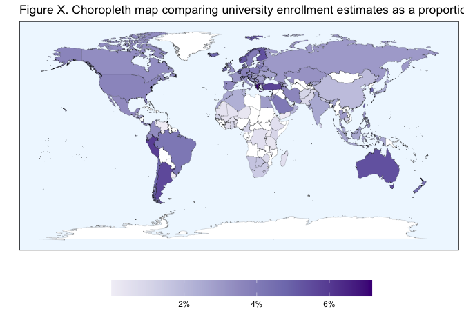
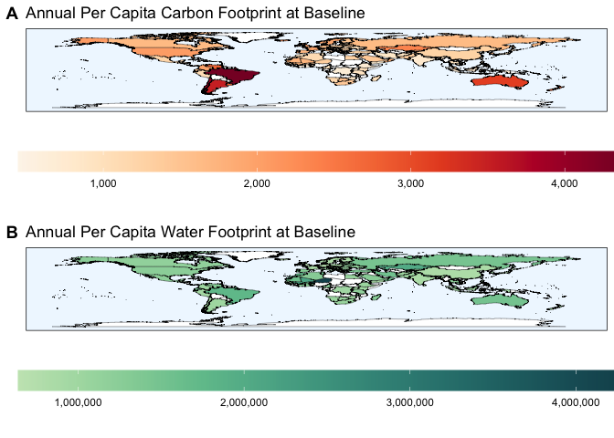

Analysis and Visualization Script
================

## Required Packages

``` r
library(tidyverse)
library(RColorBrewer)
library(colorspace)
```

## Data Loading

``` r
impact_modeling_data <- read.csv("/Users/kenjinchang/github/university-dining-impact-model/data/impact-modeling-data.csv")
```

``` r
reduction_modeling_data <- read.csv("/Users/kenjinchang/github/university-dining-impact-model/data/impact-modeling-data.csv") %>%
  distinct(country,isced6_enr,isced7_enr,isced8_enr,natpop_est,uni_enr_tot,uni_enr_prop,baseline_kg_co2e_excl_luc,baseline_kg_co2e_total,baseline_l_blue_green_wf,baseline_l_blue_wf_total,baseline_l_green_wf
,meatless_day_kg_co2e_excl_luc,meatless_day_kg_co2e_total,meatless_day_l_blue_green_wf,meatless_day_l_blue_wf_total,meatless_day_l_green_wf,no_dairy_kg_co2e_excl_luc,no_dairy_kg_co2e_total,no_dairy_l_blue_green_wf,no_dairy_l_blue_wf_total,no_dairy_l_green_wf,low_red_meat_kg_co2e_excl_luc,low_red_meat_kg_co2e_total,low_red_meat_l_blue_green_wf,low_red_meat_l_blue_wf_total,low_red_meat_l_green_wf,no_red_meat_kg_co2e_excl_luc,no_red_meat_kg_co2e_total,no_red_meat_l_blue_green_wf,no_red_meat_l_blue_wf_total,no_red_meat_l_green_wf,pescetarian_kg_co2e_excl_luc,pescetarian_kg_co2e_total,pescetarian_l_blue_green_wf,pescetarian_l_blue_wf_total,pescetarian_l_green_wf,lacto_ovo_vegetarian_kg_co2e_excl_luc,lacto_ovo_vegetarian_kg_co2e_total,lacto_ovo_vegetarian_l_blue_green_wf,lacto_ovo_vegetarian_l_blue_wf_total,lacto_ovo_vegetarian_l_green_wf,X2.3_vegan_kg_co2e_excl_luc,X2.3_vegan_kg_co2e_total,X2.3_vegan_l_blue_green_wf,X2.3_vegan_l_blue_wf_total,X2.3_vegan_l_green_wf,vegan_kg_co2e_excl_luc,vegan_kg_co2e_total,vegan_l_blue_green_wf,vegan_l_blue_wf_total,vegan_l_green_wf) %>%
  drop_na()
```

## Included countries

To distinguish the 123 included countries from within the 135 designated
countries within the `world_map_iso` data without available university
enrollment and dietary footprint data, we need to construct a new column
that can aid with this need,

``` r
impact_modeling_data %>%
  mutate(inclusion=ifelse(uni_enr_tot>0,country)) %>%
  ggplot(aes(x=long,y=lat,fill=inclusion,group=group)) + 
  geom_polygon(color="black",size=0.05,alpha=0.67) +
  scale_fill_discrete(h=c(115,350),na.value="white") +
  guides(fill="none") +
  xlab("") + 
  ylab("") +
  labs(caption="") +
  ggtitle("Figure 1. Choropleth map highlighting the 123 countries included in our analyses.") +
  theme(legend.position="none",panel.grid=element_blank(),panel.background=element_rect(fill="aliceblue"),panel.border=element_rect(fill=NA),axis.text=element_blank(),axis.ticks=element_blank())
```

<!-- -->

Comparing university enrollment totals across countries.

``` r
ggplot(impact_modeling_data,aes(x=long,y=lat,fill=uni_enr_tot,group=group)) + 
  geom_polygon(color="black",size=0.05) + 
  scale_fill_distiller(name="",palette="Purples",trans="reverse",na.value="white",labels=scales::comma) +
  guides(fill=guide_colorbar(reverse=TRUE)) + 
  xlab("") + 
  ylab("") +
  labs(caption="") +
  ggtitle("Figure 2. Choropleth map comparing university enrollment estimates across the 123 included countries.") +
  theme(legend.position="bottom",panel.grid=element_blank(),panel.background=element_rect(fill="aliceblue"),panel.border=element_rect(fill=NA),axis.text=element_blank(),axis.ticks=element_blank(),legend.key.width=unit(2,"cm"))
```

<!-- -->

Comparing university enrollment proportions (university enrollees as a
function of the national population) across countries.

``` r
ggplot(impact_modeling_data,aes(x=long,y=lat,fill=uni_enr_prop,group=group)) + 
  geom_polygon(color="black",size=0.05) + 
  scale_fill_distiller(name="",palette="Purples",trans="reverse",na.value="white",labels=scales::percent) +
  guides(fill=guide_colorbar(reverse=TRUE)) + 
  xlab("") + 
  ylab("") +
  labs(caption="") +
  ggtitle("Figure 4. Choropleth map comparing university enrollment estimates as a proportion of their respective national populations across the 123 included countries.") +
  theme(legend.position="bottom",panel.grid=element_blank(),panel.background=element_rect(fill="aliceblue"),panel.border=element_rect(fill=NA),axis.text=element_blank(),axis.ticks=element_blank(),legend.key.width=unit(2,"cm"))
```

<!-- -->

Comparing per capita baseline carbon footprint (kg co2e) across
countries

``` r
ggplot(impact_modeling_data,aes(x=long,y=lat,fill=baseline_kg_co2e_total,group=group)) + 
  geom_polygon(color="black",size=0.05) + 
  scale_fill_continuous_sequential(name="",palette="OrRd",na.value="white",labels=scales::comma) +
  guides() +
  xlab("") + 
  ylab("") +
  labs(caption="") +
  ggtitle("Figure 5. Choropleth map comparing annual per capita dietary greenhouse gas estimates (kg CO2e) at baseline across the 123 included countries.") +
  theme(legend.position="bottom",panel.grid=element_blank(),panel.background=element_rect(fill="aliceblue"),panel.border=element_rect(fill=NA),axis.text=element_blank(),axis.ticks=element_blank(),legend.key.width=unit(2,"cm"))
```

<!-- -->

Comparing per capita water footprint of baseline diet across countries.

``` r
ggplot(impact_modeling_data,aes(x=long,y=lat,fill=baseline_l_blue_green_wf,group=group)) + 
  geom_polygon(color="black",size=0.05) + 
  scale_fill_continuous_sequential(name="",palette="BluGrn",na.value="white",labels=scales::comma) +
  guides() +
  xlab("") + 
  ylab("") +
  labs(caption="") +
  ggtitle("Figure 6. Choropleth map comparing annual per capita dietary water footprint (L) at baseline across the 123 included countries.") +
  theme(legend.position="bottom",panel.grid=element_blank(),panel.background=element_rect(fill="aliceblue"),panel.border=element_rect(fill=NA),axis.text=element_blank(),axis.ticks=element_blank(),legend.key.width=unit(2,"cm"))
```

<!-- -->

``` r
reduction_modeling_data %>%
  mutate(baseline_pop_exlc_luc=baseline_kg_co2e_excl_luc*uni_enr_tot) 
```

    ##                    country  isced6_enr isced7_enr   isced8_enr natpop_est
    ## 1              Afghanistan   365982.00    4600.00     28.00000   38042000
    ## 2                  Albania    89231.00   43749.00   1865.00000    2867000
    ## 3                  Algeria   996087.00       0.00      0.00000   43053000
    ## 4                Argentina  2210454.00  276648.00  26098.00000   44901000
    ## 5                  Armenia    69622.00   10855.00    985.00000    2958000
    ## 6                Australia   999034.00  304632.00  56110.00000   25303000
    ## 7                  Austria   199235.73  135346.11  20396.37352    8865000
    ## 8               Azerbaijan   160631.00   20954.00   2626.00000   10032000
    ## 9                 Barbados        0.00       0.00    133.00000     287000
    ## 10                 Belarus   284348.00   14947.00   5652.00000    9467000
    ## 11                 Belgium   372686.00  102785.00  17339.00000   11483000
    ## 12                  Belize     5383.00       0.00      0.00000     390000
    ## 13                   Benin        0.00   12657.00   2060.00000   11801000
    ## 14                 Bermuda        8.00       0.00      0.00000      63973
    ## 15  Bosnia and Herzegovina    67031.00   21004.00    981.00000    3301000
    ## 16                Botswana    34515.00    2266.00    123.00000    2304000
    ## 17                  Brazil  8450755.00  175220.00 115028.00000  211050000
    ## 18                  Brunei     6782.00    1027.00    356.00000     433000
    ## 19                Bulgaria   155091.00   74680.00   6564.00000    6970000
    ## 20            Burkina Faso    43145.00   33243.00   1382.00000   20321000
    ## 21                Cambodia   179258.00   23256.00   1349.00000   16487000
    ## 22                Cameroon   224903.00   62008.00   7258.00000   25876000
    ## 23                  Canada  1005055.00  202679.00  53455.00000   37375000
    ## 24              Cape Verde    10988.00     370.00     62.00000     550000
    ## 25                   Chile   805053.22   96619.92   5789.00000   18952000
    ## 26                   China 24075437.00 2409068.00 410153.00000 1397295000
    ## 27                Colombia  1557594.00  157581.00   6225.00000   50339000
    ## 28        Congo, Dem. Rep.   369160.00   93444.00   2074.00000   86791000
    ## 29              Costa Rica   178008.00   14180.00   2805.00000    5048000
    ## 30           Cote d'Ivoire   101758.00   33982.00   7190.00000   25717000
    ## 31                 Croatia    97605.00   63586.00   3584.00000    4071000
    ## 32                  Cyprus    22615.00   18434.00   1472.00000    1199000
    ## 33          Czech Republic   193614.00  111986.00  22457.00000   10629000
    ## 34                 Denmark   195846.00   70048.00   9437.00000    5818000
    ## 35                 Ecuador   567854.00   21911.00    315.00000   17374000
    ## 36                   Egypt  2646568.00  222873.00  45032.00000  100388000
    ## 37             El Salvador   155759.00   16769.00     63.00000    6454000
    ## 38                 Estonia    28718.58   14590.50   2464.33300    1317000
    ## 39                Ethiopia   555335.00   29697.00   1983.00000  112079000
    ## 40                    Fiji        0.00       0.00    162.00000     890000
    ## 41                 Finland   207313.00   68582.00  18621.00000    5533000
    ## 42                  France  1058491.00  989085.00  66096.00000   67211000
    ## 43                 Georgia   111058.00   33940.00   3512.00000    3721000
    ## 44                 Germany  1872666.00 1054512.00 200400.00000   82806000
    ## 45                   Ghana   289575.00   29110.00   2373.00000   30418000
    ## 46                  Greece   659535.00   78118.00  29221.00000   10696000
    ## 47               Guatemala   247096.00   18537.00    881.00000   17581000
    ## 48                Honduras   238509.00   18076.00    492.00000    9746000
    ## 49                 Hungary   183509.00   79929.00   7676.00000    9732000
    ## 50                 Iceland    12189.00    4421.00    637.00000     356000
    ## 51                   India 30550057.00 4425011.00 173050.00000 1366418000
    ## 52               Indonesia  6659889.00  355463.00  43126.00000  270626000
    ## 53                    Iran  2076361.00  744234.00 141078.00000   82914000
    ## 54                 Ireland   168877.00   33935.00   8517.00000    4893000
    ## 55                  Israel   240653.00   62996.00  11571.00000    9018000
    ## 56                   Italy  1140641.00  713633.00  28338.00000   60340000
    ## 57                 Jamaica    31487.00    2894.00      0.00000    2948000
    ## 58                   Japan  2674263.00  348038.00  80767.00000  126097000
    ## 59                  Jordan   279811.00   26227.00   5048.00000   10102000
    ## 60              Kazakhstan   542458.00   42971.00   5609.00000   18469000
    ## 61                   Kenya   439768.00   51079.00  10215.00000   52574000
    ## 62         Krygyz Republic   123421.00   41164.00   2636.00000    6404000
    ## 63                  Kuwait    81414.00    3382.00     77.00000    4207000
    ## 64                  Latvia    46164.00   18323.00   2196.00000    1916000
    ## 65                 Lebanon   191885.00   25031.00   4230.00000    6856000
    ## 66               Lithuania    88468.00   27076.00   2743.00000    2778000
    ## 67              Luxembourg     3050.00    2534.00    693.00000     615000
    ## 68              Madagascar   123519.00   17479.00    756.00000   26969000
    ## 69                  Malawi        0.00       0.00    154.00000   18629000
    ## 70                Malaysia   680068.00   95047.00  44516.00000   31950000
    ## 71                Maldives     8097.00    1749.00     12.00000     531000
    ## 72                    Mali    63314.00   18001.00    338.00000   19658000
    ## 73                   Malta     8553.00    4452.00    147.00000     485000
    ## 74              Mauritania    15473.00    3419.00    111.00000    4526000
    ## 75               Mauritius    30948.00    4000.00    351.00000    1268000
    ## 76                  Mexico  4035251.00  308188.00  43744.00000  127576000
    ## 77                 Moldova    46779.00   17895.00   2073.00000    3536000
    ## 78              Montenegro    21308.00    1318.00     83.00000     622000
    ## 79                 Morocco   764154.00  131464.00  36653.00000   36472000
    ## 80                 Namibia    38576.00    2292.00    187.00000    2495000
    ## 81                   Nepal   376016.00   60270.00   1891.00000   28609000
    ## 82             Netherlands   668811.00  180016.00  15650.00000   17280000
    ## 83             New Zealand   187577.99   19221.03   9853.82655    4929000
    ## 84                   Niger    42937.00   18912.00   1713.00000   23311000
    ## 85         North Macedonia    56941.00    2767.00    402.00000    2083000
    ## 86                  Norway   199223.00   72404.00   8497.00000    5369000
    ## 87                    Oman    99740.00    5222.00    177.00000    4975000
    ## 88                Pakistan  1679110.00  176844.00  22147.00000  216565000
    ## 89                  Panama   129295.00   17197.00    107.00000    4246000
    ## 90                    Peru  1822684.00   92793.00   8896.00000   32510000
    ## 91             Philippines  3155957.00  236351.00  23827.00000  108117000
    ## 92                  Poland   986723.00  464624.00  41318.00000   37895000
    ## 93                Portugal   205180.00  118194.00  20239.00000   10237000
    ## 94                 Romania   350263.00  168852.00  19756.00000   19358000
    ## 95                  Russia  3032738.00 1213147.00  94582.00000  144369000
    ## 96                  Rwanda    63557.00    4214.00     51.00000   12627000
    ## 97            Saudi Arabia  1305312.00   81212.00  10541.00000   34269000
    ## 98                 Senegal   148277.00   38136.00   8296.00000   16296000
    ## 99                  Serbia   191014.00   47350.00  11407.00000    6955000
    ## 100        Slovak Republic    79000.00   55816.00   6991.00000    5448000
    ## 101               Slovenia    41840.00   21517.00   2824.00000    2067000
    ## 102           South Africa   729513.00   62930.00  23730.00000   58558000
    ## 103            South Korea  2089686.00  242332.00  74750.00000   51782000
    ## 104                  Spain  1212026.00  339934.00  85480.00000   46719000
    ## 105              Sri Lanka   229789.00   44693.00   4684.00000   21757000
    ## 106                 Sweden   241045.00  144769.00  19682.00000   10251000
    ## 107            Switzerland   207284.00   70070.00  25209.00000    8580000
    ## 108                 Taiwan   985144.00  171779.00  28907.00000   23186278
    ## 109               Tanzania   142898.00    9123.00   2014.00000   58005000
    ## 110               Thailand  1859422.00  180683.00  24742.00000   69626000
    ## 111                   Togo    84431.00    3975.00   1652.00000    8082000
    ## 112                Tunisia   163719.00   91806.00  11629.00000   11695000
    ## 113                 Turkey  4112575.00  583939.00  95100.00000   83430000
    ## 114                 Uganda        0.00       0.00   2194.00000   44270000
    ## 115                Ukraine   800886.00  392210.00  24751.00000   44391000
    ## 116         United Kingdom  1620993.00  450591.00 111257.00000   66856000
    ## 117          United States  9057685.06 2651278.84 354198.15770  329534000
    ## 118                Uruguay        0.00       0.00     91.02809    3462000
    ## 119              Venezuela        0.00       0.00   5718.00000   28516000
    ## 120                  Yemen        0.00       0.00     64.00000   29162000
    ## 121               Zimbabwe    99433.00   14899.00    371.00000   14645000
    ## 122       Hong Kong, China   162103.00   52640.01  10697.00100    7508000
    ## 123           Macao, China    25061.00    6465.00   2562.00000     640000
    ##      uni_enr_tot uni_enr_prop baseline_kg_co2e_excl_luc baseline_kg_co2e_total
    ## 1   3.706100e+05 9.742127e-03                  894.9871               898.4078
    ## 2   1.348450e+05 4.703348e-02                 1952.0389              2012.7098
    ## 3   9.960870e+05 2.313630e-02                  982.5261              1107.7870
    ## 4   2.513200e+06 5.597203e-02                 2952.2768              3516.5223
    ## 5   8.146200e+04 2.753955e-02                 1604.2125              1645.6205
    ## 6   1.359776e+06 5.373971e-02                 3015.1629              3142.1003
    ## 7   3.549782e+05 4.004266e-02                 1521.5858              1583.3920
    ## 8   1.842110e+05 1.836234e-02                 1600.3077              1653.5135
    ## 9   1.330000e+02 4.634146e-04                 1407.9734              1581.5435
    ## 10  3.049470e+05 3.221158e-02                 1376.0753              1467.6827
    ## 11  4.928100e+05 4.291649e-02                 1613.1644              1766.9017
    ## 12  5.383000e+03 1.380256e-02                 1008.9116              1085.4359
    ## 13  1.471700e+04 1.247098e-03                  690.3777               821.8233
    ## 14  8.000000e+00 1.250528e-04                 1993.9634              2049.7947
    ## 15  8.901600e+04 2.696637e-02                  983.7554              1036.1921
    ## 16  3.690400e+04 1.601736e-02                 1569.0976              1585.2711
    ## 17  8.741003e+06 4.141674e-02                 2856.1419              4366.1015
    ## 18  8.165000e+03 1.885681e-02                 1783.7341              1856.7795
    ## 19  2.363350e+05 3.390746e-02                  937.9134               989.1980
    ## 20  7.777000e+04 3.827075e-03                 1085.7443              1104.5643
    ## 21  2.038630e+05 1.236508e-02                  851.0628               930.9660
    ## 22  2.941690e+05 1.136841e-02                  887.2857               921.0749
    ## 23  1.261189e+06 3.374419e-02                 1645.1594              1658.6914
    ## 24  1.142000e+04 2.076364e-02                 1035.5358              1095.9136
    ## 25  9.074621e+05 4.788213e-02                 1630.3663              3895.4905
    ## 26  2.689466e+07 1.924766e-02                 1191.0544              1258.2617
    ## 27  1.721400e+06 3.419615e-02                 1806.2567              1972.8242
    ## 28  4.646780e+05 5.353988e-03                  638.9943               677.7450
    ## 29  1.949930e+05 3.862777e-02                 1802.4645              1860.1294
    ## 30  1.429300e+05 5.557802e-03                  531.9976               555.2293
    ## 31  1.647750e+05 4.047531e-02                 1241.9994              1338.5973
    ## 32  4.252100e+04 3.546372e-02                 1199.0651              1411.5938
    ## 33  3.280570e+05 3.086433e-02                 1088.3930              1146.2329
    ## 34  2.753310e+05 4.732399e-02                 1595.3923              1770.7317
    ## 35  5.900800e+05 3.396339e-02                 1335.2684              1506.3045
    ## 36  2.914473e+06 2.903209e-02                 1214.7941              1283.0885
    ## 37  1.725910e+05 2.674171e-02                 1030.4458              1367.8541
    ## 38  4.577342e+04 3.475582e-02                 1058.6422              1124.3830
    ## 39  5.870150e+05 5.237511e-03                  710.9891               717.8578
    ## 40  1.620000e+02 1.820225e-04                 1389.8620              1403.4943
    ## 41  2.945160e+05 5.322899e-02                 1394.1430              1450.8010
    ## 42  2.113672e+06 3.144830e-02                 1801.8850              1958.1279
    ## 43  1.485100e+05 3.991131e-02                 1189.7112              1205.7576
    ## 44  3.127578e+06 3.776994e-02                 1409.1637              1532.2176
    ## 45  3.210580e+05 1.055487e-02                  545.1520               578.9954
    ## 46  7.668740e+05 7.169727e-02                 1691.1896              1802.0541
    ## 47  2.665140e+05 1.515921e-02                  842.3210               892.7137
    ## 48  2.570770e+05 2.637769e-02                  975.2473              1459.1996
    ## 49  2.711140e+05 2.785799e-02                 1005.8398              1047.8904
    ## 50  1.724700e+04 4.844663e-02                 2096.0486              2224.0045
    ## 51  3.514812e+07 2.572282e-02                  768.8551               786.9643
    ## 52  7.058478e+06 2.608204e-02                  658.2904               703.6596
    ## 53  2.961673e+06 3.571982e-02                  840.0465               852.6197
    ## 54  2.113290e+05 4.319007e-02                 2156.4046              2347.5277
    ## 55  3.152200e+05 3.495454e-02                 2082.6980              2344.1241
    ## 56  1.882612e+06 3.120007e-02                 1564.4564              1711.8489
    ## 57  3.438100e+04 1.166248e-02                  957.3330              1029.9690
    ## 58  3.103068e+06 2.460858e-02                 1044.8571              1094.1137
    ## 59  3.110860e+05 3.079450e-02                 1171.3101              1320.4589
    ## 60  5.910380e+05 3.200162e-02                 2306.8041              2364.7877
    ## 61  5.010620e+05 9.530604e-03                 1017.2305              1035.4576
    ## 62  1.672210e+05 2.611196e-02                 1836.1731              1868.8452
    ## 63  8.487300e+04 2.017423e-02                 2351.8394              2620.3307
    ## 64  6.668300e+04 3.480324e-02                  960.5449              1016.2363
    ## 65  2.211460e+05 3.225583e-02                 1196.1641              1402.3321
    ## 66  1.182870e+05 4.257991e-02                 1140.8047              1213.3716
    ## 67  6.277000e+03 1.020650e-02                 2028.8623              2143.2976
    ## 68  1.417540e+05 5.256183e-03                  937.0303               959.3850
    ## 69  1.540000e+02 8.266681e-06                  517.3735               525.3949
    ## 70  8.196310e+05 2.565355e-02                 1174.5486              1402.1087
    ## 71  9.858000e+03 1.856497e-02                 1477.1665              1559.5775
    ## 72  8.165300e+04 4.153678e-03                 1726.0969              1730.9488
    ## 73  1.315200e+04 2.711753e-02                 1479.7297              1629.6737
    ## 74  1.900300e+04 4.198630e-03                 1726.9333              1746.9056
    ## 75  3.529900e+04 2.783833e-02                 1250.1740              1380.1854
    ## 76  4.387183e+06 3.438878e-02                 1200.1769              1218.8209
    ## 77  6.674700e+04 1.887641e-02                  854.3387               885.1354
    ## 78  2.270900e+04 3.650965e-02                 1731.5893              1834.5351
    ## 79  9.322710e+05 2.556128e-02                  885.9539               925.6469
    ## 80  4.105500e+04 1.645491e-02                 1126.5478              1164.1749
    ## 81  4.381770e+05 1.531605e-02                 1097.3768              1142.1832
    ## 82  8.644770e+05 5.002760e-02                 1639.5373              1820.7610
    ## 83  2.166528e+05 4.395473e-02                 2489.6372              2634.2060
    ## 84  6.356200e+04 2.726696e-03                 1332.3927              1335.2770
    ## 85  6.011000e+04 2.885742e-02                 1127.2038              1186.6094
    ## 86  2.801240e+05 5.217433e-02                 1771.5770              1934.9829
    ## 87  1.051390e+05 2.113347e-02                 1726.9860              1836.6585
    ## 88  1.878101e+06 8.672228e-03                 1316.3081              1337.3391
    ## 89  1.465990e+05 3.452638e-02                 1538.6275              1977.4806
    ## 90  1.924373e+06 5.919326e-02                  955.6513              1071.3782
    ## 91  3.416135e+06 3.159665e-02                  864.7852               900.4480
    ## 92  1.492665e+06 3.938950e-02                 1086.0513              1207.7833
    ## 93  3.436130e+05 3.356579e-02                 1710.0194              1923.3867
    ## 94  5.388710e+05 2.783712e-02                 1222.1128              1261.1237
    ## 95  4.340467e+06 3.006509e-02                 1451.5586              1647.2385
    ## 96  6.782200e+04 5.371189e-03                  461.2094               471.4065
    ## 97  1.397065e+06 4.076760e-02                 1264.2446              1424.2394
    ## 98  1.947090e+05 1.194827e-02                  893.2230               919.5938
    ## 99  2.497710e+05 3.591244e-02                  915.8173               927.1896
    ## 100 1.418070e+05 2.602919e-02                  815.1401               852.1398
    ## 101 6.618100e+04 3.201790e-02                 1482.9943              1618.2819
    ## 102 8.161730e+05 1.393786e-02                 1274.3170              1421.9375
    ## 103 2.406768e+06 4.647885e-02                 1524.7804              1676.9165
    ## 104 1.637440e+06 3.504870e-02                 1373.3714              1669.8609
    ## 105 2.791660e+05 1.283109e-02                  580.5800               584.0184
    ## 106 4.054960e+05 3.955673e-02                 1768.1854              1905.6643
    ## 107 3.025630e+05 3.526375e-02                 1668.6515              1814.5086
    ## 108 1.185830e+06 5.114361e-02                 1108.2816              1221.3552
    ## 109 1.540350e+05 2.655547e-03                  918.6856               930.4418
    ## 110 2.064847e+06 2.965626e-02                  822.0311               942.3208
    ## 111 9.005800e+04 1.114303e-02                  437.2379               450.5350
    ## 112 2.671540e+05 2.284344e-02                  884.6677               982.7868
    ## 113 4.791614e+06 5.743275e-02                 1209.6448              1262.7231
    ## 114 2.194000e+03 4.955952e-05                  701.3743               767.7384
    ## 115 1.217847e+06 2.743455e-02                  972.1926               996.5576
    ## 116 2.182841e+06 3.264989e-02                 1757.7410              1968.0993
    ## 117 1.206316e+07 3.660673e-02                 2037.7487              2058.1945
    ## 118 9.102809e+01 2.629350e-05                 2342.8690              2666.5831
    ## 119 5.718000e+03 2.005190e-04                 2397.1922              2762.0133
    ## 120 6.400000e+01 2.194637e-06                  641.3222               688.2674
    ## 121 1.147030e+05 7.832229e-03                  809.8198               816.8037
    ## 122 2.254400e+05 3.002664e-02                 2200.2115              2759.3689
    ## 123 3.408800e+04 5.326250e-02                 1572.1861              1771.9985
    ##     baseline_l_blue_green_wf baseline_l_blue_wf_total baseline_l_green_wf
    ## 1                  1015576.7                347776.76            667799.9
    ## 2                  1442826.5                214146.84           1228679.7
    ## 3                  1297370.6                186077.01           1111293.6
    ## 4                  1015585.2                 62016.32            953568.9
    ## 5                  1441946.2                191032.41           1250913.8
    ## 6                  1517778.9                174219.88           1343559.1
    ## 7                   793855.2                 60194.82            733660.4
    ## 8                  1243636.0                207655.78           1035980.2
    ## 9                   950947.4                 86412.77            864534.6
    ## 10                 1200212.8                 46927.86           1153285.0
    ## 11                  793608.1                 88370.52            705237.6
    ## 12                 1059051.1                 59525.28            999525.8
    ## 13                 1331729.8                 85060.39           1246669.4
    ## 14                 1042449.5                129159.82            913289.7
    ## 15                 1067061.3                 37836.36           1029224.9
    ## 16                 1068891.9                111200.61            957691.3
    ## 17                 1775234.1                 64128.65           1711105.5
    ## 18                 1196462.9                137783.59           1058679.4
    ## 19                 1257690.9                 54994.72           1202696.2
    ## 20                 1477705.9                 35532.58           1442173.4
    ## 21                 1372850.3                147016.82           1225833.5
    ## 22                 1293558.9                 62535.26           1231023.7
    ## 23                 1168002.0                105458.22           1062543.8
    ## 24                 1050939.7                115706.53            935233.2
    ## 25                  879692.5                143694.42            735998.1
    ## 26                  836917.5                135410.95            701506.6
    ## 27                 1032565.0                 54346.37            978218.6
    ## 28                  992345.6                 78014.22            914331.4
    ## 29                 1026022.6                 95094.35            930928.3
    ## 30                 1253739.3                 51858.38           1201880.9
    ## 31                 1104230.4                 49278.54           1054951.8
    ## 32                 1140741.0                148402.21            992338.8
    ## 33                  733147.3                 41644.76            691502.5
    ## 34                  748836.9                 67536.92            681300.0
    ## 35                 1482260.2                133859.52           1348400.7
    ## 36                 1088192.1                565678.41            522513.7
    ## 37                  824119.1                 45471.35            778647.8
    ## 38                  955997.5                 40985.34            915012.1
    ## 39                 1051356.8                 35489.03           1015867.8
    ## 40                 1262677.8                 76104.24           1186573.5
    ## 41                  842626.4                 78296.79            764329.6
    ## 42                  867376.1                 91749.95            775626.1
    ## 43                 1305279.9                102667.86           1202612.0
    ## 44                  721782.0                 72098.37            649683.6
    ## 45                 1196445.7                 93709.11           1102736.6
    ## 46                 1317040.8                181562.67           1135478.2
    ## 47                  829089.5                 40450.99            788638.5
    ## 48                  930887.6                 53946.77            876940.9
    ## 49                 1008969.6                 34539.17            974430.4
    ## 50                  774447.7                116126.39            658321.3
    ## 51                  865068.7                210569.12            654499.6
    ## 52                  951465.2                 85317.58            866147.6
    ## 53                 1543956.7                601044.50            942912.2
    ## 54                  719702.6                 72715.62            646986.9
    ## 55                 1662570.5                205613.90           1456956.6
    ## 56                 1121587.9                113292.51           1008295.3
    ## 57                 1023100.5                 72167.44            950933.1
    ## 58                  721985.3                 92491.33            629494.0
    ## 59                 1108728.5                231294.77            877433.7
    ## 60                 2030785.9                320643.57           1710142.4
    ## 61                  977459.2                 64531.82            912927.3
    ## 62                 1132575.2                219683.15            912892.1
    ## 63                 1370355.6                229493.97           1140861.7
    ## 64                 1062964.7                 49236.20           1013728.5
    ## 65                 1313565.9                251957.54           1061608.4
    ## 66                 1049813.3                 40216.48           1009596.8
    ## 67                  891137.2                 87789.65            803347.6
    ## 68                 1288490.1                187978.04           1100512.0
    ## 69                 1191740.0                 54550.49           1137189.5
    ## 70                 1115810.6                143502.63            972308.0
    ## 71                 1004331.1                233160.04            771171.0
    ## 72                 2194088.4                152280.16           2041808.3
    ## 73                  949576.7                128398.63            821178.1
    ## 74                 1572491.9                115444.67           1457047.2
    ## 75                  969828.2                113119.69            856708.6
    ## 76                 1213274.8                133053.04           1080221.7
    ## 77                 1070594.1                104346.59            966247.5
    ## 78                 1289166.1                 63592.54           1225573.5
    ## 79                 1755977.2                235215.68           1520761.5
    ## 80                 1039663.3                 65198.35            974464.9
    ## 81                 1372342.2                196865.09           1175477.1
    ## 82                  806151.1                 71606.69            734544.5
    ## 83                  995292.8                113815.59            881477.2
    ## 84                 4271656.7                 70072.47           4201584.2
    ## 85                  915940.1                 71837.42            844102.7
    ## 86                  828449.5                 96137.00            732312.5
    ## 87                 1587208.1                511416.14           1075791.9
    ## 88                 1052222.9                383029.76            669193.2
    ## 89                  993146.2                 70727.26            922418.9
    ## 90                  950766.8                156878.68            793888.1
    ## 91                 1022826.8                 81701.44            941125.3
    ## 92                  865393.7                 36330.59            829063.1
    ## 93                 1426916.7                271754.96           1155161.7
    ## 94                 1121089.9                 52600.89           1068489.1
    ## 95                 1480192.5                 80481.81           1399710.6
    ## 96                 1272508.1                 87792.78           1184715.3
    ## 97                 1276052.1                311117.92            964934.2
    ## 98                 1012434.3                 98332.63            914101.7
    ## 99                  939781.2                 38043.28            901738.0
    ## 100                 642723.4                 33707.40            609016.0
    ## 101                 892908.7                 62181.16            830727.5
    ## 102                1086945.7                 89561.23            997384.5
    ## 103                 949560.7                 90354.21            859206.5
    ## 104                1321632.6                206654.93           1114977.7
    ## 105                 957997.3                179239.39            778757.9
    ## 106                 813357.3                 81782.55            731574.7
    ## 107                 759109.6                 69012.03            690097.6
    ## 108                 950496.6                105572.72            844923.9
    ## 109                1183414.8                 72259.25           1111155.5
    ## 110                1220971.8                187150.54           1033821.3
    ## 111                1340443.2                 45159.81           1295283.4
    ## 112                1589767.8                189966.96           1399800.8
    ## 113                1400066.2                168496.32           1231569.9
    ## 114                 994261.1                 66985.41            927275.7
    ## 115                1185372.9                 46723.06           1138649.8
    ## 116                 705194.6                 77574.80            627619.8
    ## 117                1237262.4                144460.43           1092801.9
    ## 118                1595888.5                 54962.90           1540925.7
    ## 119                1303308.8                 63437.42           1239871.3
    ## 120                 851959.1                178264.51            673694.6
    ## 121                1003622.0                 65912.29            937709.7
    ## 122                1571288.0                208495.27           1362792.7
    ## 123                1123938.8                147551.92            976386.9
    ##     meatless_day_kg_co2e_excl_luc meatless_day_kg_co2e_total
    ## 1                       1809.9344                  1817.4949
    ## 2                       1651.1793                  1699.0555
    ## 3                       1066.4401                  1212.7564
    ## 4                       2124.5294                  2556.9938
    ## 5                       1557.5556                  1594.5413
    ## 6                       2536.1825                  2635.1555
    ## 7                       1223.2743                  1269.7309
    ## 8                       1670.2693                  1723.6840
    ## 9                       1389.3571                  1543.4558
    ## 10                      1214.5499                  1289.4822
    ## 11                      1414.6787                  1543.6344
    ## 12                      1070.0759                  1155.6168
    ## 13                       788.2442                   990.0407
    ## 14                      2167.9449                  2224.4087
    ## 15                      1002.2489                  1052.4054
    ## 16                      2401.3612                  2432.0601
    ## 17                      2112.7473                  3219.1744
    ## 18                      1614.1266                  1685.2690
    ## 19                       899.0894                   941.3749
    ## 20                       985.1448                  1003.7817
    ## 21                       768.1549                   897.1488
    ## 22                       840.0675                   885.9991
    ## 23                      1302.2709                  1312.3720
    ## 24                      1178.3112                  1240.3191
    ## 25                      1469.1188                  3386.8340
    ## 26                      1088.7179                  1151.3441
    ## 27                      2390.4664                  2631.9214
    ## 28                       988.9298                  1060.7640
    ## 29                      2082.6198                  2138.9448
    ## 30                       921.0747                   992.7831
    ## 31                      1315.0947                  1406.2327
    ## 32                      1340.2742                  1546.1731
    ## 33                      1114.3565                  1167.0000
    ## 34                      1380.2106                  1530.4715
    ## 35                      1702.3595                  1930.2690
    ## 36                      1011.0399                  1061.2308
    ## 37                      1171.3720                  1528.7944
    ## 38                      1029.5047                  1088.5392
    ## 39                       978.5310                   987.8282
    ## 40                      1526.3633                  1543.6936
    ## 41                      1231.6338                  1278.9050
    ## 42                      1446.6175                  1566.0639
    ## 43                      1706.1500                  1724.6002
    ## 44                      1189.3385                  1286.3318
    ## 45                       582.8511                   640.4659
    ## 46                      1370.2895                  1454.4083
    ## 47                      1112.6831                  1176.1251
    ## 48                      1311.3905                  1912.0559
    ## 49                      1055.6955                  1095.4578
    ## 50                      1734.6470                  1838.8993
    ## 51                      1259.4884                  1286.1557
    ## 52                       830.0272                   903.6356
    ## 53                       807.0731                   821.3549
    ## 54                      1760.1856                  1908.7369
    ## 55                      1502.5171                  1674.3841
    ## 56                      1320.3128                  1434.8575
    ## 57                      1118.8095                  1191.6133
    ## 58                      1049.3581                  1098.5266
    ## 59                      1353.6117                  1533.6254
    ## 60                      1895.5925                  1940.5645
    ## 61                      1408.3602                  1432.3911
    ## 62                      1851.2043                  1885.4118
    ## 63                      1727.2785                  1914.0162
    ## 64                       951.5351                  1001.4693
    ## 65                      1304.1453                  1509.4942
    ## 66                       999.2212                  1057.6890
    ## 67                      1775.4159                  1872.0893
    ## 68                      2020.2911                  2080.5181
    ## 69                       487.4034                   495.2496
    ## 70                      1198.2864                  1495.6694
    ## 71                      1495.4471                  1570.2939
    ## 72                      1910.2156                  1916.3808
    ## 73                      1266.3417                  1385.6836
    ## 74                      1773.3432                  1795.1131
    ## 75                      1131.2885                  1240.2226
    ## 76                      1024.7291                  1041.9094
    ## 77                      1216.5438                  1255.4689
    ## 78                      1445.7958                  1523.7773
    ## 79                       835.2165                   873.8560
    ## 80                      1679.1274                  1737.2167
    ## 81                      1549.4203                  1597.9533
    ## 82                      1424.6885                  1573.3899
    ## 83                      2253.9952                  2385.2048
    ## 84                      1124.3935                  1126.9240
    ## 85                      1312.3487                  1379.2476
    ## 86                      1496.9451                  1632.2020
    ## 87                      1672.1407                  1780.2200
    ## 88                      1898.2293                  1924.3943
    ## 89                      1593.3535                  2032.5959
    ## 90                       972.6245                  1112.0772
    ## 91                      1088.7401                  1148.7668
    ## 92                       957.8462                  1052.3534
    ## 93                      1504.3834                  1686.6353
    ## 94                      1132.6714                  1167.0383
    ## 95                      1274.9927                  1428.5313
    ## 96                       598.8782                   617.6003
    ## 97                      1213.4510                  1371.6429
    ## 98                      1385.8303                  1432.6754
    ## 99                       934.2434                   944.9509
    ## 100                     1065.8119                  1107.0114
    ## 101                     1274.2577                  1390.4679
    ## 102                     1212.1276                  1353.6084
    ## 103                     1273.4961                  1417.7193
    ## 104                     1212.8901                  1460.8426
    ## 105                      884.0138                   891.3321
    ## 106                     1529.6936                  1643.2798
    ## 107                     1544.1054                  1667.0841
    ## 108                     1000.8673                  1107.7260
    ## 109                     1450.4313                  1466.3091
    ## 110                      923.4899                  1141.2863
    ## 111                      519.7310                   537.1583
    ## 112                      803.9901                   889.2031
    ## 113                     1006.5992                  1054.3904
    ## 114                     1162.9325                  1273.2378
    ## 115                      942.7278                   963.9079
    ## 116                     1510.3502                  1683.4490
    ## 117                     1605.2594                  1619.7904
    ## 118                     1802.1036                  2059.4024
    ## 119                     2555.8359                  2926.1690
    ## 120                     1082.6333                  1185.2100
    ## 121                     1699.8813                  1719.5461
    ## 122                     1812.1144                  2243.8914
    ## 123                     1538.4517                  1722.2491
    ##     meatless_day_l_blue_green_wf meatless_day_l_blue_wf_total
    ## 1                      1302835.4                    506810.45
    ## 2                      1223613.2                    183944.88
    ## 3                      1167359.6                    159411.28
    ## 4                       787726.9                     49328.36
    ## 5                      1385885.9                    189848.42
    ## 6                      1288254.6                    150644.60
    ## 7                       631725.2                     47381.54
    ## 8                      1292700.4                    220495.64
    ## 9                       904723.7                     82437.81
    ## 10                     1045219.1                     39675.12
    ## 11                      652342.1                     72800.66
    ## 12                     1135286.3                     63279.62
    ## 13                     1254301.9                     79275.82
    ## 14                     1162276.8                    145662.85
    ## 15                     1071091.1                     37858.87
    ## 16                     1388382.7                    124344.42
    ## 17                     1282942.7                     44843.42
    ## 18                     1046215.0                    118392.26
    ## 19                     1179824.8                     50493.84
    ## 20                     1434156.0                     36978.04
    ## 21                     1242686.6                    169072.01
    ## 22                     1201292.0                     58321.02
    ## 23                      943377.1                     85072.70
    ## 24                     1152663.7                    118190.52
    ## 25                      828050.2                    137422.92
    ## 26                      787346.1                    126725.98
    ## 27                     1211339.8                     59882.32
    ## 28                     1338196.0                    114789.78
    ## 29                     1019280.8                     87344.29
    ## 30                     1318184.7                     55854.44
    ## 31                     1119428.5                     48808.35
    ## 32                     1202581.7                    157690.76
    ## 33                      721812.8                     39742.52
    ## 34                      662439.6                     59671.06
    ## 35                     1921792.7                    161044.10
    ## 36                      836681.9                    437421.82
    ## 37                      921833.5                     49355.48
    ## 38                      943996.3                     39593.80
    ## 39                     1326519.6                     59111.01
    ## 40                     1275810.4                     75623.31
    ## 41                      749333.7                     67759.61
    ## 42                      701221.1                     73726.36
    ## 43                     1560051.5                    126756.32
    ## 44                      606646.4                     60354.40
    ## 45                     1045317.5                     82709.35
    ## 46                     1050542.2                    146020.10
    ## 47                      995910.6                     45736.59
    ## 48                     1221025.0                     57944.82
    ## 49                     1082338.2                     35276.55
    ## 50                      656165.6                     96742.68
    ## 51                     1064284.8                    215944.89
    ## 52                      987372.9                    107453.42
    ## 53                     1373834.1                    527333.33
    ## 54                      595213.1                     60117.10
    ## 55                     1181194.2                    152755.98
    ## 56                      917651.4                     92446.48
    ## 57                     1141443.7                     76432.29
    ## 58                      752078.3                     94237.46
    ## 59                     1071635.0                    214971.33
    ## 60                     1595359.1                    255820.15
    ## 61                     1227546.2                     77150.65
    ## 62                     1154785.8                    230891.10
    ## 63                     1044792.4                    177184.38
    ## 64                     1041784.3                     47209.32
    ## 65                     1270620.1                    261459.08
    ## 66                      926850.1                     34412.85
    ## 67                      788537.0                     76946.38
    ## 68                     1617564.0                    221449.43
    ## 69                     1118087.3                     57242.39
    ## 70                      991961.3                    119414.05
    ## 71                     1013416.3                    233249.81
    ## 72                     2009969.5                    133748.59
    ## 73                      837569.8                    114006.23
    ## 74                     1565226.2                    110758.80
    ## 75                      832857.3                     94623.20
    ## 76                     1088207.8                    119161.04
    ## 77                     1258245.0                    118310.04
    ## 78                     1085672.7                     52421.84
    ## 79                     1548662.5                    198432.51
    ## 80                     1338017.7                     88514.54
    ## 81                     1419011.3                    177135.05
    ## 82                      707329.1                     63018.41
    ## 83                      905800.8                    104047.79
    ## 84                     3855258.6                     66200.28
    ## 85                      929910.3                     71947.56
    ## 86                      712310.1                     80463.92
    ## 87                     1405756.2                    439407.33
    ## 88                     1215625.9                    396841.01
    ## 89                     1047934.6                     74336.24
    ## 90                      940797.2                    152290.37
    ## 91                     1159177.9                    102527.97
    ## 92                      741187.2                     30094.95
    ## 93                     1289964.7                    245354.45
    ## 94                     1029063.0                     47388.84
    ## 95                     1315823.3                     70339.66
    ## 96                     1620313.7                    107141.86
    ## 97                     1168072.0                    277681.31
    ## 98                     1242656.6                    100809.60
    ## 99                      963489.3                     38178.74
    ## 100                     782912.9                     40406.32
    ## 101                     771059.2                     53509.42
    ## 102                     992248.1                     84102.67
    ## 103                     818721.3                     76993.27
    ## 104                    1182903.4                    184320.63
    ## 105                    1054617.0                    171881.03
    ## 106                     714102.9                     69920.30
    ## 107                     649659.3                     60770.27
    ## 108                     892279.2                     97728.90
    ## 109                    1386414.9                     91118.67
    ## 110                    1184525.0                    175469.28
    ## 111                    1532033.0                     48524.79
    ## 112                    1301946.4                    160137.45
    ## 113                    1033198.5                    126007.76
    ## 114                    1421792.2                     98548.87
    ## 115                    1109887.3                     42977.19
    ## 116                     606860.6                     66391.57
    ## 117                     957985.9                    112868.43
    ## 118                    1285833.4                     44613.26
    ## 119                    1363092.2                     64529.20
    ## 120                    1155084.4                    269975.12
    ## 121                    1402710.3                     98471.07
    ## 122                    1304648.3                    176921.10
    ## 123                    1112860.4                    145048.13
    ##     meatless_day_l_green_wf no_dairy_kg_co2e_excl_luc no_dairy_kg_co2e_total
    ## 1                  796024.9                  503.0854               508.6838
    ## 2                 1039668.3                  862.8370               901.7251
    ## 3                 1007948.4                  582.1108               829.6017
    ## 4                  738398.6                 2075.6507              2505.3500
    ## 5                 1196037.4                  962.5140               999.9185
    ## 6                 1137610.0                 2278.5302              2389.0576
    ## 7                  584343.7                  869.5214               920.5979
    ## 8                 1072204.8                  938.9915               999.3511
    ## 9                  822285.9                 1020.4882              1180.8994
    ## 10                1005544.0                  937.9199              1004.7585
    ## 11                 579541.4                 1059.4116              1201.5717
    ## 12                1072006.7                  871.6210               956.9131
    ## 13                1175026.1                  659.2875               852.8737
    ## 14                1016613.9                 2113.2434              2178.4516
    ## 15                1033232.2                  566.2919               630.4358
    ## 16                1264038.3                 1106.0526              1141.6116
    ## 17                1238099.3                 1657.5565              2689.8638
    ## 18                 927822.7                 1285.7974              1349.5787
    ## 19                1129331.0                  588.9629               639.2602
    ## 20                1397178.0                  895.3938               911.9002
    ## 21                1073614.6                  799.2541               907.2887
    ## 22                1142971.0                  753.5072               801.0268
    ## 23                 858304.4                 1108.6067              1119.2036
    ## 24                1034473.2                  795.8586               871.2087
    ## 25                 690627.3                 1378.4157              3418.7635
    ## 26                 660620.2                 1061.7383              1126.2406
    ## 27                1151457.5                 1308.7806              1567.7272
    ## 28                1223406.2                  916.4972               992.6792
    ## 29                 931936.5                  916.3266               970.0858
    ## 30                1262330.3                  713.0646               781.3607
    ## 31                1070620.2                  815.5007               915.3151
    ## 32                1044890.9                 1067.5036              1313.7459
    ## 33                 682070.3                  797.0056               860.4668
    ## 34                 602768.6                 1052.8844              1196.1154
    ## 35                1760748.6                 1374.7631              1665.8717
    ## 36                 399260.1                  798.9345               856.9777
    ## 37                 872478.1                  709.1009               961.2638
    ## 38                 904402.5                  702.8472               765.2143
    ## 39                1267408.6                  469.3847               477.1807
    ## 40                1200187.1                 1224.4690              1240.9326
    ## 41                 681574.1                  755.9799               797.3938
    ## 42                 627494.7                 1101.5398              1223.9380
    ## 43                1433295.2                  584.8822               608.5858
    ## 44                 546292.0                  811.7874               918.7020
    ## 45                 962608.2                  503.0255               562.4014
    ## 46                 904522.1                  971.7612              1059.5449
    ## 47                 950174.0                  597.7516               643.8806
    ## 48                1163080.2                  765.0518              1143.3380
    ## 49                1047061.7                  778.9446               821.1552
    ## 50                 559422.9                 1342.8848              1439.8176
    ## 51                 848339.9                  474.3558               497.3826
    ## 52                 879919.5                  751.0643               825.3666
    ## 53                 846500.8                  598.6586               614.5103
    ## 54                 535096.0                 1339.5281              1508.9895
    ## 55                1028438.2                 1298.7683              1493.3744
    ## 56                 825204.9                  940.2384              1063.9225
    ## 57                1065011.4                  817.8604               893.8391
    ## 58                 657840.9                 1004.2883              1055.7402
    ## 59                 856663.7                  833.4319              1045.7055
    ## 60                1339538.9                 1239.3143              1293.9759
    ## 61                1150395.6                  679.4077               699.2934
    ## 62                 923894.7                 1219.6464              1235.4767
    ## 63                 867608.0                 1590.0252              1817.9498
    ## 64                 994575.0                  603.2016               653.6861
    ## 65                1009161.0                  998.5340              1252.5428
    ## 66                 892437.3                  578.0754               636.4344
    ## 67                 711590.7                 1427.3381              1523.1313
    ## 68                1396114.6                  946.7475              1007.7329
    ## 69                1060844.9                  498.8666               506.7035
    ## 70                 872547.2                 1080.2154              1332.4287
    ## 71                 780166.5                 1069.3809              1147.1310
    ## 72                1876220.9                  879.9901               885.2508
    ## 73                 723563.6                 1022.3976              1153.3466
    ## 74                1454467.4                  983.4643              1007.2548
    ## 75                 738234.1                  902.0226              1007.9501
    ## 76                 969046.7                  888.8689               905.8177
    ## 77                1139934.9                  593.3384               637.4780
    ## 78                1033250.9                  849.2467               941.4699
    ## 79                1350230.0                  593.3326               632.7303
    ## 80                1249503.2                 1084.2338              1159.6428
    ## 81                1241876.2                  721.5271               767.1108
    ## 82                 644310.6                  965.1760              1117.1417
    ## 83                 801753.0                 1806.3456              1932.5786
    ## 84                3789058.3                  888.5740               890.6459
    ## 85                 857962.7                  655.0638               730.7680
    ## 86                 631846.1                 1158.9657              1293.8575
    ## 87                 966348.9                 1273.0581              1409.1784
    ## 88                 818784.9                  709.4656               733.0128
    ## 89                 973598.4                 1447.9004              1896.4591
    ## 90                 788506.8                  767.2827               901.8800
    ## 91                1056649.9                 1031.4933              1100.9752
    ## 92                 711092.2                  575.5178               665.8085
    ## 93                1044610.3                 1275.0510              1465.8433
    ## 94                 981674.2                  664.7088               688.6727
    ## 95                1245483.7                  953.5947              1126.7704
    ## 96                1513171.9                  465.8189               484.1853
    ## 97                 890390.7                  928.6681              1131.8695
    ## 98                1141847.0                  907.3396               954.8659
    ## 99                 925310.6                  636.6933               647.5352
    ## 100                742506.6                  674.3202               713.3683
    ## 101                717549.8                  948.1916              1103.5011
    ## 102                908145.5                 1095.2183              1255.0006
    ## 103                741728.1                 1321.5505              1463.0336
    ## 104                998582.8                  997.8660              1260.6223
    ## 105                882736.0                  551.0219               555.9676
    ## 106                644182.6                 1092.4544              1198.8159
    ## 107                588889.0                  958.3207              1087.2110
    ## 108                794550.3                  972.9255              1082.9674
    ## 109               1295296.3                  534.5401               546.7537
    ## 110               1009055.7                  838.7084              1048.9955
    ## 111               1483508.2                  546.6761               564.2744
    ## 112               1141809.0                  550.3107               645.6817
    ## 113                907190.7                  626.0089               684.8178
    ## 114               1323243.3                  535.6349               599.5304
    ## 115               1066910.1                  613.4405               636.4313
    ## 116                540469.1                 1225.9230              1424.5222
    ## 117                845117.5                 1285.1943              1300.5424
    ## 118               1241220.1                 1448.2104              1727.5437
    ## 119               1298563.0                 1955.9917              2344.2900
    ## 120                885109.3                  679.7923               817.0343
    ## 121               1304239.2                  870.8389               891.1898
    ## 122               1127727.2                 1730.6907              2217.8635
    ## 123                967812.3                 1472.6865              1676.7278
    ##     no_dairy_l_blue_green_wf no_dairy_l_blue_wf_total no_dairy_l_green_wf
    ## 1                  1298970.2                502284.92            796685.3
    ## 2                  1162489.0                156790.55           1005698.5
    ## 3                  1159163.6                170253.88            988909.7
    ## 4                   805330.2                 54337.28            750993.0
    ## 5                  1447261.2                189332.47           1257928.7
    ## 6                  1340466.3                160036.78           1180429.5
    ## 7                   621273.6                 52887.56            568386.1
    ## 8                  1311165.4                226818.07           1084347.4
    ## 9                   907926.1                 91866.25            816059.8
    ## 10                 1019065.4                 42097.30            976968.1
    ## 11                  648932.6                 87534.28            561398.4
    ## 12                 1095622.9                 63854.50           1031768.4
    ## 13                 1303826.2                 82488.74           1221337.5
    ## 14                 1217680.9                153444.83           1064236.0
    ## 15                 1053771.0                 39844.37           1013926.6
    ## 16                 1243694.3                149535.28           1094159.1
    ## 17                 1309891.2                 52889.17           1257002.1
    ## 18                 1101429.9                122199.25            979230.7
    ## 19                 1036915.7                 55559.91            981355.7
    ## 20                 1477588.4                 47028.51           1430559.9
    ## 21                 1336295.6                183216.80           1153078.8
    ## 22                 1202006.8                 61125.38           1140881.4
    ## 23                  923952.7                 94260.05            829692.6
    ## 24                 1118863.2                114778.59           1004084.6
    ## 25                  824847.3                144707.02            680140.2
    ## 26                  792448.1                130688.98            661759.2
    ## 27                 1131718.2                 74076.53           1057641.7
    ## 28                 1391107.9                125474.05           1265633.8
    ## 29                  968882.7                103617.58            865265.2
    ## 30                 1395806.0                 54642.99           1341163.0
    ## 31                 1037032.6                 51334.40            985698.2
    ## 32                 1207297.4                163986.26           1043311.1
    ## 33                  718449.2                 51953.00            666496.2
    ## 34                  636804.6                 63910.75            572893.9
    ## 35                 1749338.8                216494.19           1532844.6
    ## 36                  824040.1                430434.95            393605.2
    ## 37                  900310.8                 53055.53            847255.2
    ## 38                  886233.4                 40642.13            845591.3
    ## 39                 1398513.6                113069.75           1285443.8
    ## 40                 1346795.6                 85475.89           1261319.7
    ## 41                  655556.5                 73927.98            581628.5
    ## 42                  665423.1                 74569.08            590854.0
    ## 43                 1389280.2                101331.89           1287948.3
    ## 44                  591204.8                 65793.71            525411.1
    ## 45                 1034668.3                 87441.74            947226.6
    ## 46                 1014513.9                144270.83            870243.1
    ## 47                  959467.0                 44544.97            914922.0
    ## 48                 1249847.6                 68536.44           1181311.2
    ## 49                  816240.0                 39147.66            777092.4
    ## 50                  685821.6                107974.53            577847.1
    ## 51                 1059169.3                226091.12            833078.1
    ## 52                 1026537.8                119656.96            906880.8
    ## 53                 1364725.3                527197.64            837527.7
    ## 54                  560690.0                 61020.17            499669.9
    ## 55                 1161011.0                152422.33           1008588.7
    ## 56                  879529.2                 93214.88            786314.4
    ## 57                  983426.0                 78404.45            905021.6
    ## 58                  745947.1                100812.13            645135.0
    ## 59                 1047192.6                201689.77            845502.9
    ## 60                 1646739.7                260558.50           1386181.2
    ## 61                 1221040.6                 83762.60           1137278.0
    ## 62                 1152164.4                215592.17            936572.3
    ## 63                 1062779.4                171533.60            891245.8
    ## 64                  959960.3                 49494.29            910466.0
    ## 65                 1238554.7                253351.77            985202.9
    ## 66                  802083.7                 35585.54            766498.2
    ## 67                  742366.7                 77909.99            664456.7
    ## 68                 1684498.6                235457.83           1449040.8
    ## 69                 1140908.1                 63857.84           1077050.3
    ## 70                 1043797.3                135655.85            908141.4
    ## 71                  964410.8                236739.34            727671.5
    ## 72                 1903045.5                150936.88           1752108.6
    ## 73                  864741.0                125929.08            738812.0
    ## 74                 1227980.7                151457.72           1076523.0
    ## 75                  874930.8                103518.38            771412.5
    ## 76                 1034438.4                120675.50            913762.9
    ## 77                 1287497.8                130804.73           1156693.1
    ## 78                 1043365.3                 56842.66            986522.6
    ## 79                 1426862.4                194965.40           1231897.0
    ## 80                 1344542.8                101197.13           1243345.7
    ## 81                 1381715.6                186795.23           1194920.3
    ## 82                  643528.9                 62197.96            581331.0
    ## 83                  957332.0                110543.90            846788.1
    ## 84                 3724749.7                 77402.97           3647346.7
    ## 85                  886350.6                 69046.31            817304.3
    ## 86                  701511.8                 89006.10            612505.7
    ## 87                 1471412.1                461464.98           1009947.1
    ## 88                 1259503.2                511665.17            747838.0
    ## 89                 1126342.2                 82383.07           1043959.1
    ## 90                  873668.0                156172.60            717495.4
    ## 91                 1172811.0                112271.06           1060540.0
    ## 92                  680726.3                 27251.02            653475.3
    ## 93                 1185276.6                233121.69            952154.9
    ## 94                  928978.2                 49841.26            879136.9
    ## 95                 1322540.6                 72400.99           1250139.6
    ## 96                 1608679.8                108267.19           1500412.6
    ## 97                 1250744.8                292319.60            958425.2
    ## 98                 1117047.2                114764.62           1002282.6
    ## 99                  935483.1                 39262.24            896220.9
    ## 100                 726404.6                 41646.33            684758.2
    ## 101                 724090.1                 55771.44            668318.7
    ## 102                1019554.1                102919.38            916634.7
    ## 103                 827687.9                 80208.15            747479.8
    ## 104                1093944.5                176119.11            917825.4
    ## 105                1121425.4                190124.13            931301.3
    ## 106                 642105.1                 76637.47            565467.6
    ## 107                 686068.8                 70510.42            615558.3
    ## 108                 910432.1                103159.76            807272.3
    ## 109                1330661.0                 90334.10           1240326.9
    ## 110                1235686.9                194705.87           1040981.0
    ## 111                1557029.2                 53116.07           1503913.1
    ## 112                1238732.1                145823.76           1092908.3
    ## 113                1030258.1                124262.13            905995.9
    ## 114                1365268.2                109178.17           1256090.0
    ## 115                1087247.8                 43880.62           1043367.1
    ## 116                 585907.0                 72484.08            513422.9
    ## 117                1005111.6                124942.79            880168.8
    ## 118                1235311.7                 49722.97           1185588.7
    ## 119                1317906.8                 68707.33           1249199.4
    ## 120                1227828.5                309478.39            918350.1
    ## 121                1449024.0                111514.76           1337509.3
    ## 122                1372254.4                190962.06           1181292.3
    ## 123                1165967.6                159390.23           1006577.3
    ##     low_red_meat_kg_co2e_excl_luc low_red_meat_kg_co2e_total
    ## 1                       1827.6453                  1835.4105
    ## 2                       1686.5483                  1737.5688
    ## 3                       1065.0916                  1216.5834
    ## 4                       1781.8249                  2180.0622
    ## 5                       1594.1167                  1635.4988
    ## 6                       1979.1783                  2078.5067
    ## 7                       1098.4712                  1140.0235
    ## 8                       1710.9368                  1767.8208
    ## 9                       1323.5183                  1489.3929
    ## 10                      1097.7739                  1160.9924
    ## 11                      1298.8449                  1420.4598
    ## 12                      1042.7975                  1124.7821
    ## 13                       808.9551                  1019.2413
    ## 14                      1523.2754                  1558.3509
    ## 15                      1006.3278                  1059.9678
    ## 16                      2289.0830                  2318.2121
    ## 17                      2061.2678                  3170.0221
    ## 18                      1541.7340                  1604.9544
    ## 19                       894.6898                   942.7441
    ## 20                      1106.6937                  1125.0357
    ## 21                       832.5564                   941.6037
    ## 22                       901.8354                   949.0916
    ## 23                      1248.8494                  1259.1386
    ## 24                      1185.7879                  1255.9315
    ## 25                      1446.5316                  3416.4486
    ## 26                      1100.2120                  1162.4409
    ## 27                      2165.9080                  2384.8224
    ## 28                      1006.1530                  1081.4225
    ## 29                      1799.6870                  1855.0838
    ## 30                       900.1099                   970.5744
    ## 31                      1120.7942                  1198.1833
    ## 32                      1177.1159                  1369.3856
    ## 33                      1031.0319                  1080.2416
    ## 34                      1335.2688                  1487.7684
    ## 35                      1726.1858                  1960.4008
    ## 36                      1022.5338                  1078.1413
    ## 37                      1089.6115                  1448.0060
    ## 38                      1001.0350                  1058.4752
    ## 39                       993.5379                  1002.5587
    ## 40                      1545.4715                  1562.8459
    ## 41                      1218.7585                  1265.1874
    ## 42                      1331.9184                  1444.9273
    ## 43                      1408.9699                  1427.5549
    ## 44                      1097.3624                  1185.6212
    ## 45                       592.3935                   653.9468
    ## 46                      1302.1907                  1383.0184
    ## 47                       946.4418                  1003.5064
    ## 48                      1193.8171                  1774.7760
    ## 49                       993.1147                  1032.8396
    ## 50                      1713.0315                  1820.2947
    ## 51                      1251.2354                  1277.9950
    ## 52                       836.5601                   908.7215
    ## 53                       799.1329                   814.6475
    ## 54                      1659.7828                  1805.0868
    ## 55                      1567.8493                  1764.6501
    ## 56                      1244.1264                  1353.1069
    ## 57                       952.3363                  1025.9742
    ## 58                      1122.0802                  1174.9644
    ## 59                      1212.5652                  1391.5532
    ## 60                      1909.3728                  1957.3910
    ## 61                      1449.3775                  1473.3784
    ## 62                      1918.0371                  1952.1283
    ## 63                      1809.1847                  2018.1685
    ## 64                       916.8593                   966.4401
    ## 65                      1244.0616                  1465.0746
    ## 66                      1008.8559                  1068.7016
    ## 67                      1487.1586                  1567.1272
    ## 68                      1983.3991                  2046.9412
    ## 69                       542.3265                   550.3947
    ## 70                      1138.0214                  1386.7140
    ## 71                      1456.9377                  1538.5118
    ## 72                      1910.6011                  1916.6521
    ## 73                      1228.2044                  1346.0950
    ## 74                      1764.7212                  1786.0073
    ## 75                      1140.9424                  1251.4445
    ## 76                      1019.8445                  1035.8126
    ## 77                      1138.3196                  1180.3192
    ## 78                      1364.1776                  1432.1316
    ## 79                       784.5945                   821.8945
    ## 80                      1682.7473                  1747.9575
    ## 81                      1570.6689                  1619.6865
    ## 82                      1401.3250                  1552.2348
    ## 83                      1817.7529                  1944.3040
    ## 84                      1238.7689                  1241.3926
    ## 85                      1196.9673                  1262.8960
    ## 86                      1530.3252                  1671.3912
    ## 87                      1645.3916                  1757.7756
    ## 88                      1848.6370                  1874.4791
    ## 89                      1594.9026                  2046.5765
    ## 90                       969.6511                  1095.6720
    ## 91                      1085.9171                  1152.1199
    ## 92                       913.7008                  1010.4091
    ## 93                      1392.8204                  1561.9667
    ## 94                      1141.0680                  1177.4919
    ## 95                      1291.3368                  1463.2441
    ## 96                       622.7067                   641.2035
    ## 97                      1199.4910                  1367.4576
    ## 98                      1329.8998                  1377.1689
    ## 99                       901.9445                   912.9014
    ## 100                      902.1379                   942.1378
    ## 101                     1228.0873                  1343.1595
    ## 102                     1202.4600                  1351.9241
    ## 103                     1321.1637                  1458.6613
    ## 104                     1082.0472                  1298.6188
    ## 105                      839.8221                   846.7332
    ## 106                     1419.2590                  1524.7633
    ## 107                     1316.0805                  1426.6808
    ## 108                     1023.3748                  1128.2311
    ## 109                     1452.5329                  1468.5127
    ## 110                      911.1963                  1108.0382
    ## 111                      585.3743                   603.5677
    ## 112                      777.0382                   862.6199
    ## 113                      998.7823                  1046.9608
    ## 114                     1167.4659                  1279.1868
    ## 115                      857.6587                   879.4654
    ## 116                     1492.6623                  1671.9637
    ## 117                     1443.7257                  1457.3872
    ## 118                     1776.6680                  2033.8914
    ## 119                     2481.0707                  2856.9997
    ## 120                     1037.1209                  1139.3542
    ## 121                     1622.0918                  1641.9020
    ## 122                     1292.6811                  1547.6497
    ## 123                     1197.9341                  1324.7308
    ##     low_red_meat_l_blue_green_wf low_red_meat_l_blue_wf_total
    ## 1                      1377793.3                    565371.28
    ## 2                      1249775.2                    187203.58
    ## 3                      1187684.4                    159276.67
    ## 4                       792125.7                     52626.21
    ## 5                      1472671.7                    193113.29
    ## 6                      1191890.9                    148785.14
    ## 7                       613600.2                     47459.82
    ## 8                      1329608.4                    222011.00
    ## 9                       948834.5                     90502.92
    ## 10                     1009158.7                     39061.02
    ## 11                      650426.0                     73857.64
    ## 12                     1122978.0                     65499.91
    ## 13                     1312708.7                     83140.93
    ## 14                      991330.0                    142782.37
    ## 15                     1091545.2                     38704.52
    ## 16                     1417920.2                    141429.76
    ## 17                     1350700.0                     50144.88
    ## 18                     1121579.1                    122602.34
    ## 19                     1197180.9                     54830.59
    ## 20                     1479923.3                     50994.60
    ## 21                     1338030.0                    182498.98
    ## 22                     1209218.0                     60684.80
    ## 23                      951895.5                     89773.17
    ## 24                     1142421.9                    118803.42
    ## 25                      846508.7                    143482.65
    ## 26                      794890.3                    131976.09
    ## 27                     1205581.9                     64660.87
    ## 28                     1394143.0                    122709.36
    ## 29                      993744.2                     90926.52
    ## 30                     1410628.3                     55489.84
    ## 31                     1056237.5                     46196.68
    ## 32                     1134653.8                    154271.42
    ## 33                      712453.0                     42568.11
    ## 34                      671948.9                     61911.05
    ## 35                     1930228.4                    168565.17
    ## 36                      853749.8                    443380.23
    ## 37                      916523.0                     52355.41
    ## 38                      947827.8                     39974.93
    ## 39                     1452791.0                    119380.57
    ## 40                     1353643.0                     82528.54
    ## 41                      746433.3                     71518.55
    ## 42                      679879.6                     73655.53
    ## 43                     1547984.7                    120169.73
    ## 44                      597137.6                     60985.70
    ## 45                     1036284.9                     86853.39
    ## 46                     1031522.6                    144025.23
    ## 47                      980829.2                     45649.19
    ## 48                     1184661.3                     62992.11
    ## 49                     1037556.8                     36020.47
    ## 50                      671630.4                    103676.41
    ## 51                     1073166.4                    220952.27
    ## 52                     1039625.6                    115978.15
    ## 53                     1389798.7                    527613.26
    ## 54                      588205.3                     59648.71
    ## 55                     1251578.4                    154785.57
    ## 56                      901073.3                     92229.77
    ## 57                     1062814.5                     76189.69
    ## 58                      782020.8                     99992.75
    ## 59                     1067953.2                    210228.11
    ## 60                     1613979.8                    255326.18
    ## 61                     1264317.3                     79437.82
    ## 62                     1194624.6                    233317.81
    ## 63                     1065758.3                    175724.59
    ## 64                     1051449.5                     49112.40
    ## 65                     1293933.2                    252899.82
    ## 66                      959594.7                     36815.09
    ## 67                      713549.8                     76834.85
    ## 68                     1750800.5                    226951.76
    ## 69                     1148654.0                     63713.04
    ## 70                     1034856.3                    131828.37
    ## 71                     1000381.9                    231426.18
    ## 72                     2033749.4                    145472.17
    ## 73                      870299.3                    121405.91
    ## 74                     1600982.5                    149028.90
    ## 75                      869101.8                    101601.09
    ## 76                     1085999.4                    122286.45
    ## 77                     1264408.6                    121588.43
    ## 78                     1070339.2                     51070.75
    ## 79                     1529447.0                    198693.24
    ## 80                     1384560.6                    102484.81
    ## 81                     1443105.8                    180078.60
    ## 82                      719612.0                     64184.32
    ## 83                      862375.9                    101691.35
    ## 84                     3817925.1                     82237.52
    ## 85                      933406.1                     69629.61
    ## 86                      733298.6                     84882.56
    ## 87                     1448108.9                    447553.23
    ## 88                     1279903.9                    433103.19
    ## 89                     1081827.5                     77787.78
    ## 90                      946274.6                    152326.06
    ## 91                     1166208.0                    108828.64
    ## 92                      758041.4                     30395.67
    ## 93                     1235756.5                    239268.13
    ## 94                     1046744.5                     49112.65
    ## 95                     1393162.9                     75314.33
    ## 96                     1633693.3                    108344.21
    ## 97                     1209257.8                    290530.02
    ## 98                     1210535.0                    113286.56
    ## 99                      964481.3                     38656.77
    ## 100                     756488.0                     40068.25
    ## 101                     763109.7                     53642.56
    ## 102                    1037089.7                    102417.63
    ## 103                     828380.0                     79168.79
    ## 104                    1121812.6                    179119.00
    ## 105                    1125622.6                    183360.30
    ## 106                     698723.7                     73554.89
    ## 107                     654950.7                     58141.22
    ## 108                     903204.6                    101960.17
    ## 109                    1435321.7                     96003.35
    ## 110                    1237147.3                    190457.07
    ## 111                    1545804.0                     53074.30
    ## 112                    1320315.9                    158604.87
    ## 113                    1053688.7                    127023.41
    ## 114                    1429264.0                    106248.06
    ## 115                    1096676.9                     43228.52
    ## 116                     615245.2                     68619.80
    ## 117                     986698.8                    117935.00
    ## 118                    1312976.1                     46865.97
    ## 119                    1381792.9                     67529.45
    ## 120                    1233828.3                    301642.77
    ## 121                    1501689.2                    112088.78
    ## 122                    1106795.0                    183729.98
    ## 123                    1005662.5                    152162.42
    ##     low_red_meat_l_green_wf no_red_meat_kg_co2e_excl_luc
    ## 1                  812422.0                    1946.3292
    ## 2                 1062571.6                    1269.8213
    ## 3                 1028407.7                     942.6309
    ## 4                  739499.5                     695.4313
    ## 5                 1279558.4                    1099.7443
    ## 6                 1043105.7                    1061.0393
    ## 7                  566140.4                     876.0417
    ## 8                 1107597.4                    1207.7849
    ## 9                  858331.5                     823.0032
    ## 10                 970097.6                     950.2128
    ## 11                 576568.4                    1026.7205
    ## 12                1057478.1                     598.5257
    ## 13                1229567.7                     605.3216
    ## 14                 848547.7                     787.8012
    ## 15                1052840.7                     847.1234
    ## 16                1276490.5                    1829.5425
    ## 17                1300555.1                    1050.9396
    ## 18                 998976.8                    1022.5945
    ## 19                1142350.4                     778.6306
    ## 20                1428928.8                     533.5485
    ## 21                1155531.1                     592.0333
    ## 22                1148533.2                     483.0364
    ## 23                 862122.4                     748.3160
    ## 24                1023618.5                     897.7747
    ## 25                 703026.0                     621.4916
    ## 26                 662914.2                     695.9749
    ## 27                1140921.0                    1585.4156
    ## 28                1271433.7                     635.9986
    ## 29                 902817.7                    1646.2294
    ## 30                1355138.5                     779.4250
    ## 31                1010040.8                     977.4544
    ## 32                 980382.4                    1048.8194
    ## 33                 669884.9                     891.2408
    ## 34                 610037.8                     898.6373
    ## 35                1761663.2                    1049.0489
    ## 36                 410369.6                     818.0664
    ## 37                 864167.6                     777.1113
    ## 38                 907852.9                     764.7970
    ## 39                1333410.4                     822.9644
    ## 40                1271114.4                     904.2512
    ## 41                 674914.8                     932.2088
    ## 42                 606224.1                     900.5283
    ## 43                1427815.0                    1412.3280
    ## 44                 536151.9                     862.2757
    ## 45                 949431.5                     507.1425
    ## 46                 887497.4                    1108.0749
    ## 47                 935180.0                     711.3094
    ## 48                1121669.2                     872.9487
    ## 49                1001536.3                     747.2344
    ## 50                 567953.9                    1122.7745
    ## 51                 852214.1                    1178.9036
    ## 52                 923647.4                     716.4748
    ## 53                 862185.5                     674.6693
    ## 54                 528556.6                    1013.6144
    ## 55                1096792.9                     865.9710
    ## 56                 808843.6                    1030.4293
    ## 57                 986624.8                     710.6319
    ## 58                 682028.0                     674.3287
    ## 59                 857725.0                     929.2527
    ## 60                1358653.7                    1449.3017
    ## 61                1184879.5                    1215.4474
    ## 62                 961306.8                    1326.3752
    ## 63                 890033.7                     763.6020
    ## 64                1002337.1                     762.9017
    ## 65                1041033.3                     901.8526
    ## 66                 922779.6                     875.3030
    ## 67                 636715.0                     969.4669
    ## 68                1523848.7                    1667.5245
    ## 69                1084941.0                     314.9597
    ## 70                 903027.9                     861.5539
    ## 71                 768955.7                    1062.2544
    ## 72                1888277.2                    1770.7017
    ## 73                 748893.4                     747.5695
    ## 74                1451953.6                    1319.3698
    ## 75                 767500.7                     806.0931
    ## 76                 963712.9                     569.3879
    ## 77                1142820.2                    1176.3977
    ## 78                1019268.5                    1090.1341
    ## 79                1330753.7                     603.4464
    ## 80                1282075.7                    1161.3669
    ## 81                1263027.2                    1318.8617
    ## 82                 655427.6                     952.2532
    ## 83                 760684.5                    1180.8209
    ## 84                3735687.6                     602.0637
    ## 85                 863776.5                    1122.9710
    ## 86                 648416.0                     939.0878
    ## 87                1000555.6                    1112.1357
    ## 88                 846800.7                    1709.6569
    ## 89                1004039.7                     794.4280
    ## 90                 793948.6                     670.7225
    ## 91                1057379.4                     757.6203
    ## 92                 727645.7                     791.7774
    ## 93                 996488.4                     903.5885
    ## 94                 997631.8                     905.6065
    ## 95                1317848.5                     799.8959
    ## 96                1525349.1                     472.3532
    ## 97                 918727.8                     783.1613
    ## 98                1097248.5                     977.0078
    ## 99                 925824.5                     695.1663
    ## 100                716419.8                     780.5227
    ## 101                709467.1                     892.4985
    ## 102                934672.1                     683.5976
    ## 103                749211.2                     787.9844
    ## 104                942693.6                     782.7750
    ## 105                942262.3                     782.4946
    ## 106                625168.8                     937.8434
    ## 107                596809.4                     972.6405
    ## 108                801244.5                     759.7306
    ## 109               1339318.4                    1311.9538
    ## 110               1046690.2                     729.8824
    ## 111               1492729.7                     447.5326
    ## 112               1161711.0                     643.3207
    ## 113                926665.3                     893.8273
    ## 114               1323015.9                     990.8655
    ## 115               1053448.4                     753.8409
    ## 116                546625.4                     874.9768
    ## 117                868763.8                     855.4446
    ## 118               1266110.1                     874.4085
    ## 119               1314263.4                    1167.4430
    ## 120                932185.5                     801.1471
    ## 121               1389600.5                    1283.3295
    ## 122                923065.0                     863.8431
    ## 123                853500.0                     886.3409
    ##     no_red_meat_kg_co2e_total no_red_meat_l_blue_green_wf
    ## 1                   1954.9493                   1288914.8
    ## 2                   1289.9829                    982500.7
    ## 3                   1099.5725                   1070016.2
    ## 4                   1061.9136                    710699.4
    ## 5                   1116.2393                   1063690.3
    ## 6                   1156.3334                    930742.7
    ## 7                    899.3781                    528167.9
    ## 8                   1263.4540                   1098626.9
    ## 9                    890.9179                    803364.3
    ## 10                   977.3970                    925440.5
    ## 11                  1099.7574                    533510.2
    ## 12                   638.9745                   1067025.3
    ## 13                   789.8658                   1224540.5
    ## 14                   794.1154                    742117.3
    ## 15                   891.5858                    991527.0
    ## 16                  1862.8102                   1231284.0
    ## 17                  1556.5373                   1046020.5
    ## 18                  1084.2920                   1013801.0
    ## 19                   797.4342                   1072917.1
    ## 20                   550.9164                   1384571.8
    ## 21                   692.6366                   1290364.0
    ## 22                   529.1519                   1171466.0
    ## 23                   754.5985                    743963.8
    ## 24                   938.4450                   1069011.2
    ## 25                   892.1042                    701616.0
    ## 26                   736.6589                    667014.5
    ## 27                  1807.9018                   1103375.6
    ## 28                   704.8084                   1341253.6
    ## 29                  1674.1850                    949108.8
    ## 30                   846.4707                   1377263.2
    ## 31                  1011.5102                    881116.1
    ## 32                  1178.7047                    919288.8
    ## 33                   913.0071                    631874.7
    ## 34                  1018.3861                    531136.5
    ## 35                  1275.0356                   1654542.7
    ## 36                   847.8518                    762719.2
    ## 37                   910.7661                    892297.9
    ## 38                   790.6945                    801882.0
    ## 39                   831.9701                   1315074.0
    ## 40                   922.6396                   1129156.9
    ## 41                   955.4069                    603353.2
    ## 42                   968.1412                    543762.0
    ## 43                  1423.3426                   1400887.9
    ## 44                   909.1975                    494092.8
    ## 45                   564.2180                   1007676.0
    ## 46                  1153.9301                    870278.3
    ## 47                   763.1098                    932165.2
    ## 48                  1149.9598                   1200830.6
    ## 49                   760.9341                    938311.1
    ## 50                  1201.0940                    514974.1
    ## 51                  1205.2635                   1061273.7
    ## 52                   787.7751                   1010430.8
    ## 53                   691.2420                   1331035.6
    ## 54                  1090.4755                    461492.6
    ## 55                   894.6779                    847223.6
    ## 56                  1088.8085                    777216.2
    ## 57                   737.3271                   1008744.7
    ## 58                   710.9304                    622581.6
    ## 59                  1089.4234                    995767.6
    ## 60                  1478.2473                   1474961.2
    ## 61                  1239.4105                   1098438.4
    ## 62                  1359.2025                    971467.4
    ## 63                   871.6330                    962005.2
    ## 64                   786.3417                    903939.0
    ## 65                  1024.7672                   1055054.0
    ## 66                   901.6568                    850331.9
    ## 67                  1014.1877                    552298.8
    ## 68                  1732.9488                   1598765.7
    ## 69                   322.5008                   1107711.0
    ## 70                  1125.3685                    988547.2
    ## 71                  1100.1381                    909545.7
    ## 72                  1777.9124                   1850553.2
    ## 73                   776.0609                    684073.0
    ## 74                  1344.1145                   1427789.3
    ## 75                   899.9052                    791042.9
    ## 76                   584.0717                    967224.2
    ## 77                  1212.1286                   1248456.9
    ## 78                  1110.8062                    951905.3
    ## 79                   642.8373                   1443947.0
    ## 80                  1227.3789                   1257251.4
    ## 81                  1367.5715                   1303132.4
    ## 82                  1024.2114                    568416.4
    ## 83                  1306.3843                    695941.0
    ## 84                   604.3225                   3715475.8
    ## 85                  1174.6126                    867023.6
    ## 86                  1014.7599                    580981.7
    ## 87                  1221.8534                   1209766.6
    ## 88                  1735.3883                   1118455.4
    ## 89                   972.5165                    987304.6
    ## 90                   814.1551                    812076.2
    ## 91                   817.9884                   1113703.4
    ## 92                   813.6762                    680537.1
    ## 93                   999.8317                   1009760.3
    ## 94                   925.2268                    901322.1
    ## 95                   816.5735                   1155270.2
    ## 96                   491.5702                   1564548.9
    ## 97                   937.4798                   1126216.8
    ## 98                  1025.2486                   1136274.0
    ## 99                   702.4745                    825087.3
    ## 100                  794.7647                    678640.8
    ## 101                 1001.4511                    658117.9
    ## 102                  838.8549                    865419.0
    ## 103                  911.3001                    648510.7
    ## 104                  898.6263                    963306.2
    ## 105                  789.4181                   1097779.8
    ## 106                  991.5112                    559030.9
    ## 107                 1018.5976                    553803.2
    ## 108                  847.0067                    805951.4
    ## 109                 1327.7499                   1305090.2
    ## 110                  910.2033                   1191628.2
    ## 111                  464.2639                   1509937.2
    ## 112                  729.4833                   1133810.1
    ## 113                  944.8707                    958181.9
    ## 114                 1094.2559                   1364493.0
    ## 115                  765.7683                   1055970.0
    ## 116                  980.6153                    481667.4
    ## 117                  857.9898                    757963.0
    ## 118                 1081.3377                   1053066.3
    ## 119                 1370.8606                   1024760.8
    ## 120                  917.7527                   1092950.0
    ## 121                 1302.9337                   1412135.2
    ## 122                  960.1876                    919782.4
    ## 123                  948.7706                    877650.0
    ##     no_red_meat_l_blue_wf_total no_red_meat_l_green_wf
    ## 1                     568457.29               720457.5
    ## 2                     169421.09               813079.6
    ## 3                     157833.34               912182.9
    ## 4                      49111.59               661587.9
    ## 5                     185940.33               877750.0
    ## 6                     137804.87               792937.8
    ## 7                      45331.76               482836.2
    ## 8                     223442.52               875184.4
    ## 9                      87585.11               715779.2
    ## 10                     36550.79               888889.7
    ## 11                     71382.68               462127.6
    ## 12                     60994.47              1006030.8
    ## 13                     83215.16              1141325.4
    ## 14                    133620.20               608497.1
    ## 15                     34998.33               956528.6
    ## 16                    139484.99              1091799.0
    ## 17                     46410.50               999610.0
    ## 18                    121460.06               892341.0
    ## 19                     47579.25              1025337.8
    ## 20                     48450.57              1336121.3
    ## 21                    191758.10              1098605.9
    ## 22                     60470.80              1110995.2
    ## 23                     85516.06               658447.8
    ## 24                    112228.34               956782.9
    ## 25                    141163.39               560452.6
    ## 26                    135599.87               531414.6
    ## 27                     66167.56              1037208.0
    ## 28                    124984.64              1216269.0
    ## 29                     89247.00               859861.8
    ## 30                     55093.41              1322169.8
    ## 31                     39734.81               841381.3
    ## 32                    145591.45               773697.3
    ## 33                     38519.45               593355.3
    ## 34                     55822.71               475313.7
    ## 35                    170859.90              1483682.8
    ## 36                    422707.16               340012.0
    ## 37                     50950.38               841347.5
    ## 38                     33016.73               768865.3
    ## 39                    118956.09              1196118.0
    ## 40                     80302.32              1048854.6
    ## 41                     67323.29               536029.9
    ## 42                     65816.69               477945.3
    ## 43                    119237.74              1281650.1
    ## 44                     55677.73               438415.0
    ## 45                     87038.38               920637.6
    ## 46                    132697.83               737580.5
    ## 47                     43656.76               888508.4
    ## 48                     61127.89              1139702.7
    ## 49                     31889.66               906421.4
    ## 50                     94672.02               420302.1
    ## 51                    220513.69               840760.0
    ## 52                    117535.27               892895.6
    ## 53                    535940.11               795095.5
    ## 54                     52625.27               408867.4
    ## 55                    150783.13               696440.5
    ## 56                     85613.99               691602.2
    ## 57                     76035.94               932708.8
    ## 58                     90895.22               531686.4
    ## 59                    209326.23               786441.4
    ## 60                    252406.85              1222554.3
    ## 61                     80271.53              1018166.9
    ## 62                    228971.54               742495.8
    ## 63                    174628.26               787376.9
    ## 64                     43030.00               860909.0
    ## 65                    264476.67               790577.3
    ## 66                     30464.93               819867.0
    ## 67                     69705.09               482593.8
    ## 68                    231023.85              1367741.8
    ## 69                     64437.57              1043273.5
    ## 70                    133208.26               855338.9
    ## 71                    229506.37               680039.3
    ## 72                    147696.43              1702856.7
    ## 73                    105773.45               578299.5
    ## 74                    150354.48              1277434.9
    ## 75                     99557.60               691485.3
    ## 76                    118352.46               848871.7
    ## 77                    120932.13              1127524.7
    ## 78                     43352.57               908552.8
    ## 79                    199553.85              1244393.2
    ## 80                    100897.72              1156353.7
    ## 81                    177881.83              1125250.6
    ## 82                     57239.17               511177.3
    ## 83                     93566.72               602374.2
    ## 84                     79896.45              3635579.4
    ## 85                     66749.53               800274.0
    ## 86                     79591.78               501390.0
    ## 87                    446122.57               763644.0
    ## 88                    435245.84               683209.6
    ## 89                     74561.88               912742.7
    ## 90                    153504.98               658571.2
    ## 91                    114377.58               999325.8
    ## 92                     23953.31               656583.8
    ## 93                    206179.84               803580.4
    ## 94                     41761.11               859561.0
    ## 95                     65555.90              1089714.3
    ## 96                    107203.07              1457345.8
    ## 97                    290505.72               835711.1
    ## 98                    113371.35              1022902.7
    ## 99                     33208.23               791879.1
    ## 100                    35966.63               642674.2
    ## 101                    48169.19               609948.7
    ## 102                   101128.26               764290.8
    ## 103                    71825.39               576685.4
    ## 104                   163672.33               799633.9
    ## 105                   183043.86               914736.0
    ## 106                    68524.62               490506.3
    ## 107                    53628.56               500174.6
    ## 108                   103674.99               702276.4
    ## 109                    97419.36              1207670.8
    ## 110                   191964.52               999663.7
    ## 111                    52216.78              1457720.5
    ## 112                   146828.16               986982.0
    ## 113                   126021.06               832160.8
    ## 114                   110687.17              1253805.8
    ## 115                    39992.90              1015977.1
    ## 116                    64072.36               417595.1
    ## 117                   109780.38               648182.6
    ## 118                    41094.35              1011972.0
    ## 119                    65697.20               959063.6
    ## 120                   302915.80               790034.2
    ## 121                   114766.42              1297368.8
    ## 122                   183031.37               736751.1
    ## 123                   153886.36               723763.6
    ##     pescetarian_kg_co2e_excl_luc pescetarian_kg_co2e_total
    ## 1                       879.0195                  881.5167
    ## 2                      1256.7550                 1271.3019
    ## 3                       618.3569                  681.1100
    ## 4                       616.0545                  887.1841
    ## 5                      1069.6377                 1077.4663
    ## 6                      1110.9270                 1120.8631
    ## 7                       820.7151                  830.9263
    ## 8                      1127.4019                 1151.9549
    ## 9                       815.4360                  873.4248
    ## 10                      842.2334                  859.2536
    ## 11                      957.2524                  996.5277
    ## 12                      524.5064                  571.9262
    ## 13                      488.3080                  517.7540
    ## 14                      909.6575                  910.2483
    ## 15                      801.2140                  822.2034
    ## 16                     1027.7440                 1041.2965
    ## 17                      767.0913                 1053.4013
    ## 18                     1090.3795                 1119.5004
    ## 19                      722.9528                  727.0294
    ## 20                      494.5771                  511.9318
    ## 21                      576.7401                  653.2140
    ## 22                      393.3495                  423.2711
    ## 23                      710.5346                  712.2968
    ## 24                      732.4313                  738.1462
    ## 25                      638.6138                  827.4585
    ## 26                      655.0268                  683.8947
    ## 27                      945.6500                 1049.1267
    ## 28                      628.8802                  646.4838
    ## 29                     1163.2406                 1184.9666
    ## 30                      606.5892                  614.8966
    ## 31                      903.7514                  922.0514
    ## 32                     1027.2198                 1045.5628
    ## 33                      792.7928                  801.7087
    ## 34                      863.8506                  942.9841
    ## 35                      832.5686                  938.3366
    ## 36                      600.5620                  613.7625
    ## 37                      703.5787                  816.6904
    ## 38                      744.0907                  753.5322
    ## 39                      683.5901                  692.0379
    ## 40                      794.6788                  799.7065
    ## 41                      918.0952                  932.7027
    ## 42                      925.6277                  960.4986
    ## 43                     1182.9382                 1184.7977
    ## 44                      864.9402                  893.3720
    ## 45                      409.9149                  417.9726
    ## 46                     1047.6953                 1071.6840
    ## 47                      540.3304                  581.6096
    ## 48                      592.2942                  737.7532
    ## 49                      703.3874                  709.5625
    ## 50                     1092.8546                 1132.4417
    ## 51                      750.5027                  769.5537
    ## 52                      633.6178                  660.1071
    ## 53                      563.2489                  565.3576
    ## 54                     1051.8133                 1086.9216
    ## 55                      811.9998                  824.5953
    ## 56                      948.7461                  981.5409
    ## 57                      727.5414                  733.4432
    ## 58                      656.3005                  671.5994
    ## 59                      674.4313                  689.2373
    ## 60                     1073.7410                 1086.8388
    ## 61                      839.8328                  861.4014
    ## 62                     1046.8139                 1069.0389
    ## 63                      738.2614                  749.0495
    ## 64                      790.1116                  799.5900
    ## 65                      694.4979                  707.0768
    ## 66                      851.6012                  865.8009
    ## 67                      980.2673                 1004.5501
    ## 68                      684.1121                  696.2646
    ## 69                      294.6322                  301.2500
    ## 70                      848.2938                  950.3356
    ## 71                     1040.5531                 1050.5606
    ## 72                     1033.9425                 1038.5429
    ## 73                      704.0826                  713.2375
    ## 74                      883.7733                  895.8151
    ## 75                      724.3743                  814.0771
    ## 76                      498.0066                  505.5939
    ## 77                      949.7040                  956.6659
    ## 78                     1073.8977                 1085.0861
    ## 79                      526.4980                  545.9938
    ## 80                      882.2669                  886.3528
    ## 81                      656.3287                  696.3222
    ## 82                      921.2658                  962.9064
    ## 83                     1128.0856                 1173.2342
    ## 84                      604.5096                  606.4808
    ## 85                      900.1864                  914.8154
    ## 86                      954.8995                  998.1504
    ## 87                     1063.3033                 1088.5872
    ## 88                     1139.6142                 1159.3254
    ## 89                      694.2757                  816.4731
    ## 90                      583.4000                  695.3128
    ## 91                      714.2198                  717.2980
    ## 92                      754.8682                  771.4419
    ## 93                      954.7032                 1003.0260
    ## 94                      894.1377                  909.5734
    ## 95                      830.8940                  836.3966
    ## 96                      406.3880                  425.2634
    ## 97                      716.1180                  746.8807
    ## 98                      645.1853                  660.9800
    ## 99                      641.1139                  643.3822
    ## 100                     735.4063                  741.9206
    ## 101                     836.9682                  912.9293
    ## 102                     575.3822                  589.6344
    ## 103                     748.0092                  836.7185
    ## 104                     831.5805                  883.4259
    ## 105                     602.0645                  604.0418
    ## 106                     969.7061                 1001.4356
    ## 107                     973.8819                  998.7527
    ## 108                     621.1363                  686.5346
    ## 109                     828.3273                  840.4639
    ## 110                     614.6566                  687.9953
    ## 111                     418.4600                  426.8414
    ## 112                     553.3624                  616.3483
    ## 113                     684.6213                  725.2745
    ## 114                     670.6828                  729.7318
    ## 115                     712.1547                  715.2191
    ## 116                     919.5768                  959.8366
    ## 117                     874.8201                  876.6985
    ## 118                     841.0121                 1038.0033
    ## 119                     940.9539                 1066.6240
    ## 120                     518.8840                  532.0839
    ## 121                     545.3204                  547.1161
    ## 122                     902.6425                  938.2352
    ## 123                     837.9386                  851.5971
    ##     pescetarian_l_blue_green_wf pescetarian_l_blue_wf_total
    ## 1                     1168045.6                   512937.25
    ## 2                      942245.0                   157578.50
    ## 3                      864259.9                   158495.29
    ## 4                      644455.1                    51421.86
    ## 5                     1041135.5                   197009.61
    ## 6                      847182.8                   173832.32
    ## 7                      502022.9                    66161.43
    ## 8                     1025564.6                   207104.16
    ## 9                      671319.0                    82426.71
    ## 10                     798316.1                    57170.55
    ## 11                     525461.6                   101574.71
    ## 12                     941143.2                    62878.69
    ## 13                    1152138.0                    89964.30
    ## 14                     701958.2                   152929.69
    ## 15                     898070.4                    36770.00
    ## 16                     989750.2                   146446.35
    ## 17                     878223.4                    61763.09
    ## 18                    1017207.8                   137739.00
    ## 19                     959379.5                    63478.34
    ## 20                    1388754.5                    51887.73
    ## 21                    1303586.5                   195177.13
    ## 22                    1140031.4                    61560.24
    ## 23                     703556.5                   103493.44
    ## 24                    1098752.2                   109531.67
    ## 25                     597028.9                   131247.15
    ## 26                     651082.7                   143491.95
    ## 27                     877819.9                    79581.13
    ## 28                    1280055.1                   152013.58
    ## 29                     826081.9                    94427.59
    ## 30                    1294142.6                    48181.43
    ## 31                     808935.8                    44747.32
    ## 32                     810529.3                   177892.53
    ## 33                     557713.3                    67274.26
    ## 34                     495348.2                    55380.83
    ## 35                    1193455.4                   189721.65
    ## 36                     695632.9                   392679.09
    ## 37                     829955.4                    51506.10
    ## 38                     743489.8                    33212.37
    ## 39                    1328028.5                   134515.26
    ## 40                    1025038.0                    84069.33
    ## 41                     586753.6                    69281.10
    ## 42                     518651.9                    80341.58
    ## 43                    1257393.0                   112800.39
    ## 44                     479197.4                    72236.50
    ## 45                     968553.4                    92017.74
    ## 46                     783653.6                   128595.65
    ## 47                     851072.0                    42738.22
    ## 48                     877950.0                    62828.30
    ## 49                     836835.4                    61575.96
    ## 50                     470531.4                    96854.40
    ## 51                    1023336.0                   217728.68
    ## 52                     932101.0                   130415.21
    ## 53                    1173386.3                   528087.09
    ## 54                     435664.2                    62433.80
    ## 55                     677940.7                   173560.58
    ## 56                     714404.2                    93246.69
    ## 57                     783968.3                    63029.41
    ## 58                     577744.9                    92521.44
    ## 59                     716461.9                   184159.34
    ## 60                    1294647.5                   258742.07
    ## 61                    1090073.8                    82962.13
    ## 62                     907657.9                   216096.22
    ## 63                     783897.9                   203430.66
    ## 64                     798567.6                    52429.84
    ## 65                     788596.0                   205688.04
    ## 66                     766837.3                    30676.93
    ## 67                     531059.5                    79424.12
    ## 68                    1413320.3                   216580.06
    ## 69                    1076282.0                    66376.50
    ## 70                     828367.8                   153576.55
    ## 71                     857811.5                   232027.72
    ## 72                    1662439.5                   157790.42
    ## 73                     635344.9                   100747.54
    ## 74                    1164053.4                   159790.01
    ## 75                     658166.0                   106528.90
    ## 76                     841049.1                   118606.46
    ## 77                     991594.3                   143632.36
    ## 78                     909405.4                    45092.23
    ## 79                    1116163.2                   195631.28
    ## 80                    1107653.9                   106705.56
    ## 81                    1225088.8                   186347.55
    ## 82                     520272.3                    56342.35
    ## 83                     674938.6                   106277.45
    ## 84                    3675637.4                    86069.96
    ## 85                     735522.7                    70803.94
    ## 86                     566460.3                    86875.18
    ## 87                    1022848.2                   456208.64
    ## 88                    1026329.0                   427343.37
    ## 89                     791092.8                    71912.14
    ## 90                     696797.8                   164634.01
    ## 91                     984986.0                   137665.04
    ## 92                     602325.4                    30269.12
    ## 93                     913960.1                   188790.25
    ## 94                     861252.5                    52355.95
    ## 95                    1049947.3                    74761.09
    ## 96                    1528872.5                   106388.29
    ## 97                     896072.6                   346744.86
    ## 98                     950853.1                   121932.57
    ## 99                     779969.3                    37805.03
    ## 100                    601731.5                    51123.47
    ## 101                    588070.3                    58216.84
    ## 102                    656640.8                   110086.78
    ## 103                    563649.1                    69624.94
    ## 104                    870289.8                   164563.25
    ## 105                   1016203.3                   190824.66
    ## 106                    557074.3                    82601.93
    ## 107                    564253.5                    81362.07
    ## 108                    735428.0                   107328.34
    ## 109                   1258869.9                    98892.17
    ## 110                   1096061.0                   219561.50
    ## 111                   1486454.2                    53496.68
    ## 112                   1010434.7                   127481.30
    ## 113                    799587.5                   116488.73
    ## 114                   1341427.2                   115705.37
    ## 115                    891743.6                    45497.49
    ## 116                    458159.6                    87971.78
    ## 117                    755752.5                   154470.61
    ## 118                   1040265.7                    42931.72
    ## 119                    770001.7                    76982.37
    ## 120                    905894.7                   259362.64
    ## 121                   1136555.5                   131550.16
    ## 122                    833435.6                   205907.75
    ## 123                    810197.7                   176396.00
    ##     pescetarian_l_green_wf lacto_ovo_vegetarian_kg_co2e_excl_luc
    ## 1                 655108.3                             2170.7392
    ## 2                 784666.5                             1243.6415
    ## 3                 705764.6                             1074.5227
    ## 4                 593033.3                              849.9150
    ## 5                 844125.9                             1283.6285
    ## 6                 673350.5                             1636.9438
    ## 7                 435861.5                             1002.3996
    ## 8                 818460.4                             1426.2640
    ## 9                 588892.3                             1389.9985
    ## 10                741145.6                             1181.6031
    ## 11                423886.9                             1154.9213
    ## 12                878264.6                              714.3302
    ## 13               1062173.7                              738.5802
    ## 14                549028.5                             1115.4800
    ## 15                861300.4                              977.7755
    ## 16                843303.9                             2162.5288
    ## 17                816460.3                             1405.9557
    ## 18                879468.8                             1724.4690
    ## 19                895901.2                             1020.7520
    ## 20               1336866.8                              547.0215
    ## 21               1108409.4                              476.7142
    ## 22               1078471.2                              469.4602
    ## 23                600063.0                              871.1238
    ## 24                989220.5                             1133.4510
    ## 25                465781.7                              797.9380
    ## 26                507590.8                              679.8453
    ## 27                798238.8                             2170.0965
    ## 28               1128041.5                              868.1348
    ## 29                731654.3                             2063.4812
    ## 30               1245961.1                             1125.9612
    ## 31                764188.4                             1193.8626
    ## 32                632636.8                             1525.5069
    ## 33                490439.0                             1001.0521
    ## 34                439967.4                              811.0539
    ## 35               1003733.7                             1406.3703
    ## 36                302953.8                              916.9480
    ## 37                778449.3                              926.2472
    ## 38                710277.4                              715.8248
    ## 39               1193513.2                              829.6762
    ## 40                940968.7                             1249.5670
    ## 41                517472.5                              838.6725
    ## 42                438310.4                             1078.9197
    ## 43               1144592.6                             2079.8873
    ## 44                406960.9                              993.0674
    ## 45                876535.7                              528.9829
    ## 46                655058.0                             1296.5265
    ## 47                808333.8                              827.0368
    ## 48                815121.7                             1125.0781
    ## 49                775259.4                              911.9663
    ## 50                373677.0                              836.6946
    ## 51                805607.3                             1254.1171
    ## 52                801685.8                              854.3920
    ## 53                645299.2                              854.7144
    ## 54                373230.4                             1218.1153
    ## 55                504380.1                             1110.5299
    ## 56                621157.5                             1322.4697
    ## 57                720938.9                             1274.0190
    ## 58                485223.5                              614.6688
    ## 59                532302.6                             1521.2368
    ## 60               1035905.4                             1812.9109
    ## 61               1007111.6                             1297.2477
    ## 62                691561.6                             1462.8449
    ## 63                580467.2                             1095.9464
    ## 64                746137.7                              916.9618
    ## 65                582907.9                             1133.5995
    ## 66                736160.3                              783.6695
    ## 67                451635.3                             1078.7217
    ## 68               1196740.2                             2327.2315
    ## 69               1009905.5                              300.3256
    ## 70                674791.3                             1341.0744
    ## 71                625783.7                             1695.1414
    ## 72               1504649.1                             2037.2928
    ## 73                534597.3                              738.8203
    ## 74               1004263.3                             1534.4267
    ## 75                551637.1                             1058.8549
    ## 76                722442.7                              644.6475
    ## 77                847962.0                             1719.7351
    ## 78                864313.1                             1162.2335
    ## 79                920532.0                              894.5583
    ## 80               1000948.3                             1719.2454
    ## 81               1038741.2                             1404.8457
    ## 82                463930.0                             1012.3461
    ## 83                568661.1                             1735.9590
    ## 84               3589567.5                              598.7431
    ## 85                664718.8                             1315.2171
    ## 86                479585.1                             1031.0767
    ## 87                566639.6                             1600.4569
    ## 88                598985.7                             1842.8833
    ## 89                719180.6                             1100.1061
    ## 90                532163.8                              970.7796
    ## 91                847321.0                             1076.5962
    ## 92                572056.3                             1093.6650
    ## 93                725169.9                             1004.9556
    ## 94                808896.6                             1082.2919
    ## 95                975186.2                             1020.0044
    ## 96               1422484.2                              455.9069
    ## 97                549327.8                             1226.0365
    ## 98                828920.5                             1821.7762
    ## 99                742164.2                              751.5227
    ## 100               550608.0                              935.8018
    ## 101               529853.4                             1040.4885
    ## 102               546554.0                             1207.6244
    ## 103               494024.2                              663.8831
    ## 104               705726.6                             1008.0348
    ## 105               825378.7                             1088.9903
    ## 106               474472.4                             1040.8048
    ## 107               482891.4                             1180.2372
    ## 108               628099.6                              598.6284
    ## 109              1159977.7                             1480.1999
    ## 110               876499.5                              827.6746
    ## 111              1432957.5                              355.6535
    ## 112               882953.4                              784.1512
    ## 113               683098.7                             1053.5001
    ## 114              1225721.8                             1135.7317
    ## 115               846246.1                              917.2359
    ## 116               370187.8                             1179.8917
    ## 117               601281.9                             1190.4554
    ## 118               997334.0                              980.9358
    ## 119               693019.4                             2226.8943
    ## 120               646532.0                             1016.5057
    ## 121              1005005.4                             1703.8706
    ## 122               627527.9                             1077.1296
    ## 123               633801.7                             1014.6737
    ##     lacto_ovo_vegetarian_kg_co2e_total lacto_ovo_vegetarian_l_blue_green_wf
    ## 1                            2178.3697                            1308713.0
    ## 2                            1258.1884                             941367.4
    ## 3                            1189.7864                            1045411.0
    ## 4                            1197.2915                             690582.9
    ## 5                            1294.2358                            1054930.0
    ## 6                            1651.2620                             905101.6
    ## 7                            1020.2073                             515796.0
    ## 8                            1458.8634                            1071252.6
    ## 9                            1464.7026                             789273.5
    ## 10                           1218.8092                             931815.3
    ## 11                           1224.7011                             521503.8
    ## 12                            768.1750                            1025486.8
    ## 13                            875.8706                            1204233.8
    ## 14                           1117.0403                             785260.3
    ## 15                           1007.0310                             948366.6
    ## 16                           2181.9421                            1254554.9
    ## 17                           2010.3756                             986332.5
    ## 18                           1818.3015                            1067345.0
    ## 19                           1028.4250                            1187942.9
    ## 20                            567.4284                            1398068.0
    ## 21                            698.4486                            1197489.8
    ## 22                            507.4440                            1153736.3
    ## 23                            874.0152                             750157.8
    ## 24                           1146.6446                            1214114.5
    ## 25                           1226.2538                             688411.7
    ## 26                            726.5607                             634068.2
    ## 27                           2351.2385                            1100529.6
    ## 28                            907.1805                            1300548.2
    ## 29                           2092.7630                             906202.3
    ## 30                           1209.7687                            1594178.2
    ## 31                           1224.3633                             961191.8
    ## 32                           1574.2915                             943829.2
    ## 33                           1018.0807                             618021.2
    ## 34                            890.1874                             482913.6
    ## 35                           1576.0662                            1776606.8
    ## 36                            933.7156                             728754.3
    ## 37                           1104.3405                             875139.3
    ## 38                            725.9986                             746597.7
    ## 39                            838.4768                            1342840.6
    ## 40                           1258.9829                            1093322.7
    ## 41                            853.2799                             541397.8
    ## 42                           1130.5362                             553383.7
    ## 43                           2083.6910                            1579253.0
    ## 44                           1031.7351                             490876.7
    ## 45                            563.1849                            1121416.1
    ## 46                           1341.5537                             893542.5
    ## 47                            878.6603                             904385.3
    ## 48                           1512.4473                             977131.2
    ## 49                            922.9460                            1064490.3
    ## 50                            876.2817                             415881.2
    ## 51                           1278.5172                            1051098.8
    ## 52                            934.4150                            1042826.0
    ## 53                            861.5991                            1278046.6
    ## 54                           1273.8946                             460791.2
    ## 55                           1132.7940                             758888.8
    ## 56                           1382.0682                             812391.4
    ## 57                           1297.5964                            1185208.2
    ## 58                            641.5429                             613609.6
    ## 59                           1554.3199                             933481.2
    ## 60                           1839.6060                            1483634.4
    ## 61                           1321.7810                            1108843.0
    ## 62                           1497.7502                             992875.5
    ## 63                           1120.5815                             890285.7
    ## 64                            933.4859                             936326.4
    ## 65                           1158.8953                            1009238.4
    ## 66                            797.8692                             772462.4
    ## 67                           1115.2995                             534854.5
    ## 68                           2366.9356                            1561779.6
    ## 69                            307.1806                            1042598.0
    ## 70                           1820.9847                             926564.2
    ## 71                           1729.6242                            1129125.9
    ## 72                           2043.8611                            1843453.0
    ## 73                            750.8331                             648621.8
    ## 74                           1552.1581                            1537705.1
    ## 75                           1156.6538                             740329.0
    ## 76                            655.3180                             989908.2
    ## 77                           1740.4444                            1270468.0
    ## 78                           1175.5164                             930238.1
    ## 79                            924.5743                            1517129.0
    ## 80                           1732.0301                            1222363.6
    ## 81                           1449.9404                            1294264.5
    ## 82                           1062.8235                             545489.6
    ## 83                           1839.0308                             726972.7
    ## 84                            600.7142                            3672710.7
    ## 85                           1343.6530                             852304.2
    ## 86                           1106.4573                             568181.0
    ## 87                           1655.9214                            1169816.6
    ## 88                           1867.2598                            1107655.0
    ## 89                           1309.0467                             862416.8
    ## 90                           1186.1517                             904054.0
    ## 91                           1095.6195                            1131634.0
    ## 92                           1126.2676                             717114.9
    ## 93                           1092.1483                            1081059.3
    ## 94                           1104.3170                             922974.3
    ## 95                           1029.1380                            1149910.3
    ## 96                            475.9814                            1540036.4
    ## 97                           1300.1048                             998536.6
    ## 98                           1863.9419                            1488148.0
    ## 99                            754.5994                             804786.3
    ## 100                           947.9370                             700671.7
    ## 101                          1135.1620                             653290.3
    ## 102                          1234.6190                             845045.2
    ## 103                           825.0102                             690404.8
    ## 104                          1128.4207                            1080042.1
    ## 105                          1097.0157                            1095503.6
    ## 106                          1084.2818                             551921.6
    ## 107                          1220.9399                             532741.2
    ## 108                           692.8795                             750916.0
    ## 109                          1495.4728                            1306037.0
    ## 110                          1083.4408                            1175596.4
    ## 111                           365.2699                            1605344.1
    ## 112                           852.0187                            1159185.4
    ## 113                          1098.9682                             910257.2
    ## 114                          1237.5435                            1376961.7
    ## 115                           921.9877                            1053908.6
    ## 116                          1265.2261                             485099.1
    ## 117                          1193.9316                             759347.4
    ## 118                          1174.5690                            1076173.7
    ## 119                          2459.6168                            1092655.6
    ## 120                          1037.6227                            1025694.7
    ## 121                          1711.0703                            1319626.9
    ## 122                          1149.6183                             842883.3
    ## 123                          1061.5373                             816644.4
    ##     lacto_ovo_vegetarian_l_blue_wf_total lacto_ovo_vegetarian_l_green_wf
    ## 1                              594591.93                        714121.1
    ## 2                              156057.87                        785309.5
    ## 3                              160218.93                        885192.1
    ## 4                               50753.04                        639829.9
    ## 5                              183460.74                        871469.2
    ## 6                              123289.50                        781812.1
    ## 7                               34721.15                        481074.8
    ## 8                              211403.44                        859849.1
    ## 9                               75646.74                        713626.8
    ## 10                              28085.79                        903729.5
    ## 11                              50747.56                        470756.3
    ## 12                              55451.91                        970034.9
    ## 13                              62066.42                       1142167.4
    ## 14                             108888.80                        676371.5
    ## 15                              32784.97                        915581.6
    ## 16                             141123.44                       1113431.5
    ## 17                              34374.48                        951958.0
    ## 18                             107367.67                        959977.3
    ## 19                              44272.54                       1143670.4
    ## 20                              51066.22                       1347001.8
    ## 21                              65511.65                       1131978.1
    ## 22                              44138.32                       1109598.0
    ## 23                              67001.41                        683156.4
    ## 24                             114513.11                       1099601.4
    ## 25                             125967.97                        562443.8
    ## 26                              97939.32                        536128.9
    ## 27                              47972.11                       1052557.5
    ## 28                              65401.48                       1235146.7
    ## 29                              63306.49                        842895.8
    ## 30                              53560.69                       1540617.5
    ## 31                              36834.68                        924357.1
    ## 32                             131490.11                        812339.1
    ## 33                              30102.55                        587918.7
    ## 34                              43037.18                        439876.4
    ## 35                             111142.54                       1665464.3
    ## 36                             398042.27                        330712.0
    ## 37                              47328.04                        827811.3
    ## 38                              25868.78                        720728.9
    ## 39                             135562.28                       1207278.4
    ## 40                              72232.67                       1021090.1
    ## 41                              37227.67                        504170.1
    ## 42                              55400.80                        497982.9
    ## 43                             138632.86                       1440620.1
    ## 44                              47331.37                        443545.3
    ## 45                              58725.93                       1062690.2
    ## 46                             131552.68                        761989.8
    ## 47                              40827.87                        863557.5
    ## 48                              45184.80                        931946.4
    ## 49                              26301.19                       1038189.1
    ## 50                              50826.95                        365054.2
    ## 51                             200549.22                        850549.5
    ## 52                              61989.57                        980836.5
    ## 53                             525653.72                        752392.9
    ## 54                              46411.83                        414379.4
    ## 55                             140578.43                        618310.4
    ## 56                              78685.36                        733706.0
    ## 57                              63102.79                       1122105.4
    ## 58                              63844.72                        549764.9
    ## 59                             218563.57                        714917.6
    ## 60                             258783.99                       1224850.4
    ## 61                              62419.46                       1046423.6
    ## 62                             240884.65                        751990.8
    ## 63                             183046.46                        707239.3
    ## 64                              36049.66                        900276.7
    ## 65                             236691.67                        772546.8
    ## 66                              21939.71                        750522.7
    ## 67                              47540.90                        487313.6
    ## 68                             188111.62                       1373668.0
    ## 69                              39993.96                       1002604.0
    ## 70                              84425.99                        842138.2
    ## 71                             247995.94                        881130.0
    ## 72                             129617.18                       1713835.8
    ## 73                              92974.12                        555647.7
    ## 74                             147874.28                       1389830.9
    ## 75                              94478.23                        645850.8
    ## 76                             117158.30                        872749.9
    ## 77                             110348.32                       1160119.6
    ## 78                              37958.36                        892279.8
    ## 79                             212403.10                       1304725.9
    ## 80                             101391.28                       1120972.3
    ## 81                             168433.40                       1125831.1
    ## 82                              49780.76                        495708.8
    ## 83                              86393.80                        640578.9
    ## 84                              80956.31                       3591754.3
    ## 85                              64393.02                        787911.2
    ## 86                              50564.08                        517616.9
    ## 87                             427456.64                        742359.9
    ## 88                             419921.26                        687733.7
    ## 89                              61842.54                        800574.3
    ## 90                             151645.64                        752408.3
    ## 91                              63391.40                       1068242.6
    ## 92                              22956.87                        694158.0
    ## 93                             203659.77                        877399.6
    ## 94                              37045.98                        885928.3
    ## 95                              54088.62                       1095821.7
    ## 96                              99927.75                       1440108.6
    ## 97                             308392.72                        690143.9
    ## 98                              95000.74                       1393147.3
    ## 99                              26808.74                        777977.6
    ## 100                             32467.60                        668204.1
    ## 101                             44190.43                        609099.9
    ## 102                            105883.68                        739161.5
    ## 103                             59713.76                        630691.0
    ## 104                            164384.12                        915658.0
    ## 105                            151439.83                        944063.8
    ## 106                             42319.39                        509602.2
    ## 107                             39535.93                        493205.2
    ## 108                             73755.37                        677160.6
    ## 109                             79645.10                       1226391.9
    ## 110                            155960.04                       1019636.4
    ## 111                             45630.45                       1559713.6
    ## 112                            149455.85                       1009729.5
    ## 113                            119913.88                        790343.3
    ## 114                             52353.72                       1324608.0
    ## 115                             36454.72                       1017453.9
    ## 116                             50985.55                        434113.6
    ## 117                             90961.97                        668385.4
    ## 118                             39365.05                       1036808.7
    ## 119                             59156.75                       1033498.9
    ## 120                            288756.53                        736938.2
    ## 121                            101684.90                       1217942.0
    ## 122                            138487.75                        704395.6
    ## 123                             99864.17                        716780.3
    ##     X2.3_vegan_kg_co2e_excl_luc X2.3_vegan_kg_co2e_total
    ## 1                      753.6340                 756.1502
    ## 2                      815.2231                 833.0340
    ## 3                      528.3851                 597.2911
    ## 4                      956.5001                1269.1834
    ## 5                      784.8361                 798.7925
    ## 6                     1088.0534                1130.5242
    ## 7                      600.6277                 618.7759
    ## 8                      754.8884                 778.4354
    ## 9                      629.8362                 718.6603
    ## 10                     610.3670                 642.6805
    ## 11                     674.4342                 735.7358
    ## 12                     536.1291                 615.2437
    ## 13                     426.0466                 503.3199
    ## 14                     942.0433                 963.9601
    ## 15                     526.7469                 545.7872
    ## 16                     985.2493                1004.8302
    ## 17                     913.8956                1393.1516
    ## 18                     720.2677                 747.0441
    ## 19                     493.0789                 509.5149
    ## 20                     528.2636                 548.7761
    ## 21                     503.6717                 675.5729
    ## 22                     456.6058                 497.0014
    ## 23                     644.1755                 648.4227
    ## 24                     579.7007                 603.1676
    ## 25                     706.8513                1457.6168
    ## 26                     650.0061                 704.0758
    ## 27                     963.5494                1097.8111
    ## 28                     479.3245                 515.5779
    ## 29                     844.2739                 881.9171
    ## 30                     445.3798                 471.5969
    ## 31                     626.9342                 670.3618
    ## 32                     622.0749                 699.6703
    ## 33                     556.8435                 576.8764
    ## 34                     717.4966                 774.2417
    ## 35                     762.8805                 894.7563
    ## 36                     535.1102                 565.3126
    ## 37                     564.1454                 695.8901
    ## 38                     544.9163                 567.3387
    ## 39                     486.9204                 494.9145
    ## 40                     717.1868                 725.5568
    ## 41                     616.9001                 638.4484
    ## 42                     690.3361                 746.6632
    ## 43                     730.7370                 737.7026
    ## 44                     588.7904                 650.9758
    ## 45                     335.1253                 359.0290
    ## 46                     660.5396                 691.6308
    ## 47                     534.6976                 576.7485
    ## 48                     595.1285                 815.8686
    ## 49                     547.8172                 563.1718
    ## 50                     804.2555                 842.8120
    ## 51                     622.9602                 642.6923
    ## 52                     466.7607                 507.7390
    ## 53                     469.0675                 474.2390
    ## 54                     782.2230                 836.9692
    ## 55                     709.2844                 780.8181
    ## 56                     620.0144                 676.4417
    ## 57                     528.3888                 555.5646
    ## 58                     573.5336                 612.5952
    ## 59                     631.4539                 705.4689
    ## 60                     852.0832                 876.7269
    ## 61                     638.6294                 659.2307
    ## 62                     834.4453                 846.2827
    ## 63                     809.0615                 882.7378
    ## 64                     532.3428                 550.9102
    ## 65                     636.1508                 719.3915
    ## 66                     538.5533                 561.1196
    ## 67                     832.3594                 867.9251
    ## 68                     851.5028                 878.1091
    ## 69                     335.2659                 342.2350
    ## 70                     563.8117                 684.0139
    ## 71                     683.4431                 711.1173
    ## 72                     824.0300                 829.1997
    ## 73                     651.0579                 696.9094
    ## 74                     765.3120                 777.6478
    ## 75                     554.7230                 648.3799
    ## 76                     513.7586                 524.6570
    ## 77                     579.9724                 594.4820
    ## 78                     718.4480                 748.2220
    ## 79                     457.0593                 480.7889
    ## 80                     742.7176                 764.6250
    ## 81                     737.5816                 779.3724
    ## 82                     664.5957                 732.2887
    ## 83                     971.5940                1021.7971
    ## 84                     575.1636                 576.9544
    ## 85                     663.1705                 688.5446
    ## 86                     694.9042                 746.4944
    ## 87                     756.0292                 803.2492
    ## 88                     796.9822                 815.2287
    ## 89                     746.9522                 986.7691
    ## 90                     494.5253                 612.0954
    ## 91                     561.9803                 587.1087
    ## 92                     497.2327                 533.6344
    ## 93                     738.4228                 862.0371
    ## 94                     581.0495                 593.7237
    ## 95                     648.9522                 714.2188
    ## 96                     389.1275                 408.6190
    ## 97                     582.3078                 649.6323
    ## 98                     619.7138                 644.0983
    ## 99                     508.0749                 512.3443
    ## 100                    554.3671                 571.0936
    ## 101                    607.5833                 721.0844
    ## 102                    572.9845                 633.7221
    ## 103                    667.4432                 811.4595
    ## 104                    614.6134                 722.1774
    ## 105                    479.1718                 481.8735
    ## 106                    712.4178                 757.8591
    ## 107                    725.4427                 772.5225
    ## 108                    545.3563                 650.4934
    ## 109                    648.6802                 660.5536
    ## 110                    512.6693                 647.2217
    ## 111                    360.6199                 372.1746
    ## 112                    446.5536                 522.2515
    ## 113                    539.4975                 587.0451
    ## 114                    518.2854                 573.9156
    ## 115                    538.6471                 549.9909
    ## 116                    697.1852                 762.7344
    ## 117                    734.1675                 740.5162
    ## 118                    845.4583                1116.5928
    ## 119                   1030.4884                1218.0226
    ## 120                    538.7314                 584.2962
    ## 121                    725.8351                 733.6031
    ## 122                    845.6994                1021.9823
    ## 123                    752.0723                 822.3302
    ##     X2.3_vegan_l_blue_green_wf X2.3_vegan_l_blue_wf_total X2.3_vegan_l_green_wf
    ## 1                    1181193.4                  491555.05              689638.3
    ## 2                     945348.8                  136343.78              809005.1
    ## 3                     911940.3                  166664.52              745275.8
    ## 4                     674639.9                   51269.35              623370.5
    ## 5                    1065401.1                  172584.32              892816.8
    ## 6                     898958.3                  132428.29              766530.0
    ## 7                     488658.2                   41011.87              447646.3
    ## 8                    1046054.6                  204970.73              841083.9
    ## 9                     748065.9                   78211.20              669854.7
    ## 10                    795966.5                   30977.95              764988.6
    ## 11                    496864.5                   58381.68              438482.9
    ## 12                    990141.5                   53733.85              936407.6
    ## 13                   1191790.3                   66330.40             1125459.9
    ## 14                    773658.4                  123985.49              649672.9
    ## 15                    874910.2                   35670.42              839239.7
    ## 16                   1047810.9                  141612.02              906198.8
    ## 17                    967816.3                   37866.42              929949.9
    ## 18                   1045076.4                  103207.08              941869.3
    ## 19                    860867.5                   49010.69              811856.8
    ## 20                   1421844.4                   44572.01             1377272.3
    ## 21                   1219603.1                  104595.26             1115007.8
    ## 22                   1183068.3                   49319.89             1133748.4
    ## 23                    715171.1                   78818.14              636353.0
    ## 24                   1229609.8                  109532.11             1120077.7
    ## 25                    622455.8                  116569.96              505885.9
    ## 26                    629721.3                  102598.57              527122.7
    ## 27                    906733.5                   50533.17              856200.4
    ## 28                   1278149.6                   81412.41             1196737.2
    ## 29                    846761.1                   67097.54              779663.6
    ## 30                   1369712.8                   42660.87             1327051.9
    ## 31                    810242.0                   43269.88              766972.1
    ## 32                    843759.6                  160339.63              683419.9
    ## 33                    520473.9                   36396.20              484077.7
    ## 34                    495024.0                   50780.53              444243.4
    ## 35                   1231169.8                  138737.22             1092432.6
    ## 36                    671412.1                  365937.81              305474.3
    ## 37                    849904.0                   47087.47              802816.6
    ## 38                    713494.9                   31395.79              682099.1
    ## 39                   1315754.1                  112461.87             1203292.2
    ## 40                   1120874.1                   76712.52             1044161.5
    ## 41                    534883.8                   51228.25              483655.5
    ## 42                    522953.7                   60768.64              462185.1
    ## 43                   1189948.7                  110613.12             1079335.6
    ## 44                    465616.2                   52731.96              412884.2
    ## 45                   1095737.5                   66866.45             1028871.0
    ## 46                    755782.1                  114935.82              640846.3
    ## 47                    868362.5                   40757.01              827605.5
    ## 48                    975175.0                   46048.26              929126.8
    ## 49                    672971.4                   31806.74              641164.6
    ## 50                    503086.7                   75701.04              427385.6
    ## 51                   1016930.9                  194178.71              822752.2
    ## 52                    916663.2                   72178.99              844484.2
    ## 53                   1228041.0                  526083.13              701957.8
    ## 54                    431905.7                   54437.10              377468.6
    ## 55                    780593.0                  163072.16              617520.9
    ## 56                    719272.8                   75922.57              643350.3
    ## 57                    874003.7                   66654.45              807349.3
    ## 58                    593615.0                   72715.18              520899.8
    ## 59                    800779.6                  189775.05              611004.6
    ## 60                   1272790.7                  251264.33             1021526.4
    ## 61                   1127362.4                   66022.55             1061339.8
    ## 62                    898327.8                  191771.32              706556.5
    ## 63                    823070.9                  173986.64              649084.2
    ## 64                    778111.8                   44060.10              734051.7
    ## 65                    890258.3                  206534.94              683723.4
    ## 66                    673988.5                   27813.06              646175.5
    ## 67                    529997.4                   54231.90              475765.5
    ## 68                   1436699.9                  189415.09             1247284.8
    ## 69                   1051504.1                   46605.88             1004898.2
    ## 70                    852908.6                   97512.64              755396.0
    ## 71                    955001.9                  224459.15              730542.8
    ## 72                   1709777.5                  127975.78             1581801.7
    ## 73                    632684.7                   95559.45              537125.3
    ## 74                   1103807.9                  125471.01              978336.9
    ## 75                    708580.7                   92746.51              615834.2
    ## 76                    881725.2                  106916.25              774808.9
    ## 77                    939245.7                   94559.44              844686.2
    ## 78                    856853.1                   44955.66              811897.5
    ## 79                   1180529.9                  200726.92              979803.0
    ## 80                   1133154.4                   92925.01             1040229.4
    ## 81                   1275471.7                  174759.68             1100712.1
    ## 82                    535078.0                   55220.11              479857.9
    ## 83                    715637.7                   95919.59              619718.2
    ## 84                   3672807.6                   76106.47             3596701.1
    ## 85                    709773.9                   62453.34              647320.6
    ## 86                    543527.4                   63685.22              479842.2
    ## 87                   1138116.5                  441029.57              697086.9
    ## 88                   1022620.2                  408589.14              614031.0
    ## 89                    907388.9                   66351.39              841037.6
    ## 90                    740770.1                  163817.31              576952.8
    ## 91                   1014824.8                   67884.26              946940.6
    ## 92                    565493.0                   21618.66              543874.3
    ## 93                    970170.6                  181013.51              789157.1
    ## 94                    784172.7                   40399.52              743773.2
    ## 95                   1014750.9                   53019.15              961731.7
    ## 96                   1550434.4                  102422.91             1448011.5
    ## 97                    937526.6                  303980.04              633546.6
    ## 98                   1222632.4                   95365.90             1127266.5
    ## 99                    787063.0                   32272.97              754790.0
    ## 100                   596615.8                   34086.07              562529.7
    ## 101                   578054.8                   48720.31              529334.5
    ## 102                   758712.2                  102654.96              656057.2
    ## 103                   657017.4                   60110.49              596906.9
    ## 104                   892204.1                  144386.33              747817.8
    ## 105                  1022987.6                  161619.47              861368.2
    ## 106                   506521.7                   56641.01              449880.7
    ## 107                   529123.8                   48446.92              480676.8
    ## 108                   768478.5                   78664.00              689814.5
    ## 109                  1256848.1                   77799.22             1179048.9
    ## 110                  1079763.6                  164320.43              915443.2
    ## 111                  1595884.5                   47108.03             1548776.5
    ## 112                  1053544.2                  127511.55              926032.7
    ## 113                   815055.7                  107504.47              707551.3
    ## 114                  1342586.2                   65884.27             1276701.9
    ## 115                   877347.0                   35813.49              841533.5
    ## 116                   450155.9                   59316.58              390839.3
    ## 117                   743296.8                  103695.91              639600.9
    ## 118                  1112855.9                   43673.51             1069182.4
    ## 119                   918184.4                   56517.19              861667.2
    ## 120                   982315.1                  269409.00              712906.1
    ## 121                  1152363.3                   94625.64             1057737.7
    ## 122                   957850.0                  156876.59              800973.4
    ## 123                   863332.1                  115963.63              747368.4
    ##     vegan_kg_co2e_excl_luc vegan_kg_co2e_total vegan_l_blue_green_wf
    ## 1                 255.5508            255.5508             1120862.2
    ## 2                 363.2835            363.2844              782696.2
    ## 3                 260.0278            287.6409              774068.3
    ## 4                 266.2676            511.9696              610001.0
    ## 5                 375.6491            375.8927              877579.1
    ## 6                 289.0375            296.2025              672380.8
    ## 7                 270.8953            272.5019              407463.9
    ## 8                 276.8642            283.7427              904277.7
    ## 9                 250.1291            299.6997              660116.1
    ## 10                305.5300            313.3902              661889.9
    ## 11                282.6662            305.2095              408222.6
    ## 12                239.5103            312.7704              908419.1
    ## 13                240.8092            250.4453             1156362.2
    ## 14                241.3871            241.4550              547931.1
    ## 15                286.9564            288.6970              766592.6
    ## 16                257.2902            270.3717              866372.6
    ## 17                255.5613            379.3978              785535.6
    ## 18                282.5335            289.0178             1046268.0
    ## 19                300.2148            300.8417              702065.3
    ## 20                263.3127            284.9105             1412681.2
    ## 21                347.1433            548.2266             1204294.9
    ## 22                233.9910            270.9563             1169993.4
    ## 23                279.2083            279.9279              584966.5
    ## 24                276.6570            276.7857             1273203.7
    ## 25                269.7601            312.9341              508022.1
    ## 26                396.5775            445.0430              538135.7
    ## 27                231.7268            307.3657              745196.2
    ## 28                214.4556            230.1863             1244989.1
    ## 29                223.5060            249.5548              751078.0
    ## 30                224.6063            229.0860             1418476.3
    ## 31                272.6996            287.2189              642462.3
    ## 32                278.3977            278.7483              642785.8
    ## 33                268.6568            269.4165              411155.2
    ## 34                338.7074            342.7674              396355.6
    ## 35                268.4746            347.4823              873759.6
    ## 36                289.3047            306.7275              579783.2
    ## 37                240.1050            244.0668              810048.1
    ## 38                276.4886            276.5332              581794.3
    ## 39                228.7106            236.0118             1311731.5
    ## 40                289.5321            292.7625             1028198.6
    ## 41                276.7865            282.7513              410330.9
    ## 42                281.5547            300.6698              421500.2
    ## 43                274.1752            274.1780             1006497.4
    ## 44                272.1573            312.0783              385453.6
    ## 45                206.7734            211.8705             1127289.0
    ## 46                299.5178            300.8375              595318.8
    ## 47                221.9010            252.2714              796961.4
    ## 48                221.4715            234.4742              831925.6
    ## 49                281.9005            282.6528              466800.6
    ## 50                264.2304            264.5502              406523.5
    ## 51                304.2484            320.3240              992155.1
    ## 52                287.1578            312.3556              885929.5
    ## 53                304.0347            304.0347             1147162.1
    ## 54                248.0659            248.1785              339050.2
    ## 55                280.0006            288.9007              545100.4
    ## 56                270.0367            292.8264              611311.9
    ## 57                246.1125            246.3722              743930.8
    ## 58                299.3973            331.5475              502844.2
    ## 59                284.3470            293.1184              653839.1
    ## 60                323.4384            336.3949             1102196.1
    ## 61                244.5046            263.4330             1067378.5
    ## 62                293.7026            294.4129              756606.3
    ## 63                297.3591            300.9962              699334.5
    ## 64                319.8702            319.9699              637487.4
    ## 65                287.9414            295.1236              678295.7
    ## 66                290.2734            291.1999              534692.1
    ## 67                302.7732            302.7772              379587.3
    ## 68                292.6869            300.7727             1341619.1
    ## 69                243.6073            250.0553             1011921.7
    ## 70                258.4734            305.2957              777932.6
    ## 71                294.0823            294.8065              935437.2
    ## 72                291.5269            296.2325             1545805.1
    ## 73                299.4558            299.6181              514496.5
    ## 74                241.3868            248.6689              870805.3
    ## 75                260.4042            345.4944              638731.7
    ## 76                226.6041            233.8190              770292.3
    ## 77                303.6193            304.4032              780764.6
    ## 78                331.1439            331.4226              729490.5
    ## 79                272.9828            288.5389              993835.9
    ## 80                277.8558            277.8970             1021084.8
    ## 81                319.6144            357.7475             1193306.4
    ## 82                250.1874            269.1909              435465.8
    ## 83                287.2236            294.5788              605653.9
    ## 84                256.7444            258.1188             3566369.7
    ## 85                338.8205            340.2269              593238.6
    ## 86                255.0621            259.8293              447125.3
    ## 87                291.9998            304.4056              984635.0
    ## 88                241.7465            255.8846              917119.7
    ## 89                282.6482            403.5605              821656.3
    ## 90                255.3107            368.2662              637694.7
    ## 91                297.5885            301.8507              940353.0
    ## 92                278.2443            280.4344              475639.8
    ## 93                313.8235            400.1975              792864.7
    ## 94                301.0402            301.8396              652886.9
    ## 95                314.6870            323.7838              850388.5
    ## 96                272.3379            292.3267             1508805.0
    ## 97                267.7781            282.6587              808126.0
    ## 98                272.9848            285.7491             1233077.9
    ## 99                279.7639            280.1783              685624.6
    ## 100               287.8070            289.8749              496613.8
    ## 101               254.7664            365.1182              471738.6
    ## 102               253.0377            263.8632              629677.3
    ## 103               313.6157            458.9372              565472.4
    ## 104               298.3922            325.1315              738282.7
    ## 105               293.8322            294.2846             1010580.1
    ## 106               263.0390            268.5656              389216.0
    ## 107               285.7890            288.0630              459112.8
    ## 108               284.0809            387.3066              694797.8
    ## 109               250.2854            260.1061             1185366.6
    ## 110               299.2744            395.3690             1026638.8
    ## 111               267.3913            275.3588             1633919.5
    ## 112               266.1811            335.6761              917446.4
    ## 113               309.8551            357.0872              695739.2
    ## 114               193.6952            221.2799             1299247.3
    ## 115               334.4825            339.5390              756412.0
    ## 116               263.0645            267.5252              361656.7
    ## 117               264.0546            265.3908              619399.0
    ## 118               298.6757            571.4226             1008895.6
    ## 119               240.4028            325.0700              673194.1
    ## 120               261.2701            271.5407              885148.0
    ## 121               239.1445            239.9253             1020266.2
    ## 122               301.2432            319.8383              745970.4
    ## 123               315.2345            317.3113              713883.2
    ##     vegan_l_blue_wf_total vegan_l_green_wf baseline_pop_exlc_luc
    ## 1               491242.47         629619.7          3.316912e+08
    ## 2               110219.31         672476.9          2.632227e+08
    ## 3               170358.44         603709.9          9.786815e+08
    ## 4                52358.56         557642.4          7.419662e+09
    ## 5               163419.97         714159.1          1.306824e+08
    ## 6               121040.54         551340.2          4.099946e+09
    ## 7                36772.00         370691.9          5.401298e+08
    ## 8               196450.59         707827.1          2.947943e+08
    ## 9                75531.97         584584.2          1.872605e+05
    ## 10               25663.59         636226.3          4.196300e+08
    ## 11               49334.42         358888.2          7.949835e+08
    ## 12               48308.65         860110.5          5.430971e+06
    ## 13               58423.58        1097938.6          1.016029e+07
    ## 14              110082.32         437848.8          1.595171e+04
    ## 15               34153.37         732439.3          8.756997e+07
    ## 16              151644.08         714728.6          5.790598e+07
    ## 17               33505.51         752030.1          2.496554e+10
    ## 18               94695.78         951572.2          1.456419e+07
    ## 19               47750.67         654314.6          2.216618e+08
    ## 20               49543.01        1363138.2          8.443834e+07
    ## 21               63726.85        1140568.1          1.735002e+08
    ## 22               43637.43        1126356.0          2.610120e+08
    ## 23               74184.92         510781.6          2.074857e+09
    ## 24              104896.45        1168307.3          1.182582e+07
    ## 25              105188.90         402833.2          1.479496e+09
    ## 26               88135.98         449999.8          3.203300e+10
    ## 27               44866.09         700330.1          3.109290e+09
    ## 28               60608.04        1184381.0          2.969266e+08
    ## 29               54971.02         696107.0          3.514680e+08
    ## 30               35872.94        1382603.4          7.603842e+07
    ## 31               39502.84         602959.5          2.046504e+08
    ## 32              159480.68         483305.1          5.098545e+07
    ## 33               33919.72         377235.5          3.570549e+08
    ## 34               44949.11         351406.5          4.392610e+08
    ## 35              123425.31         750334.3          7.879152e+08
    ## 36              326914.17         252869.0          3.540485e+09
    ## 37               45784.52         764263.6          1.778457e+08
    ## 38               26153.03         555641.2          4.845767e+07
    ## 39              145508.25        1166223.2          4.173613e+08
    ## 40               76974.57         951224.0          2.251576e+05
    ## 41               40418.24         369912.6          4.105974e+08
    ## 42               52762.64         368737.6          3.808594e+09
    ## 43              103531.23         902966.2          1.766840e+08
    ## 44               47835.48         337618.1          4.407269e+09
    ## 45               56946.38        1070342.6          1.750254e+08
    ## 46               98188.06         497130.7          1.296929e+09
    ## 47               37858.16         759103.2          2.244903e+08
    ## 48               39036.65         792888.9          2.507137e+08
    ## 49               29323.89         437476.7          2.726972e+08
    ## 50               61353.91         345169.6          3.615055e+07
    ## 51              182012.65         810142.4          2.702381e+10
    ## 52               50753.11         835176.4          4.646529e+09
    ## 53              525318.07         621844.0          2.487943e+09
    ## 54               50454.99         288595.2          4.557108e+08
    ## 55              167215.46         377884.9          6.565081e+08
    ## 56               66513.86         544798.0          2.945264e+09
    ## 57               60654.73         683276.0          3.291407e+07
    ## 58               59421.31         443422.9          3.242263e+09
    ## 59              177476.26         476362.8          3.643782e+08
    ## 60              249233.41         852962.7          1.363409e+09
    ## 61               59230.90        1008147.6          5.096956e+08
    ## 62              173044.22         583562.1          3.070467e+08
    ## 63              172876.28         526458.3          1.996077e+08
    ## 64               41555.52         595931.9          6.405201e+07
    ## 65              177008.92         501286.8          2.645269e+08
    ## 66               23473.74         511218.3          1.349424e+08
    ## 67               40424.20         339163.1          1.273517e+07
    ## 68              170619.77        1170999.3          1.328278e+08
    ## 69               39850.25         972071.4          7.967552e+04
    ## 70               83646.26         694286.3          9.626964e+08
    ## 71              221292.67         714144.6          1.456191e+07
    ## 72              124745.08        1421060.0          1.409410e+08
    ## 73               84583.38         429913.1          1.946141e+07
    ## 74              135920.06         734885.3          3.281691e+07
    ## 75               91796.08         546935.7          4.412989e+07
    ## 76              100626.96         669665.3          5.265396e+09
    ## 77               82020.66         698744.0          5.702455e+07
    ## 78               40017.28         689473.2          3.932266e+07
    ## 79              203038.35         790797.5          8.259492e+08
    ## 80               96203.30         924881.5          4.625042e+07
    ## 81              172846.86        1020459.5          4.808453e+08
    ## 82               50217.83         385248.0          1.417342e+09
    ## 83               90384.32         515269.5          5.393870e+08
    ## 84               82289.24        3484080.5          8.468955e+07
    ## 85               57076.69         536161.9          6.775622e+07
    ## 86               52804.21         394321.1          4.962612e+08
    ## 87              440844.80         543790.2          1.815736e+08
    ## 88              416386.56         500733.2          2.472160e+09
    ## 89               61317.82         760338.5          2.255613e+08
    ## 90              169527.05         468167.6          1.839030e+09
    ## 91               47301.03         893052.0          2.954223e+09
    ## 92               16785.66         458854.2          1.621111e+09
    ## 93              145368.48         647496.3          5.875849e+08
    ## 94               36042.96         616843.9          6.585612e+08
    ## 95               43004.65         807383.9          6.300442e+09
    ## 96               99462.27        1409342.7          3.128014e+07
    ## 97              319688.68         488437.3          1.766232e+09
    ## 98               92159.98        1140917.9          1.739186e+08
    ## 99               28372.58         657252.0          2.287446e+08
    ## 100              30264.39         466349.4          1.155926e+08
    ## 101              45549.18         426189.4          9.814605e+07
    ## 102             113746.20         515931.1          1.040063e+09
    ## 103              50229.14         515243.2          3.669793e+09
    ## 104             122757.80         615524.9          2.248813e+09
    ## 105             154785.25         855794.9          1.620782e+08
    ## 106              47701.29         341514.7          7.169921e+08
    ## 107              40515.71         418597.1          5.048722e+08
    ## 108              67133.76         627664.1          1.314234e+09
    ## 109              70183.37        1115183.2          1.415097e+08
    ## 110             157120.24         869518.6          1.697368e+09
    ## 111              46158.45        1587761.1          3.937677e+07
    ## 112             110308.47         807137.9          2.363425e+08
    ## 113              97745.00         597994.2          5.796151e+09
    ## 114              45702.38        1253544.9          1.538815e+06
    ## 115              31688.10         724723.9          1.183982e+09
    ## 116              54495.24         307161.4          3.836869e+09
    ## 117              97284.10         522114.9          2.458169e+10
    ## 118              42766.29         966129.3          2.132669e+05
    ## 119              52063.48         621130.6          1.370715e+07
    ## 120             270691.05         614456.9          4.104462e+04
    ## 121              92970.74         927295.5          9.288875e+07
    ## 122             143651.56         602318.9          4.960157e+08
    ## 123              97656.05         616227.2          5.359268e+07
