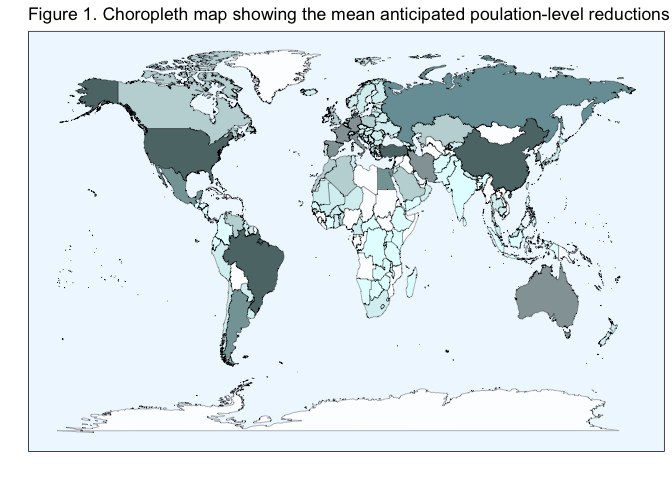
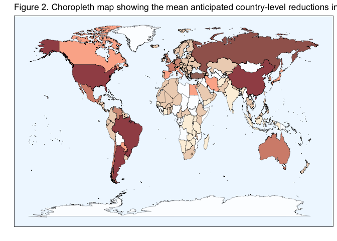
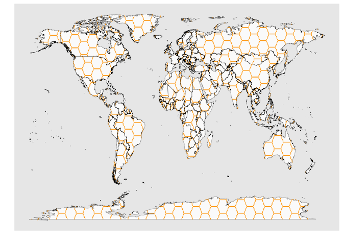

Visuals
================
2023-02-21

## Required Packages

``` r
library(tidyverse)
```

    ## ── Attaching packages ─────────────────────────────────────── tidyverse 1.3.2 ──
    ## ✔ ggplot2 3.4.1      ✔ purrr   0.3.4 
    ## ✔ tibble  3.1.8      ✔ dplyr   1.0.10
    ## ✔ tidyr   1.2.1      ✔ stringr 1.4.1 
    ## ✔ readr   2.1.2      ✔ forcats 0.5.2 
    ## ── Conflicts ────────────────────────────────────────── tidyverse_conflicts() ──
    ## ✖ dplyr::filter() masks stats::filter()
    ## ✖ dplyr::lag()    masks stats::lag()

``` r
library(dplyr)
library(ggpattern)
library(mapproj)
```

    ## Loading required package: maps
    ## 
    ## Attaching package: 'maps'
    ## 
    ## The following object is masked from 'package:purrr':
    ## 
    ##     map

## Data Loading

First, we load in the `world_map` data set included embedded within the
\``ggplot2` package. We do this by assigning it as an object within our
environment:

``` r
world_map <- ggplot2::map_data("world")
```

From here, we need to update `ggplot2::map_data('world')` to be
compatible with datasets using ISO country codes. We can accomplish this
by using this tutorial provided by Haslam (2021):
<https://rpubs.com/Thom_JH/798825>.

The essential components required for this project are outlined
sequentially in the code chunks below.

``` r
world_map2 <- world_map %>% 
  rename(country = region) %>%
  mutate(country = case_when(country == "Macedonia" ~ "North Macedonia" ,
  country == "Ivory Coast"  ~ "Cote d'Ivoire",
  country == "Democratic Republic of the Congo"  ~ "Congo, Dem. Rep.",
  country == "Republic of Congo" ~  "Congo, Rep.",
  country == "UK" ~  "United Kingdom",
  country == "USA" ~  "United States",
  country == "Laos" ~  "Lao",
  country == "Slovakia" ~  "Slovak Republic",
  country == "Saint Lucia" ~  "St. Lucia",
  country == "Kyrgyzstan"  ~  "Kyrgyz Republic",
  country == "Micronesia" ~ "Micronesia, Fed. Sts.",
  country == "Swaziland"  ~ "Eswatini", 
  country == "Virgin Islands"  ~ "Virgin Islands (U.S.)", 
  TRUE ~ country))
```

``` r
match_names <- c("Antigua" , "Barbuda", "Nevis", "Saint Kitts", "Trinidad", "Tobago", "Grenadines", "Saint Vincent")
```

``` r
map_match <- world_map2 %>% 
  filter(country %in% match_names)
```

``` r
map_match %>% distinct(country)
```

    ##         country
    ## 1       Antigua
    ## 2       Barbuda
    ## 3         Nevis
    ## 4   Saint Kitts
    ## 5      Trinidad
    ## 6        Tobago
    ## 7    Grenadines
    ## 8 Saint Vincent

``` r
ant_bar <- c(137 ,138 )

kit_nev <- c(930 , 931)

tri_tog <- c(1425, 1426)

vin_gre <- c(1575, 1576, 1577)
```

``` r
new_names_ref <- c("Antigua and Barbuda", "St. Kitts and Nevis","Trinidad and Tobago", "St. Vincent and the Grenadines")
```

``` r
map_match <- map_match %>% 
  mutate(country = case_when(group %in% ant_bar ~ "Antigua and Barbuda",group %in% kit_nev  ~ "St. Kitts and Nevis" ,group %in% tri_tog  ~ "Trinidad and Tobago" ,group %in% vin_gre ~ "St. Vincent and the Grenadines") ) %>% 
  tibble()
```

``` r
map_match %>% head()
```

    ## # A tibble: 6 × 6
    ##    long   lat group order country             subregion
    ##   <dbl> <dbl> <dbl> <int> <chr>               <chr>    
    ## 1 -61.7  17.0   137  7243 Antigua and Barbuda <NA>     
    ## 2 -61.7  17.0   137  7244 Antigua and Barbuda <NA>     
    ## 3 -61.9  17.0   137  7245 Antigua and Barbuda <NA>     
    ## 4 -61.9  17.1   137  7246 Antigua and Barbuda <NA>     
    ## 5 -61.9  17.1   137  7247 Antigua and Barbuda <NA>     
    ## 6 -61.8  17.2   137  7248 Antigua and Barbuda <NA>

``` r
map_match %>% 
  distinct(country)%>% 
  knitr::kable(caption = "Add to World Map")
```

| country                        |
|:-------------------------------|
| Antigua and Barbuda            |
| St. Kitts and Nevis            |
| Trinidad and Tobago            |
| St. Vincent and the Grenadines |

Add to World Map

``` r
map_match %>% 
  group_by(country) %>% 
  count(group)  %>% 
  knitr::kable(caption = "Add to World Map")
```

| country                        | group |   n |
|:-------------------------------|------:|----:|
| Antigua and Barbuda            |   137 |  12 |
| Antigua and Barbuda            |   138 |  10 |
| St. Kitts and Nevis            |   930 |   7 |
| St. Kitts and Nevis            |   931 |  13 |
| St. Vincent and the Grenadines |  1575 |  16 |
| St. Vincent and the Grenadines |  1576 |  23 |
| St. Vincent and the Grenadines |  1577 |  10 |
| Trinidad and Tobago            |  1425 |  30 |
| Trinidad and Tobago            |  1426 |   8 |

Add to World Map

``` r
map_match %>% 
  str()
```

    ## tibble [129 × 6] (S3: tbl_df/tbl/data.frame)
    ##  $ long     : num [1:129] -61.7 -61.7 -61.9 -61.9 -61.9 ...
    ##  $ lat      : num [1:129] 17 17 17 17.1 17.1 ...
    ##  $ group    : num [1:129] 137 137 137 137 137 137 137 137 137 137 ...
    ##  $ order    : int [1:129] 7243 7244 7245 7246 7247 7248 7249 7250 7251 7252 ...
    ##  $ country  : chr [1:129] "Antigua and Barbuda" "Antigua and Barbuda" "Antigua and Barbuda" "Antigua and Barbuda" ...
    ##  $ subregion: chr [1:129] NA NA NA NA ...

``` r
world_map2 %>% 
  str()
```

    ## 'data.frame':    99338 obs. of  6 variables:
    ##  $ long     : num  -69.9 -69.9 -69.9 -70 -70.1 ...
    ##  $ lat      : num  12.5 12.4 12.4 12.5 12.5 ...
    ##  $ group    : num  1 1 1 1 1 1 1 1 1 1 ...
    ##  $ order    : int  1 2 3 4 5 6 7 8 9 10 ...
    ##  $ country  : chr  "Aruba" "Aruba" "Aruba" "Aruba" ...
    ##  $ subregion: chr  NA NA NA NA ...

``` r
world_map2 <-  world_map2 %>%
  filter(!country %in% match_names)

world_map2 <- world_map2 %>% 
  bind_rows(map_match) %>%
  arrange(country)  %>%
  tibble()

world_map2 %>% 
  filter(country %in% match_names)
```

    ## # A tibble: 0 × 6
    ## # … with 6 variables: long <dbl>, lat <dbl>, group <dbl>, order <int>,
    ## #   country <chr>, subregion <chr>

``` r
world_map2 %>% 
  filter(country %in% new_names_ref) %>%
  group_by(country) %>%
  slice_max(order, n = 1)
```

    ## # A tibble: 4 × 6
    ## # Groups:   country [4]
    ##    long   lat group order country                        subregion
    ##   <dbl> <dbl> <dbl> <int> <chr>                          <chr>    
    ## 1 -61.7  17.6   138  7265 Antigua and Barbuda            <NA>     
    ## 2 -62.6  17.2   931 58081 St. Kitts and Nevis            <NA>     
    ## 3 -61.2  13.2  1577 98189 St. Vincent and the Grenadines <NA>     
    ## 4 -60.8  11.2  1426 89453 Trinidad and Tobago            <NA>

``` r
sub_sleeps <- c("Hong Kong", "Macao")

hk_mc <- world_map2 %>% 
  filter(subregion %in% sub_sleeps)

hk_mc <- hk_mc %>%
  mutate(country = case_when(subregion == "Hong Kong" ~ "Hong Kong, China" ,
  subregion == "Macao" ~ "Macao, China" ))

hk_mc %>% 
  slice(38:41) %>% 
  knitr::kable(caption ="Check structure")
```

|     long |      lat | group | order | country          | subregion |
|---------:|---------:|------:|------:|:-----------------|:----------|
| 114.0067 | 22.48403 |   670 | 45801 | Hong Kong, China | Hong Kong |
| 114.0154 | 22.51191 |   670 | 45802 | Hong Kong, China | Hong Kong |
| 113.4789 | 22.19556 |   960 | 59893 | Macao, China     | Macao     |
| 113.4810 | 22.21748 |   960 | 59894 | Macao, China     | Macao     |

Check structure

``` r
world_map2 <-   world_map2 %>%
  filter(!subregion %in% sub_sleeps)

world_map2 <- world_map2 %>% 
  bind_rows(hk_mc) %>%
  select(-subregion) %>% 
  tibble()
```

## Mapping choropleths for each primary outcome variable

Mean population-level water footprint dividends:

``` r
ggplot(world_map2, aes(x=long,y=lat,group=group,fill=country)) + 
  geom_polygon(color="black",alpha=.8,linewidth=.1) + 
  scale_fill_manual(values=c("lightcyan1","lightcyan2","lightcyan3","white","white","white","white","white","lightcyan1","paleturquoise4","lightcyan2","white","white","lightcyan4","lightcyan2","lightcyan2","white","white","white","white","lightcyan2","lightcyan2","lightcyan2","lightcyan2","lightcyan2","lightcyan2","white","white","white","lightcyan2","lightcyan1","darkslategray","lightcyan2","lightcyan2","lightcyan2","white","lightcyan2","lightcyan2","lightcyan3","white","lightcyan1","white","lightcyan1","white","white","lightcyan2","darkslategray","white","white","lightcyan1","white","lightcyan1","white","white","lightcyan2","lightcyan1","lightcyan2","white","white","lightcyan2","lightcyan2","lightcyan2","white","white","white","lightcyan1","paleturquoise4","lightcyan1","white","white","lightcyan2","white","lightcyan1","white","white","lightcyan2","lightcyan2","lightcyan4","white","white","white","white","lightcyan2","lightcyan1","lightcyan4","lightcyan2","lightcyan3","white","white","white","white","lightcyan1","white","white","white","lightcyan2","white","white","lightcyan1","lightcyan2","lightcyan2","lightcyan2","lightcyan1","lightcyan1","lightcyan4","white","lightcyan2","white","lightcyan2","lightcyan4","lightcyan2","lightcyan2","white","lightcyan2","lightcyan3","lightcyan1","white","white","lightcyan2","lightcyan2","white","lightcyan2","lightcyan2","white","white","white","white","lightcyan2","lightcyan2","lightcyan2","lightcyan1","white","lightcyan2","lightcyan2","lightcyan2","lightcyan2","lightcyan2","white","white","lightcyan2","lightcyan2","white","paleturquoise4","white","lightcyan1","white","white","lightcyan2","white","lightcyan3","white","white","lightcyan1","white","lightcyan2","lightcyan2","white","lightcyan2","lightcyan1","lightcyan2","white","white","white","white","lightcyan2","white","lightcyan2","lightcyan2","lightcyan1","white","white","lightcyan2","white","lightcyan2","lightcyan2","lightcyan1","white","lightcyan3","lightcyan2","white","white","white","lightcyan2","cadetblue4","lightcyan1","white","white","white","white","white","white","white","lightcyan1","lightcyan3","lightcyan1","lightcyan2","white","white","white","white","white","white","lightcyan1","lightcyan2","white","white","lightcyan2","white","lightcyan4","white","white","lightcyan4","lightcyan1","white","white","white","white","lightcyan2","lightcyan2","lightcyan2","white","lightcyan2","white","lightcyan1","lightcyan2","white","lightcyan1","white","white","lightcyan2","darkslategray","white","white","lightcyan1","lightcyan2","white","lightcyan3","darkslategray","lightcyan2","white","lightcyan2","white","lightcyan3","white","white","white","white","lightcyan1","lightcyan1","lightcyan1")) +
  xlab(" ") + 
  ylab(" ") + 
  guides(fill="none") +
  ggtitle("Figure 1. Choropleth map showing the mean anticipated poulation-level \nreductions in diet-attributable water use for each of the 133 included countries.") +
  theme(panel.background=element_rect(fill="aliceblue"),panel.border=element_rect(fill=NA),axis.ticks=element_blank(),axis.text=element_blank(),panel.grid=element_blank())
```

<!-- -->

Mean population-level carbon footprint dividends:

``` r
ggplot(world_map2, aes(x=long,y=lat,group=group,fill=country)) + 
    geom_polygon(color="black",alpha=.8,linewidth=.1) + 
    scale_fill_manual(values=c("papayawhip","peachpuff2","peachpuff2","white","white","white","white","white","peachpuff2","firebrick4","peachpuff2","white","white","salmon3","peachpuff2","peachpuff2","white","white","white","white","peachpuff2","peachpuff2","peachpuff2","peachpuff2","peachpuff2","peachpuff2","white","white","white","peachpuff2","papayawhip","firebrick4","peachpuff2","peachpuff2","peachpuff2","white","peachpuff2","peachpuff2","lightsalmon1","white","peachpuff2","white","peachpuff2","white","white","salmon3","firebrick4","white","white","peachpuff2","white","papayawhip","white","white","peachpuff2","papayawhip","peachpuff2","white","white","peachpuff2","peachpuff2","peachpuff2","white","white","white","peachpuff2","lightsalmon1","peachpuff2","white","white","peachpuff2","white","peachpuff2","white","white","peachpuff2","peachpuff2","salmon3","white","white","white","white","papayawhip","peachpuff2","lightsalmon3","peachpuff2","peachpuff2","white","white","white","white","peachpuff2","white","white","white","peachpuff2","white","white","peachpuff2","peachpuff2","peachpuff2","peachpuff2","papayawhip","papayawhip","lightsalmon1","white","peachpuff2","white","peachpuff2","lightsalmon1","peachpuff2","lightsalmon1","white","peachpuff2","peachpuff2","peachpuff2","white","white","peachpuff2","peachpuff2","white","peachpuff2","peachpuff2","white","white","white","white","peachpuff2","peachpuff2","peachpuff2","papayawhip","white","peachpuff2","peachpuff2","peachpuff2","peachpuff2","peachpuff2","white","white","peachpuff2","peachpuff2","white","salmon3","white","papayawhip","white","white","peachpuff2","white","peachpuff2","white","white","papayawhip","white","peachpuff2","peachpuff2","white","peachpuff2","peachpuff2","peachpuff2","white","white","white","white","peachpuff2","white","peachpuff2","peachpuff2","peachpuff2","white","white","peachpuff2","white","lightsalmon1","peachpuff2","peachpuff2","white","peachpuff2","peachpuff2","white","white","white","peachpuff2","tomato4","papayawhip","white","white","white","white","white","white","white","papayawhip","peachpuff2","papayawhip","peachpuff2","white","white","white","white","white","white","peachpuff2","peachpuff2","white","white","peachpuff2","white","lightsalmon3","white","white","lightsalmon1","papayawhip","white","white","white","white","peachpuff2","peachpuff2","peachpuff2","white","peachpuff2","white","papayawhip","peachpuff2","white","papayawhip","white","white","peachpuff2","salmon4","white","white","papayawhip","peachpuff2","white","lightsalmon3","firebrick4","peachpuff2","white","papayawhip","white","lightsalmon3","white","white","white","white","papayawhip","papayawhip","papayawhip")) +
    xlab(" ") + 
    ylab(" ") + 
    guides(fill="none") +
    ggtitle("Figure 2. Choropleth map showing the mean anticipated country-level \nreductions in diet-attributable emissions for each of the 133 included countries.") +
    theme(panel.background=element_rect(fill="aliceblue"),panel.border=element_rect(fill=NA),axis.ticks=element_blank(),axis.text=element_blank(),panel.grid=element_blank())
```

<!-- -->

``` r
ggplot(world_map2,aes(x=long,y=lat,group=group,fill=country,pattern=country)) + 
    geom_polygon(color="black",alpha=.8,linewidth=.1) + 
    scale_fill_manual(values=c("papayawhip","peachpuff2","peachpuff2","white","white","white","white","white","peachpuff2","firebrick4","peachpuff2","white","white","salmon3","peachpuff2","peachpuff2","white","white","white","white","peachpuff2","peachpuff2","peachpuff2","peachpuff2","peachpuff2","peachpuff2","white","white","white","peachpuff2","papayawhip","firebrick4","peachpuff2","peachpuff2","peachpuff2","white","peachpuff2","peachpuff2","lightsalmon1","white","peachpuff2","white","peachpuff2","white","white","salmon3","firebrick4","white","white","peachpuff2","white","papayawhip","white","white","peachpuff2","papayawhip","peachpuff2","white","white","peachpuff2","peachpuff2","peachpuff2","white","white","white","peachpuff2","lightsalmon1","peachpuff2","white","white","peachpuff2","white","peachpuff2","white","white","peachpuff2","peachpuff2","salmon3","white","white","white","white","papayawhip","peachpuff2","lightsalmon3","peachpuff2","peachpuff2","white","white","white","white","peachpuff2","white","white","white","peachpuff2","white","white","peachpuff2","peachpuff2","peachpuff2","peachpuff2","papayawhip","papayawhip","lightsalmon1","white","peachpuff2","white","peachpuff2","lightsalmon1","peachpuff2","lightsalmon1","white","peachpuff2","peachpuff2","peachpuff2","white","white","peachpuff2","peachpuff2","white","peachpuff2","peachpuff2","white","white","white","white","peachpuff2","peachpuff2","peachpuff2","papayawhip","white","peachpuff2","peachpuff2","peachpuff2","peachpuff2","peachpuff2","white","white","peachpuff2","peachpuff2","white","salmon3","white","papayawhip","white","white","peachpuff2","white","peachpuff2","white","white","papayawhip","white","peachpuff2","peachpuff2","white","peachpuff2","peachpuff2","peachpuff2","white","white","white","white","peachpuff2","white","peachpuff2","peachpuff2","peachpuff2","white","white","peachpuff2","white","lightsalmon1","peachpuff2","peachpuff2","white","peachpuff2","peachpuff2","white","white","white","peachpuff2","tomato4","papayawhip","white","white","white","white","white","white","white","papayawhip","peachpuff2","papayawhip","peachpuff2","white","white","white","white","white","white","peachpuff2","peachpuff2","white","white","peachpuff2","white","lightsalmon3","white","white","lightsalmon1","papayawhip","white","white","white","white","peachpuff2","peachpuff2","peachpuff2","white","peachpuff2","white","papayawhip","peachpuff2","white","papayawhip","white","white","peachpuff2","salmon4","white","white","papayawhip","peachpuff2","white","lightsalmon3","firebrick4","peachpuff2","white","papayawhip","white","lightsalmon3","white","white","white","white","papayawhip","papayawhip","papayawhip")) +
    geom_polygon_pattern(pattern="polygon_tiling",pattern_fill=NA) +
    scale_pattern_scale_manual(values=c("trihexagonal","trihexagonal","trihexagonal","none","none","none","none","none","trihexagonal","trihexagonal","trihexagonal","none","none","trihexagonal","trihexagonal","trihexagonal","none","none","none","none","trihexagonal","trihexagonal","trihexagonal","trihexagonal","trihexagonal","trihexagonal","none","none","none","trihexagonal","trihexagonal","trihexagonal","trihexagonal","trihexagonal","trihexagonal","none","trihexagonal","trihexagonal","trihexagonal","none","trihexagonal","none","trihexagonal","none","none","trihexagonal","trihexagonal","none","none","trihexagonal","none","trihexagonal","none","none","trihexagonal","trihexagonal","trihexagonal","none","none","trihexagonal","trihexagonal","trihexagonal","none","none","none","trihexagonal","trihexagonal","trihexagonal","none","none","trihexagonal","none","trihexagonal","none","none","trihexagonal","trihexagonal","trihexagonal","none","none","none","none","trihexagonal","trihexagonal","trihexagonal","trihexagonal","trihexagonal","none","none","none","none","trihexagonal","none","none","none","trihexagonal","none","none","trihexagonal","trihexagonal","trihexagonal","trihexagonal","trihexagonal","trihexagonal","trihexagonal","none","trihexagonal","none","trihexagonal","trihexagonal","trihexagonal","trihexagonal","none","trihexagonal","trihexagonal","trihexagonal","none","none","trihexagonal","trihexagonal","none","trihexagonal","trihexagonal","none","none","none","none","trihexagonal","trihexagonal","trihexagonal","trihexagonal","none","trihexagonal","trihexagonal","trihexagonal","trihexagonal","trihexagonal","none","none","trihexagonal","trihexagonal","none","trihexagonal","none","trihexagonal","none","none","trihexagonal","none","trihexagonal","none","none","trihexagonal","none","trihexagonal","trihexagonal","none","trihexagonal","trihexagonal","trihexagonal","none","none","none","none","trihexagonal","none","trihexagonal","trihexagonal","trihexagonal","none","none","trihexagonal","none","trihexagonal","trihexagonal","trihexagonal","none","trihexagonal","trihexagonal","none","none","none","trihexagonal","trihexagonal","trihexagonal","none","none","none","none","none","none","none","trihexagonal","trihexagonal","trihexagonal","trihexagonal","none","none","none","none","none","none","trihexagonal","trihexagonal","none","none","trihexagonal","none","trihexagonal","none","none","trihexagonal","trihexagonal","none","none","none","none","trihexagonal","trihexagonal","trihexagonal","none","trihexagonal","none","trihexagonal","trihexagonal","none","trihexagonal","none","none","trihexagonal","trihexagonal","none","none","trihexagonal","trihexagonal","none","trihexagonal","trihexagonal","trihexagonal","none","trihexagonal","none","trihexagonal","none","none","none","none","trihexagonal","trihexagonal","trihexagonal")) +
    ggtitle("Figure 2. Choropleth map showing the mean anticipated country-level \nreductions in diet-attributable emissions for each of the 133 included countries.") +
    guides(fill="none") + 
    xlab("") +
    ylab("") +
    theme(panel.background=element_rect(fill="aliceblue"),panel.border=element_rect(fill=NA),panel.grid=element_blank(),axis.text=element_blank(),axis.ticks=element_blank())
```

<!-- -->

pattern=“stripe”
